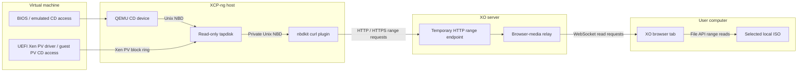
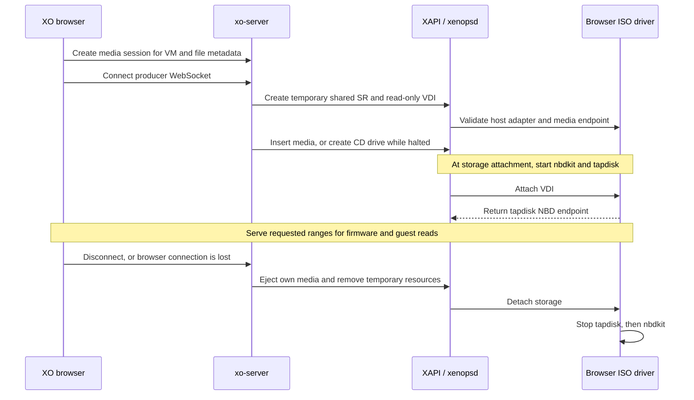

# Spike report: browser-streamed virtual ISO media in Xen Orchestra

**Date:** 18 September 2026
**Status:** Feasibility demonstrated on an XCP-ng 8.3 test host
**Working branches:** `feat/browser-virtual-media` in `sm` and `xen-orchestra`

## Result

A user can select an ISO on their own computer in Xen Orchestra and boot a VM from it, without first uploading the complete ISO to XO, copying it onto the host, or configuring a network ISO share.

The interaction resembles remote virtual media in an IPMI console: the browser supplies the media and must remain connected. The prototype demonstrated Debian 13 installer startup in both BIOS and UEFI modes. UEFI reached the graphical installer's language-selection screen; a subsequent hard reboot returned to the UEFI installer menu.

This spike establishes that the approach is technically viable. It is not a production-ready feature or evidence of a completed OS installation, migration support, or broad host compatibility.

## Functional changes

| Area             | User-visible behavior                                                                                                                                                                              |
| ---------------- | -------------------------------------------------------------------------------------------------------------------------------------------------------------------------------------------------- |
| Local media      | Select a local ISO and connect it to a VM. Only requested portions of the file are transferred.                                                                                                    |
| Before boot      | Connect media while the VM is halted, then start it with CD first in its boot order. A missing CD drive can be created while halted.                                                               |
| Running VM       | Insert media into an existing, attached, empty CD drive. The prototype does not hotplug an HVM CD drive.                                                                                           |
| Firmware         | The final host adapter supports the demonstrated BIOS and UEFI boot paths.                                                                                                                         |
| Disconnect       | Explicitly disconnect the ISO or eject it through the normal VM controls. Temporary storage resources are cleaned up.                                                                              |
| Browser lifetime | Navigation within the same XO application keeps its session alive. Reloading or closing the owning tab disconnects the media.                                                                      |
| XO 5             | An experimental local ISO picker appears below the existing CD selector on the VM console/disks views.                                                                                             |
| XO 6             | A **Local ISO · Experimental** panel appears at the top of the right-hand actions panel in **VM → Console**, including while halted. It shows the filename, status, errors, and disconnect action. |
| Access           | The experiment is opt-in on xo-server and its management APIs are administrator-only.                                                                                                              |

An already occupied CD drive must be ejected before connecting another ISO. Browser sessions are not transferred between tabs or between XO 5 and XO 6.

## Architecture

The ISO remains a browser-selected file. XO requests byte ranges through a WebSocket, and the browser reads those ranges using the File API. XO exposes a temporary HTTP range endpoint for the host. A host-side adapter converts those HTTP reads into storage I/O.

The arrows below show the direction of **read requests**; ISO bytes return in the opposite direction.

There is no complete-file upload step or persistent ISO cache introduced by the prototype. Transfers use bounded chunks; the storage stack and operating system still have normal buffers. The relay limits each browser read to 1 MiB, with at most 16 outstanding reads per session and 16 sessions per XO process. This is bounded transfer handling, not a measured end-to-end memory guarantee.

The browser, xo-server, and XCP-ng host can be on separate machines. The browser connects to XO; the host must reach XO's configured media origin. The host does not connect directly to the user's computer. If the frontend is served separately, its proxy must forward the REST and media routes, including WebSocket upgrades, to xo-server.

## Storage representation and lifecycle

The user does not configure an ISO SR. Internally, the prototype still uses XAPI's existing storage model: **one temporary shared SR and one read-only VDI per browser-media session**, with host connections represented by PBDs. “Shared” describes pool visibility and access; it does not mean that a network filesystem or persistent shared ISO library is created.

XO checks the shared SR's PBD attachments and rolls back partial failures. Each host needs the adapter and access to the same XO endpoint. Host processes start when storage is attached, rather than when the shared SR metadata is created.

While XO remains running, cleanup is serialized with attachment and retries after host/API failures. External ejection is checked periodically. Cleanup verifies that a drive still contains this session's VDI before ejecting it, so it does not eject replacement media inserted by another client.

## Minimal-change implementation

The spike deliberately reused existing interfaces and components. Most behavior was added in new, dedicated files, with small integration points in existing code. This is the minimum practical integration pursued for this demonstration, not a claim that the resulting design has completed production review.

### SM repository

| Location                                            | Modification and purpose                                                                                                                                                                                                                   |
| --------------------------------------------------- | ------------------------------------------------------------------------------------------------------------------------------------------------------------------------------------------------------------------------------------------ |
| `libs/sm/drivers/BrowserISOSR.py` — new             | Implements the `browseriso` backend, temporary read-only VDI metadata, endpoint checks, and the nbdkit/tapdisk lifecycle. Returns the existing NBD attachment representation.                                                              |
| `drivers/BrowserISOSR` — new                        | Driver entry point using the normal SM command infrastructure.                                                                                                                                                                             |
| `libs/sm/SRCommand.py`                              | Adds an explicit opt-in path for attachment/detachment managed by the driver itself. This avoids wrapping its NBD endpoint as a conventional file-backed disk. Also redacts the driver's source configuration from normal command logging. |
| `libs/sm/blktap2.py`                                | Adds `nbd` to the recognized tapdisk types so SM can enumerate the new backend. The tapdisk NBD client itself already existed.                                                                                                             |
| `Makefile`                                          | Installs the new driver and Python module.                                                                                                                                                                                                 |
| `scripts/prototypes/install-browser-media.py` — new | Adapts installation to the test host's older flat SM module layout, preserves originals, and applies the narrow dispatcher/type-list changes.                                                                                              |
| `tests/test_BrowserISOSR.py` — new                  | Covers validation, read-only behavior, backend reuse, failure cleanup, teardown ordering, and dispatch integration.                                                                                                                        |

The driver bypasses the **generic SM tapdisk wrapper**, but the final implementation explicitly starts a tapdisk itself. Tapdisk remains essential for serving the Xen PV frontend.

### Xen Orchestra repository

| Location                                                                               | Modification and purpose                                                                                                                    |
| -------------------------------------------------------------------------------------- | ------------------------------------------------------------------------------------------------------------------------------------------- |
| `packages/xo-server/src/browser-media.mjs` — new                                       | Owns temporary sessions, browser WebSockets, HTTP range responses, timeouts, transfer limits, and revocation.                               |
| `packages/xo-server/src/api/browser-media.mjs` — new                                   | Adds administrator-only session creation, attachment, disconnection, and availability methods. Uses existing XAPI SR/VDI/PBD/CD operations. |
| `packages/xo-server/src/browser-media-rest.mjs` — new                                  | Bridges XO 6 REST requests to those same API methods, reusing their validation, authorization, ownership, and lifecycle.                    |
| `packages/xo-server/src/index.mjs`                                                     | Registers the opt-in relay during server initialization.                                                                                    |
| `packages/xo-web/src/common/local-iso.js` — new                                        | Implements the XO 5 file picker and browser range producer. Keeps sessions outside the component lifecycle.                                 |
| `packages/xo-web/src/common/iso-device.js` and `common/xo/index.js`                    | Mount the XO 5 control and add API call helpers.                                                                                            |
| `@xen-orchestra/web/src/modules/vm/components/VmLocalIso.vue` — new                    | Implements the XO 6 console-side panel.                                                                                                     |
| `@xen-orchestra/web/src/modules/vm/composables/browser-media.ts` — new                 | Implements XO 6's tab-owned media sessions and file-range responses.                                                                        |
| `@xen-orchestra/web/src/pages/vm/[id]/console.vue`                                     | Integrates the panel and keeps it accessible when the VM is halted.                                                                         |
| `@xen-orchestra/web-core/lib/locales/en.json`                                          | Adds the XO 6 panel's English labels and messages.                                                                                          |
| `packages/xo-server/src/browser-media.test.mjs` and `browser-media-api.test.mjs` — new | Exercise the relay and storage lifecycle, including ranges, disconnections, rollback, and halted/running CD-drive handling.                 |

The server API index is generated by the existing build process. The prototype does not introduce a new application framework or transport dependency.

### Components reused without source changes

- **xen-api / xenopsd:** existing NBD attachments, shared SRs, VDI metadata, and CD insertion/ejection operations.
- **QEMU:** existing NBD client and emulated CD device.
- **tapdisk / blktap:** existing NBD client, NBD server, and Xen PV block backend.
- **UEFI firmware:** existing Xen PV block driver.
- **nbdkit:** existing curl plugin converts HTTP range reads into NBD.

No xen-api, QEMU, tapdisk C-code, or firmware source changes were required. No branch was needed in xen-api because it was inspected but not modified.

## Important findings during the spike

### UEFI needs the PV storage path

The first adapter supplied nbdkit directly to QEMU. BIOS boot worked, but UEFI stopped at the XCP-ng logo before QEMU recorded any guest reads.

Inspection of Xen's UEFI block driver and a live reproduction showed that firmware had published a PV ring and entered `Connected` state, while the advertised `vbd3` backend remained in `InitWait`. The prototype had not started a backend to serve that ring.

Adding read-only tapdisk between nbdkit and the existing attachment interface resolved this. Both the PV frontend and QEMU now have a working path to the same ISO. UEFI boot, installer startup, and reboot were then demonstrated. This was a missing integration in the spike, not evidence of a firmware or QEMU defect.

For compatibility with the existing tapdisk client, nbdkit uses an old-style NBD handshake on its private Unix socket. QEMU uses tapdisk's normal new-style NBD endpoint.

### Insert media rather than hotplug an HVM CD drive

XO's general drive-creation helper attempts a plug when the VM is running. XAPI rejects HVM CD-drive hotplug; depending on validation order, it can also report missing PV drivers. The prototype now requires an existing attached drive for running VMs, and allows creating a missing drive while halted.

### Range and process-lifecycle details matter

The HTTP endpoint must clamp valid ranges extending past EOF; this was needed for nbdkit curl reads of the final sector. Host service startup was also adjusted for the test host's older systemd. Teardown stops tapdisk before its nbdkit source, and nbdkit shutdown has a bounded fallback for lingering connections.

## Test-host changes

The lab host ran XCP-ng 8.3, xapi-core 26.1.16, SM 3.2.12, QEMU 4.2.1, and edk2 20220801.

The host's available nbdkit package did not provide the needed curl support, so nbdkit 1.48.1 was built in an isolated `/opt/browser-media-prototype/nbdkit` prefix. Compiler and development dependencies were installed for that build. This is a lab deployment, not finished product packaging.

The new driver was installed, `browseriso` was added to XAPI's SM-plugin allowlist, and XAPI was restarted once for initial discovery. Later driver updates required no XAPI restart. Original dispatcher, tapdisk-wrapper, and XAPI configuration files were preserved for rollback. Existing host support for other tapdisk formats was preserved.

xo-server requires an explicit `XO_BROWSER_MEDIA_ORIGIN`. HTTPS is the default requirement. The trusted-LAN demonstration used the separate `XO_BROWSER_MEDIA_ALLOW_HTTP=1` opt-in. Reverse proxies must support the media WebSocket and range requests.

## Validation and evidence

| Check                      | Result and scope                                                                                                                             |
| -------------------------- | -------------------------------------------------------------------------------------------------------------------------------------------- |
| Real browser ISO, BIOS     | Debian installer boot and language selection demonstrated. User also confirmed the BIOS flow worked.                                         |
| Real browser ISO, UEFI     | Graphical installer reached language selection after adding the PV backend.                                                                  |
| Reboot                     | Temporary UEFI VM returned to the installer menu after a hard reboot.                                                                        |
| Live media lifecycle       | Eject/reinsert succeeded; observed eject removed tapdisk and nbdkit in approximately 0.38 seconds in this lab.                               |
| Data integrity             | Deterministic reads through a real adapter were checked byte-for-byte, including the final sector.                                           |
| SM regression checks       | 106 targeted tests passed across BrowserISOSR, SRCommand, ISOSR, and blktap2.                                                                |
| XO relay and API tests     | 18 tests passed before the XO 6 REST/UI additions. Covers bounded ranges, malformed requests, disconnects, rollback, and CD lifecycle rules. |
| Frontend/server builds     | XO 5 and xo-server built successfully; XO 6 production build and TypeScript checks passed after its additions.                               |
| XO 6 browser demonstration | UI implementation and build completed; an end-to-end interactive browser test of the new XO 6 panel was not performed during this spike.     |
| Shared storage             | Shared SR/PBD lifecycle exercised on a single-host pool. Multi-host access and migration remain unvalidated.                                 |

Temporary comparison VMs and their dedicated storage resources were removed after testing. The user's VM was not power-cycled by the diagnostic tests.

## Boundaries and follow-up work

This is intentionally an ephemeral media session. Closing/reloading the browser, losing connectivity, or restarting XO makes the source unavailable. Read failure becomes an I/O error; the prototype does not substitute zeroes or silently switch media.

Before production use, the remaining work includes:

- Persistent session/resource reconciliation after XO crashes or restarts. Current in-memory state can leave metadata or adapters requiring manual cleanup.
- Multi-host behavior, migration, HA, suspend/resume, backup/snapshot interactions, and broader firmware/host-version testing.
- Packaging nbdkit and its curl plugin, upgrade/rollback integration, and reducing host-side process privileges.
- Capability-secret handling beyond normal SM log redaction. Media URLs are temporary bearer credentials visible in host configuration/process arguments and potentially diagnostic logs.
- Browser lifecycle, authentication/account revocation, proxy failure, and automated XO 6 UI coverage.
- Latency, bandwidth, and peak-memory measurements under realistic loads; no performance or scaling claim follows from this demonstration.
- Product polish, localization beyond English, and deciding how ephemeral browser media should appear in normal storage and VM workflows.

The spike's conclusion is that browser-streamed ISO media fits the existing Xen storage and CD lifecycle. A dedicated SM driver, a small XO relay, thin UI integrations, and a few existing-code hooks were sufficient to demonstrate it, without changes to the hypervisor, XAPI protocol, QEMU, or firmware.

## Supporting material

- [Prototype deployment and troubleshooting runbook](BROWSER_MEDIA_PROTOTYPE.md)
- [Xen UEFI block frontend and backend-state wait](https://github.com/tianocore/edk2/blob/edk2-stable202208/OvmfPkg/XenPvBlkDxe/BlockFront.c)
- [XCP-ng 8.3 firmware packaging](https://github.com/xcp-ng-rpms/edk2/blob/8.3/SPECS/edk2.spec)
