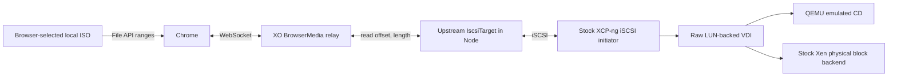
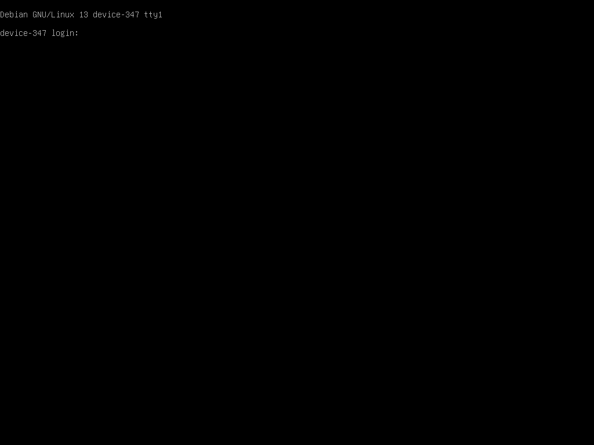
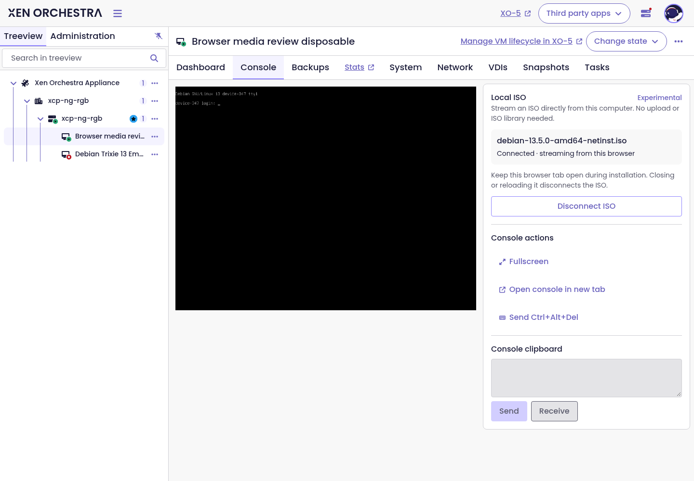

# Browser-streamed ISO using stock XCP-ng iSCSI storage

**2026-09-19 — demonstrated on XCP-ng 8.3 (xapi 26.1.16).**

A browser-selected Debian 13.5 ISO booted a disposable VM in both BIOS and UEFI using XCP-ng's existing `iscsi` SR driver. No custom SM driver, NBD client/server, nbdkit, tapdisk changes, or XAPI changes were needed in the tested data path.

The lead was correct: reuse the iSCSI target and raw-LUN introduction from XO live mount, replacing the backup disk reader with the existing browser range relay. The experiment establishes feasibility; the integrated implementation remains opt-in and experimental and does not establish full installation or migration support.

## Architecture

The browser source was real Chrome, controlled through CDP only to choose a file and inspect counters. The browser used `File.slice().arrayBuffer()` to answer WebSocket requests. The relay process did not open the ISO or pre-upload it. The standalone harness imported the checkout's actual `BrowserMedia` class.

The target adapter exposes 512-byte logical sectors, returns the ISO's exact size, rejects writes, and forwards reads to `BrowserMedia.read`. Reads are split into at most 1 MiB chunks; target read concurrency was set to eight. There is no persistent ISO cache in the adapter. Normal host/guest buffers still apply; end-to-end memory use was not measured.

## Storage and CD details

- `SR.introduce`: type `iscsi`, content type `user`, non-shared; no formatting.
- `PBD.create`/`PBD.plug`: ordinary target address, port, IQN, and generated CHAP credentials. The test used a single host and one LUN.
- `VDI.introduce`: `sm_config={LUNid:'0', type:'raw'}`. The stock driver discovers the SCSI ID, derives the actual VDI UUID, and adds `backend-kind=vbd`.
- `VBD.create`: `type=CD`, `mode=RO`, bootable. XAPI accepted this VDI despite its SR being an ordinary raw iSCSI SR with content type `user`.
- QEMU's command line used the normal `/dev/sm/backend/...` raw block path with `read-only=on` and `ide-cd`; XenStore advertised a physical `vbd` backend.
- The driver reported `VDI.read_only=false` despite requesting true during introduction, as documented by live mount. Read-only enforcement therefore belongs in the target as well as the CD VBD. The adapter always rejects writes; this experiment did not issue destructive host write commands to test it.

The iSCSI target remains a direct-access block device. Guest optical semantics come from the CD VBD/device model; no optical iSCSI target implementation was needed.

## Results

| Check                    | Observed result                                                                                                                                               |
| ------------------------ | ------------------------------------------------------------------------------------------------------------------------------------------------------------- |
| BIOS                     | Debian installer reached language selection. Its menu timeout selected the speech/text path; the no-sound prompt was dismissed.                               |
| UEFI                     | Debian graphical installer reached language selection.                                                                                                        |
| Live eject and reinsert  | Both XAPI operations succeeded while the UEFI VM ran.                                                                                                         |
| Reboot after reinsert    | Hard reboot returned to the Debian UEFI installer menu.                                                                                                       |
| Byte integrity           | Five 4096-byte direct-I/O reads on the host matched the local ISO's SHA-256 values, including its final 4096 bytes.                                           |
| Browser disconnect       | A fresh direct-I/O read failed with `Input/output error`, exit 1, and zero returned bytes. The iSCSI target remained running for this check.                  |
| Upstream protocol checks | 35 SCSI/loopback tests passed, zero failures or skips.                                                                                                        |
| Transfer volume          | 4,814 browser read replies, 237,912,064 bytes across the boot/lifecycle checks, from a 791,674,880-byte ISO. This includes repeat reads, not unique coverage. |
| Cleanup                  | Disposable VM/VBD/SR/PBD/VDI metadata removed; target session logged out. Existing user VM left halted and untouched.                                         |

Direct-read offsets: 0, 32768, 1048576, 63209472, 791670784. Each read used `dd iflag=direct bs=512 count=8` against the host's iSCSI block device. Local hashes were computed separately for comparison and were not a data source for the relay.

Evidence: [BIOS language selection](docs/static/img/browser-media/bios-installer.png), [UEFI graphical installer](docs/static/img/browser-media/uefi-installer.png), and [UEFI reboot](docs/static/img/browser-media/uefi-reboot.png).

## Integrated PR validation

The PR now imports the merged `@vates/iscsi` package directly and exposes browser bytes through its `BlockDevice` interface. The old host-facing HTTP endpoint and custom SR creation were removed. Browser sessions use the stock raw `iscsi` SR, normal CD insertion, and retryable detach/forget cleanup. The shared iSCSI library and live-mount mixin were not modified.

The integrated `create`/`attach` API methods were exercised with a real Chrome file producer and real host XAPI calls through a local-authentication SSH bridge. A newly created disposable VM reached Debian language selection in BIOS; the same VM reached the graphical installer in UEFI. API disconnect then left zero browser sessions and zero targets, and the disposable VM was removed. The integrated run transferred 218,456,064 bytes across 4,104 browser replies. This checks the actual PR attachment code, not just the earlier standalone target harness. Full authenticated XO 5/XO 6 UI automation is still separate work. Screenshots: [integrated BIOS](docs/static/img/browser-media/bios-integrated.png), [integrated UEFI](docs/static/img/browser-media/uefi-integrated.png).

Automated checks cover 13 attachment/lifecycle cases and nine relay cases, including real CHAP iSCSI reads through a WebSocket producer. Builds of xo-server, XO 5, and XO 6 passed, as did lint. See the [runbook](BROWSER_MEDIA_PROTOTYPE.md) for configuration and commands.

## What “stock” means for this experiment

The lab host had been used for earlier prototypes. Before testing, its modified `SRCommand.py` and `blktap2.py` were preserved in `/root/browser-media-prototype/pre-iscsi-test/`, then replaced with original backups whose SHA-256 values match the installed RPM manifest:

- `SRCommand.py`: `583a135e522753e2b486607437170d11deb3ea5da8527af3d590d409d57773eb`
- `blktap2.py`: `d8f9ac83f5255f468c08352c8d4439346178d606f29775eeac174b04425beda4`

After restoration, `rpm -V sm` showed no modified SM code: only a pre-existing multipath configuration timestamp difference. No package or storage-driver code was installed for this test. The stock shared SM files were left restored. Earlier custom driver files, isolated nbdkit builds, and XAPI allowlist entries remain on the host but were not used. This was a stock-storage-path test on an existing lab machine, not a fresh-install certification. Lab scripts and small evidence/configuration files were written under `/root/iso-iscsi-spike`.

## Remaining work

The custom host-adapter approach is superseded by this implementation. The follow-up validation below adds persistent crash reconciliation, authenticated UI coverage, and a complete installation. Remaining work includes browser reconnection policy, shared-target hardening, and broader handling of the raw-iSCSI-backed CD. Existing ISO selectors and backup logic may assume `SR.content_type=iso`; those workflows need further review.

The upstream target/live-mount design is single-consumer and the browser SR is non-shared. Migration and pool-wide use require separate work. The host must reach XO's temporary iSCSI listener; CHAP authenticates but does not encrypt that traffic. The browser path should use WSS in deployment (the isolated lab page used localhost WS).

An overlap check of all 185 open XO PRs identified Florent's [#10018](https://github.com/vatesfr/xen-orchestra/pull/10018), which includes writable cache/persistence work, and [#10345](https://github.com/vatesfr/xen-orchestra/pull/10345), which adds restore UI. The merged iSCSI target/backend interfaces already provide what browser media needs. No unmerged branch was required, and this PR does not duplicate the caching or restore UI changes.

## Upstream sources

- [#10345: restore UI](https://github.com/vatesfr/xen-orchestra/pull/10345)
- [#10302: live-mount backend and SR/VDI introduction](https://github.com/vatesfr/xen-orchestra/pull/10302)
- [#10242: iSCSI library used unchanged for this test](https://github.com/vatesfr/xen-orchestra/pull/10242)

## Authenticated UI and installation validation (2026-09-19)

An isolated XO server built from the PR used its own temporary Redis-compatible database and Chrome profile. It connected to the lab host through an SSH-forwarded XAPI Unix socket. The existing user VM was left untouched. A new disposable VM had two vCPUs, 2 GiB RAM, a 12 GiB local disk, and a LAN interface. No XCP-ng storage-driver or timeout changes were made.

The real XO 5 file picker attached the original Debian 13.5 netinst ISO while the VM was halted. Debian installed its base system and GRUB onto the disk with package mirrors disabled, using a configuration based on the [Debian preseeding guide](https://www.debian.org/releases/trixie/amd64/apb.en.html). Navigating from the Disks tab to the Console tab retained the browser source. After installation, Disconnect ISO removed the temporary SR; the VM then booted from disk to the Debian GNU/Linux 13 login prompt. The guest was provisioned with a disposable local account. The test automation needed corrections to boot-menu timing, shifted VNC keystrokes, and its completion callback; those were harness issues, not streaming failures.

The authenticated XO 6 Local ISO panel also attached the same file to the running installed guest. The stock driver preserved the atomic SR ownership marker. The raw VDI's label is now set after introduction so its metadata retains the ISO filename. XO 5 also exposes ISO controls on its halted Console page.

### Failure and authorization checks

- Killing the isolated XO process with SIGKILL left its SR/PBD/VDI and persistent journal entry behind. Restarting XO automatically ejected the CD, unplugged and removed the PBD, forgot the SR/VDI metadata, and cleared the journal. The installed VM remained running. The stock driver's SCSI identification timed out after approximately 142 seconds before cleanup continued; no manual storage cleanup or host changes were required. A new XO 6 attachment then succeeded.
- Disconnecting XO's management connection to the host, then reloading the source tab, retained the temporary resources while cleanup was unavailable. Reconnecting XO allowed the automatic retry to clean them using the new XAPI connection. This simulates loss of XO's management connection; it is not a physical host power-loss test.
- Pausing only the isolated Chrome network service for 45 seconds caused the real heartbeat timeout to revoke its source. XO 6 displayed “Media disconnected” and the temporary SR was removed automatically. Chrome’s offline emulation alone did not interrupt the existing WebSocket and was not counted as a successful outage test.
- Ordinary XO 6 Disconnect ISO removed its storage. The rebuilt XO 5 halted Console page attached the ISO successfully; closing that source tab also removed its temporary storage.
- The real API rejected a second local ISO session for a VM that already had one.
- A non-admin account was denied all four browser-media JSON-RPC methods. The REST endpoint returned 401 without authentication and 403 for a non-admin token.

The automated suites cover storage rollback, lost XAPI replies, retries across replacement XAPI connections, journal ordering, restart recovery, ownership mismatch, non-CD attachment protection, read-only data, bounded reads, browser timeout, malformed replies, session quotas, cross-origin rejection, and one-use producer capabilities. The recovery journal contains resource identifiers, not ISO data or browser capabilities. It only reconciles resources recorded by the same XO database.

## Code and adversarial review (2026-09-19)

The full PR was reviewed against the existing XO lifecycle hooks, API/REST authorization, translation conventions, React 15 compatibility, and storage cleanup patterns. A fresh check of all 185 open PRs found no competing browser-media implementation; Florent's #10018 still overlaps the shared iSCSI package. Its freshly fetched target and connection files are identical to the merged base, so they do not already fix the issue below. No shared iSCSI or live-mount code was changed during this review.

### Fixed in this PR

- Recovery ran synchronously during installation of the HTTP/API service and processed all journal entries serially. A stalled storage call could delay startup and cleanup on unrelated pools. Recovery now starts in the background and tracks work per SR, so repeated scans do not duplicate the same cleanup and unrelated pools can progress independently.
- The CD monitor ignored a missing VDI just like a temporary connection failure. External removal could retain a source session and target unnecessarily. An invalid VDI handle now revokes the source and starts cleanup; transient connection errors still retain the source.
- XO 5's local-ISO labels bypassed the translation system. They now use the existing message catalog, with French translations. Its connection handshake has the same 15-second deadline as XO 6, duplicate selection/disconnect actions are guarded, and a socket-close event no longer erases a cleanup error.
- CHAP secrets previously truncated hexadecimal output to 16 characters, retaining only 64 bits from 12 random bytes. They now encode all 12 bytes as 16 Base64 characters, retaining 96 bits within the existing length limit.

### Remaining blocker: pre-authentication iSCSI connection replacement

The shared target's `IscsiTarget.#onConnection()` destroys its established connection immediately when another TCP connection arrives, before the replacement completes CHAP authentication. A localhost-only reproduction established an authenticated initiator and successfully read 512 bytes, then opened a second TCP socket without sending any login or credentials. The authenticated initiator lost its connection and its next read failed. This is an availability issue; the reproduction did not bypass authentication to read ISO data.

A port probe or another unauthenticated peer able to reach the temporary listener can therefore interrupt an installation. The fix belongs in the shared iSCSI connection lifecycle: authenticate a candidate before allowing it to replace an established session, and bound unauthenticated candidate connections and login timeouts. Existing single-consumer/reconnect semantics and legitimate discovery connections need regression coverage there. Coordinate this fix with #10018 instead of maintaining a browser-media copy of the target. The feature should remain draft/opt-in until this dependency issue is resolved; CHAP alone does not prevent the demonstrated interruption.

The final review validation passed 34 targeted tests (16 lifecycle, 12 relay/startup, and six recovery), lint, and builds of xo-server, XO 5, and XO 6.

Other explicitly unvalidated areas remain shared-SR/migration/HA behavior, physical host power loss, backup/snapshot interactions, and performance across slow or unreliable WAN links. This review does not change those scope boundaries.
