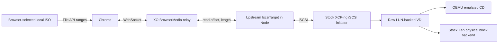

# Browser-streamed ISO using stock XCP-ng iSCSI storage

**2026-09-19 — demonstrated on XCP-ng 8.3 (xapi 26.1.16).**

A browser-selected Debian 13.5 ISO booted a disposable VM in both BIOS and UEFI using XCP-ng's existing `iscsi` SR driver. No custom SM driver, NBD client/server, nbdkit, tapdisk changes, or XAPI changes were needed in the tested data path.

The lead was correct: reuse the iSCSI target and raw-LUN introduction from XO live mount, replacing the backup disk reader with the existing browser range relay. The experiment establishes feasibility; the integrated implementation remains opt-in and experimental and does not establish full installation or migration support.

## Architecture

The browser source was real Chrome, controlled through CDP only to choose a file and inspect counters. The browser used `File.slice().arrayBuffer()` to answer WebSocket requests. The relay process did not open the ISO or pre-upload it. The standalone harness imported the checkout's actual `BrowserMedia` class.

The target adapter exposes 512-byte logical sectors, returns the ISO's exact size, rejects writes, and forwards reads to `BrowserMedia.read`. Reads are split into at most 1 MiB chunks; target read concurrency was set to eight. There is no persistent ISO cache in the adapter. Normal host/guest buffers still apply; end-to-end memory use was not measured.

## Storage and CD details

- `SR.introduce`: type `iscsi`, content type `user`, non-shared; no formatting.
- `PBD.create`/`PBD.plug`: ordinary target address, port, IQN, and generated CHAP credentials. The test used a single host and one LUN.
- `VDI.introduce`: `sm_config={LUNid:'0', type:'raw'}`. The stock driver discovers the SCSI ID, derives the actual VDI UUID, and adds `backend-kind=vbd`.
- `VBD.create`: `type=CD`, `mode=RO`, bootable. XAPI accepted this VDI despite its SR being an ordinary raw iSCSI SR with content type `user`.
- QEMU's command line used the normal `/dev/sm/backend/...` raw block path with `read-only=on` and `ide-cd`; XenStore advertised a physical `vbd` backend.
- The driver reported `VDI.read_only=false` despite requesting true during introduction, as documented by live mount. Read-only enforcement therefore belongs in the target as well as the CD VBD. The adapter always rejects writes; this experiment did not issue destructive host write commands to test it.

The iSCSI target remains a direct-access block device. Guest optical semantics come from the CD VBD/device model; no optical iSCSI target implementation was needed.

## Results

| Check                    | Observed result                                                                                                                                               |
| ------------------------ | ------------------------------------------------------------------------------------------------------------------------------------------------------------- |
| BIOS                     | Debian installer reached language selection. Its menu timeout selected the speech/text path; the no-sound prompt was dismissed.                               |
| UEFI                     | Debian graphical installer reached language selection.                                                                                                        |
| Live eject and reinsert  | Both XAPI operations succeeded while the UEFI VM ran.                                                                                                         |
| Reboot after reinsert    | Hard reboot returned to the Debian UEFI installer menu.                                                                                                       |
| Byte integrity           | Five 4096-byte direct-I/O reads on the host matched the local ISO's SHA-256 values, including its final 4096 bytes.                                           |
| Browser disconnect       | A fresh direct-I/O read failed with `Input/output error`, exit 1, and zero returned bytes. The iSCSI target remained running for this check.                  |
| Upstream protocol checks | 35 SCSI/loopback tests passed, zero failures or skips.                                                                                                        |
| Transfer volume          | 4,814 browser read replies, 237,912,064 bytes across the boot/lifecycle checks, from a 791,674,880-byte ISO. This includes repeat reads, not unique coverage. |
| Cleanup                  | Disposable VM/VBD/SR/PBD/VDI metadata removed; target session logged out. Existing user VM left halted and untouched.                                         |

Direct-read offsets: 0, 32768, 1048576, 63209472, 791670784. Each read used `dd iflag=direct bs=512 count=8` against the host's iSCSI block device. Local hashes were computed separately for comparison and were not a data source for the relay.

Evidence: [BIOS language selection](docs/static/img/browser-media/bios-installer.png), [UEFI graphical installer](docs/static/img/browser-media/uefi-installer.png), and [UEFI reboot](docs/static/img/browser-media/uefi-reboot.png).

## Integrated PR validation

The PR now imports the merged `@vates/iscsi` package directly and exposes browser bytes through its `BlockDevice` interface. The old host-facing HTTP endpoint and custom SR creation were removed. Browser sessions use the stock raw `iscsi` SR, normal CD insertion, and retryable detach/forget cleanup. The shared iSCSI library and live-mount mixin were not modified.

The integrated `create`/`attach` API methods were exercised with a real Chrome file producer and real host XAPI calls through a local-authentication SSH bridge. A newly created disposable VM reached Debian language selection in BIOS; the same VM reached the graphical installer in UEFI. API disconnect then left zero browser sessions and zero targets, and the disposable VM was removed. The integrated run transferred 218,456,064 bytes across 4,104 browser replies. This checks the actual PR attachment code, not just the earlier standalone target harness. Full authenticated XO 5/XO 6 UI automation is still separate work. Screenshots: [integrated BIOS](docs/static/img/browser-media/bios-integrated.png), [integrated UEFI](docs/static/img/browser-media/uefi-integrated.png).

Automated checks cover 13 attachment/lifecycle cases and nine relay cases, including real CHAP iSCSI reads through a WebSocket producer. Builds of xo-server, XO 5, and XO 6 passed, as did lint. See the [runbook](BROWSER_MEDIA_PROTOTYPE.md) for configuration and commands.

## What “stock” means for this experiment

The lab host had been used for earlier prototypes. Before testing, its modified `SRCommand.py` and `blktap2.py` were preserved in `/root/browser-media-prototype/pre-iscsi-test/`, then replaced with original backups whose SHA-256 values match the installed RPM manifest:

- `SRCommand.py`: `583a135e522753e2b486607437170d11deb3ea5da8527af3d590d409d57773eb`
- `blktap2.py`: `d8f9ac83f5255f468c08352c8d4439346178d606f29775eeac174b04425beda4`

After restoration, `rpm -V sm` showed no modified SM code: only a pre-existing multipath configuration timestamp difference. No package or storage-driver code was installed for this test. The stock shared SM files were left restored. Earlier custom driver files, isolated nbdkit builds, and XAPI allowlist entries remain on the host but were not used. This was a stock-storage-path test on an existing lab machine, not a fresh-install certification. Lab scripts and small evidence/configuration files were written under `/root/iso-iscsi-spike`.

## Remaining work

The custom host-adapter approach is superseded by this implementation. Remaining work includes automatic crash reconciliation, browser reconnection policy, shared-target hardening, broader UI coverage, and user-facing handling of the raw-iSCSI-backed CD. Existing ISO selectors and backup logic may assume `SR.content_type=iso`; those workflows need further review. A complete OS installation was not tested.

The upstream target/live-mount design is single-consumer and the browser SR is non-shared. Migration and pool-wide use require separate work. The host must reach XO's temporary iSCSI listener; CHAP authenticates but does not encrypt that traffic. The browser path should use WSS in deployment (the isolated lab page used localhost WS).

An overlap check of all 185 open XO PRs identified Florent's [#10018](https://github.com/vatesfr/xen-orchestra/pull/10018), which includes writable cache/persistence work, and [#10345](https://github.com/vatesfr/xen-orchestra/pull/10345), which adds restore UI. The merged iSCSI target/backend interfaces already provide what browser media needs. No unmerged branch was required, and this PR does not duplicate the caching or restore UI changes.

## Upstream sources

- [#10345: restore UI](https://github.com/vatesfr/xen-orchestra/pull/10345)
- [#10302: live-mount backend and SR/VDI introduction](https://github.com/vatesfr/xen-orchestra/pull/10302)
- [#10242: iSCSI library used unchanged for this test](https://github.com/vatesfr/xen-orchestra/pull/10242)
