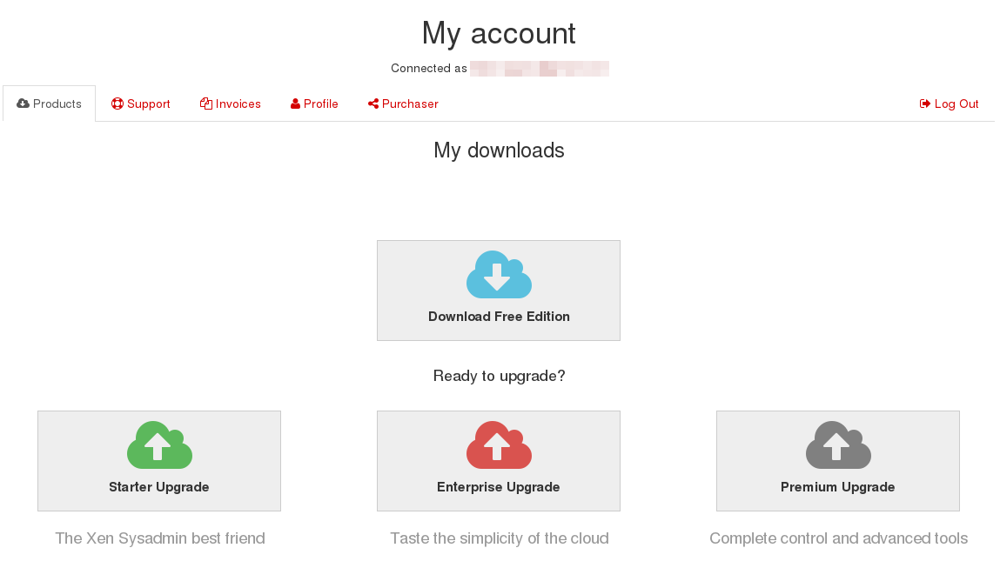
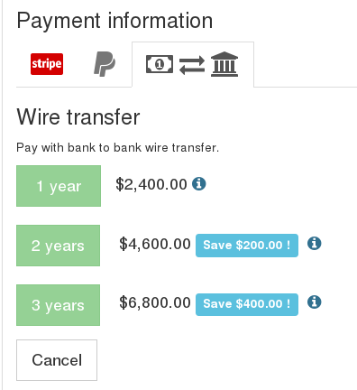

# Direct purchase

This is the simplest case: you buy XOA with your registered email account on `xen-orchestra.com`.

You can choose the edition you want in two places:

* [the pricing page](https://xen-orchestra.com/#!/pricing)
* [your account/member zone](https://xen-orchestra.com/#!/member)

> You need to be logged to make a purchase. If you don't have any account, please [register here](https://xen-orchestra.com/#!/signup).

From your account zone, click on the Edition you want:

Then you need to fill your information:

The default payment method is by **credit card**. But you can also choose the "wiretransfer" tab (with the "banknote/bank icon):

