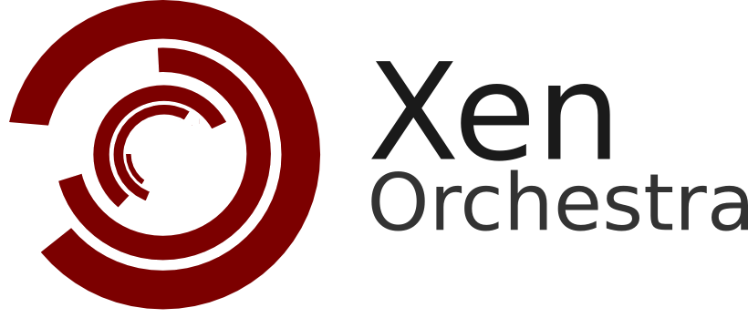

# Documentation

## Introduction

Welcome on the Xen Orchestra documentation. This document has multiple purposes, it explains:
- what is Xen Orchestra
- how to install it
- how to use it

## [Architecture](./architecture/README.md)

## [Installation](./installation/README.md)

## [Administration](./administration/README.md)

## [Layout](./layout/README.md)

## [VM Usage](./vm/README.md)

<!--  

This is what's left to do

### Hosts

#### Life-cycle

#### Memory Map

#### Edit host characteristics

#### Restart tool-stack

#### Remove from pool

#### Host console

#### Attached storage repository

#### Network (interface) management

#### Pending tasks

#### Logs

### Storage repositories

#### Edit SR characteristics

#### VDI Map

#### Virtual disks management

##### Rescan the repository

#### Connected hosts

#### Logs

### Pools

#### Edit pool characteristics

#### Hosts list

#### Shared SR list

#### Logs

## Troubleshooting

### Connection between XO-server and XO-web

### Consoles

#### With HTTPS

#### Behind a NAT or a firewall

## How to contribute

### Report bugs

### Fork us!
-->
