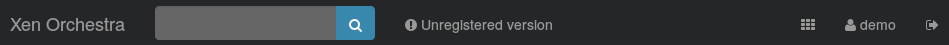
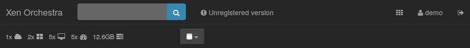
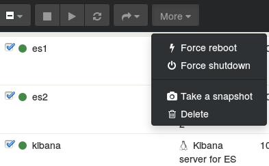
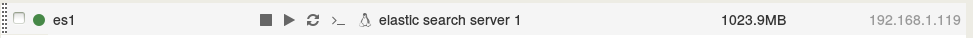
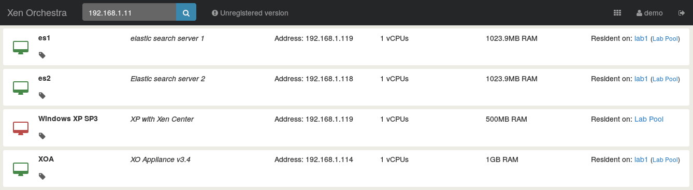

# Layout

In this section, we'll make a tour of the global layout of XO-web.

## Navigation bar

The navigation bar, on the top, is displayed on every views/pages. You can go to the main view by clicking on "Xen Orchestra", use the search bar, access to the main menu and disconnect your session from there.

### Main menu

It's represented by the . It gives you access to the main zones of XO-web.

### Search bar

The search bar is very useful to filter information, to quickly find what you need. The live filter works with every data on every object. Check the result in the Flat view section.

## Main view

The main view is a global view of all your pools, servers and VMs. The concept is to display all the important information with an horizontal hierarchy.

### Extended navigation bar

The first change is an extended navigation bar, with statistics and the "master checkbox":

This master checkbox can be use to select multiple VM in one action: all VM running, halted, or VM on one host.

The bar change when you select a VM with its checkbox (or *via* the master checkbox):

From this bar, you've got also Migrate VM display.

### Quick actions

We hovering a VM, you can see buttons for stop, start, reboot VM, and also access its console:

### Host and pools submenu

Don't forget to expand Pool and hosts submenus to explore what you can do:

## Flat view

Flat view is non hierarchical view, with the main goal to serve the filtered results of the search field.

Here is a example with an IP address:

It also work for names, descriptions, everything else!

**Congrats! You've reached the end of this doc. See the next part, [about how to manage VMs](../vm_usage/README.md).**
