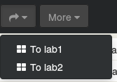
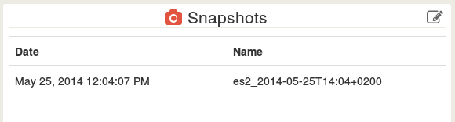

# Virtual machines

VM are the core interest of virtualization. That's why they are first in this documentation. The VM view contains all you need to interact with a virtual machine:

## Life-cycle (stop, start, reboot)

This is trivial, it can be done in the main view:

But also in the VM view, in the **Actions** panel:

## Live migration

Live migration allows to move your VM from an host to another without interrupting service. You can do it in the main view, by checking the needed VM, and choose the Migrate button in the extended navigation bar:

Or in the VM view in the **Actions** panel:

## Console

Xen Orchestra allows console access from the web. For that, we use the NoVNC project. Check the troubleshooting section if you have any problem for display it (it relies on a direct network connection, but it will be fixed soon).

Consoles are accessible from different views, but always with the same symbol: 

You can send *Ctrl+Alt+Del* key with the dedicated button. And you can also insert a virtual CD (from an ISO repository or a local DVD drive) in any VM you need:

## Edit VM characteristics

On the VM view, you can edit any characteristics using the edit icon: 

E.g with **General** panel:

## Create a VM

You can create a VM from the pool submenu or the host submenu:

Then, here you go, on the create vm view:

Fill the required fields:
- choose a template
- pick a name
- choose install settings
- choose an interface and a Network
- you can modify disk size and add disks if you want

The summary is here to check if you are sure about your settings. Let's create a VM by clicking on "Create VM" button!

**WARNING**: if you create a VM from a special template (a previously existing VM converted in a template), you should remove all interfaces and disks! Because they are already existing in the template.

## Copy/clone a VM

Copying (or cloning, same thing) a VM allows you to "fork" an existing VM. You have 2 choices:
- Fast clone: it uses a snapshot on your storage back-end. Pro: it's very fast to create a fast clone. Cons: snapshots are less suitable for a long-term usage (important performance drawback).
- Full disk copy: it creates a new disk and copy the whole content of the VM in it. Pro: it's very reliable, and there is no link between this disk and its parent. Cons: disk creation is longer.

When to use *Fast clone*:
- create a temporary VM, e.g for development or test purpose
- disk performance is not needed
- you storage system is occupied at less than 80% (performance impact is very high after this average limit)

For production use, please consider *Full disk copy*.

## Create a template

When you create a template from an existing VM, it will **convert** your current VM to a template. **There is no turning back!**

After the conversion, you can create a new VM, and see in the template list, a new template with the name of the converted VM. The VM creation process is slightly different from a "classical" template because:
- your converted VM contains already a network interface
- and a disk

Thus, you don't need to create both of them (remove the network interface and let disks section empty).

This is very powerful for creating the same VM basis for a type of usage (e.g: a development stack pre-configured in the templated VM).

You can use this feature in the VM view, in the "Actions panel", using this icon: 

## Delete

Remove a VM can be done from the main view but also the VM view.

In the main view, you need to check the VM you want to delete (can be multiple VM), then in the "More" menu, select the Delete action:

It will ask you if you are sure to delete the VM, and also the possibility to delete its associated disks:

In the VM view, the process is the same with the trash icon: 

## Snapshots management

Snapshotting is a very powerful feature. It allows the possibility to quickly save a VM state (e.g: for backups) but also to rollback to a previous state if needed.

The classical example is to create a snapshot before a VM OS update, check if it works, and revert/rollback if not. As snapshots are really fast, you can avoid a too long service interruption.

You can create a snapshot from the main view, with the "More" menu on each VM selected (can be multiples VM at one time):

Or in the VM view with the snapshot icon: 

Created snapshots are visible in the VM view in the "Snapshots" panel:

As you can see, the snapshot name is auto-generated (with the snapshot date). You can change the name, revert of delete snapshot by editing the panel:

Snapshots operations are possible without power state distinction.

<!--

## Disk management

## Network (interface) management

-->

## Logs

Logs are XAPI events, like when a VM is started or shutdown:

You can remove a log by editing the "Logs" panel and use this icon: 

## Group actions

You can make "group actions" in the main view, e.g migrate a bunch of VM in another host. For that, you have to use the check box for each VM you want or use the "master checkbox" for select VM in the same host or power state:

The, choose the button you need in the [extended navigation bar](#extended-navigation-bar).
