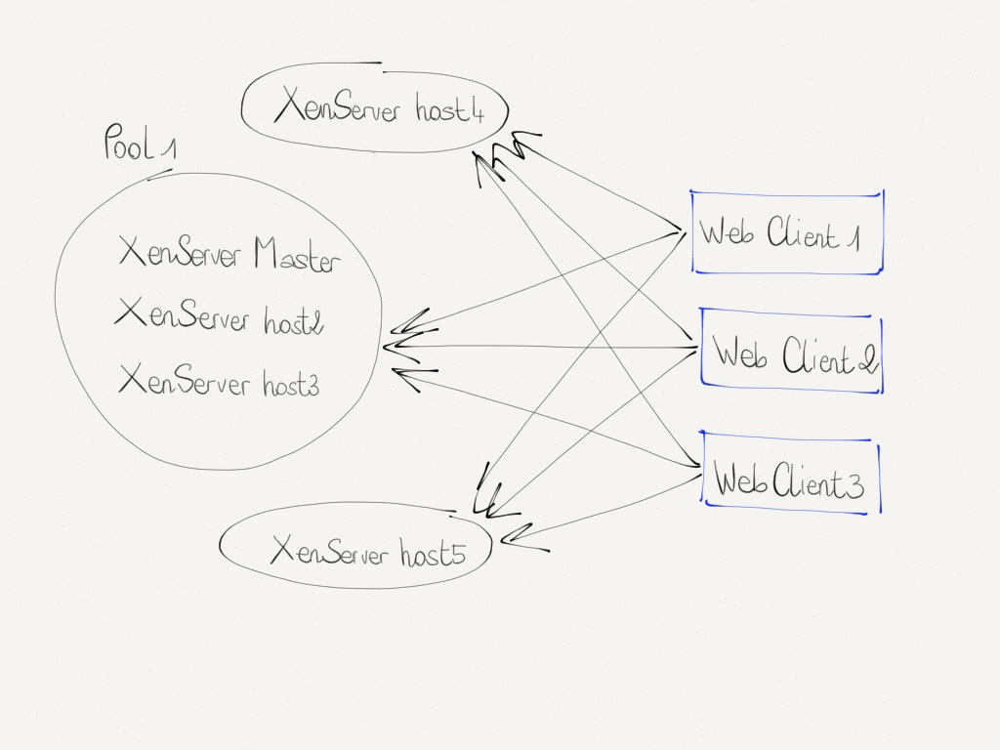
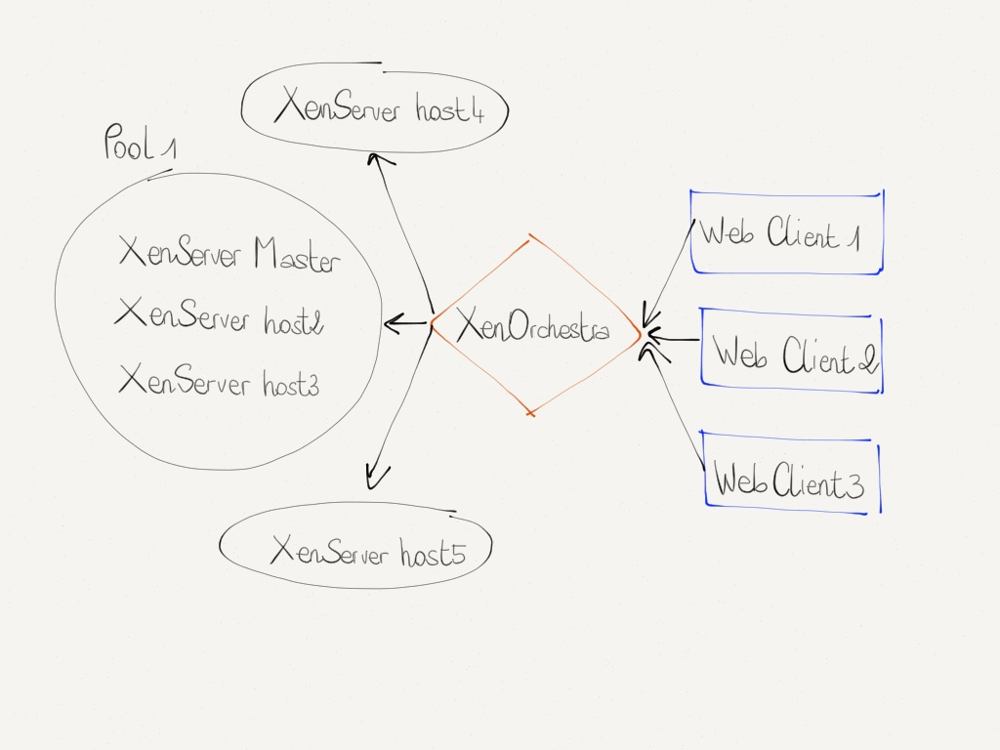
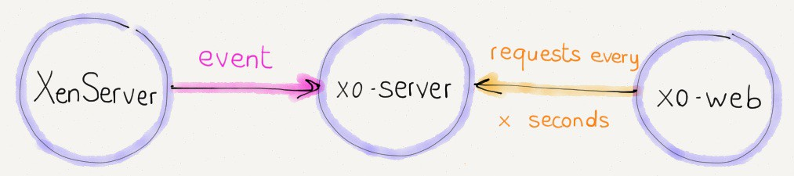
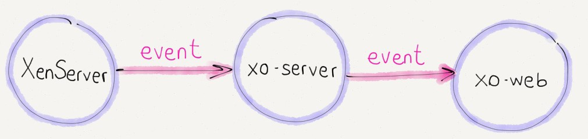
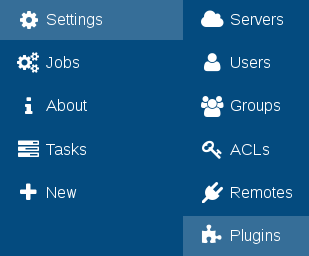
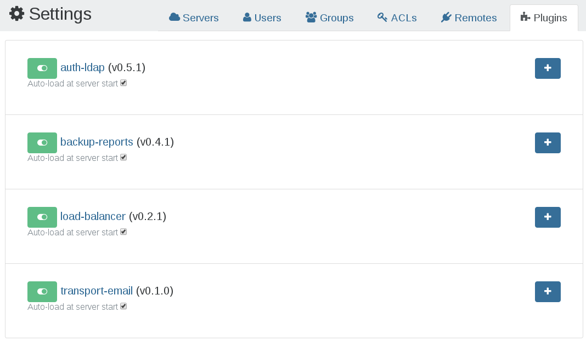

# Architecture

Xen Orchestra (XO) is software built with a server and clients, such as the web client `xo-web`, but also a CLI capable client, called `xo-cli`.

:::tip
XO is totally agent-less: you don't have to install any program on your hosts to get it working!
:::

## XOA

_Xen Orchestra Virtual Appliance_ (XOA) is a virtual machine with Xen Orchestra already installed, thus working out-of-the-box.

This is the easiest way to try Xen Orchestra quickly.

Your XOA is connected to all your hosts, or the pool master only if you are using Pools in XCP-ng/Citrix Hypervisor:


## Xen Orchestra (XO)


Xen Orchestra itself is built as a modular solution. Each part has its role.

## xo-server (server)

The core is "[xo-server](https://github.com/vatesfr/xen-orchestra/tree/master/packages/xo-server/)" - a daemon dealing directly with XenServer or XAPI capable hosts. This is where users are stored, and it's the center point for talking to your whole Xen infrastructure.

XO-Server is the core of Xen Orchestra. Its central role opens a lot of possibilities versus other solutions - let's see why.

### Daemon mode

As a daemon, XO-Server is always up. Because of this, it can listen and record every event occurring on your entire Xen infrastructure. Connections are always open and it can cache information before serving it to another client (CLI, Web or anything else).

### Central point

Contrary to XenCenter, each Xen Orchestra's client is connected to one XO-Server, and not all the Xen servers. With a traditional architecture:



You can see how we avoid a lot of resource and bandwidth waste with a central point:



### Events

Legacy interfaces use the "pull" model, requesting data every "x" seconds:


It's **not scalable** and **slow**.

Previously with XO < 3.4, we used events in the following way:



But the interface was still lagging behind the server. With XO 3.4 and beyond, we now have a full event system, allowing instant display of what's happening on your infrastructure:



### A proxy for your hosts

XO-Server will act as a proxy for all your clients. This opens a lot of possibilities!

#### Console proxy

A good example is the console: you can now expose your consoles even if your clients are outside the network!


#### VM streaming

Another possibility is to stream a VM from one host to another.

To do that previously, you needed to export your VM somewhere, then re-import it:


Thanks to our architecture, it's now far easier:


#### Patching on the fly

To install a patch manually, it requires a lot of steps: find, download, extract and apply the patch, sequentially.

"xo-server" can do all these steps at once:

1. automatically download the patch from Citrix servers
2. unzip it and upload it on the fly to your host
3. apply it as soon it's done

### Pluggable

It's really easy to connect other modules to XO-server, and extend or adapt the solution to your needs (see XO-web and XO-cli for real examples).

#### ACLs


### NodeJS under the hood

[NodeJS](https://en.wikipedia.org/wiki/Nodejs) is a software platform for scalable server-side and networking applications. It's famous for its efficiency, scalability and its asynchronous capabilities. Exactly what we need! Thus, XO-server is written in JavaScript.

## xo-web (web UI)

The web interface is "[xo-web](https://github.com/vatesfr/xen-orchestra/tree/master/packages/xo-web)" - it runs directly from your browser. The connection with `xo-server` is done via _WebSockets_.

This is probably the first part of Xen Orchestra you'll see. The Web interface allows you to interact with your virtual infrastructure. As a module of XO-Web it facilitates everyday Xen administrator work, but also provides a solution to delegate parts of your infrastructure to other people.


[Read the manage section](./manage.md) to discover what you can do in XO-web.

### ReactJS

We stay consistent from the back-end to the front-end with one main language: [ReactJS](https://reactjs.org/)


## xo-cli (CLI)

"[xo-cli](https://github.com/vatesfr/xen-orchestra/tree/master/packages/xo-cli)" is a module allowing you to send commands directly from the command line.

Thanks to introspection, `xo-cli` will detect all the available features exposed in the `xo-server` API.

:::warning
This CLI is mainly used as a debug tool, there's no 100% guarantee on its stability. Use it only if you really know what you do.
:::

### Usage

```
> xo-cli --help
Usage:

  xo-cli --register <XO-Server URL> <username> [<password>]
    Registers the XO instance to use.

  xo-cli --unregister
    Remove stored credentials.

  xo-cli --list-commands [--json] [<pattern>]...
    Returns the list of available commands on the current XO instance.

    The patterns can be used to filter on command names.

  xo-cli --list-objects [--<property>]… [<property>=<value>]...
    Returns a list of XO objects.

    --<property>
      Restricts displayed properties to those listed.

    <property>=<value>
      Restricted displayed objects to those matching the patterns.

  xo-cli <command> [<name>=<value>]...
    Executes a command on the current XO instance.

```

#### Register your XO instance

```
> xo-cli --register http://xo.my-company.net admin@admin.net admin
Successfully logged with admin@admin.net
```

Note: only a token will be saved in the configuration file.

#### List available objects

Prints all objects:

```
> xo-cli --list-objects
```

It is possible to filter on object properties, for instance to print
all VM templates:

```
> xo-cli --list-objects type=VM-template
```

#### List available commands

```
> xo-cli --list-commands
```

Commands can be filtered using patterns:

```
> xo-cli --list-commands '{user,group}.*'
```

#### Execute a command

The same syntax is used for all commands: `xo-cli <command> <param name>=<value>...`

E.g., adding a new server:

```
> xo-cli server.add host=my.server.net username=root password=secret-password
42
```

The return value is the identifier of this new server in XO.

Parameters (except `true` and `false` which are correctly parsed as
booleans) are assumed to be strings. For other types, you may use JSON
encoding by prefixing with `json:`:

```
> xo-cli foo.bar baz='json:[1, 2, 3]'
```

##### VM export

```
> xo-cli vm.export vm=a01667e0-8e29-49fc-a550-17be4226783c @=vm.xva
```

##### VM import

```
> xo-cli vm.import sr=60a6939e-8b0a-4352-9954-5bde44bcdf7d @=vm.xva
```

> Note: `xo-cli` only supports the import of XVA files. It will not import OVA files. To import OVA images, you must use the XOA web UI or use `xo-upload-ova` [available here](https://github.com/vatesfr/xen-orchestra/blob/master/@xen-orchestra/upload-ova/README.md#xo-upload-ova).

## API

Because `xo-server` is already requested by our web UI (`xo-web`) or CLI (`xo-cli`), there's an API. You can use it directly to have advanced integration in your IT infrastructure (automation, or as a VPS vendor etc.).

:::warning
However, this API isn't 100% guarantee to be stable. Use it with caution.
:::

If you need assistance on how to use it:

1. Try to use [xo-cli](./architecture.md#xo-cli-cli) first. You'll learn all the available calls
2. A good intro can be find within [xo-lib](https://github.com/vatesfr/xen-orchestra/tree/master/packages/xo-lib#xo-lib-)
3. Create a support ticket asking us for precise call you want to make, we'll help you!

## Plugins

Xen Orchestra plugins allow you to extend features without rewriting the core of the application.

You can see your installed plugins in "Settings" then the "Plugins" page:



All plugin configuration should be done in the web interface:



A plugin can be:

- activated/deactivated
- loaded on start of the application
- configured (extend the plugin settings by clicking on the "+" icon
