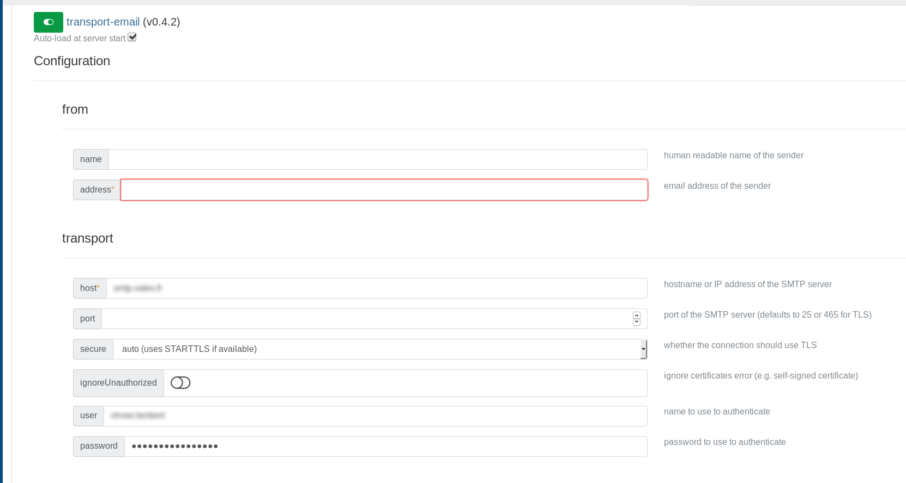
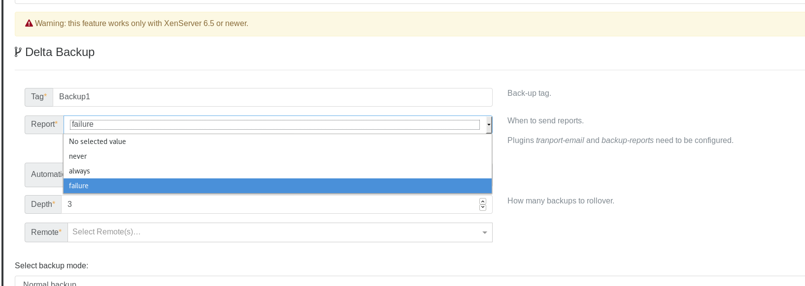
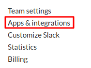
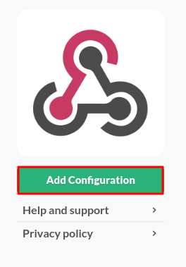
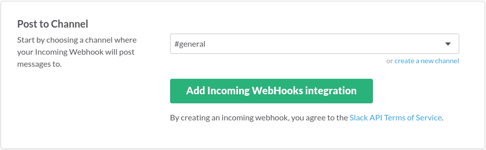
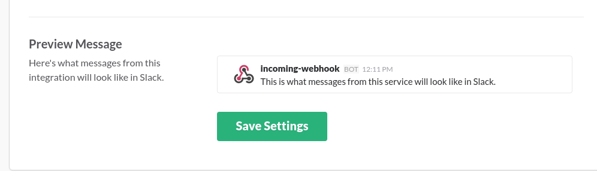
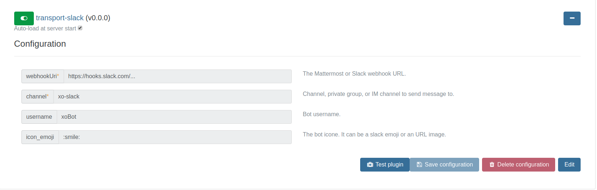
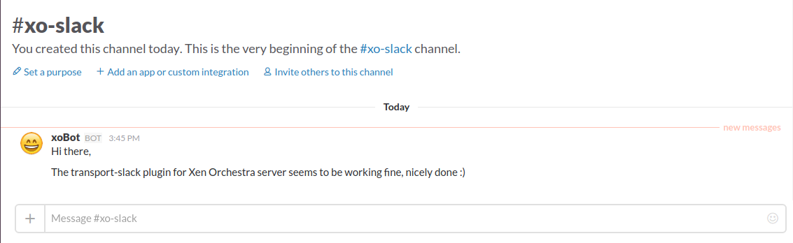

# How to configure backup reports

At the end of a backup Job, you can configure Xen Orchestra in order to receive a backup reports directly by email, on Slack or on Mattermost. It's up to you.

## Email notification

### Step-by-step

1. On the "settings/plugins" view you have to activate and configure the "Backup-reports" plugin. 

2. Still on the plugins view, you also have to configure the "transport-email" plugin.

3. Once it's done, you can now create your backup job. On the line "report" you can choose the situation in wish you want to receive
an email (always, never or failure). 

> Note: You can also modify existing backup jobs and change the behaviour of the report system.

## XMPP nofications

You can **be notified via XMPP** after the backup task is finished (scheduled "full backup", "snapshots" or "disaster recovery").

To configure it, 2 steps in the plugin section (in "Settings"):

1. add a list of recipient(s) for the notifications (in the plugin "backup-reports" and for XMPP)
2. set the XMPP server

That's it: your next scheduled jobs will be recap in a message:

## Slack or Mattermost notifications

Xen Orchestra is able to send backup report to Slack or Mattermost.

### Plugin configuration

Like all other xo-server plugins, it can be configured directly via
the web iterface, see [the plugin documentation](https://xen-orchestra.com/docs/plugins.html).

### Generate the Webhook

#### Slack

1. Log in your Slack team account

2. Click on the **Main menu** at the top and choose **Apps & Integrations**

3. Search **Incoming WebHooks**

4. Click on **Add Configuration**

5. Choose the default channel and click on **Add Incoming WebHooks integration**

6. Modify the default settings and click on **Save Settings**

#### Mattermost

You need to be an admin.

* Go in MatterMost menu, then Integration
* Click on "Add Incoming webhook"
* "Add Incoming Webhook"

### Testing the plugin

#### Slack

#### Mattermost

