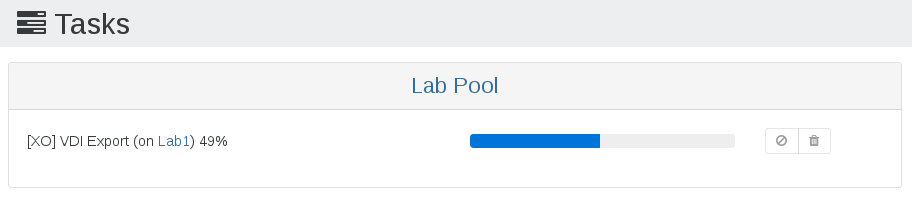

# Backup troubleshooting

## Backup progress

While a backup job is running, you should see activity in the "Tasks" view (Menu/Tasks), like this:

Another good way to check if there is activity is the XOA VM stats view (on the Network graph).

## Error messages

### VDI chain protection

This means your previous VM disks and snapshots should be "merged" (*coalesced* in the XenServer world) before we can take a new snapshot. This mechanism is handled by XenServer itself, not Xen Orchestra. But we can check your existing VDI chain and avoid creating more snapshots than your storage can merge. Otherwise, this will lead to catastrophic consequences. Xen Orchestra is the **only** XenServer/XCP backup product dealing with this.

Without this detection, you could have 2 potential issues:

* `The Snapshot Chain is too Long`
* `SR_BACKEND_FAILURE_44 (insufficient space)`

The first issue is a chain that contains more than 30 elements (fixed XenServer limit), and the other one means it's full because the "coalesce" process couldn't keep up the pace and the storage filled up.

In the end, this message is a **protection mechanism against damaging your SR**. The backup job will fail, but XenServer itself should eventually automatically coalesce the snapshot chain, and the the next time the backup job should complete.

Just remember this: **coalesce will happen every time a snapshot is removed**.

> You can read more on this on our dedicated blog post regarding [XenServer coalesce detection](https://xen-orchestra.com/blog/xenserver-coalesce-detection-in-xen-orchestra/).

### Troubleshooting a constant VDI Chain Protection message (XenServer failure to coalesce)

 As previously mentioned, this message can be normal and it just means XenServer needs to perform a coalesce to merge old snapshots. However if you repeatedly get this message and it seems XenServer is not coalescing, You can take a few steps to determine why.  

First check SMlog on the XenServer host for messages relating to VDI corruption or coalesce job failure. For example, by running `cat /var/log/SMlog | grep -i exception` or `cat /var/log/SMlog | grep -i error` on the XenServer host with the affected storage.  

Coalesce jobs can also fail to run if the SR does not have enough free space. Check the problematic SR and make sure it has enough free space, generally 30% or more free is recommended depending on VM size.  

You can check if a coalesce job is currently active by running `ps axf | grep vhd` on the XenServer host and looking for a VHD process in the results (one of the resulting processes will be the grep command you just ran, ignore that one).  

If you don't see any running coalesce jobs, and can't find any other reason that XenServer has not started one, you can attempt to make it start a coalesce job by rescanning the SR. This is harmless to try, but will not always result in a coalesce. Visit the problematic SR in the XOA UI, then click the "Rescan All Disks" button towards the top right: it looks like a refresh circle icon. This should begin the coalesce process - if you click the Advanced tab in the SR view, the "disks needing to be coalesced" list should become smaller and smaller.

### Parse Error

This is most likely due to running a backup job that uses Delta functionality (eg: delta backups, or continuous replication) on a version of XenServer older than 6.5. To use delta functionality you must run XenServer 6.5 or later.

### SR_BACKEND_FAILURE_44 (insufficient space)

> This message can be triggered by any backup method.

The Storage Repository (where your VM disks are currently stored) is full. Note that doing a snapshot on a thick provisioned SR (LVM family for all block devices, like iSCSI, HBA or Local LVM) will consume the current disk size. Eg if you are using this kind of SR at more than 50% and you want to backup ALL VM disks on it, you'll hit this wall.

Workarounds:

* use a thin provisioned SR (local ext, NFS, XOSAN)
* wait for Citrix to release thin provisioning on LVM
* wait for Citrix to allow another mechanism besides snapshot to be able to export disks
* use less than 50% of SR space or don't backup all VMs

### Could not find the base VM

This message appears when the previous replicated VM has been deleted on the target side which breaks the replication. To reset the process it's necessary to delete VM snapshot related to this CR job on the original VM. The name of this snapshot is: `XO_DELTA_EXPORT: <name label of target SR> (<UUID of target SR>)`

### LICENSE_RESTRICTION(PCI_device_for_auto_update)

This message appears when you try to do a backup/snapshot from a VM that was previously on a host with an active commercial XenServer license but is now on a host with a free edition of XenServer.

To solve it, you have to change a parameter in your VM. `xe vm-param-set has-vendor-device=false uuid=<VM_UUID>`

### ENOSPC: no space left on device

This message appears when you do not have enough free space on the target remote when running a backup to it.  

To check your free space, enter your XOA and run `xoa check` to check free system space and `df -h` to check free space on your chosen remote storage.

### Error: no VMs match this pattern

This is happening when you have a *smart backup job* that doesn't match any VMs. For example: you created a job to backup all running VMs. If no VMs are running on backup schedule, you'll have this message. This could also happen if you lost connection with your pool master (the VMs aren't visible anymore from Xen Orchestra).

Edit your job and try to see matching VMs or check if your pool is connected to XOA.