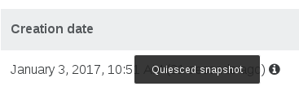
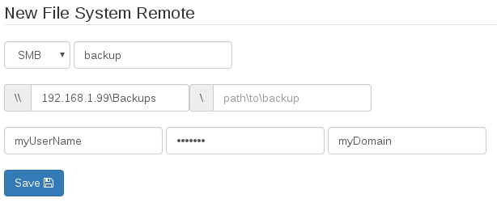
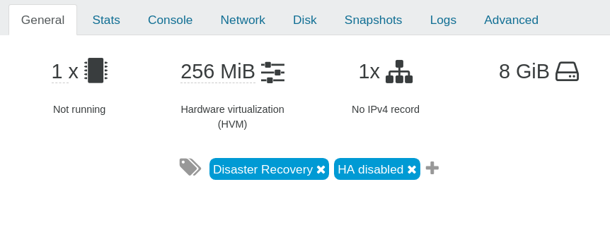

# Backups

This section is dedicated to all existing methods of rolling back or backing up your VMs in Xen Orchestra.

There are several ways to protect your VMs:

* [Full Backups](full_backups.md) [*Starter Edition*]
* [Rolling Snapshots](rolling_snapshots.md) [*Starter Edition*]
* [Delta Backups](delta_backups.md) (best of both previous ones) [*Enterprise Edition*]
* [Disaster Recovery](disaster_recovery.md) [*Enterprise Edition*]
* [Continuous Replication](continuous_replication.md) [*Premium Edition*]
* [File Level Restore](file_level_restore.md) [*Premium Edition*]

> Don't forget to take a look at the [backup troubleshooting](backup_troubleshooting.md) section. You can also take a look at the [backup reports](backup_reports.md) section for configuring notifications.

There is also a way to automatically select the VMs to backup: **[smart backup](smart_backup.md)** [*Enterprise Edition*]

## Overview

This is the welcome panel for the backup view. It recaps all existing scheduled jobs. This is also where the backup logs are displayed.

## Logs

All the scheduled operations (backup, snapshots and even DR) are displayed in the main backup view.

A successful backup task will be displayed in green, a faulty one in red. You can click on the arrow to see each entry detail.

You also have a filter to search anything related to these logs.

> Logs are not "live" tasks. If you restart XOA during a backup, the log associated with the job will stay in orange (in progress), because it wasn't finished. It will stay forever unfinished because the job was cut in the middle.

## Backups execution

Each backups' job execution is identified by a `runId`. You can find this `runId` in its detailed log.


## Consistent backup (with quiesce snapshots)

All backup types rely on snapshots. But what about data consistency? By default, Xen Orchestra will try to take a **quiesced snapshot** every time a snapshot is done (and fall back to normal snapshots if it's not possible).

Snapshots of Windows VMs can be quiesced (especially MS SQL or Exchange services) after you have installed Xen Tools in your VMs. However, [there is an extra step to install the VSS provider on windows](quiesce). A quiesced snapshot means the operating system will be notified and the cache will be flushed to disks. This way, your backups will always be consistent.

To see if you have quiesced snapshots for a VM, just go into its snapshot tab, then the "info" icon means it is a quiesced snapshot:


The tooltip confirms this:



## Remotes

> Remotes are places where your *backup* and *delta backup* files will be stored.

To add a *remote*, go to the **Settings/Remotes** menu.

Supported remote types:

* Local (any folder in XOA filesystem)
* NFS
* SMB (CIFS)


> **WARNING**: the initial "/" or "\\" is automatically added.

### NFS

On your NFS server, authorize XOA's IP address and permissions for subfolders. That's all!

### SMB

We support SMB storage on *Windows Server 2012 R2*.

> WARNING: For continuous delta backup, SMB is **NOT** recommended (or only for small VMs, eg < 50GB)

Also, read the UI twice when you add an SMB store. If you have:

* `192.168.1.99` as SMB host
* `Backups` as folder
* no subfolder

You'll have to fill it like this:



**PATH TO BACKUP is only needed if you have subfolders in your share.**

### Local

> **This is for advanced users**. Using the local XOA filesystem without extra mounts/disks will **use the default system disk of XOA**.

If you need to mount an unsupported store (FTP for example), you can always do it manually:

1. mount your remote store inside the XOA filesystem manually, e.g in `/media/myStore`
2. in the web interface, select a "local" store and point it to your `/media/myStore` folder.

Any Debian Linux mount point could be supported this way, until we add further options directly in the web interface.

## Restore backups

All your scheduled backups are acccessible in the "Restore" view in the backup section of Xen Orchestra.

1. Select your remote and click on the eye icon to see the VMs available
2. Choose the backup you want to restore
3. Select the SR where you want to restore it

> Note: You can restore your backup even on a brand new XenServer and on brand new hardware.

## About backup compression

By default, *Backups* are compressed (using GZIP, done on XenServer side). There is no absolute rule but in general uncompressed backups are faster (but sometimes much larger).

XenServer uses Gzip compression, which is:

* slow (single threaded)
* space efficient
* consumes less bandwidth (helpful if your NFS share is far away)

If you have compression on your NFS share (or destination filesystem like ZFS), you can disable compression in Xen Orchestra.

## Add a disk for local backups

If you want to use XOA to locally store all your backups, you need to attach a large disk to it. This can be done live.

First, after your disk is attached to XOA, you'll have to find the new disk name with `fdisk -l`. It's probably `xvdb`.

Then, create a filesystem on it:

```
mkfs.ext4 /dev/xvdb

```

If you already have backups done, you can move them to the new disk. The orignal backups folder is in `/var/lib/xoa-backups`.

To make the mount point persistent in XOA, edit the `/etc/fstab` file, and add:

```
/dev/xvdb /var/lib/xoa-backups ext4 defaults 0 0
```

This way, without modifying your previous scheduled snapshot, they will be written to this new local mountpoint!

## High availability (HA) disabled on replicated VMs

Replicated VMs HA are taken into account by XS/XCP-ng. To avoid the resultant troubles, HA will be disabled from the replicated VMs and a tag indicating this change will be added. This tag won't be removed on re-enabling HA.



