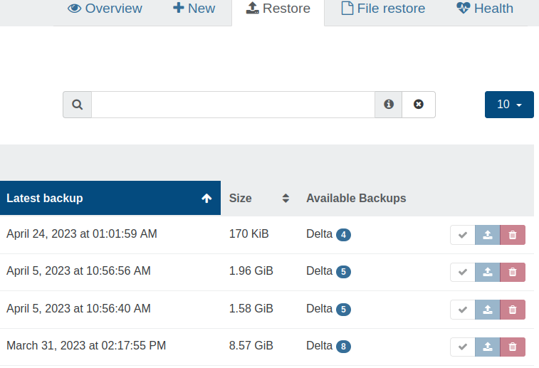
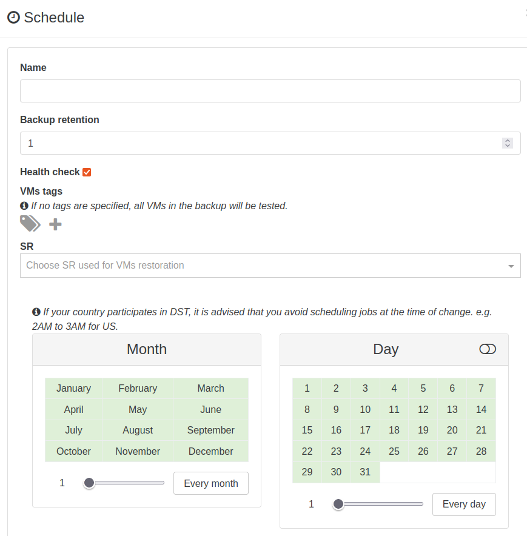

# Concepts

This section is dedicated to all general concepts about Xen Orchestra backups.

## Interface

### Overview

This is the welcome panel for the backup view. It recaps all existing scheduled jobs. This is also where the backup logs are displayed.

### Logs

All the scheduled operations (backup, snapshots and even DR) are displayed in the main backup view.

A successful backup task will be displayed in green, a faulty one in red. You can click on the arrow to see each entry detail.

You also have a filter to search anything related to these logs.

:::tip
Logs are not "live" tasks. If you restart XOA during a backup, the log associated with the job will stay in orange (in progress), because it wasn't finished. It will stay forever unfinished because the job was cut in the middle.
:::

### Backups execution

Each backups' job execution is identified by a `runId`. You can find this `runId` in its detailed log.


## Exclude disks

During a backup job, you can avoid saving all disks of the VM. To do that is trivial: just edit the VM disk name and add `[NOBAK]` before the current name, eg: `data-disk` will become `[NOBAK] data-disk` (with a space or not, doesn't matter).

The disks marked with `[NOBAK]` will be now ignored in all following backups.

## Schedule

:::tip
:construction_worker: This section needs to be completed: screenshots and how-to :construction_worker:
:::

## Smart Backup

There are two ways to select which VMs will be backed up:

1. Manually selecting multiple VM's
1. Smart backup

Picking VMs manually can be a limitation if your environment moves fast (i.e. having new VMs you need to backup often). In that situation you would previously need to constantly go back and edit the backup job to add new VM's.

But thanks to _smart backup_, you now have more flexibility: you won't select specific VMs, but VMs status/tag/placement **at the time backup job will be executed**. Let's see some examples!

### Backup all VMs on a pool

This job will backup all VMs on a pool "Lab Pool" when scheduled:


It means: **every VM existing on this pool at the time of the backup job will be backed up**. Doesn't matter if you create a new VM, it will be backed up too without editing any backup job.

**You now have the ability to intelligently backup VM's in production pools!**

Want to narrow the job a bit? See below.

### Backup filters

You can also:

- backup only running (or halted) VMs when the job is executed
- backup only VMs with a specific tag

Remember the Prod VMs? I added a tag "prod" to each of them:


Now if you do this:


It means any VMs on "Lab Pool" with the "prod" tag will be backed up.

## RAM Enabled backup

:::tip
This feature is **only compatible** with XCP-ng 8.0 or more recent. Citrix Hypervisor didn't yet merge our changes, despite we contributed to their code directly.
:::


XCP-ng modified XAPI is now able to create VMs in a `Suspended` state with a `suspend_VDI` property set. When a VM is suspended, all of its memory contents are written into a disk called `suspend_VDI`. When the VM is restored, the `suspend_VDI` is read to recreate the memory of the VM. Once the resuming is done it's as if the VM was never suspended.

### Use cases

It is already possible to snapshot a VM with its RAM, however when restoring a VM, the VM was created in the `Halted` state so it wasn't possible to restore the VM with its RAM. With our XAPI modification a VM can now be created in a `Suspended` state with preset memory contents, so when snapshotting a VM with RAM, the snapshotted VM will also have the RAM contents set.

This can be very useful when you're running a VM that needs RAM coherence to run:

- For instance, snapshotting a Windows VM used to be very tricky for this reason. The Citrix VSS script previously answered part of this problem, when snapshotted, the VM flushed its cache but if it happened that the snapshot had coherence issues, the restored VM would be broken. And the VSS script is no longer available.
- VMs running databases could also need such a feature in order to keep transient transactions.
- A VM can be restored on a different host, now the RAM can be as well.

In a nutshell this functionality can be seen as _hot copy_, similar to _hot migration_ but the original VM is not deleted.

### Continuous replication with RAM

This feature allows you to regularly send a copy of a VM to a target SR. The copied VM will be `Suspended` and ready to be resumed if the original VM encounters issues. As the copied VM is `Suspended`, no reboot will be required, resuming it is much faster.

For instance, if an hourly continuous replication is configured on a VM, if the VM is lost, you can quickly resume a running VM with a memory loss of one hour tops.

:::warning
In order to use this functionality, the CPU of the host the VM is restored on should be the same or more recent than the CPU of the host the VM was originally running on.
:::

### Future of RAM enabled backup

- Better analyze of compatible CPUs to avoid manual compatibility checks
- RAM snapshot using Xen copy-on-write memory capabilities (time to snapshot reduce to almost 0)

## Consistent backup

:::warning
This feature is being deprecated in XCP-ng and Citrix Hypervisor. It's now replaced by RAM enabled backup!
:::

All backup types rely on snapshots. But what about data consistency? By default, Xen Orchestra will try to take a **quiesced snapshot** every time a snapshot is done (and fall back to normal snapshots if it's not possible).

Snapshots of Windows VMs can be quiesced (especially MS SQL or Exchange services) after you have installed Xen Tools in your VMs. However, [there is an extra step to install the VSS provider on windows](https://xen-orchestra.com/blog/xenserver-quiesce-snapshots/). A quiesced snapshot means the operating system will be notified and the cache will be flushed to disks. This way, your backups will always be consistent.

To see if you have quiesced snapshots for a VM, just go into its snapshot tab, then the "info" icon means it is a quiesced snapshot:


The tooltip confirms this:


## Remotes

Remotes are places where your _backup_ and _delta backup_ files will be stored.

To add a _remote_, go to the **Settings/Remotes** menu.

Supported remote types:

- Local (any folder in XOA filesystem)
- NFS
- SMB (CIFS)

:::warning
The initial "/" or "\\" is automatically added.
:::

### NFS

On your NFS server, authorize XOA's IP address and permissions for subfolders. That's all!

### SMB

We support SMB storage on _Windows Server 2012 R2_.

:::warning
For continuous delta backup, SMB is **NOT** recommended (or only for small VMs, eg < 50GB)
:::

Also, read the UI twice when you add an SMB store. If you have:

- `192.168.1.99` as SMB host
- `Backups` as folder
- no subfolder

You'll have to fill it like this:


:::warning
PATH TO BACKUP is only needed if you have subfolders in your share.
:::

### Local

:::warning
**This is for advanced users**. Using the local XOA filesystem without extra mounts/disks will **use the default system disk of XOA**.
:::

If you need to mount an unsupported store (FTP for example), you can always do it manually:

1. mount your remote store inside the XOA filesystem manually, e.g in `/media/myStore`
2. in the web interface, select a "local" store and point it to your `/media/myStore` folder.

Any Debian Linux mount point could be supported this way, until we add further options directly in the web interface.

## Restore a backup

All your scheduled backups are acccessible in the "Restore" view in the backup section of Xen Orchestra.

1. Search the VM Name and click on the blue button with a white arrow
2. Choose the backup you want to restore
3. Select the SR where you want to restore it and click "OK"

:::tip
You can restore your backup even on a brand new host/pool and on brand new hardware.
:::

## File level restore

You can also restore specific files and directories inside a VM. It works with all your existing delta backups.

:::warning
File level restore **is only possible on delta backups**. Also, due of some technical limitations, you won't be able to do file level restore if you have a chain longer than 99 (ie retention longer than 99 records without any full between). Take a look at the [full backup interval section](./delta_backups.md#full-backup-interval) to set this correctly.
:::

:::warning
File level restore **is only possible on a single VDI**, it does not support LVM Volume Groups that span multiple VDIs.
:::

### Restore a file

Go into the Backup/File restore section:


Then, click on the VM where your files are, and follow the instructions:


That's it! Your chosen file will be restored.

## About backup compression

By default, _Backups_ are compressed (using GZIP or zstd, done on host side). There is no absolute rule but in general uncompressed backups are faster than GZIP backups (but sometimes much larger).

Citrix Hypervisor uses Gzip compression, which is:

- slow (single threaded)
- space efficient
- consumes less bandwidth (helpful if your NFS share is far away)

However, XCP-ng is using `zstd`, which is far better.

:::tip
If you have compression on your NFS share (or destination filesystem like ZFS), you can disable compression in Xen Orchestra.
:::

## Add a disk for local backups

If you want to use XOA to locally store all your backups, you need to attach a large disk to it. This can be done live.

First, after your disk is attached to XOA, you'll have to find the new disk name with `fdisk -l`. It's probably `xvdb`.

Then, create a filesystem on it:

```sh
mkfs.ext4 /dev/xvdb
```

If you already have backups done, you can move them to the new disk. The orignal backups folder is in `/var/lib/xoa-backups`.

To make the mount point persistent in XOA, edit the `/etc/fstab` file, and add:

```
/dev/xvdb /var/lib/xoa-backups ext4 defaults 0 0
```

This way, without modifying your previous scheduled snapshot, they will be written to this new local mountpoint!

## HA behavior

Replicated VMs HA are taken into account by XCP-ng. To avoid the resultant troubles, HA will be disabled from the replicated VMs and a tag indicating this change will be added.


:::tip
The tag won't be automatically removed by XO on the replicated VMs, even if HA is re-enabled.
:::

## Backup Concurrency

Xen Orchestra 5.20 introduces new tools to manage backup concurrency. Below is an overview of the backup process and ways you can control concurrency in your own environment.

### Backup process

#### 1. Snapshot creation

When you perform a backup in XCP-ng/XenServer, the first operation performed is to "freeze" the data at a specific time - this is done by **making a snapshot**. This operation is pretty quick, only a few seconds in general. However it uses a lot of I/O on your storage, therefore more I/O activity means longer times to snapshot. Still, the order of magnitude is seconds per VM.

#### 2. Export

Xen Orchestra will fetch the content of the snapshot made in step 1. This operation can be very long, obviously depending on the size of the snapshot to export: exporting 1TiB of data will take far longer than exporting 1GiB!

#### 3. Snapshot removal

When it's done exporting, we'll remove the snapshot. Note: this operation will trigger a coalesce on your storage in the near future (a coalesce is required every time a snapshot is removed).

### Concurrency

Concurrency is a parameter that let you define how many VMs your backup job will manage simultaneously.

:::tip

- Default concurrency value is 2 if left empty.
  :::

Let's say you want to backup 50 VMs (each with 1x disk) at 3:00 AM. There are **2 different strategies**:

1. backup VM #1 (snapshot, export, delete snapshots) **then** backup VM #2 -> _fully sequential strategy_
2. snapshot all VMs, **then** export all snapshots, **then** delete all snapshots for finished exports -> _fully parallel strategy_

The first purely sequential strategy will lead to the fact that: **you can't predict when a snapshot of your data will occur**. Because you can't predict the first VM export time (let's say 3 hours), then your second VM will have its snapshot taken 3 hours later, at 6 AM.

:::tip
If you need your backup to be done at a specific time you should consider creating a specific backup task for this VM.
:::

Strategy number 2 is to parallelise: all the snapshots will be taken at 3 AM. However **it's risky without limits**: it means potentially doing 50 snapshots or more at once on the same storage. **Since XCP-ng/XenServer doesn't have a queue**, it will try to do all of them at once. This is also prone to race conditions and could cause crashes on your storage.

By default the _parallel strategy_ is, on paper, the most logical one. But you need to be careful and give it some limits on concurrency.

:::danger
High concurrency could impact your dom0 and network performances.
:::

You should be aware of your hardware limitation when defining the best concurrency for your XCP-ng infrastructure, never put concurrency too high or you could impact your VMs performances.
The best way to define the best concurrency for you is by increasing it slowly and watching the result on backup time.

So to summarize, if you set your concurrency at 6 and you have 20 Vms to backup the process will be the following:

- We start the backup of the first 6 VMs.
- When one VM backup has ended we will launch the next VM backup.
- We keep launching new VM backups until the 20 VMs are finished, keeping 6 backups running.

Removing the snapshot will trigger the coalesce process for the first VM, this is an automated action not triggered directly by the backup job.

## Backup modifier tags

When a backup job is configured using Normal snapshot mode, it's possible to use VM tags to apply a different snapshot mode to individual VMs.

- **xo-offline-backup** to apply offline snapshotting mode (VM will be shut down prior to snapshot)
- **xo-memory-backup** to apply RAM-enabled snapshotting
- **xo-backup-healthcheck-xenstore** to use a script during [backup healthcheck](#backup-health-check)

For example, you could have a regular backup job with 10 VMs configured with Normal snapshotting, including two which are database servers. Since database servers are generally more sensitive to being restored from snapshots, you could apply the **xo-memory-backup** tag to those two VMs and only those will be backed up in RAM-enabled mode. This will avoid the need to manage a separate backup job and schedule.

## Retention and Scheduling

Just a refresher/summary: You can select multiple backup methods for the same job:

- Full: _Backup_ and _Disaster Recovery_ (DR)
- Deltas: _Delta Backup_ and _Continuous Replication_ (CR)

The Full and Delta options are mutually exclusive; Rolling Snapshots are compatible with both. The Backup and Delta Backup go to a remote Target (e.g, NFS); DR and CR back up to another XCP-ng storage repository (i.e., not the one on which the VM's being backed up reside). In the Schedule configuration, you will have the option to select the number of "Backup Retention" if your backup includes a _Backup_ (or _Delta Backup_); you will have the option to select the number "Replication Retention" if you have selected _DR_ or _CR_ in the backup configuration.

### Rolling Snapshots

Vates recommends keeping the Rolling Snapshots retention to a minimum; if you check Dashboard>Health, you'll see a table for 'Too Many Snapshots,' which shows VMs that have more than 5 snapshots saved; this includes the snapshots used for any kind of backup, not simply the rolling snapshots.

### Retention of Backups and CR/DR

If your backup includes both a (Delta) Backup _and_ a CR/DR, you will have the option to select the number you wish for both "Backup retention" and "Replication retention" in the Schedule configuration; make sure to assign the number you want to the correct retention.

If you need to restore a (Delta) Backup (or clone and spin up a VM from CR/DR), you will be able to select all the available backups or VMs, regardless of the retention or delta scheme. If you have multiple backup jobs backing up the same VM, you'll see all the backups in the restore list, sorted by date.

### Decreasing Retention Frequency with Age

It is often a good idea to configure retention of older backups with decreasing frequency. For example, you may want a nightly backup, but you don't want 365 backups to be able to restore from a year ago. The solution is to set several different schedules/retention policies for the same backup job. A reasonable approach might be to schedule...

- a nightly backup, except on Sunday (retaining 6)
- a weekly backup on Sunday (retaining 4)
- a monthly backup (retaining 12)

Again, all of these can be assigned to the same backup job. Note that if you do a weekly and a monthly backup, at some point, these will fall on the same day. Xen Orchestra is designed to fail gracefully (with an error message) if a backup job for a VM is already running. For this reason, you will want to set the time on the monthly job to run before the weekly job so that if one fails, it will be the weekly rather than the monthly one; if the weekly one fails, the monthly will be there for that spot in the retention plan; if the monthly one fails, the weekly one will only be retained for 4 weeks, and then there will be a gap in the monthly retention.

## Backup Health Check

Backup health check ensures the backups are ready to be restored.

### Different level of checking

#### Check for boot

XO will restore the VM, either by downloading it for a delta/full backup or by cloning it for a disaster recovery or continuous replication and then wait for the guest tools to be loaded before the end of a timeout of 10 minutes (boot + guest tools).

A VM without guest tools will fail its health check.

The restored VM is then deleted.

#### Execute a script

If a VM has the tag **xo-backup-healthcheck-xenstore** during a backup health check, then XO will wait for a script to change the value of the xenstore `vm-data/xo-backup-health-check` key to be either `success` or `failure`.

In case of `failure`, it will mark the health check as failed, and will show the (optional) message contained in `vm-data/xo-backup-health-check-error`

The script needs to be planned on boot. It can check if the record `vm-data/xo-backup-health-check` of the local xenstore contains `planned`
to differenciate a normal boot and a boot during health check.
On success it must write `success`in `vm-data/xo-backup-health-check`.
On failure it must write `failure` in `vm-data/xo-backup-health-check`, and may optionally add details in `vm-data/xo-backup-health-check-error` .

The total timeout of a backup health check (boot + guest tools + scripts) is 10min.

The restored VM is then deleted.

An example in bash is shown in `@xen-orchestra/backups/docs/healtcheck example/wait30seconds.sh`

### Running Health checks

#### Checking a backup

Go to backup > restore and click on the tick to launch a health check.



Then, you will select the backup to be checked and a destination SR, which must have enough space for the full restore.

#### Scheduling health check after backups

Go to Backup > overview > edit.

Then edit the schedule and check the healthcheck box.



You will then need to select the SR used, which must have enough space to restore the VMs. Healthcheck will be done after each VM backup, before starting the next one.

You can filter the VMs list by providing tags, only the VMs with these tags will be checked.
