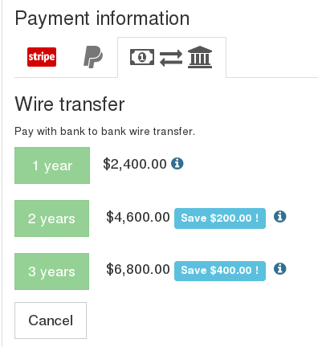

# Direct purchase

This is the simplest case: you buy XOA with your registered email account on `xen-orchestra.com`.

You can choose the edition you want in two places:

* [the pricing page](https://xen-orchestra.com/#!/pricing)
* [your account/member zone](https://xen-orchestra.com/#!/member)

> You need to be logged to make a purchase. If you don't have any account, please [register here](https://xen-orchestra.com/#!/signup).

From your account zone, click on the purchase menu, then select the edition you need:

Then you need to fill your information and select "buy it for my own use":

The default payment method is by **credit card**. But you can also choose the "wire transfer" tab (with the "bank" icon):

## Wire transfer process

If you selected wire transfer, you need to upload a transfer proof before we can unlock your XOA. If you don't, you'll have to wait for funds to be actually transferred in our account.
