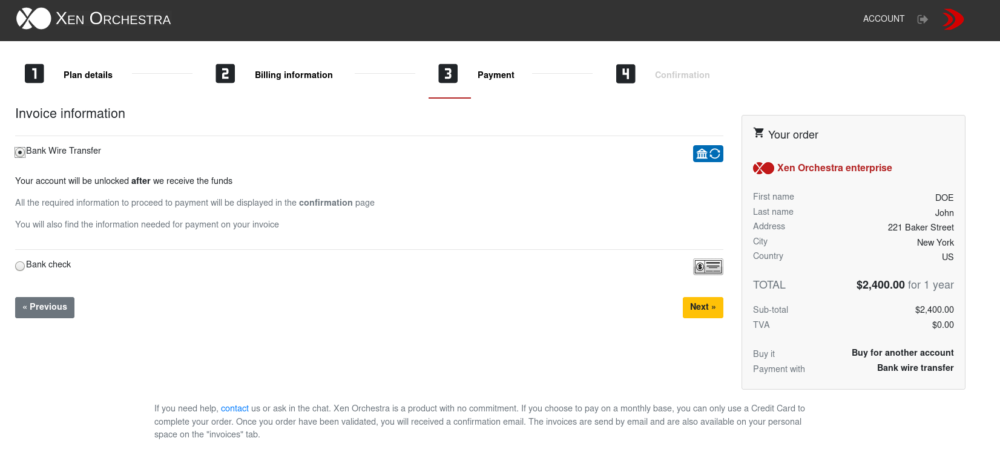

# Direct purchase

This is the easiest purchase option: you can buy XOA with your registered email account on `xen-orchestra.com`.

## Choose your edition

You can choose the edition you want in two places:

* [the pricing page](https://xen-orchestra.com/#!/pricing)
* [your account/purchases page](https://xen-orchestra.com/#!/purchases)

> You need to be logged in to make a purchase. If you don't have an account, please [register here](https://xen-orchestra.com/#!/signup).

From your account page, click on the purchase menu, then select the edition you need:

## Purchase options

The second step is to select your purchase option: 

- Subscription: only available with a credit card payment. Choose this option for a monthly payment or a yearly payment **renewed automatically** each year.

- Paid period: **check or wire transfer only**. This purchase allows you to subscribe for a one, two or three year period

> A 2 year subscription period grants you 1 month discounted
> A 3 year subscription period grants you 2 months discounted

Then you need to fill in your information and select **"Buy for my own use"** (direct purchase)

## Billing information
You need to complete all the required information on this page in order to move forward. 

> Note: If you are part of the Eurozone, you will need to provide a valid EU VAT number in order to proceed to payment. Transactions between companies inside the Eurozone are VAT free. 
Transactions outside the Eurozone are VAT free. 

## Select your payment mode

Credit Card, Wire transfer or Bank check are the three payment methods available on our store. Some methods can be unavailable regarding the purchase option you have selected during step one. 

> Wire transfer is not available for monthly and yearly subscription - Credit Card is not available for paid period.

> All required information for wire transfer and Check payment will be available in the last step of the payment AND on your proforma invoice.
> ⚠ Please, use an explicit reference for your wire transfer in order for us to easily identify your payment.
