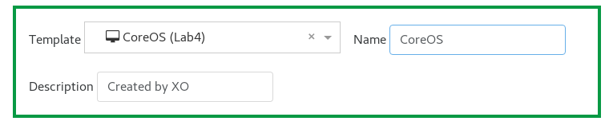
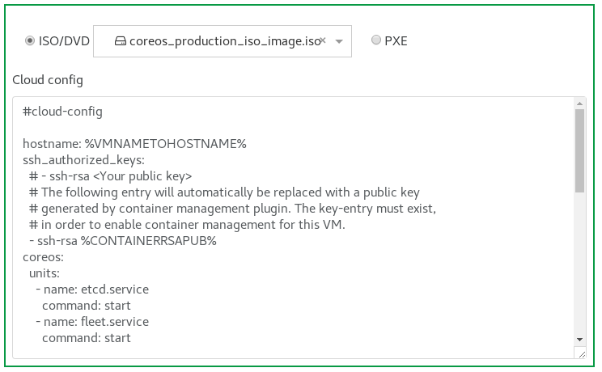
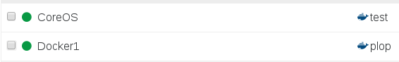
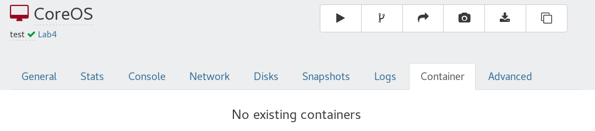
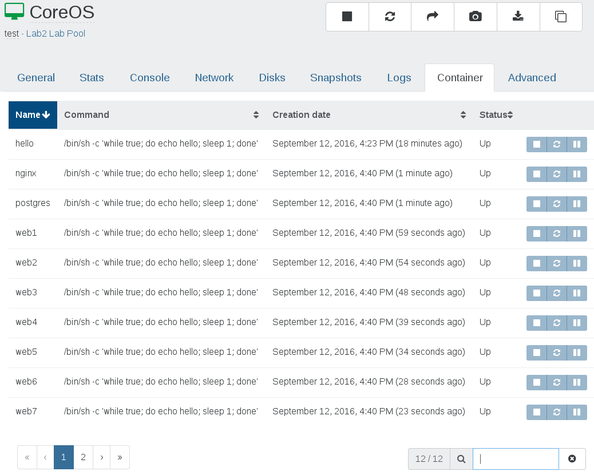
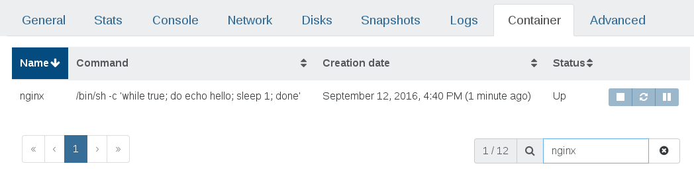

# Docker support

> This feature is available in XOA 4.10 and above

The basic container lifecycle is documented [in the Administration section](https://xen-orchestra.com/docs/administration.html#docker-management).

This category is dedicated to creating a VM with Docker support.

## Prerequisites

* XenServer 6.5 or higher
* Plugin installation (see below)
* CoreOS ISO ([download it here](http://stable.release.core-os.net/amd64-usr/current/coreos_production_iso_image.iso)) for CoreOS installations
* Xen Orchestra 4.10 or newer

## Docker plugin installation

This first step is needed until Docker is supported natively in the XenServer API (XAPI).

> The plugin should be installed on every host you will be using, even if they are on the same pool.

#### For XenServer 6.5

1. SSH to your XenServer
1. Download the plugin: `wget http://downloadns.citrix.com.edgesuite.net/10343/XenServer-6.5.0-SP1-xscontainer.iso`
1. Install it: `xe-install-supplemental-pack XenServer-6.5.0-SP1-xscontainer.iso`

#### For XenServer 7.0

1. SSH to your XenServer
1. Download the plugin: `wget http://downloadns.citrix.com.edgesuite.net/11621/XenServer-7.0.0-xscontainer.iso`
1. Install it: `xe-install-supplemental-pack XenServer-7.0.0-xscontainer.iso`

#### For XenServer 7.1

1. SSH to your XenServer
1. Download the plugin: `wget http://downloadns.citrix.com.edgesuite.net/11993/XenServer-7.1.0-xscontainer.iso`
1. Install it: `xe-install-supplemental-pack XenServer-7.1.0-xscontainer.iso`

#### For XenServer 7.2

1. SSH to your XenServer
1. Download the plugin: `wget http://downloadns.citrix.com.edgesuite.net/12641/XenServer-7.2.0-xscontainer.iso`
1. Install it: `xe-install-supplemental-pack XenServer-7.2.0-xscontainer.iso`

That's it! You can now enjoy Docker support!

## Docker managed VMs

There are two ways to use the newly exposed Docker features:

* Install a CoreOS VM
* Transform an existing VM into a supported Docker VM

### CoreOS

[CoreOS](https://coreos.com/) is a Linux distribution with bundled software, like `etcd`, `rkt`, `fleet` etc. The ISO install CD also uses `CloudInit` (which is the interesting thing here).


#### Create the VM

First things first, [create a new VM as usual](vm_creation.md).

Then, select the "CoreOS" template in the list and name it as you wish:



Select the [CoreOS ISO](http://stable.release.core-os.net/amd64-usr/current/coreos_production_iso_image.iso) as source for the installation.

You will also notice Cloud Config panel:



You'll have to uncomment the line:

`# - ssh-rsa <Your public key>`

And replace it with your actual SSH public key:

`- ssh-rsa AAAA....kuGgQ me@mypc`


The rest of the configuration is identical to any other VM. Just click on "Create VM" and you are done. After a few seconds, your VM will be ready. Nothing else to do!

You can see it thanks to the docker logo in the main view:



But also in the VM view, you'll have a container tab:



It's empty obviously, because you don't have any Docker containers running. So now, let's boot the VM, and create some Docker containers!

You should be able to access the VM with the user `core` and your SSH key (so no password to write!). And good news: because Xen Tools are installed automatically, you already have the IP address displayed in Xen Orchestra.

So in our example (use the `core` user):

```
me@mypc $ ssh core@192.168.100.209

The authenticity of host '192.168.100.209 (192.168.100.209)' can't be established.
ED25519 key fingerprint is SHA256:NDOQgOqUm3J2ZsBEMNFCpXE1lTsu4DKqKN6H7YcxS3k.
Are you sure you want to continue connecting (yes/no)? yes
Warning: Permanently added '192.168.100.209' (ED25519) to the list of known hosts.
Last login: Sun Nov 22 21:00:05 2015
CoreOS stable (607.0.0)
Update Strategy: No Reboots

core@core1 ~ $
```

You are now connected! Let's run some tests before installing it on the disks, with a container named "hello" (just doing a small infinite loop):

```
core@core1 ~ $ docker run --name nginx -d hello /bin/sh -c "while true; do echo Hello World; sleep 1; done"
Unable to find image 'busybox:latest' locally
Pulling repository busybox
17583c7dd0da: Download complete
d1592a710ac3: Download complete
Status: Downloaded newer image for busybox:latest
150bc05a84971489b2dd5dc99fe0169cdbd23599d6fac55a6a8756a3c6f52853

```

You can create any number of these!

Guess what? Check in Xen Orchestra, in the VM view:



You can now "cycle" this container: stop, pause or reboot it!

Don't forget that you can sort the table and even search inside it:



#### CoreOS installation

Now that it works, you can make a persistent installation of your CoreOS VM. In the same SSH terminal used before, just type:

```
core@core1 ~ $ sudo coreos-install -d /dev/xvda -o xen -C stable
```

You should have this output:

```
Downloading the signature for http://stable.release.core-os.net/amd64-usr/607.0.0/coreos_production_xen_image.bin.bz2...
...
Downloading, writing and verifying coreos_production_xen_image.bin.bz2...
Success! CoreOS stable 607.0.0 (xen) is installed on /dev/xvda
```

You can reboot the VM and even eject the CoreOS ISO: it will boot as a normal VM now!

### How it works

During the VM creation, the XSContainer plugin will create an extra disk: "Automatic Config Drive", with a size of 2MB. This is where the necessary configuration you edited previously (with the SSH key) is passed to the CoreOS VM! In fact, it uses `CloudInit`.

#### What is CloudInit?

`CloudInit` is software created to simplify VM provisioning for Cloud instances: it was originally developed for the Amazon Cloud, but works with all major Cloud ready systems, like OpenStack for example.

Basically, it reads configuration during the boot, allowing:

* SSH key management for newly created VM/instances
* Root disk filesystem growing
* User/group management
* Arbitrary command execution (system update, custom scripts etc.)

In our case, it's used by the XSContainer plugin to allow host communication to the Docker daemon running in the VM, thus exposing Docker commands outside of the VM.

### Existing VMs

You can also use the XSContainer plugin to "transform" an existing VM into a "Docker" managed VM.

You need to have the following installed inside the VM:

* Docker
* openssh-server
* ncat

For Debian/Ubuntu like distro: `apt-get install docker.io openssh-server nmap`. For RHEL and derived (CentOS...): `yum install docker openssh-server nmap-ncat`.

To run Docker as non-root, please add the user you want inside the "Docker" group.

Now you need to access your host (Dom0) and use the following command:

```
xscontainer-prepare-vm -v <VM_UUID> -u <username>
```

> Because "prepare-vm" is not exposed outside of the Dom0 (yet?), we can't use Xen Orchestra to give you a one-click solution as of now.
