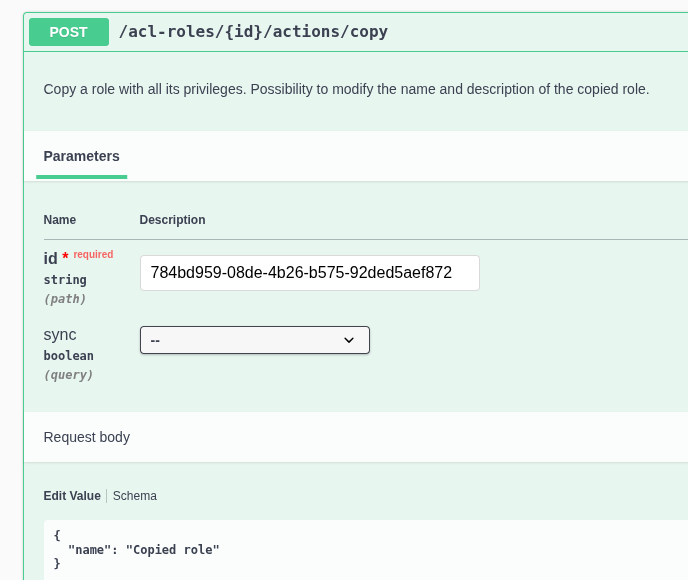
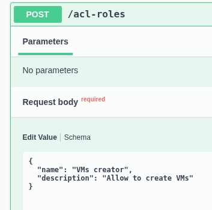
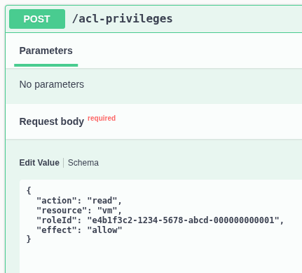
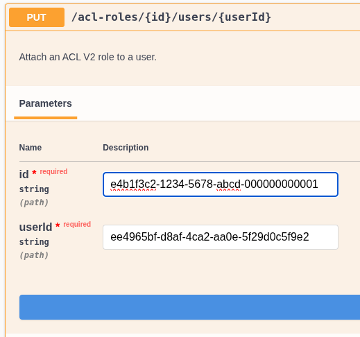
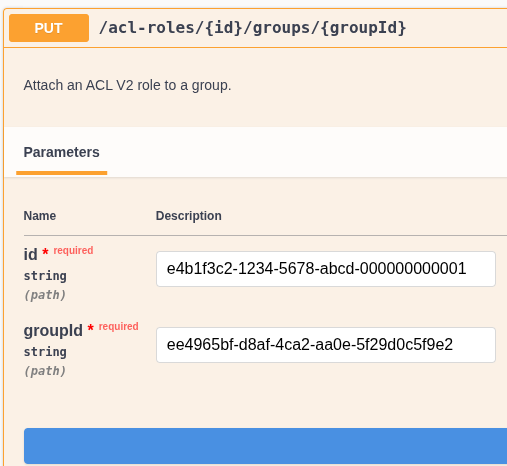

# ACL v2 (REST API/XO6)

ACL v2 is the access control system for the Xen Orchestra REST API and the XO6 UI. It lets you define exactly what each user or group can see and do — down to individual objects — without granting them full administrator access.

## What changed from v1

The old ACL system (v1) allowed granting access to individual objects (a VM, an SR…). Simple, but limited: there was no way to say _"this user can shutdown only VMs tagged `qa`"_. It also only covered **XAPI objects** — VMs, hosts, SRs, networks. Users, groups, backups, schedules, and jobs were out of scope.

ACL v2 introduces a full **RBAC (Role-Based Access Control)** model with effects, selectors, and an action hierarchy, covering the entire infrastructure including XO management objects.

:::note
ACL v2 is available through the **REST API only**. The JSON-RPC API (used by XO5) stays on ACL v1. Conversely, ACL v1 is not available on the REST API.
:::

---

## Core concepts

### How it works

ACL v2 follows a **deny-by-default** model:

- XOA admins always have full access, regardless of any ACL configuration.
- Non-admin users start with **zero access**. They can only access objects they have been explicitly granted permission to.
- A `deny` privilege always takes precedence over an `allow` privilege on the same action + resource + object combination.

The system is built around two building blocks:

| Concept       | Description                                                                                                             |
| ------------- | ----------------------------------------------------------------------------------------------------------------------- |
| **Role**      | A named container for privileges.                                                                                       |
| **Privilege** | A rule inside a role: which action is allowed (or denied) on which resource, and optionally on which subset of objects. |

### Roles

A role is just a label with a collection of privileges. You create a role once, add privileges to it, then assign it to as many users or groups as needed.

A user's effective privileges are the union of all privileges from all their direct roles and the roles of their groups.

### Privileges

A privilege defines:

- **resource** — the type of object (e.g. `vm`, `backup-job`, `sr`)
- **action** — what operation is allowed or denied (e.g. `read`, `start`, `delete`)
- **effect** — `allow` or `deny`
- **selector** _(optional)_ — a filter expression to restrict the privilege to a subset of objects (complex-matcher format)

### Action hierarchy

Actions use a `:` separator to form a hierarchy. A broader action automatically covers its children:

| Privilege action | Covers                                 |
| ---------------- | -------------------------------------- |
| `shutdown`       | `shutdown:clean` and `shutdown:hard`   |
| `reboot`         | `reboot:clean` and `reboot:hard`       |
| `update`         | `update:tags`, `update:datasources`, … |
| `*`              | every action on the resource           |

The reverse is not true: granting `shutdown:clean` does **not** grant `shutdown:hard`.

---

## Built-in template roles

Xen Orchestra ships with four ready-to-use role templates. They are **immutable** and automatically kept up to date on startup — they cannot be modified, deleted, or assigned directly.

To use them, **copy** a template into a new role and assign that copy to your users or groups. This ensures the built-in templates always stay up to date without affecting your custom configuration.

| Role                        | Description                                                                          |
| --------------------------- | ------------------------------------------------------------------------------------ |
| **Read only**               | Read access to the entire infrastructure and all XO objects. Cannot modify anything. |
| **VMs power state manager** | Can start, stop, reboot, pause, suspend, resume, and unpause VMs.                    |
| **VMs creator**             | Can instantiate VM templates and create VDIs and VIFs.                               |
| **VMs read only**           | Can only list and view VMs.                                                          |



---

## Self endpoints

Some endpoints are always accessible to a logged-in user **without any ACL privilege**, as they only expose information about the user themselves:

| Endpoint                                       | Description                                 |
| ---------------------------------------------- | ------------------------------------------- |
| `GET /rest/v0/users/me`                        | Get your own user profile                   |
| `GET /rest/v0/users/me/privileges`             | List your own privileges                    |
| `GET /rest/v0/users/me/authentication_tokens`  | List your own authentication tokens         |
| `POST /rest/v0/users/me/authentication_tokens` | Create an authentication token for yourself |

`me` is a convenience alias — it is automatically redirected to `/rest/v0/users/{your-id}`.

:::tip
The Swagger UI available at `/rest/v0/swagger` documents every endpoint with its required privileges. Endpoints with no declared privilege are admin-only.
:::

---

## Supported resources and actions

### Infrastructure resources

| Resource        | Available actions                                                                                                                                                                    |
| --------------- | ------------------------------------------------------------------------------------------------------------------------------------------------------------------------------------ |
| `vm`            | `read`, `delete`, `export`, `pause`, `start`, `reboot` (`clean`, `hard`), `shutdown` (`clean`, `hard`), `resume`, `snapshot`, `suspend`, `unpause`, `update` (`datasources`, `tags`) |
| `vm-snapshot`   | `read`, `delete`, `export`, `update:tags`                                                                                                                                            |
| `vm-template`   | `read`, `instantiate`                                                                                                                                                                |
| `vm-controller` | `read`                                                                                                                                                                               |
| `vdi`           | `read`, `create`, `delete`, `boot`, `export-content`, `import-content`, `update:tags`                                                                                                |
| `vdi-snapshot`  | `read`                                                                                                                                                                               |
| `vdi-unmanaged` | `read`                                                                                                                                                                               |
| `vif`           | `read`, `create`                                                                                                                                                                     |
| `vbd`           | `read`                                                                                                                                                                               |
| `sr`            | `read`, `import-vdi`, `update:tags`                                                                                                                                                  |
| `host`          | `read`, `allow-vm`                                                                                                                                                                   |
| `pool`          | `read`                                                                                                                                                                               |
| `network`       | `read`                                                                                                                                                                               |
| `pif`           | `read`                                                                                                                                                                               |
| `pbd`           | `read`                                                                                                                                                                               |
| `pci`           | `read`                                                                                                                                                                               |
| `pgpu`          | `read`                                                                                                                                                                               |
| `vgpu`          | `read`                                                                                                                                                                               |
| `vgpuType`      | `read`                                                                                                                                                                               |
| `vtpm`          | `read`                                                                                                                                                                               |
| `sm`            | `read`                                                                                                                                                                               |
| `gpuGroup`      | `read`                                                                                                                                                                               |

### XO management resources

| Resource            | Available actions |
| ------------------- | ----------------- |
| `backup-job`        | `read`            |
| `backup-archive`    | `read`            |
| `backup-log`        | `read`            |
| `backup-repository` | `read`            |
| `schedule`          | `read`, `run`     |
| `restore-log`       | `read`            |
| `proxy`             | `read`            |
| `server`            | `read`            |
| `task`              | `read`            |
| `alarm`             | `read`            |
| `message`           | `read`            |

### User management resources

| Resource        | Available actions                                                                      |
| --------------- | -------------------------------------------------------------------------------------- |
| `user`          | `read`, `create`, `delete`, `update` (`name`, `password`, `permission`, `preferences`) |
| `group`         | `read`                                                                                 |
| `acl-role`      | `read`                                                                                 |
| `acl-privilege` | `read`                                                                                 |

---

## Concrete examples

### Alice: QA operator scoped to tagged VMs

> Alice needs to start and stop VMs in her test environment, but must not touch anything in production.

Create a `QA Operator` role with these privileges:

```json
{ "resource": "vm", "action": "read",     "effect": "allow", "selector": "tags:qa" }
{ "resource": "vm", "action": "start",    "effect": "allow", "selector": "tags:qa" }
{ "resource": "vm", "action": "shutdown", "effect": "allow", "selector": "tags:qa" }
```

Attach the role to Alice. She can now manage QA VMs only. Any attempt on a VM without the `qa` tag is blocked with a 403.

:::tip Selectors are evaluated dynamically
If someone adds the `qa` tag to an existing VM, it immediately appears in Alice's scope.
This means a single tag change is enough to grant or revoke access to a resource, with no need to touch roles or privileges at all.
:::

---

### Bob: Rename only running VMs

> Bob is allowed to rename VMs, but only while they are running — to prevent renaming VMs that are off and might be part of an automated process.

Create a `Running VM Renamer` role with these privileges:

```json
{ "resource": "vm", "action": "read",              "effect": "allow", "selector": "power_state:Running" }
{ "resource": "vm", "action": "update:name_label", "effect": "allow", "selector": "power_state:Running" }
```

Bob can see and rename any running VM. Stopped VMs are completely invisible to him.

---

### Carol: Full VM access except production

> Carol can do everything on VMs — except touch anything tagged `prod`.

Create a `Full VM Access (non-prod)` role with these privileges. The `*` wildcard grants every action on a resource at once. Pair it with a `deny` to carve out an exception — `deny` always wins:

```json
{ "resource": "vm", "action": "*",    "effect": "allow" }
{ "resource": "vm", "action": "*",    "effect": "deny",  "selector": "tags:prod" }
```

Carol can start, stop, delete, snapshot any VM she wants. Production VMs are completely invisible to her — they never appear in her lists and any direct attempt returns a 403.

---

## Walkthrough: creating and assigning a role

### Step 1 — Create a role



Response:

```json
{ "id": "e4b1f3c2-1234-5678-abcd-000000000001" }
```

### Step 2 — Add privileges to the role



### Step 3 — Assign the role to the user



The user can now list VMs.

To assign to a group instead (all group members inherit the role):



---

## Selectors

By default, a privilege applies to **all** objects of the given resource type. The optional `selector` field narrows it down using the [complex-matcher](https://docs.xen-orchestra.com/manage_infrastructure#filter-syntax) syntax — the same filter syntax used in the XO UI.

A selector is evaluated against each object's properties. If it matches, the privilege applies; otherwise it does not.

### Common selector patterns

| Goal                           | Selector example              |
| ------------------------------ | ----------------------------- |
| A specific object by its ID    | `id: <uuid>`                  |
| All objects in a pool          | `$pool: <pool-uuid>`          |
| VMs tagged with a label        | `tags: <tag>`                 |
| VMs by power state             | `power_state: Running`        |
| VMs created by a specific user | `creation:creator: <user-id>` |

---

## Tips

- **Start minimal.** Add only the privileges a user actually needs. It is easy to add more later.
- **Use groups.** Assigning a role to a group avoids repeating the same assignment for every user.
- **Combine `allow` and `deny`.** Grant broad access with a wildcard privilege, then carve out exceptions with `deny` + a selector.
- **Template roles are immutable.** Copy them first before customizing.
- **Endpoint permissions** are visible in the Swagger UI (`/rest/v0/swagger`). Endpoints without a declared privilege require admin access.
