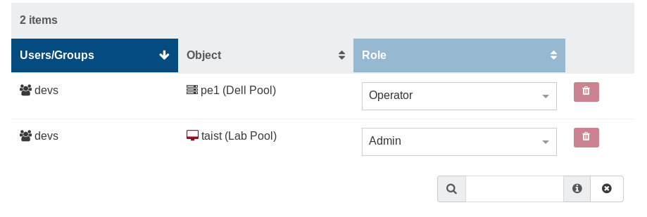

# ACLs

ACLs are permissions that apply to pre-existing objects. Only a super admin (XO administrator) can create objects.

ACLs are the permissions for your users or groups. The ACLs view can be accessed in the "Settings" panel.

1. Select the user or group you want to apply permissions on
2. Select the object on which the permission will apply
3. Choose the role for this ACL
4. Click on "Create"

:::tip
You can click to add multiple objects at the same time!
:::

Your ACL is now available in the right list:

You can edit/remove existing ACLs here.

## Roles

There are 3 different roles for your users:

- Admin
- Operator
- Viewer

### Admin

An object admin can do everything on it, even destroy it. E.g with its admin VM:

- remove it
- migrate it (to a host with admin permission on it)
- modify the VM resources, name and description
- clone it
- copy it
- convert it into a template
- snapshot it (even revert from a snapshot)
- export it
- attach/add visible disks
- same for network cards

### Operator

An operator can make everyday operations on assigned objects. E.g on a VM:

- eject a CD
- insert a CD (if he can view the ISO storage repository)
- start, restart, shutdown, suspend/resume it

All other operations are forbidden.

### Viewer

A viewer can only see the VM state and its metrics. That's all!

## Inheritance

Objects have a hierarchy: a Pool contains all its hosts, containing itself all its VMs.

If you give a _view_ permission to a user (or a group) on a pool, he will automatically see all the objects inside this pool (SRs, hosts, VMs).

## Examples

### Allow a user to install an OS

If the OS install needs an ISO, you need to give this user 2 permissions:

- _Operate_ on the VM (e.g to start it)
- _View_ on the ISO Storage containing the needed ISO.
