# Advanced features

This section is dedicated to all others Xen Orchestra "advanced features".

## Live Telemetry

When you are working on your virtualized infrastructure, you might need a very detailed view on what's going on. From resource consumption analysis (CPU/RAM) to network traffic, but also storage, having a kind of very detailed dashboard per host can be really useful.

:::tip
This feature will be only available in XCP-ng+XOA. If you are a hardcore Citrix Hypervisor user, let us know if you want this.
:::

### Enable Advanced Live Telemetry for a host

Go into the Advanced host view:


By clicking here, XOA will handle everything: installing netdata on the host, and configure a secured/encrypted streaming toward your XOA.

As soon it's installed, the button will now be replaced by a "Go to Advanced Live Telemetry". As soon you'll click on it, you'll be redirected to the netdata page of the host. If you have multiple host, you can access any of them directly from the top menu of the netdata UI.

### Examples

IMPI info (power, temperatures, voltages, fans…):


:::tip
This feature is only available in one-click in your XOA. However, all sources and packages to do it yourself are available!
:::

Memory details:


Firewall:


## Hardware Monitoring

### Disk Health Monitoring

Xen Orchestra makes it easy to monitor disk health using a XAPI plugin for XCP-ng that leverages `smartctl`. You can check the status of your disks directly in the interface.

- **Healthy Disks:** If all disks are in good condition, Xen Orchestra shows: **All disks are healthy ✅**.
- **Unhealthy Disks:** If any issues are detected, a warning icon appears, indicating how many disks are affected:

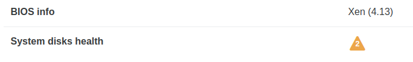


## Cloud-init and Cloudbase-init

### Cloud-init (Linux)

Cloud-init is a program "that handles the early initialization of a cloud instance".  
In other words, on a "cloud-init"-ready template VM, you can pass a lot of data at first boot, such as:

- Set the host name
- Add SSH keys
- Automatically grow the file system
- Create users
- And a lot more!

This tool is pretty standard and used everywhere. A lot of existing cloud templates use it.

This means that you can easily customize your VM when you create it from a compatible template. It brings you closer to the "instance" principle like in Amazon Cloud or OpenStack.

### Cloudbase-init (Windows)

As of release 5.101, Xen Orchestra also supports Cloudbase-init. This tool provides equivalent functionality to Cloud-init but is specifically designed for Windows virtual machines.

### Requirements

You only need to use a template of a VM with Cloud-init (for Linux VMs) or Cloudbase-init (for Windows VMs) installed inside it.  
[Check this blog post to learn how to install CloudInit](https://xen-orchestra.com/blog/centos-cloud-template-for-xenserver/).

:::tip
In XOA 5.31, we changed the Cloud-init config drive type from [OpenStack](https://cloudinit.readthedocs.io/en/latest/topics/datasources/configdrive.html) to the [NoCloud](https://cloudinit.readthedocs.io/en/latest/topics/datasources/nocloud.html) type. This will allow us to pass network configuration to VMs in the future. For 99% of users, including default cloud-init installs, this change will have no effect. However if you have previously modified your cloud-init installation in a VM template to only look for `openstack` drive types (for instance with the `datasource_list` setting in `/etc/cloud/cloud.cfg`) you need to modify it to also look for `nocloud`.
:::

### Example: How to create a Cloudbase-init template with Windows Server 2019?
1. Create a VM.
2. Install Windows Server 2019 on it.
3. Upon boot, install Cloudbase-Init.  
To do that, run the following commands:  

```
# For 64-bit environments
curl https://www.cloudbase.it/downloads/CloudbaseInitSetup_Stable_x64.msi --output installer.msi
installer.msi

# For 32-bit environments
curl https://www.cloudbase.it/downloads/CloudbaseInitSetup_Stable_x86.msi --output installer.msi
installer.msi
```

4. At the end of the installation, check the option **Run Sysprep**.  
Do not check **Shutdown when SysPrep terminates**!
5. (Optional). Delete the .msi installer.
6. The Cloudbase-init installer creates these configuration files:
* `cloudbase-init-unattend.conf`
* `cloudbase-init.conf`

7. Depending on your needs, choose the file that you need and make sure it contains the following three lines, with the same values:

```
...
config_drive_vfat=true
...
metadata_services=cloudbaseinit.metadata.services.nocloudservice.NoCloudConfigDriveService
plugins=cloudbaseinit.plugins.common.userdata.UserDataPlugin
...
```

If the file does not contain these lines or if the values are different, modify the file and set it to the values above.  
Cloudbase-init needs these settings to find the configuration disk and set up your VM.

8. Shut the VM down.
9. Convert the VM to a template.

### Example: How to create a Cloud-init template with Ubuntu 22.04 LTS?

1. Create a VM with e.g. 2 CPU, 8 GiB of RAM, 10 GiB of disk space, and install Ubuntu 22.04 LTS on it.
2. Upon reboot, `apt update` and `apt upgrade` the machine.
3. Install the [Guest Tools](https://docs.xcp-ng.org/vms/#%EF%B8%8F-guest-tools).
4. Install the "cloud-initramfs-growroot" so that the VM can apply a Cloud Config:
   ```
   sudo apt install cloud-initramfs-growroot
   ```
5. Run the command `sudo cloud-init clean`.
6. Clear out the machine-id so it can be regenerated when the template is used:
   ```
   sudo truncate -s 0 /etc/machine-id /var/lib/dbus/machine-id
   ```
7. Shutdown the VM and create a template from that image.

### Usage

First, select your compatible template (CloudInit ready) and name it:

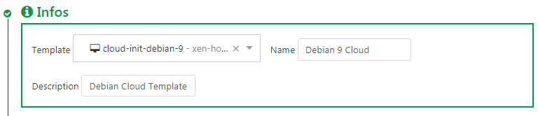

Then, activate the config drive and insert your SSH key. Or you can also use a custom CloudInit configuration:


> CloudInit configuration examples are [available here](http://cloudinit.readthedocs.org/en/latest/topics/examples.html).

You can extend the disk size (**in this case, the template disk was 8 GiB originally**). We'll extend it to 20GiB:

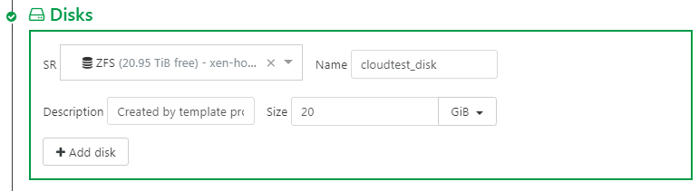

Finally, create the VM:

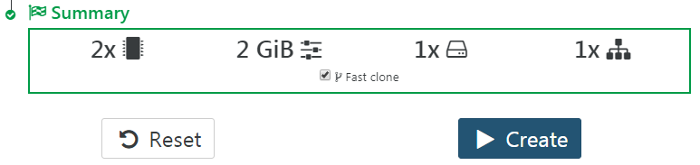

Now start the VM and SSH to its IP:

- **the system has the right VM hostname** (from VM name)
- you don't need to use a password to access it (thanks to your SSH key):

```
$ ssh centos@192.168.100.226
[centos@tmp-app1 ~]$
```

The default `cloud-init` configuration can allow you to be to be a sudoer directly:

```
[centos@tmp-app1 ~]$ sudo -s
[root@tmp-app1 centos]#
```

Check the root file system size: indeed, **it was automatically increased** to what you need:

```
[centos@tmp-app1 ~]$ df -h
/dev/xvda1          20G    1,2G   18G   6% /
```

## Web hooks

:::warning
We need your feedback on this feature!
:::

### Configuration

The plugin "web-hooks" needs to be installed and loaded for this feature to work.

You can trigger an HTTP POST request to a URL when a Xen Orchestra API method is called or when a backup job runs.

- Go to Settings > Plugins > Web hooks
- Add new hooks
- For each hook, configure:
  - Method: the XO API method that will trigger the HTTP request when called. For backup jobs, choose `backupNg.runJob`.
  - Type:
    - pre: the request will be sent when the method is called
    - post: the request will be sent after the method action is completed
    - pre/post: both
  - URL: the full URL which the requests will be sent to
  - Wait for response: you can choose to wait for the web hook response before the method is actually called ("pre" hooks only). This can be useful if you need to automatically run some tasks before a certain method is called.
- Save the plugin configuration

From now on, a request will be sent to the corresponding URLs when a configured method is called by an XO client.

### Request content

```
POST / HTTP/1.1
Content-Type: application/json
```

The request's body is a JSON string representing an object with the following properties:

- `type`: `"pre"` or `"post"`
- `callId`: unique ID for this call to help match a pre-call and a post-call
- `userId`: unique internal ID of the user who performed the call
- `userName`: login/e-mail address of the user who performed the call
- `method`: name of the method that was called (e.g. `"vm.start"`)
- `params`: call parameters (object)
- `timestamp`: epoch timestamp of the beginning ("pre") or end ("post") of the call in ms
- `duration`: duration of the call in ms ("post" hooks only)
- `result`: call result on success ("post" hooks only)
- `error`: call result on error ("post" hooks only)

### Request handling

_Quick Node.js example of how you may want to handle the requests_

```js
const http = require('http')
const { exec } = require('child_process')

http
  .createServer((req, res) => {
    let body = ''
    req.on('data', chunk => {
      body += chunk
    })
    req.on('end', () => handleHook(body))
    res.end()
  })
  .listen(3000)

const handleHook = data => {
  const { method, params, type, result, error, timestamp } = JSON.parse(data)

  // Log it
  console.log(`${new Date(timestamp).toISOString()} [${method}|${type}] ${params} → ${result || error}`)

  // Run scripts
  exec(`./hook-scripts/${method}-${type}.sh`)
}
```

## Alerts

Alerts are a way to warn the administrator about various events. The first kind of alerts will be emails and also in a dedicated area of `xo-web` to display them.

### Performances alerts

The administrator will configure alerts based on performance thresholds.

The configurable metrics are:

- CPU usage (VM, host)
- RAM usage (VM, host)
- network bandwidth (VM, host)
- load average (host)
- disk IO (VM)
- total IO (SR, only for XenServer Dundee and higher)

If any configured values exceed the threshold during a selected period of time, an alert will be sent.

Those alerts will be also stored and accessible in the web interface, and also later for the load balancing feature (helping it to solve those performance problems).

### Updates alerts

:::warning
:construction_worker: This feature might be missing. We are investigating. :construction_worker:
:::

When your XOA detects new packages, you'll be notified by email.

### Backup alerts

Same story for backups: if a backup fails, you'll receive an email.

You can choose to be notified only if it fails or even after each backup job.

Current supported alerts system:

- Email
- XMPP

## Job manager

The key idea is to be able to schedule any action (migrate, reboot etc.), for things like backups, snapshots or DR actions.

In the main menu, go to the "Job Manager" section:

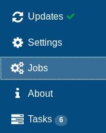

You can now **schedule all actions** on your hosts, VMs, or ACLs. It's configured in 2 steps:

1. Create a job
1. Schedule it!

Real example, step by step: **Creating a job called "security reboot"** (in this case, restarting "nfs" and "Core1" VMs):

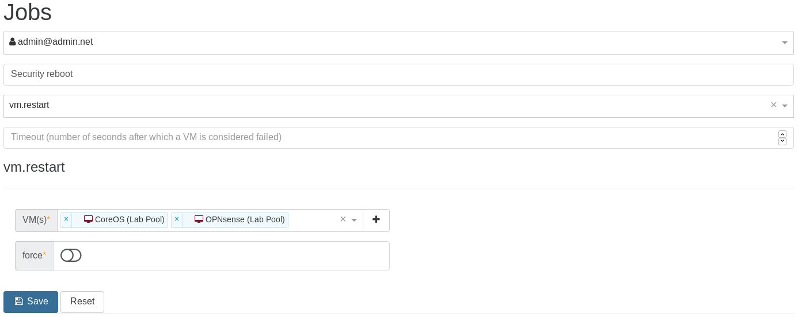

Note that you can execute this job **now** by clicking on the orange play button (to test it for instance):

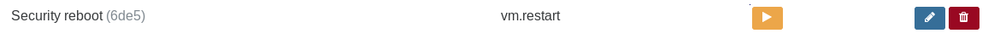

**Schedule the job** (every Sunday at 5:00 AM):

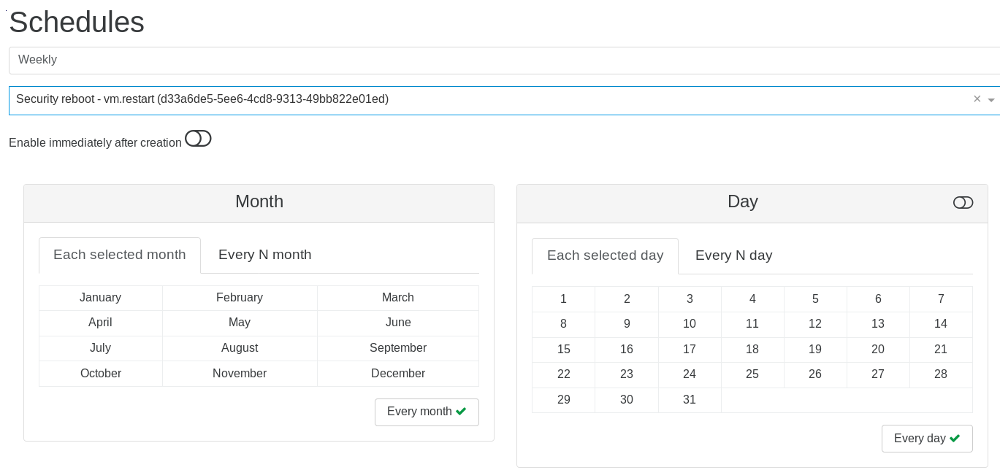

And that's it! The job is listed in the Overview:

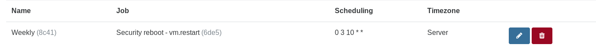

The possibilities are infinite! You can schedule a **lot** of things (any actions on a VM, like migrate, start, clone, suspend etc. Same thing also applies to hosts).

### Examples

#### Save on your electric bill

- plan a live migration of your VMs at 11:00PM to a less powerful host, then shutdown the big one
- start the big server at 6:00AM and migrate the VMs back 15 minutes later

#### Scale when needed

- schedule the boot of extra VMs during your usual activity spikes (horizontal scaling)
- also add more vCPUs or RAM to these VMs at the same time
- go back to the previous state when your planned load is low (e.g: during the night)

#### Planned reboot

- For example: your client app is not very stable, or you need to reboot every month after kernel updates: schedule this during the weekend!

#### Add or Remove ACLs

- revoke your user ACLs Friday at 11:00PM (e.g: no access on the weekend)
- restore them Monday at 6:00AM

## Emergency Shutdown

If you have a UPS for your hosts, and lose power, you may have a limited amount of time to shut down all of your VM infrastructure before the batteries run out. If you find yourself in this situation, or any other situation requiring the fast shutdown of everything, you can use the **Emergency Shutdown** feature.

### How to activate

On the host view, clicking on this button will trigger the _Emergency Shutdown_ procedure:

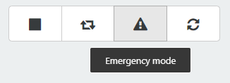

1.  **All running VMs will be suspended** (think of it like "hibernate" on your laptop: the RAM will be stored in the storage repository).
2.  Only after this is complete, the host will be halted.

Here, you can see the running VMs are being suspended:

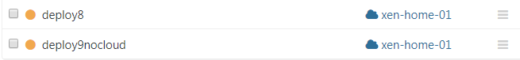

And finally, that's it. They are cleanly shut down with the RAM saved to disk to be resumed later:

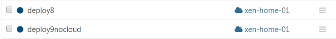

Now the host is halted automatically.

### Powering back on

When the power outage is over, all you need to do is:

1.  Start your host.
2.  All your VMs can be resumed, your RAM is preserved and therefore your VMs will be in the exact same state as they were before the power outage.

## Terraform provider

Terraform is a cloud/platform agnostic tool for building, changing, and versioning infrastructure. Terraform can manage existing and popular service providers as well as custom in-house solutions (like Xen Orchestra). It can manage resources through their entire lifecycle or even manage infrastructure it didn't initially create.

We sponsored a developer to build a [Xen Orchestra provider for Terraform](https://registry.terraform.io/providers/vatesfr/xenorchestra/latest), so you can use it as a central point for your whole virtualized infrastructure. The source code is [available on Github](https://github.com/vatesfr/terraform-provider-xenorchestra/), and contributions are welcome!

:::tip
Don't miss [our blog post series about it](https://xen-orchestra.com/blog/author/ddelnano/), written by Dom Del Nano, the original developer of this provider!
:::

It works with few steps:

1. Install terraform
2. Create a VM template for the new VM
3. Provision the VM with terraform and its XO provider

From there, you can even manage your existing resources with Terraform!

## Netbox

Synchronize your pools, VMs, network interfaces and IP addresses with your [Netbox](https://docs.netbox.dev/en/stable/) instance.

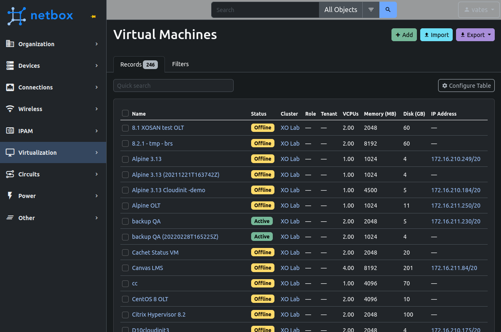

## Supported versions

- `>= 2.10`
- `3.x`
- `< 4.2`

:::tip
For safety, XO will not synchronize your pools if it detects a Netbox version that is not supported. If you wish to change that behavior, edit you `xo-server` configuration like so:

```toml
[netbox]
checkNetboxVersion = false
```

Please be aware that by doing this, a Netbox update might make XO delete some of your data in Netbox.
:::

### Netbox side

- Go to your Netbox interface
- Configure prefixes:
  - Go to IPAM > Prefixes > Add
  - Manually create as many prefixes as needed for your infrastructure's IP addresses

:::warning
XO will try to find the right prefix for each IP address. If it can't find a prefix that fits, the IP address won't be synchronized.
:::

- Create permissions:
  - Go to Admin > Permissions > Add and create 2 permissions:
    - "XO read" with action "Can view" enabled and object types:
      - Extras > custom field
      - IPAM > prefix
    - "XO read-write" with all 4 actions enabled and object types:
      - DCIM > platform
      - Extras > tag
      - IPAM > IP address
      - Tenancy > tenant (if you want to synchronize XO users with Netbox tenants)
      - Virtualization > cluster
      - Virtualization > cluster type
      - Virtualization > virtual machine
      - Virtualization > interface

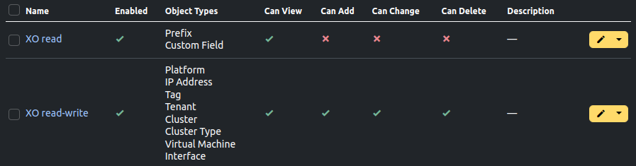

- Create a Netbox user:
  - Go to Admin > Users > Add
  - Choose a username and a password
  - Scroll down to Permissions and select the 2 permissions "XO read" and "XO read-write"
- Create an API token:
  - Got to Admin > API Tokens > Add
  - Select the user you just created
  - Copy the token for the next step
  - Make sure "Write enabled" is checked and create it

:::warning
For testing purposes, you can create an API token bound to a Netbox superuser account, but once in production, it is highly recommended to create a dedicated user with only the required permissions.
:::

- Create a UUID custom field:
  - Go to Customization > Custom Fields > Add
  - Select object types:
    - Tenancy > tenant (if you want to synchronize XO users with Netbox tenants)
    - Virtualization > cluster
    - Virtualization > virtual machine
    - Virtualization > interface
  - Name it "uuid" (lower case!)

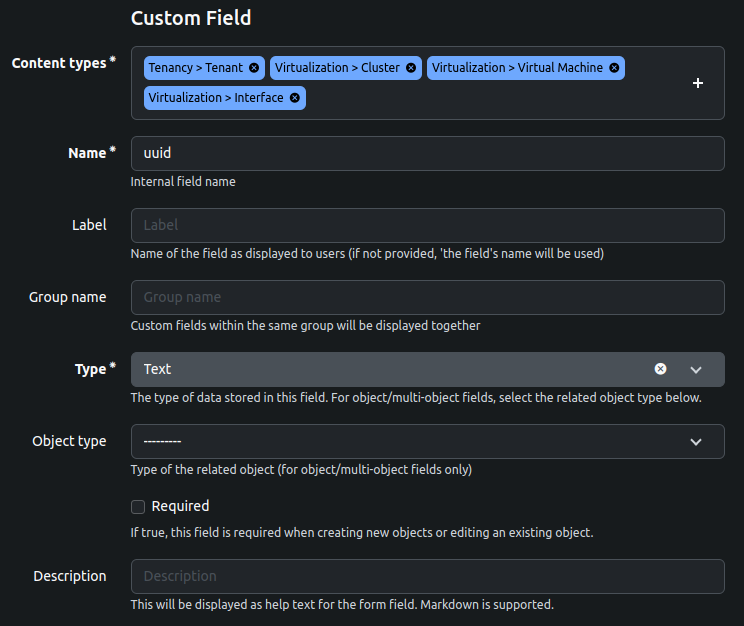

:::tip
In Netbox 2.x, custom fields can be created from the Admin panel > Custom fields > Add custom field.
:::

### In Xen Orchestra

- Go to Xen Orchestra > Settings > Plugins > Netbox and fill out the configuration:
  - Endpoint: the URL of your Netbox instance (e.g.: `https://netbox.company.net`)
  - Unauthorized certificate: only for HTTPS, enable this option if your Netbox instance uses a self-signed SSL certificate
  - Token: the token you generated earlier
  - Pools: the pools you wish to automatically synchronize with Netbox
  - Synchronize users: enable this if you wish to synchronize XO users with Netbox tenants. Tenants will be assigned to the VMs the XO user _created_ within XO. Important: if you want to enable this feature, you also need to assign the custom field "uuid" that you created in the previous step to the type "Tenancy > tenant".
  - Interval: the time interval (in hours) between 2 auto-synchronizations. Leave empty if you don't want to synchronize automatically.
- Load the plugin (button next to the plugin's name)
- Manual synchronization: if you correctly configured and loaded the plugin, a "Synchronize with Netbox" button will appear in every pool's Advanced tab, which allows you to manually synchronize it with Netbox

:::tip
If you get a `403 Forbidden` error when testing the plugin, make sure you correctly configured the "Allowed IPs" for the token you are using.
:::

## Recipes

:::tip
TODO: this section is still a work in progress!
:::
