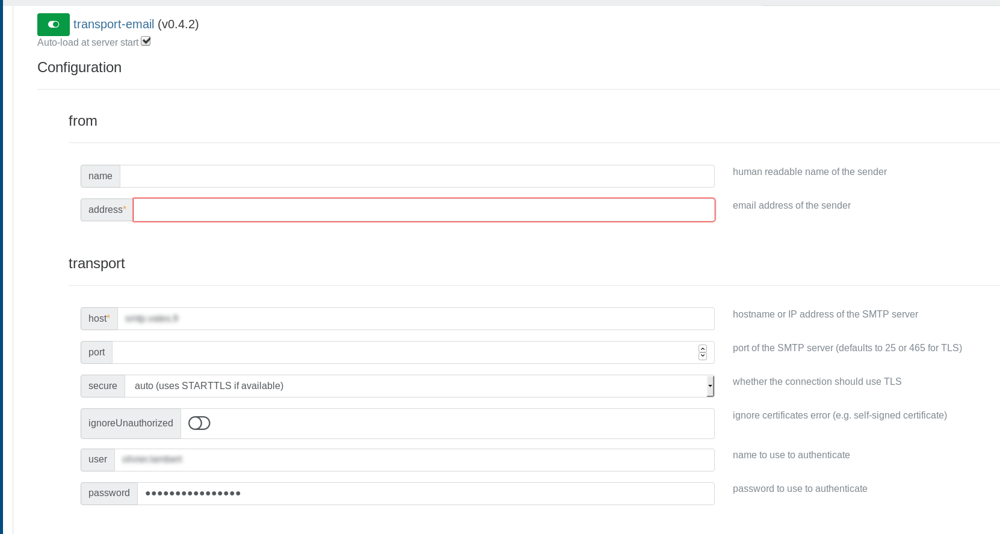
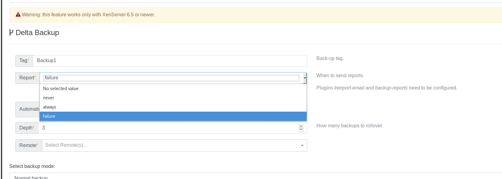

# Backup reports

At the end of a backup job, you can configure Xen Orchestra to send backup reports directly by email, Slack or in Mattermost. It's up to you.

## Email

### Step-by-step

1. In the **Settings → Plugins** enable and configure the **Backup-reports** plugin.
   

2. Configure also the `transport-email` plugin (see detailed configuration below).
   

3. Once it's done, you can now create your backup job. In the "report" selection you can choose the situation in wish you want to receive an email (always, never or failure).
   

:::tip
You can also modify existing backup jobs and change the behaviour of the report system.
:::

### Email Provider Configuration

:::info
**Authentication Requirements**

- **Gmail**: Standard passwords no longer work - App Passwords with 2FA are required
- **Microsoft 365**: Basic authentication still works but will be disabled in March 2026

:::

#### Gmail Configuration

Gmail users must use App Passwords for SMTP authentication.

**Prerequisites:**

- Enable 2-Factor Authentication on your Google account.

**Steps:**

1. **Enable 2FA**: Go to [Google Account Security](https://myaccount.google.com/security) → 2-Step Verification
2. **Generate App Password**: Visit [App Passwords](https://myaccount.google.com/apppasswords) → Select "Mail" → Generate
3. **Configure transport-email plugin:**
   - Host: `smtp.gmail.com`
   - Port: `587`
   - Secure: `Auto` or `STARTTLS`
   - Username: Your Gmail address
   - Password: The 16-character App Password (no spaces)

:::tip
App Passwords are more secure than regular passwords, as they require 2FA and can be revoked individually.
:::

#### Microsoft 365 Configuration

**Current Configuration :**

- Host: `smtp.office365.com`
- Port: `587`
- Secure: `STARTTLS`
- Username: Your Office 365 email
- Password: Your Office 365 password

:::warning
Microsoft will permanently disable basic authentication between March 1 and April 30, 2026. After this date, your email notifications will stop working
:::

#### Other SMTP Providers

For providers supporting basic authentication:

- Host: Your SMTP server
- Port: `587` (STARTTLS) or `465` (TLS)
- Username/Password: As provided by your service

### Network Requirements

The transport-email plugin requires outbound access to:

- Port 587 (SMTP with STARTTLS)
- Port 465 (SMTP over TLS)
- SMTP server addresses (e.g., smtp.gmail.com)

### Troubleshooting

**Gmail "Authentication failed":**

- Ensure you're using an App Password, not your regular password.
- Verify 2FA is enabled

**Microsoft 365 "Authentication unsuccessful":**

- Check if your organization has disabled SMTP AUTH
- Contact your IT administrator

**Connection timeouts:**

- Verify firewall allows outbound SMTP
- Test connectivity: `telnet [smtp-server] 587`

## XMPP

You can **be notified via XMPP** after the backup task is finished (scheduled "full backup", "snapshots" or "disaster recovery").

To configure it, 2 steps are needed in the plugin section (under "Settings"):

1. add a list of recipient(s) for the notifications (in the plugin "backup-reports" and for XMPP)
2. set the XMPP server

That's it: your next scheduled job will be recapped in a message:

## Slack or Mattermost

Xen Orchestra is able to send backup reports to Slack or Mattermost.

### Plugin configuration

Like all other xo-server plugins, it can be configured directly via the web interface, see [the plugin documentation](architecture#plugins).

### Generate the Webhook

#### Slack

1. Log in your Slack team account

2. Click on the **Main menu** at the top and choose **Apps & Integrations**

3. Search **Incoming WebHooks**

4. Click on **Add Configuration**

5. Choose the default channel and click on **Add Incoming WebHooks integration**

6. Modify the default settings and click on **Save Settings**

#### Mattermost

You need to be an admin:

- Go into the MatterMost menu, then Integration
- Click on "Add Incoming webhook"
- "Add Incoming Webhook"

### Testing the plugin

#### Slack

#### Mattermost

## Web hooks

You can also configure web hooks to be sent to a custom server before and/or after a backup job runs. This won't send a formatted report but raw JSON data that you can use in custom scripts on your side. Follow the [web-hooks plugin documentation](./advanced#web-hooks) to configure it.
