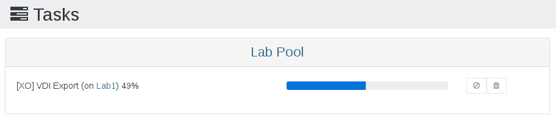

# Backup troubleshooting

This section is dedicated to help you if you have problems with XO Backups.

## Backup progress

While a backup job is running, you should see activity in the "Tasks" view (Menu/Tasks), like this:



Another good way to check if there is activity is the XOA VM stats view (on the Network graph).

## Unexpected key (full) export

_Incremental Backup_ and _Incremental Replication_ usually produce delta exports after the initial seed.

Nevertheless, there may be some reasons for XO to trigger a key (full) export instead:

- the configured [_Full backup interval_](incremental_backups#key-backup-interval) advanced setting has been reached for this VM
- the _Force full backup_ is enabled for the current schedule
- a new disk has been added to the VM (only this disk is completely exported)
- the reference snapshot for this backup job on the source VM is missing
- the previous exported backup/replication is either missing or corrupted

## VDI chain protection

Backup jobs regularly delete snapshots. When a snapshot is deleted, either manually or via a backup job, it triggers the need for XCP-ng/XenServer to coalesce the VDI chain - to merge the remaining VDIs and base copies in the chain. This means generally we cannot take too many new snapshots on said VM until XCP-ng/XenServer has finished running a coalesce job on the VDI chain.

This mechanism and scheduling is handled by XCP-ng/XenServer itself, not Xen Orchestra. But we can check your existing VDI chain and avoid creating more snapshots than your storage can merge. If we don't, this will lead to catastrophic consequences. Xen Orchestra is the **only** XCP-ng/XenServer backup product that takes this into account and offers protection.

Without this detection, you could have 2 potential issues:

- `The Snapshot Chain is too Long`
- `SR_BACKEND_FAILURE_44 (insufficient space)`

The first issue is a chain that contains more than 30 elements (fixed XCP-ng/XenServer limit), and the other one means it's full because the "coalesce" process couldn't keep up the pace and the storage filled up.

In the end, this message is a **protection mechanism preventing damage to your SR**. The backup job will fail, but XCP-ng/XenServer itself should eventually automatically coalesce the snapshot chain, and the next time the backup job should complete.

Just remember this: **a coalesce should happen every time a snapshot is removed**.

> You can read more on this on our dedicated blog post regarding [XCP-ng/XenServer coalesce detection](https://xen-orchestra.com/blog/xenserver-coalesce-detection-in-xen-orchestra/).

### Troubleshooting a constant VDI Chain Protection message (XCP-ng/XenServer failure to coalesce)

As previously mentioned, this message can be normal and it just means XCP-ng/XenServer needs to perform a coalesce to merge old snapshots. However if you repeatedly get this message and it seems XCP-ng/XenServer is not coalescing, You can take a few steps to determine why.

First check SMlog on the XCP-ng/XenServer host for messages relating to VDI corruption or coalesce job failure. For example, by running `cat /var/log/SMlog | grep -i exception` or `cat /var/log/SMlog | grep -i error` on the XCP-ng/XenServer host with the affected storage.

Coalesce jobs can also fail to run if the SR does not have enough free space. Check the problematic SR and make sure it has enough free space, generally 30% or more free is recommended depending on VM size. You can check if this is the issue by searching `SMlog` with `grep -i coales /var/log/SMlog` (you may have to look at previous logs such as `SMlog.1`).

You can check if a coalesce job is currently active by running `ps axf | grep vhd` on the XCP-ng/XenServer host and looking for a VHD process in the results (one of the resulting processes will be the grep command you just ran, ignore that one).

If you don't see any running coalesce jobs, and can't find any other reason that XCP-ng/XenServer has not started one, you can attempt to make it start a coalesce job by rescanning the SR. This is harmless to try, but will not always result in a coalesce. Visit the problematic SR in the XOA UI, then click the "Rescan All Disks" button towards the top right: it looks like a refresh circle icon. This should begin the coalesce process - if you click the Advanced tab in the SR view, the "disks needing to be coalesced" list should become smaller and smaller.

As a last resort, migrating the VM (more specifically, its disks) to a new storage repository will also force a coalesce and solve this issue. That means migrating a VM to another host (with its own storage) and back will force the VDI chain for that VM to be coalesced, and get rid of the `VDI Chain Protection` message.

## Parse Error

This is most likely due to running a backup job that uses Delta functionality (eg: delta backups, or continuous replication) on a version of XenServer older than 6.5. To use delta functionality you must run [XenServer 6.5 or later](/supported_hosts#xenserver-formerly-citrix-hypervisor).

## SR_BACKEND_FAILURE_44

:::tip
This message can be triggered by any backup method.
:::

`SR_BACKEND_FAILURE_44 (insufficient space)` means the Storage Repository (where your VM disks are currently stored) is full. Note that doing a snapshot on a thick provisioned SR (LVM family for all block devices, like iSCSI, HBA or Local LVM) will consume the current disk size. Eg if you are using this kind of SR at more than 50% and you want to backup ALL VM disks on it, you'll hit this wall.

Workarounds:

- use a thin provisioned SR (local ext, NFS, XOSAN)
- wait for Citrix to release thin provisioning on LVM
- wait for Citrix to allow another mechanism besides snapshot to be able to export disks
- use less than 50% of SR space or don't backup all VMs

## Could not find the base VM

This message appears when the previous replicated VM has been deleted on the target side which breaks the replication. To reset the process it's necessary to delete VM snapshot related to this CR job on the original VM. The name of this snapshot is: `XO_DELTA_EXPORT: <name label of target SR> (<UUID of target SR>)`

## LICENSE_RESTRICTION

`LICENSE_RESTRICTION (PCI_device_for_auto_update)` message appears when you try to do a backup/snapshot from a VM that was previously on a host with an **active commercial XenServer license** but is now on a host with a free edition of XenServer/Citrix Hypervisor.

To solve it, you have to change a parameter in your VM. `xe vm-param-set has-vendor-device=false uuid=<VM_UUID>`.

## ENOSPC: no space left on device

This message appears when you do not have enough free space on the target remote when running a backup to it.

To check your free space, enter your XOA and run `xoa check` to check free system space and `df -h` to check free space on your chosen remote storage.

## Error: no VMs match this pattern

This is happening when you have a _smart backup job_ that doesn't match any VMs. For example: you created a job to backup all running VMs. If no VMs are running on backup schedule, you'll have this message. This could also happen if you lost connection with your pool master (the VMs aren't visible anymore from Xen Orchestra).

Edit your job and try to see matching VMs or check if your pool is connected to XOA.

## Error: SR_OPERATION_NOT_SUPPORTED

This error can be caused by leaving any removable device (such as USB storage) attached to the VM that you are backing up or snapshotting, detach the device and retry. This can also be caused if you created a VM disk using the [RAW format](https://xcp-ng.org/docs/storage.html#using-raw-format).

## Error: Lock file is already being held

This error message appears in the logs in some instances of a failed backup job. It means that the VM’s folder on the remote is already used by a process. This could be:

- another backup job
- a merge process on the Virtual Hard Disk (VHD)

To solve this issue, we recommend that you:

- wait until the other backup job is completed/the merge process is done
- make sure your remote storage is not being overworked

## Error: HTTP connection has timed out

This error occurs when XO tries to fetch data from a host, via the HTTP GET method. This error essentially means that the host (dom0 specifically) isn't responding anymore, after we asked it to expose the disk to be exported. This could be a symptom of having an overloaded dom0 that couldn't respond fast enough. It can also be caused by dom0 having trouble attaching the disk in question to expose it for fetching via HTTP, or just not having enough resources to answer our GET request.

::: warning
As a temporary workaround you can increase the timeout greater than the default value, to allow the host more time to respond. But you will need to eventually diagnose the root cause of the slow host response or else you risk the issue returning.
:::

Create the following file:

```
/etc/xo-server/config.httpInactivityTimeout.toml
```

Add the following lines:

```toml
# XOA Support - Work-around HTTP timeout issue during backups
[xapiOptions]
httpInactivityTimeout = 1800000 # 30 mins
```

## Error: Expected values to be strictly equal

This error occurs at the end of the transfer. XO checks the exported VM disk integrity, to ensure it's a valid VHD file (we check the VHD header as well as the footer of the received file). This error means the header and footage did not match, so the file is incomplete (likely the export from dom0 failed at some point and we only received a partial HD/VM disk).

## Error: the job is already running

This means the same job is still running, typically from the last scheduled run. This happens when you have a backup job scheduled too often. It can also occur if you have a long timeout configured for the job, and a slow VM export or slow transfer to your remote. In either case, you need to adjust your backup schedule to allow time for the job to finish or timeout before the next scheduled run. We consider this an error to ensure you'll be notified that the planned schedule won't run this time because the previous one isn't finished.

## Error: VDI_IO_ERROR

This error comes directly from your host/dom0, and not XO. Essentially, XO asked the host to expose a VM disk to export via HTTP (as usual), XO managed to make the HTTP GET connection, and even start the transfer. But then at some point the host couldn't read the VM disk any further, causing this error on the host side. This might happen if the VDI is corrupted on the storage, or if there's a race condition during snapshots. More rarely, this can also occur if your SR is just too slow to keep up with the export as well as live VM traffic.

## Error: no XAPI associated to `UUID`

This message means that XO had a UUID of a VM to backup, but when the job ran it couldn't find any object matching it. This could be caused by the pool where this VM lived no longer being connected to XO. Double-check that the pool hosting the VM is currently connected under Settings > Servers. You can also search for the VM UUID in the Home > VMs search bar. If you can see it, run the backup job again and it will work. If you cannot, either the VM was removed or the pool is not connected.
