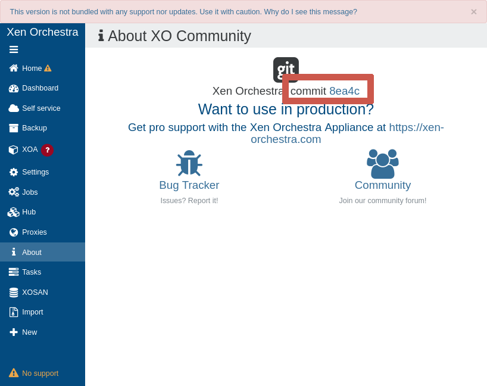

# Community support

We do our best to assist users running Xen Orchestra from the sources on [our community forums](https://xcp-ng.org/forum/category/12/xen-orchestra). However there's no guarantee you will receive a solution (from us or the community), nor any guarantee on a timeframe. Usually we are responsive, but keep in mind that if you need production level support, you should consider subscribing to our [XOA offers](https://vates.tech/pricing-and-support/).

:::warning
If you installed your XO from a 3rd party script (any method outside [our official documentation](installation.md#from-the-sources)), please report your issue **first** on the 3rd party script repository. We can't waste time debugging 3rd party installers that very often lag behind our own deployment methods and fall out of date.
:::

## Current version

With Xen Orchestra from the sources, you can check your current commit hash in the **About** section:

:::tip
You can compare this hash to the current commit list in [our GitHub repository](https://github.com/vatesfr/xen-orchestra/commits/master).
:::

## Report a bug

:::warning
Before reporting a bug, please check that your **current version is up-to-date with the latest commit on `master`!** See the "Current version" section below.
:::

If you have issues with XO installed from the sources (via GitHub), please **always** first:

1. update your XO to the latest `master` commit (see how-to in the [dedicated section](installation.md#updating)) and retest again
2. if the issue persists, double check you have all the requirements checked from the [installation section](installation.md#from-the-sources) and test again
3. then, if you still experience problems, remove and rebuild from scratch

Only after that, you can go to the [dedicated forum](https://xcp-ng.org/forum/category/12/xen-orchestra) to ask about your problem.

:::tip
If you want a consistent and tested solution for using Xen Orchestra, we strongly advise using our preconfigured and validated [Xen Orchestra Virtual Appliance](installation.md#xoa).
:::

## Feature requests

The best way to submit a feature request is to:

1. Ask on the forum first, explaining **why you need it**.
2. If the discussion is fruitful, we might ask you to [create the request on our GitHub repository](https://github.com/vatesfr/xen-orchestra/issues/new/choose) and choose "Feature request".
3. Wait for the feature to be released!

:::tip
Obviously, XOA users get a higher priority to get new features, since they contribute directly to the project with a subscription. However, your feedback/ideas are always welcome, and the more popular the feature request is, the higher the chances it will be added!
:::
