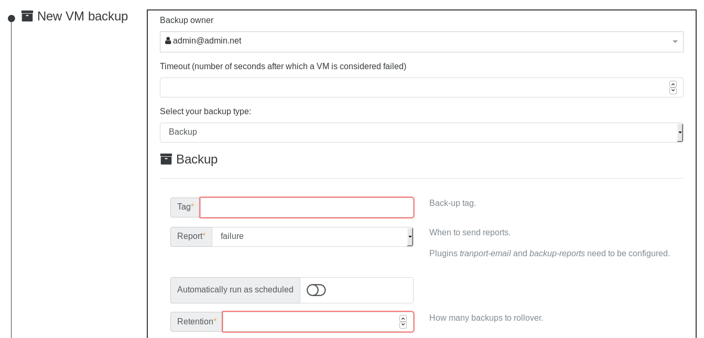
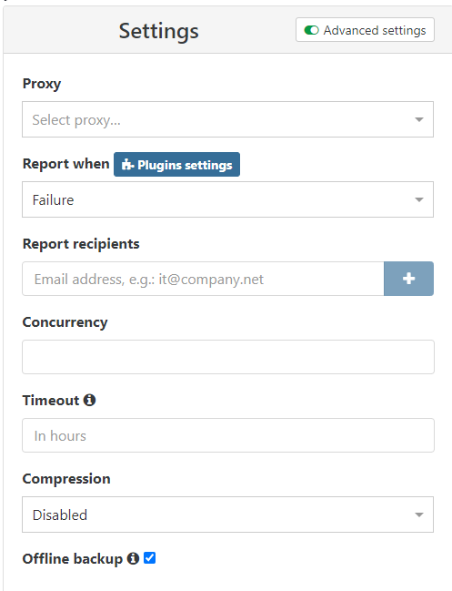

# Full backups

You can schedule full backups of your VMs, by exporting them to the local XOA file-system, or directly to an NFS or SMB share. The "retention" parameter allows you to modify how many backups are retained (by removing the oldest one).

:::tip
Full backups are space consuming! But they allow a very simple restoration without anything to think of (the file will contain all the VM disks and information). To use less space and data transferred, take a look at the [delta backups](delta_backups.md) feature.
:::

## Backup without snapshot

In some cases you will need to do a backup without doing a snapshot.

The most common use case for this is a large VM on a small local SR where you just don't have the space to do a snapshot before backup.
So for that you need to open the advanced settings of your backup job, and check the offline backup check box:

