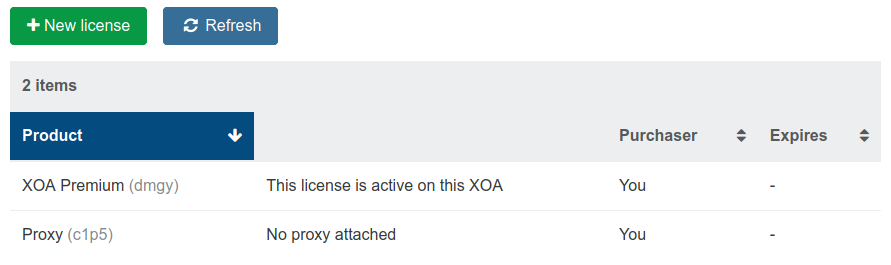
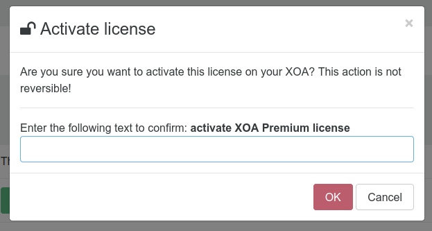
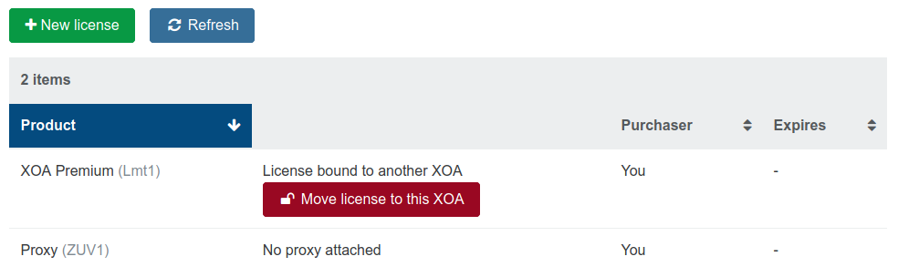
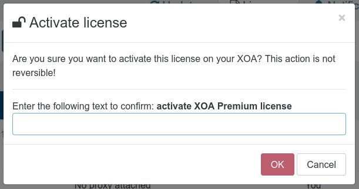

# License management

This section will cover the license management system for commercial editions of our products.

## Activate a Xen Orchestra license

1. After the [purchase](purchase.md), all your available licenses will be visible in the license section of your appliance.

2. All the licenses available and not bind already will be displayed here with a green `activate license` button

3. By clicking on the activate license option, you will be required to confirm your choice.

## Rebind XO license

:::warning
A license can only be bind to a single appliance at the same time, rebind your license will unbind the license from any other appliance.
:::

To rebind your Xen Orchestra appliance, you simply need to connect on the **appliance on which you want to bind the license** and click on the rebind option (Move license to this XOA button) in the license section

You will then have a confirmation screen

Once it's done, you simply need to proceed to an upgrade on your freshly binded appliance to download the correct edition packages.
