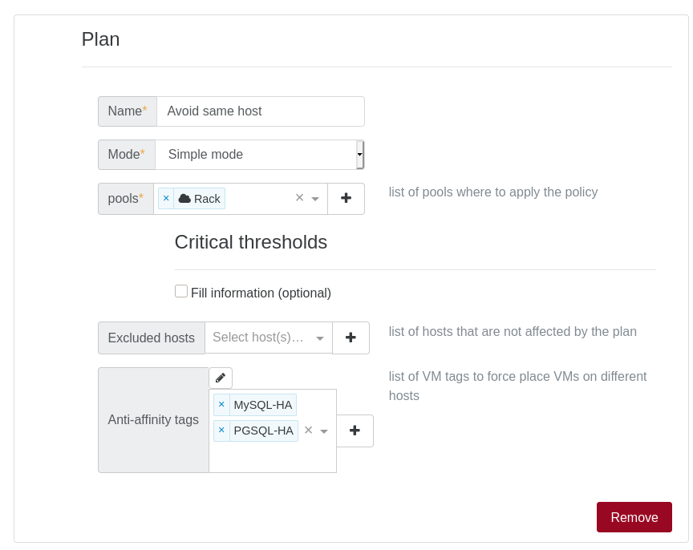

# Load balancing

A generic definition (from Wikipedia), is:

> In computing, load balancing distributes workloads across multiple computing resources, such as computers, a computer cluster, network links, central processing units or disk drives.

In the case of virtualization, you have multiple physical hosts, which runs your virtual machines (VMs). The goal here is to **distribute the VMs load** in the best way possible on your servers.

:::tip
Maybe you already heard about VMWare DRS (Distributed Resource Scheduler): that's the same principle here, but for XCP-ng.
:::

So the first objective is to adapt your VM placement in live (without service interruption), depending of the load. Because Xen Orchestra is connected to [multiple pools](architecture.md#xo-server-server) and XCP-ng supports live storage motion, we can perform load balancing on a **whole XCP-ng infrastructure** (even between remote datacenters). A load balancing policy is called a "**plan**".

Let's take a simple example, with these 2 hosts running 6 VMs:

Let's say both hosts are using only 5% of all their CPUs. Suddenly, one of your VM starts to have a very high CPU load (in yellow): performance of other VMs on this same host could be impacted negatively (in pink):

`Host 1` still using 5% of its CPUs, but `Host 2` is now a 95%.

We are detecting it and now move others VM to the other host, like this:

`Host 1` has a slightly increased load, but `Host 2` can be fully used for the "problematic" VM without disrupting service of other VMs.

This way, the impact of your high load usage on one VM doesn't penalize everyone.

But it's not the only way to see this: there is multiple possibilities to "optimize" your existing resource usage:

- maybe you want to spread the VM load on the maximum number of server, to get the most of your hardware? (previous example)
- maybe you want to reduce power consumption and migrate your VMs to the minimum number of hosts possible? (and shutdown useless hosts)

Those ways can be also called modes: "performance" for 1 and "density" for number 2.

## Configure a plan

In this view, you can configure a new load balancing plan, or edit an existing one.

A plan has:

- a name
- pool(s) where to apply the policy
- a mode (see paragraph below)

### Plan modes

There are 3 modes possible:

- performance
- density
- simple

#### Performance

VMs are placed to use all possible resources. This means balance the load to give the best overall performance possible. This tends to use all hosts available to spread the load.

#### Density

This time, the objective is to use the least hosts possible, and to concentrate your VMs. In this mode, unused (and compatible) hosts are shut down.

#### Simple

This mode allows you to use VM anti-affinity without using any load balancing mechanism. (see paragraph below)

### Threshold

In a plan, you can configure various thresholds:

- CPU threshold
- Free memory

:::warning
If the CPU threshold is set to 90%, the load balancer will be only triggered if the **average CPU usage on a host** is more than 90%.
:::

For free memory, it will be triggered if there is **less** free RAM than the threshold.

### Exclusion

If you want to prevent load balancing from triggering migrations on a particular host or VM, it is possible to exclude it from load balancing. It can be configured via the "Excluded hosts" parameter in each plan, and in the "Ignored VM tags" parameter which is common to every plan.

### Timing

The global situation (resource usage) is examined **every minute**.

:::tip
TODO: more details to come here
:::

### Performance submode

With a performance plan, you can configurate a performance submode that will add features to the default behavior of the performance plan. These features are additional and do not replace the default behavior.

#### Conservative (default)

Default behavior of the performance plan.

#### Preventive

The default performance plan attempts to migrate VMs only when critical usage of CPU or memory is reached. This option also attempts to reduce the disparities of CPU usage between hosts in the pool. For example, it aims to avoid situations such as having one host at 60% CPU usage and other hosts at 10%, which is a situation would be allowed by the default behavior of the performance plan.

#### vCPU balancing

When the pool's load is low (under 40% CPU usage), this option attempts to pre-emptively distribute your VMs across hosts to avoid excessive disparities in the number of vCPUs per CPU, instead of just waiting for a host to be overloaded. In this way, VMs are pre-positioned in a way that is likely to trigger less migrations when the load increases.

## VM anti-affinity

VM anti-affinity is a feature that prevents VMs with the same user tags from running on the same host. This functionality is available directly in the load-balancer plugin.
This way, you can avoid having pairs of redundant VMs or similar running on the same host.

Let's look at a simple example: you have multiple VMs running MySQL and PostgreSQL with high availability/replication. Obviously, you don't want to lose the replicated database inside the VMs on the same physical host. Just create your plan like this:

- Simple plan: means no active load balancing mechanism used
- Anti-affinity: we added our 2x tags, meaning any VMs with one of these tags will never run on the same host (if possible) with another VM having the same tag

You can also use the performance plan with the anti-affinity mode activated to continue to migrate non-tagged VMs.

:::tip
This feature is not limited by the number of VMs using the same tag, i.e. if you have 6 VMs with the same anti-affinity tag and 2 hosts, the plugin will always try to place 3 VMs on each host. It will distribute as much as possible the VMs fairly and it takes precedence (in the majority of the cases) over the performance algorithm.
:::
