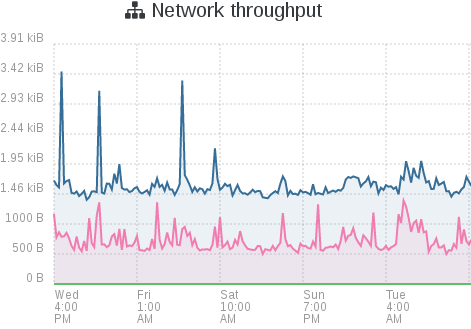

# Management overview

Xen Orchestra is based on the concept of **one interface to rule all your pools, hosts and VMs, from any device**. It's made to do any object creation, modification, displays metrics and statistics. In other words, all the tools you need to administer your XCP-ng/Citrix Hypervisor (formerly XenServer) infrastructure efficiently.

See the [Infrastructure management section](manage_infrastructure.md) for more details and examples.

But there's even more! You can:

- [create XO users](users.md) to delegate resources
- use [advanced features](advanced.md) like Cloud Init or web hooks
- [load balance](load_balancing.md) your VMs
- extend your network with [our SDN controller](sdn_controller.md)
- create hyperconverged storage with [XOSTOR](https://docs.xcp-ng.org/xostor/)
