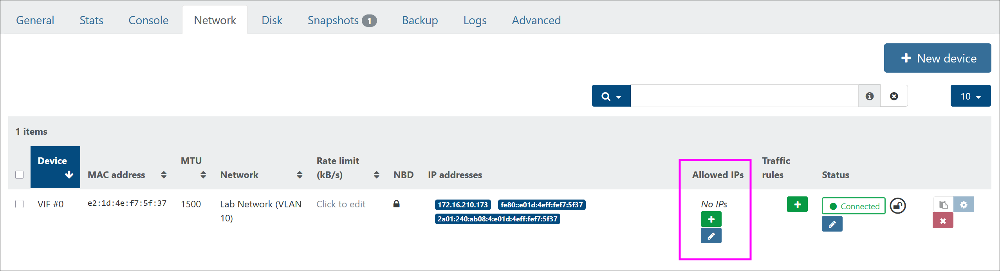
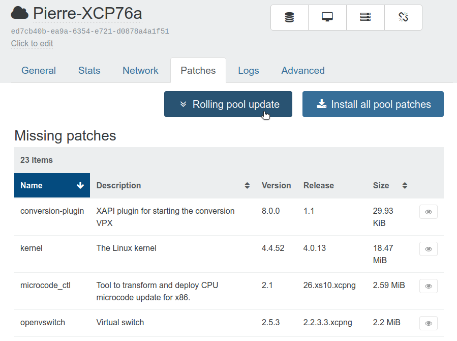
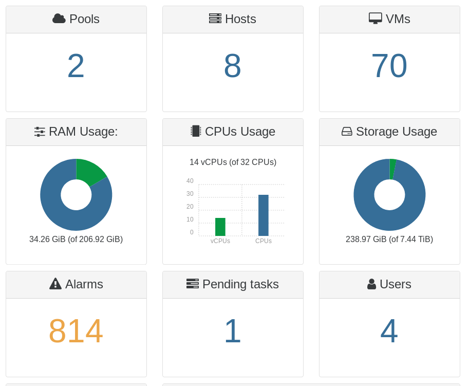
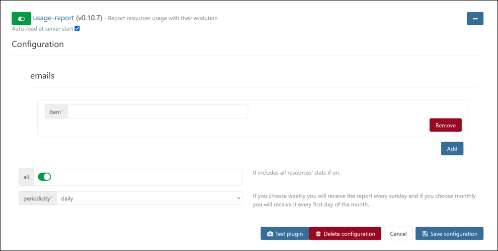

# Infrastructure management

This section is related on how to manage your XCP-ng/Citrix Hypervisor infrastructure.

## Home view

The home view is what you see when you access your Xen Orchestra URL. It displays all running VMs. This can be configured to your needs (see the "Filters section" below).

If you don't have any servers connected, you'll see a panel telling you to add a server:


### Add a host

Just click on "Add server", enter the IP of a XCP-ng/XenServer host (ideally the pool master if in a pool):


After clicking on connect, the server is displayed as connected:


Now go back to the Home view (or click on the "Xen Orchestra" title on the top left of the screen), you'll see the default home view of VM objects.

### VMs

By default, this view groups all **running VMs** on your connected server:


Let's take a quick tour:

- the global menu is on the left, you can collapse it by clicking on the icon 
- the home view has a header with a type selector (VMs, hosts or pools), a filter zone and a button to create new VMs
- the VM list also has a header (number of filtered VMs and total VMs) and assisted filters (by pool, host and tags) and a sort menu (by name, memory etc.). You can also expand all VMs details here with the icon 

:::tip
You can edit a VM name, description and even current host by long clicking on the field
:::

### Bulk actions

You can select multiple objects (eg VMs) at once to perform a bulk action. The master checkbox will select all, or you can select anything yourself.

After selecting one or more object, an action bar is displayed:


This will execute the action for all selected objects!

### Hosts

All host objects are displayed:


You have power status, name, description, number of CPU cores, total memory, management IP and pool name displayed. You can also edit these by long clicking.

:::tip
If hosts have missing patches, you'll see a red dot with the total patches missing. Click on it to go the patch section of the host. See this blog post on [patches for XenServer](https://xen-orchestra.com/blog/hotfix-xs70e004-for-xenserver-7-0/) for more details.
:::

### Pools

All your pools are displayed here:


You can also see missing patches in red.

:::tip
Did you know? Even a single XCP-ng/XenServer host is inside a pool!
:::

## Live filter search

The idea is not just to provide a good search engine, but also a complete solution for managing all your XCP-ng/XenServer infrastructure. Ideally:

- less clicks to see or do what you need
- find a subset of interesting objects
- perform bulk actions on all results found
- sort your results for more pertinent insight

:::tip
Pro Tip: the URL of Xen Orchestra contains the search string, eg `home?s=power_state%3Arunning+`. You can share these URLs to your colleagues to share your search!
:::

### Search examples

We include some predefined filters in the dropdown "Filters":


You can use custom filters here:


### Save your search

If you want to record your filter, just click on the "Save" icon 

After giving a name to your filter, you will be able to find it in the dropdown filter menu.

### Manage your saved search

Just go into your user panel (bottom of main left menu):


There, you can edit or remove any filter/search you've created!

### Set a default search

In this user section, you can set a default filter (preset filters or your own).

:::tip
Pro Tip: this is saved in your user preferences. It means that you can connect anywhere on any browser, and you'll still see the same behavior.
:::

### Filter syntax

:::tip
A filter allows you to search through a collection of objects which have multiple properties and may even contain other nested objects.
:::

#### Searching for a string (or substring)

Simply type the string, if it contains special characters just surround it with quotes:

- `simple-string`
- `"string with special characters like whitespaces"`

:::tip
The search is recursive, case insensitive and non-anchored (i.e. matches if the pattern is contained in a string).
:::

A simple string can also contain a wildcard character (`*`) to match any character in a portion of the string:

- `foo*bar`: matches `foobar`, `foo - bar`, etc.

#### Regular expression

For more advanced string matching, you can use regular expressions:

- `/^DNS server \d+$/`: matches `DNS server 1`, `DNS server 05` but not `DNS server`
- `/foo/i`: with the `i` flag, it ignores the case, therefore it matches `Foo` and `FOO`

[More information about supported regular expressions](https://developer.mozilla.org/en-US/docs/Web/JavaScript/Guide/Regular_Expressions).

#### Searching a specific property

Type the property name, followed by a colon `:` and a subfilter:

- `name_label:"my VM"`
- `virtualizationMode:hvm`
- `boot:order:cn`

#### Exclusion

Prefix your filter with an exclamation mark `!` to exclude any matching results:

- `!hvm`
- `!power_state:Running` or `power_state:!Running`

#### Intersection

Simply type the filter's terms side by side:

- `power_state:Halted !virtualizationMode:hvm`

#### Grouping

Parentheses can be used to group terms together:

- `!(power_state:Running virtualizationMode:hvm)`

#### Union

Pipe `|` followed by a group of terms:

- `|(vm1 vm2)`
- `power_state:|(Running suspended)`

#### Truthy property

This one is less common but can be used to check whether a property has a truth-like value (`true`, non-empty string or non-zero number).

Postfix the name of a property by a question mark `?`:

- `auto_poweron?`
- `high_availability?`

#### Number comparison

You can use the search field/filter with number comparisons:

- `snapshots:length:>2` (to display VMs with more than 2 snapshots)
- `$VBDs:length:>=4` (VMs with more 4 or more disks attached)
- `VIFs:length:>=2` (number of network interfaces)

### Available properties

There isn't much documentation listing these (yet), but you can see all objects and their properties using `xo-cli list-objects`. You can then use these properties for search in XOA.

Take a look at [the documentation](https://github.com/vatesfr/xen-orchestra/tree/master/packages/xo-cli#xo-cli) for xo-cli :)

Example: to search by the Xen Tools status:

- `xenTools?`: whether the tools are installed
- `xenTools:"up to date"`: whether they are installed and up to date

## VM creation

A new VM can be created via the "New" button in the main menu (bottom):


Or in the home view:


### Wizard

#### Select your Pool

Because Xen Orchestra can be connected to multiple pools, you must select which one you want to create your VMs on:


On which **host** the VM will actually run on will depend of various settings (local SR or not, RAM available etc.)

#### Infos category

##### Select your template

The next step is to select a template:


:::tip
What is a XCP-ng/XenServer template? It can be 2 things: first an "empty" template, meaning it contains only the configuration for your future VM, such as example settings (minimum disk size, RAM and CPU, BIOS settings if HVM etc.) Or it could be a previous VM you converted into a template: in this case, creating a VM will clone the existing disks.
:::

##### Name and description

These values can be changed anytime after your VM is created.

##### Multiple VMs

You can create multiple VMs at once by toggling the _Multiple VMs_ option. The `{name}` pattern is the "Name" field of the VM. By default, it will start with number 1 and increment up. You can change this via the "First index" field.

Click on the refresh icon to see the change:


#### Performance

This is where you can configure VM performance options: number of vCPUs, RAM, CPU weight and cap.

##### CPU weight and cap

The default CPU weight is `256` which means it will be scheduled by Xen like any other VMs on the host it runs from. If you raise it, eg with `512`, CPUs on this VM will be scheduled with twice the priority as others. If you decrease it, with `64` for example, it will be scheduled with 4 times less priority.

What about cap? It's the maximum amount of CPUs a VM can consume, using a 100 base (1 vCPU: 100). Default is 0 and means no upper cap.

:::tip
Should I mess with these settings? In general: nope. Change this only if you are sure of what are you doing. More can be found here: https://wiki.xen.org/wiki/Credit_Scheduler
:::

#### Install settings

Depending of your template type (with existing disks or not, PV vs HVM) this panel can be changed.

##### HVM templates without existing disks

You can choose to boot from an ISO or using PXE:


##### PV templates

These templates will use PV configuration in order to boot: either from the right ISO or network URL. PV Args can be used to modify kernel parameters, but it's a very advanced setting you shouldn't play with.

##### Template with existing disks

Because there is already disks installed, you shouldn't have "Install settings" _per se_. But you can use our `config drive` setup if your template already has CloudInit installed!

Please refer to the [XCP-ng CloudInit section](vm-templates.md#cloud-init) for more.

#### Interfaces

This is the network section of the VM configuration: in general, MAC field is kept empty (autogenerated from XCP-ng/XenServer). We also select the management network by default, but you can change it to reflect your own network configuration.

#### Disks

This section is for configuring new or existing disks (according to your selected template).

:::tip
Protip: avoid using large disks for your VMs. Want to store a lot of files? Use a network share for that (NFS, SMB) and keep using VMs with small system disks. It's far easier to maintain, migrate, backup and restore!
:::

## VM management

### Live Editing

Any object with a dotted underline can be edited with a mouse click: VM title, description, CPU and memory.


In the advanced tab, you have extra options:


### XCP-ng/Citrix Hypervisor limitations

- Each VM has a maximum vCPU number. This value can't be changed while the VM is running. You can reduce the number of vCPUs, but you can't assign more than the set max. In XO, while your VM is halted, set the max vCPUs you would need, then boot it. Now you can reduce it and then expand it later to this maximum.
- The same limitation applies to static RAM.

You can learn more about XenServer [resource management on the Citrix Website](https://docs.citrix.com/en-us/citrix-hypervisor/system-requirements/configuration-limits.html).
:::tip
XCP-ng doesn't limit VMs to 32 vCPU
:::

### VDI live migration

Thanks to Xen Storage Motion, it's easy to move a VM disk from one storage location to another, while the VM is running! This feature can help you migrate from your local storage to a SAN, or just upgrade your SAN without any downtime.

To do so: Access the Xen Orchestra page for your running VM, then enter the Disk tab. Long click on the current SR of the disk, and a drop down menu will be displayed with all compatible destinations. Just select one, that's all: the migration will start live!


#### Offline VDI migration

Even though it's not currently supported in XCP-ng/XenServer, we can do it in Xen Orchestra. It's exactly the same process as a running VM.

### VM recovery

In the advanced tab, use the "Recovery Start" button:


This button will allow you to boot directly from the CD drive, ignoring your current disks. Note that it works for all virtualization modes: HVM or PV.

### Auto power VM

Activating "Auto Power on" for a VM will also configure the pool accordingly. If your host is rebooted, the VM will be started right after the host is up.

### Network locking mode

#### What's a VIF?

In the Vates stack, each VM connects to the network through a **Virtual Interface**, or **VIF**. 

Think of it as the VM’s virtual network card —it handles all incoming and outgoing traffic on a specific virtual network, which is linked to a physical NIC on the host via a bridge. Every VIF comes with a fixed MAC address and can be tied to a particular VLAN (or virtual network), depending on how your environment is set up.

#### What does VIF locking mode do?

**VIF locking mode** is a security feature that helps prevent unauthorized or spoofed traffic from getting in or out of a VM. 

In practical terms, enabling locking mode means **the VM can’t send traffic using a fake MAC address** — and if an IP address is set, it won’t be able to use anything else either. This is **especially helpful in multi-tenant setups** or anytime you need tight control over which VM is allowed to do what on the network.

#### Default behavior

**By default, VIFs are not locked.** Users can assign any IP address to their VM, and they will work without restriction. 
However, if you add restricted IPs, the VIF becomes locked, meaning only the specified IP addresses are allowed to send traffic outside the VM.

#### Adding restricted IP addresses

To add a restricted IP address:

1. Go to the **VM view** and open the **Network** tab. You will see a column called **Allowed IPs**:
   
1. Click the **+** icon to add authorized IP addresses:
   

#### How do I enable VIF locking mode?

1. Select the VM.
1. Head over to the **Network** tab to see each VIF along with its current locking mode status:
   
1. To change the locking mode status:
   1. Click the pencil icon (with the **Edit locking mode** label). A dropdown menu appears.
   1. Choose your desired mode from that menu:
      
    
If Xen Orchestra knows the VM’s IP address — either through the guest agent or DHCP — it will automatically apply IP-level locking when the mode is enabled.

#### How do I automate VIF locking mode?

If you’re automating things or working with scripts, you can also control VIF locking mode through the XO [command-line interface](architecture#xo-cli-cli). 

### VM high availability (HA)

If you pool supports HA (must have shared storage), you can activate "HA". Read our blog post for more details on [VM high availability with XCP-ng/XenServer](https://xen-orchestra.com/blog/xenserver-and-vm-high-availability/).

#### Docker management

:::tip
Please [read the dedicated section](manage_infrastructure.md#docker-support) to install a Docker Ready VM.
:::

### VM CPU priority

You can change the CPU Weight in the VM advanced view. The values are:

- Default
- Quarter (64)
- Half (128)
- Normal (256)
- Double (512)

By default, each VM has a weight of 256.

If one VM has for example, "Double", it will have double the priority on the Xen scheduler. [Read more on the official Citrix XenServer documentation](http://support.citrix.com/article/CTX117960).

### VM Copy

VM copy allows you to make an export and an import via streaming. You can target any SR in your whole XCP-ng/XenServer infrastructure (even across different pools!)

### Snapshot management

You can create a snapshot with one click. It will be named automatically. After the snapshot is created, you can either:

- export it on your computer
- revert your VM to this snapshot (it will restart the VM)
- delete this snapshot

:::tip
By default, XOA will try to make a snapshot with quiesce. If the VM does not support it, it will fallback to the default snapshot system.
:::

## VM import and export

Xen Orchestra can import and export VM's in XVA format (XCP-ng/XenServer format) or import OVA files (OVF1 format).

:::tip
We support OVA import from VirtualBox. Feel free to report issues with OVA from other virtualization platforms.
:::

### VM import

#### XVA files

To import an XVA file, just go to the New/Import menu:


Select the target pool and SR where the VM will be imported. Then, drag and drop your file and click on the import button.

#### OVA files

OVA files contains extra info that you need to check before importing, like name, etc.


When you are OK with these settings, just click on the "Import" button.

### VM export

:::tip
Exported VMs are in XVA format
:::

Just access the page for the VM that you want to export, and click on the "Export" button in the toolbar. You'll instantly download a compressed XVA file.

It works even if the VM is running, because we'll automatically export a snapshot of this VM.

#### Snapshot export

In the VM "Snapshots" tab, you can also export a snapshot like you export a VM.

## VM migration

### Simple VM Migration (VM.pool_migrate)

In simple migration, the VM's active state is transferred from host A to host B while its disks remains in its original location. This feature is only possible when the VM's disks are on a shared SR by both hosts and if the VM is running.

#### Use Case

- Migrate a VM within the same pool from host A to host B without moving the VM's VDIs.

### VM Migration with Storage Motion (VM.migrate_send)

VM migration with storage motion allows you to migrate a VM from one host to another when the VM's disks are not on a shared SR between the two hosts or if a specific network is chosen for the migration. VDIs will be migrated to the destination SR if one is provided.

#### Use Cases

- Migrate a VM to another pool.
- Migrate a VM within the same pool from host A to host B by selecting a network for the migration.
- Migrate a VM within the same pool from host A to host B by moving the VM's VDIs to another storage.

### Expected Behavior

- Migrating a VM that has VDIs on a shared SR from host A to host B must trigger a "Simple VM Migration".
- Migrating a VM that has VDIs on a shared SR from host A to host B using a particular network must trigger a "VM Migration with Storage Motion" without moving its VDIs.
- Migrating a VM from host A to host B with a destination SR must trigger a "VM Migration with Storage Motion" and move VDIs to the destination SR, regardless of where the VDIs were stored.

### Preventing VM migration

To prevent a virtual machine from migrating:

1. Go to the VM's configuration page.
2. Go to the **Advanced** tab.
3. Activate the **Prevent migration** toggle switch. 


When this option is enabled, the VM won't be able to migrate to another host.

## Migrating from VMware with V2V

XCP-ng is a type 1 hypervisor, similar to VMware ESXi.

You can migrate your VM from VMware vSphere to a Vates environment (Xen Orchestra and XCP-ng), directly from Xen Orchestra. For this, we use V2V ("VMware to Vates").

To know more on using V2V in Xen Orchestra to migrate your environment from VMware, refer to the [XO V2V section in the XCP-ng documentation](https://docs.xcp-ng.org/installation/migrate-to-xcp-ng/#xo-v2v).


## Hosts management

Outside updates (see next section), you can also do host management via Xen Orchestra. Basic operations are supported, like reboot, shutdown and so on.

But there's also some specific things, like Maintenance mode.

### Maintenance mode

:::warning
If you are using HA, maintenance mode will be required before doing any reboot or update. NEVER forget to enable maintenance in HA!
:::

Maintenance mode will trigger two actions internally:

- disabling the host (no new VMs could start on it)
- evacuate VMs that can be evacuated ("agile" VMs, which could be live migrated)

It's perfect if you want to shutdown the host for hardware replacement, or if you want to do some other operations without disrupting your production.


Note that maintenance mode will be **automatically exited after a host reboot**.

### Modify Dom0 memory

You can easily adjust the control domain memory under the Advanced tab of a host. Enable the maintenance mode on the host and click on the pen icon to edit the value:


There is more information about Dom0 memory management in the [XCP-ng Documentation](https://docs.xcp-ng.org/guides/dom0-memory/)

## Pool and host updates

Xen Orchestra is here to help you to manage all your pools and hosts updates. Note there's a difference on updates between XCP-ng and Citrix Hypervisor, since they are not using the same mechanism. However, the view on available updates and updating is very similar.

:::tip
Updates can be called both "patches" or "updates", it doesn't matter. Updates are distributed via an ISO file containing RPMs for Citrix Hypervisor, while in XCP-ng they are just traditional RPMs hosted in a central repository and its mirrors, like a regular Linux distribution.
:::

### Available updates

You'll be notified by Xen Orchestra directly in the main XO menu (on the left), with a yellow triangle:


If you hover on it, it will explain that updates/patches are available.

You can also see how many updates to do in the Home/Pool view for your pools, and Home/Host view for your hosts, with a red pill. In this following screenshot, "Test Pool1" got 88 updates available:


You can also see the available updates in the Dashboard view.

### XCP-ng

On XCP-ng, there's multiple way to update your pools and hosts.

:::details ⚙️ How it works
Xen Orchestra will request a plugin, bundled and hosted within your XCP-ng hosts. This plugin will query the status of updates. Then, when the update will be apply, it's also the plugin that will download and apply them. So unlike with Citrix Hypervisor, Xen Orchestra will not fetch or download updates, but it will order the host to do it by itself. Be sure that your host(s) can access the update repositories.
:::

#### Rolling Pool Updates (RPU)

Also known as RPU, **this is the advised way to update your pool**. By just clicking on one button, Xen Orchestra will automatically move VMs around, apply updates and reboot the hosts, without any service interruption. The following button is available in the **Pool** view of the **Patches** tab:


:::tip
This powerful and fully automated mechanism requires some prerequisites: all your VMs disks must be on a one (or more) shared storage. Also, high-availability will be automatically disabled, as the XO load balancer plugin and backup jobs. Everything will be enabled back when it's done!
:::

:::warning
XO will restart the hosts one by one and wait for each host to be up and running before continuing. However, if the host takes too much time to boot, the RPU will fail with an error. By default, XO will wait up to 20 minutes before failing. You can change that value in your `xo-server` config:

```toml
[xapiOptions]
restartHostTimeout = '40 minutes'
```
:::



##### Scheduling a RPU

You can schedule rolling pool updates to automate the patching and rebooting of your pools during off-peak hours.

:::tip
Of course, schedule the updates outside production hours. Although RPUs are designed to be transparent, it is always wise to schedule some buffer time in case something goes wrong.
:::

1. **Create a job**: Navigate to the **Jobs** screen and create a new job, using the `pool.rollingUpdate` method. Determine which pools you want to include in the update: 
   
1. **Set the schedule**: Assign a schedule to the job (e.g., every Sunday at 3 AM) and apply it to your new job:
   
1. **Monitor the process**: Once scheduled, the RPU will run automatically at the set time, applying updates and rebooting hosts as necessary.

#### Pool updates

If you can't use RPU (Rolling Pool Updates), you can still use "Install pool patches" button. This will simply install updates on all hosts on your pool and restart the toolstack, **without doing any host reboot**:


:::tip
Restarting the toolstack won't have any impact on your running VMs. However, **most updates will require a reboot** to be applied, that you should execute during a scheduled maintenance.
:::

You can see hosts that will require a reboot via a small blue triangle:


#### Host updates

:::warning
We do NOT recommend to install updates to individual hosts. Obviously except if they are alone in their own pool. Running hosts in the same pool with different level of updates should be avoided as possible. We leave that option in case you have a specific need, but again, we discourage that usage as possible. Note that even a host alone in its pool can be updated via the "Pool update" button!
:::

### XenServer/Citrix Hypervisor

:::details ⚙️ How it works
Xen Orchestra will directly request a specific XML, hosted by Citrix. It will be analyzed and compared to the patch level on your hosts. If there's available/missing updates, XO will download it directly, then send it to the pool, and finally ask the pool to apply it. In that scenario, you should check if Xen Orchestra can access outside to get those updates.
:::

#### Pool updates

It's recommended to apply patches from the entire pool, to be sure all your hosts are at the same patch level.

When you click on "Install all patches", XOA will do all of the following automatically:

- fetch all missing patches from Citrix servers
- unzip them
- upload them
- apply them in the correct order

You can see [more screenshots here](https://xen-orchestra.com/blog/hotfix-xs70e004-for-xenserver-7-0).

:::tip
If you are behind a proxy, please update your `xo-server` configuration to add a proxy server, as [explained in the appropriate section](configuration.md#proxy-for-updates-and-patches).
:::

#### Host updates

As for XCP-ng, we do NOT recommend to install updates to individual hosts. Please install patches for the whole pool, even if it's a single host.

## Pool Management

:::danger
As specified in the [documentation](https://xcp-ng.org/docs/requirements.html#pool-requirements) your pool shouldn't consist of hosts from different CPU vendors.
:::

:::warning
- Even with matching CPU vendors, in the case of different CPU models, XCP-ng/Citrix Hypervisor will "level" down to use the CPU having the least instructions.
- All the hosts in a pool must run the same XCP-ng version.
:::

### Creating a pool

First you should add your new host to XOA by going to New > Server as described in [the relevant chapter](manage_infrastructure.md#add-a-host).

When you add your host to XOA a pool will automatically be created for it, taking the host name as the default pool name. The pool name can be edited to match your needs.

To edit the name of your pool go to Home > Pools and long click on the pool name to edit it.

### Adding a host to an existing pool

If you need to add a new host to a pool, first you need to add your new host to your XOA by going to New > Server as described in [the relevant chapter](manage_infrastructure.md#add-a-host).

Then you need to add the new host to the desired pool. Navigate to Home > Pools, and click on the desired pool. Then in the top right, click the Add Hosts button and select your new host.

### Adding an existing pool

If your hosts are already in a pool you only need to add your pool master host to XOA, the slaves will be added automatically.
::: danger
Don't add pool slaves to your XOA server list! XOA will automatically find them from the master you add.
:::

### Remove a host from an existing pool

To remove one host from a pool, you can go to the "Advanced" tab of the host page for the host you wish to remove, and click on "Detach"


:::warning
- Detaching a host will remove all the VM disks stored on the Local Storage of this host, and reboot the host.
- The host you want to remove must be a slave, not the master!
:::

## Storage Management


### Maintenance mode

Need to shutdown your storage for maintenance? In the SR's Advanced tab, use the "Enable maintenance mode" button.
Maintenance mode will trigger two actions internally:

- shutdown related VMs
- disconnect the storage from your hosts


This way, you can do whatever is needed on the storage, and when done, re-enable it: all the hosts will be reconnected to it. No manual process to find all VMs related to this SR, shut them down, then disconnect all the PBDs.

### Reclaim free space

If your SAN supports it, Xen Orchestra can instruct your XCP-ng host to send a trim command to perform some cleaning.


## Visualizations

Visualizations can help you to understand your XCP-ng/XenServer infrastructure, as well as correlate events and detect bottlenecks.

:::tip
:construction_worker: This section needs to be completed: screenshots and how-to :construction_worker:
:::

### Dashboard

The dashboard view gathers information on all your connected pools/hosts.



:::tip
You can also update all your hosts (install missing patches) from this page.
:::

### Parallel Coordinates

A Parallel Coordinates visualization helps to detect proportions in a hierarchical environment. In a XCP-ng/XenServer environment, it's especially useful if you want to see useful information from a large amount of data.


## Health

This view will help you find any bottlenecks and compare the metrics of your infrastructure.

### Storage state

This section shows the disks, their size and used space. A progress bar helps you to quickly identify when a disk becomes full as it turns orange (80%) and then red (91%).

### Local default SRs

Declaring a default storage repository for each pool is good practice to avoid unexpected behaviours.

### Pools with no default SR

To select a default SR, go to the Home tab and click on 'Pools'. Select the pool you are working with and click on the storage icon:


Hover over the storage you want to select and click on the disk icon to set it as the default SR:


### Unhealthy VDIs

If your infrastructure works properly, this view should be empty. If not, the causes of unhealthy VDIs can be numerous and we recommend you [open a support ticket](https://help.vates.tech/kb/en-us/8-technical-support/15-open-a-support-ticket).

### Orphan VDIs

Orphan VDIs are disks not associated with a VM. If you're sure you don't need it, you can easily delete them using the trash icon.

### VDIs attached to Control Domain

Having VDIs attached to the control domain during a backup job is normal, but not when it's finished. You can detach them by clicking on the Forget button, this will remove the virtual cable between the host and the disk without removing the disk. If the problem occurs on a regular basis, we recommend you [open a support ticket](https://help.vates.tech/kb/en-us/8-technical-support/15-open-a-support-ticket).

### Orphaned VM snapshot

VMs snapshots that do not have parents are usually automatically deleted. If not, they can be removed using the trash icon and should be considered abnormal in a production environment.

### Too many snapshots

List of the VMs with more than the recommended amount of snapshots (3). There is no hard limit, but as the chain becomes longer, this can lead to poorer performances during the process of reading the VMs snapshots.

### Duplicated MAC addresses

Machines with the same MAC addresses on a network will result in unexpected behavior if they run simultaneously.

### Guest Tools status

List of VMs with missing or outdated guest tools. It's best practice to [install the guest tools](https://xcp-ng.org/docs/guests.html#guest-tools) for every VM.

### Alarms

This sections details the alerts coming from XCP-ng/XenServer hosts. More information can be found on [this page](advanced#alerts).

### Heatmap

A heatmap allows its reader to understand when your VMs or hosts are stressed. Values are relative, thus it's easy to detect trends or spikes.

[](https://xen-orchestra.com/blog/xen-orchestra-4-4/#heatmapforinfrastructurehealth).

### Event correlation

This is the place to compare metrics on comparable objects (VMs to VMs, hosts to hosts).

[](https://xen-orchestra.com/blog/xen-orchestra-4-6#eventcorrelation).

### Usage reports

Xen Orchestra allows you to monitor the usage of some or all of your resources, by sending you regular reports via email.

To receive reports, you need to enable the **usage-report** plugin.

1. Navigate to the **Settings → Plugin** menu. A list of plugins appears.
1. From the list, look for the **usage-report** plugin. You can scroll through the list or type the plugin name in the search bar.
1. Enable the plugin by activating the toggle switch next to the plugin name.
1. Click the **+** icon to reveal the plugin settings:
    
1. In the **emails** section, click **Add**. This will display a new text field.
1. In that field, enter the email address where you wish to receive the usage reports. Repeat steps 5 and 6 to add more email addresses.
1. Activate the toggle switch called **all** to include stats for all resources in your report.
1. In the dropdown menu called **periodicity**, choose whether you want to receive **daily**, **weekly** or **monthly reports**.
1. Click **Save configuration**. Your reports will be sent to the email addresses you've entered, at your desired frequency.

## Software RAID

### About `mdadm`

Software RAID in the Vates stack is managed using `mdadm`.

`mdadm` is a Linux utility used to manage and monitor software RAID devices. It is used in modern Linux distributions in place of older software RAID utilities such as `raidtools2` or `raidtools`.

### Support status

:::tip

We **strongly recommend** using a **hardware RAID** solution over software RAID whenever possible.

:::

:::warning

**Software RAID integration is provided as-is**, with no official support.
We do not offer support for issues arising from the use of software RAID for your storage repositories.

:::

### Setup instructions

For detailed instructions on setting up a software RAID storage for your VMs, refer to the [Guides](https://docs.xcp-ng.org/guides/software-RAID-SR/) section in the XCP-ng documentation.

### Troubleshooting

If you encounter issues with your software RAID array, you can find answers regarding disk replacement at the [Troubleshooting](https://docs.xcp-ng.org/troubleshooting/storage/disk-failure-softwaire-RAID/#%EF%B8%8F-disk-replacement-with-software-raid) section in the XCP-ng documentation.

### Monitoring software RAID health

#### Checking RAID status

Xen Orchestra allows you to monitor the health of your software RAID arrays directly from the interface.

To check the status reported by `mdadm`, go to the **Host → Advanced** section. You'll get a clear, real-time view of your RAID array’s condition:


#### RAID status alerts

If a host has a degraded software RAID array, a red warning triangle will appear in the host view. Clicking on it will display detailed information about the issue, so you can quickly identify and address critical problems:


## Docker support

This allows you to enjoy Docker containers displayed directly in Xen Orchestra.

### Prerequisites

- XenServer 6.5 or higher
- Plugin installation (for Citrix Hypervisor, it's included in XCP-ng)

### Docker plugin installation

This first step is needed until Docker is supported natively in the XCP-ng/XenServer API (XAPI).

:::tip
The plugin should be installed on every host you will be using, even if they are on the same pool.
:::

#### For XenServer 6.5

1. SSH to your XenServer
1. Download the plugin: `wget http://downloadns.citrix.com.edgesuite.net/10343/XenServer-6.5.0-SP1-xscontainer.iso`
1. Install it: `xe-install-supplemental-pack XenServer-6.5.0-SP1-xscontainer.iso`

#### For XenServer 7.0

1. SSH to your XenServer
1. Download the plugin: `wget http://downloadns.citrix.com.edgesuite.net/11621/XenServer-7.0.0-xscontainer.iso`
1. Install it: `xe-install-supplemental-pack XenServer-7.0.0-xscontainer.iso`

#### For XenServer 7.1

1. SSH to your XenServer
1. Download the plugin: `wget http://downloadns.citrix.com.edgesuite.net/11993/XenServer-7.1.0-xscontainer.iso`
1. Install it: `xe-install-supplemental-pack XenServer-7.1.0-xscontainer.iso`

#### For XenServer 7.2

1. SSH to your XenServer
1. Download the plugin: `wget http://downloadns.citrix.com.edgesuite.net/12641/XenServer-7.2.0-xscontainer.iso`
1. Install it: `xe-install-supplemental-pack XenServer-7.2.0-xscontainer.iso`

That's it! You can now enjoy Docker support!

### Docker managed VMs

You can also use the XSContainer plugin to "transform" an existing VM into a "Docker" managed VM.

You need to have the following installed inside the VM:

- Docker
- openssh-server
- ncat

For Debian/Ubuntu like distro: `apt-get install docker.io openssh-server nmap`. For RHEL and derived (CentOS...): `yum install docker openssh-server nmap-ncat`.

To run Docker as non-root, please add the user you want inside the "Docker" group.

Now you need to access your host (Dom0) and use the following command:

```sh
xscontainer-prepare-vm -v <VM_UUID> -u <username>
```

:::tip
Because "prepare-vm" is not exposed outside of the Dom0 (yet?), we can't use Xen Orchestra to give you a one-click solution as of now.
:::
