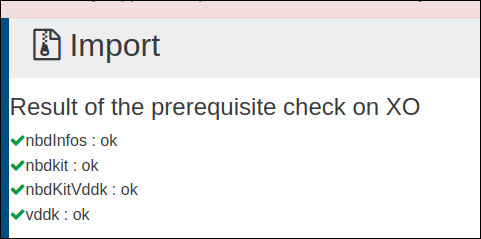
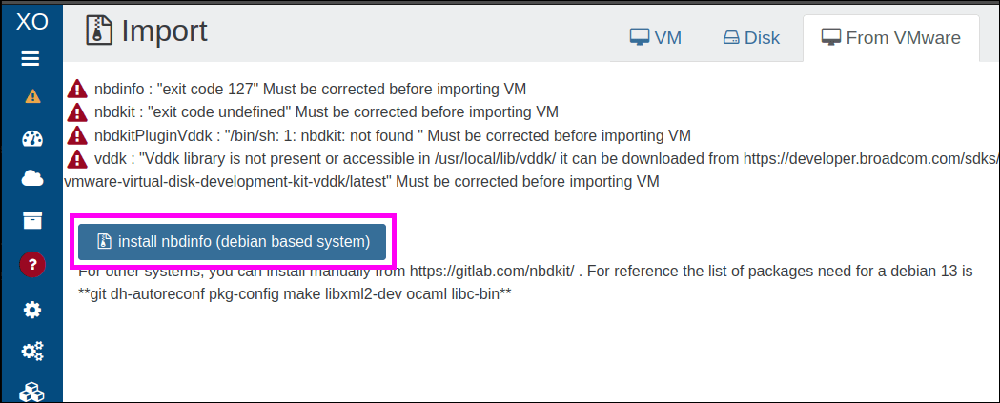
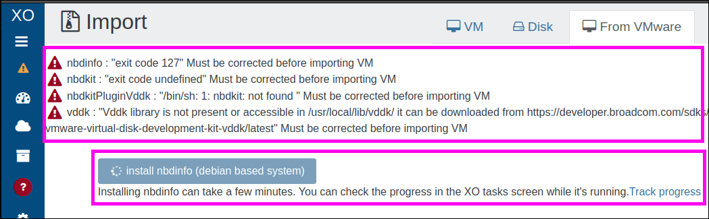
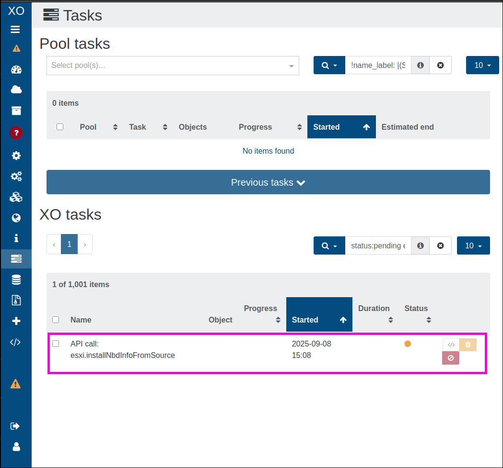
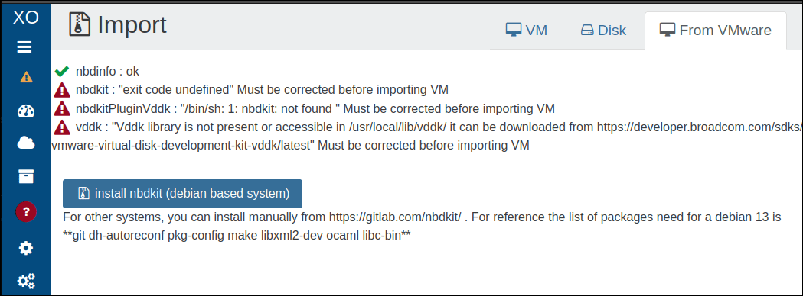
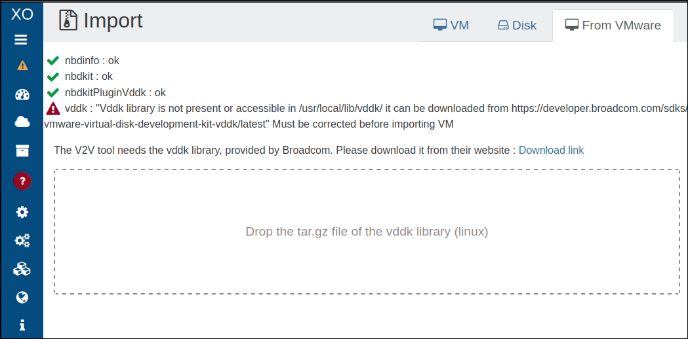
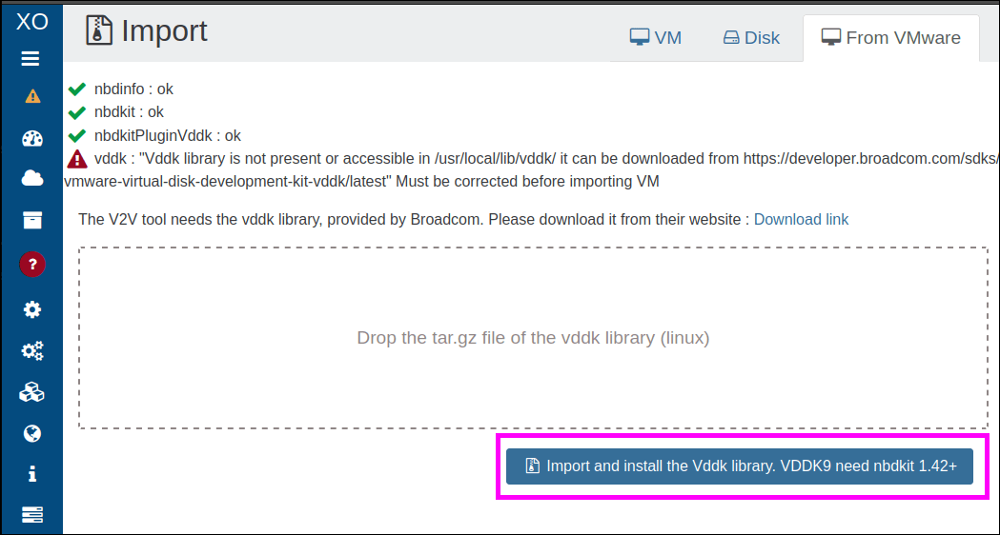
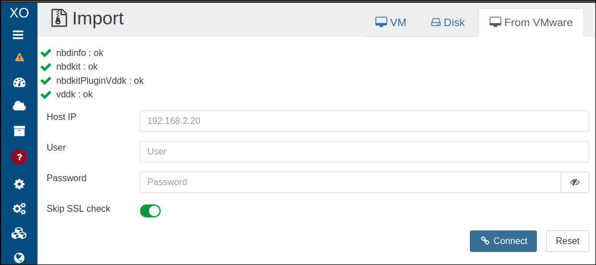

# V2V Migration Guide

## 📌 Introduction

Xen Orchestra 5.110 introduced a new migration backend for moving virtual machines from VMware to Vates (V2V). This replaces the old NFS-based method and now uses `nbdkit` alongside VMware’s VDDK libraries, delivering improved performance and reliability.

This guide walks you through the entire migration process:

- Preparing your VMware environment
- Installing the required components
- Running a test migration
- Executing the final cutover

You’ll also find troubleshooting advice and best practices to maximize speed and minimize downtime.

## 🎁 Benefits

### In short

The new V2V backend replaces the old approach, and delivers:

- Warm migration for all ESXi versions
- Improved performance
- A cleaner design for easier maintenance

### Detailed benefits

#### Ease of use and compatibility

The new backend only reads allocated blocks, which accelerates transfers, and snapshots have minimal impact on performance. There’s no longer any need for temporary NFS storage or remote VSAN targets. The system is also built to handle very large disks, with support for sizes beyond 2 TB planned in a future update.

#### UI improvements

The interface has also seen significant improvements: a **progress bar** is now visible from the start of migration, **speed metrics** are recorded in the VDI, and **snapshots** are created at each step. This allows you to pause and resume the process safely without creating multiple VMs. 

Additionally, UEFI VMs are no longer forced into Secure Boot mode, which resolves previous boot issues.

#### Performance gains 

Performance gains can be significant, though results depend on the environment:

- **In the best case**, when using VMs with many snapshots or mostly empty disks, migrations can be up to 100 times faster. In our high-performance lab, we measured around 150 MB/s per disk and up to 500 MB/s total, which means an infrastructure with 10 TB of data could be migrated in a single day, with less than five minutes of downtime per VM.

- **In less favorable situations**, such as a fully allocated disk with no snapshots and a powered-off VM, improvements are smaller, mainly due to compression between XO and ESXi. In general, the limiting factor is the import speed on the XCP-ng side, which scales well until the storage is saturated. Most of the transfer occurs while the VM is running, so production data remains safe. 

## 👨‍🍳 Preparing the XO environment

### Update Xen Orchestra 

Make sure your Xen Orchestra instance is up to date. The import page now includes an automatic check that highlights errors and warnings before migration. Errors must be resolved, and warnings should be addressed when possible.

### Dependencies

Install the following dependencies:
- `nbdkit`
- The VDDK plugin
- `nbdinfo`

#### Installing `nbdinfo` on Debian

:::warning
This procedure requires an active Internet connection and has only been tested on Debian 12 and 13.

In the future, we plan to include the latest libraries directly in XOA.
:::

To install `nbdinfo` on Debian:

1. Go to the **Import → VM → From VMware** section.
2. Click the button called **install nbdinfo (debian based system)**:

This starts the install.
3. Keep an eye on the current page to make sure the install goes as planned.
    - The **install nbdinfo** button will update to show the installation progress, and the page will display any warnings in real time as they appear:
    
    - Additionally, the **Task** screen shows the `nbdinfo` install task, with its name, start date, start time and status indicator:
    
    Thes task will be removed from the list upon completion.

4. Once the installation finishes, the `nbdinfo` install screen updates automatically. It lets you know if everything was completed successfully and flags any warnings that came up during the process:
    

    :::tip
    `nbdkit` and the `nbdkit-plugin-vddk` are installed using the same approach.
    :::

#### Installing the other dependencies

:::warning
You can compile `nbdkit` and `libnbd` from source on GitLab, but the correct dependencies must be in place for `nbdinfo` and VDDK.
:::

##### Installing VDDK

1. Download the VMware Virtual Disk Development Kit (VDDK) from the [Broadcom developer portal](https://developer.broadcom.com/sdks/vmware-virtual-disk-development-kit-vddk/9.0?ref=xen-orchestra.com). 
2. Select the *tar.gz* archive, then drag and drop it directly into the Xen Orchestra interface:

An **install button** will appear.
3. Click the button: 

The installation should take just a few seconds.
Once the installation is done, a **transfer form** will appear.:

:::warning
Filling in this form and clicking the **Connect** button will start the VM import. However, make sure your VMware environment is ready! 

Read [Preparing the VMware Environment](#-preparing-the-vmware-environment) to know more.
:::

## 👨‍🍳 Preparing the VMware Environment

### Prerequisites

Before starting the migration, make sure your VMware environment meets the following conditions:

#### Network
XO must be able to connect to the vsphere/esxi through the port running the web UI (default port: 443) and vddk (default port: 902). At the time of writing, there is no solution to select one network or another. If possible, keep one single network path from XO to VMware.

#### VMware disk support

##### ✅Supported 

- **Native snapshots** are supported. To migrate these:
    1. Shut them down completely.
    2. Remove all snapshots before attempting the migration.
- **Warm migration** is supported. If warm migration fails:
        1. Stop the VM.
        2. Remove any snapshots.

##### ⚠️ Unofficial support

VSAN configurations have not been fully tested, but they are expected to work.

##### ❌ Unsupported

The following VMware disk types are not supporetd: 

- RDM (Raw Device Mapping)
- Independent disks
- Physical compatibility mode RDMs
- Encrypted virtual disks (unless you have the correct credentials)

:::warning
Starting with Xen Orchestra 5.110, NFS-based migration and VSAN exports are no longer available.
:::

### Step-by-step procedure 

Here is the "surefire method" to prepare your VMware environment. 

It involves a lot of manual steps, but it lets you detect and fix issues without impacting production.

:::tip
There’s also a "fire-and-forget" approach: launch the migration with `stop source` enabled, then start the VM once the migration is complete. 

This method is only recommended for non-critical VMs, and only after the first few migrations have gone smoothly.
:::

Once the [prerequisites](#prerequisites) are met, follow these steps to prepare the source VM:

#### Optimize the Source VM

1. Remove all existing snapshots from the VM.
2. Take a new snapshot named `vm starting point` to serve as a baseline.

#### Clean up VMware

If applicable:

1. Uninstall VMware Tools from the VM.
2. Verify that the VM can still boot successfully.

#### Create a clean snapshot

Take another snapshot named `vm without tools`. 

This snapshot captures the state of the VM without VMware-specific components, and will be used for the initial migration.

## 🧪 Initial test migration

Before making the final switch, **run a test migration first**. This lets you catch any issues before moving to production.

### Perform the first migration attempt

1. **Start the V2V migration** in Xen Orchestra, without enabling the `Stop Source` option.\
    This will transfer the VM data up to the snapshot named `vm without tools`. 
    :::tip
    You can safely close your browser while the migration runs.
    :::
2. **Monitor the migration progress** using one of these methods:
    - Check the VM status in Xen Orchestra (it should show `importing...`).
    - Follow the disk transfer progress indicators.

### Testing the migrated VM

Once the migration is complete:

1. Start the migrated VM copy on your XCP-ng environment. 

:::tip
- Use an **isolated network** to avoid IP conflicts.
- The **VM state** might be slightly inconsistent since memory and cache data aren't fully synced.
:::

2. Check the following during testing:

- The VM boots up without issues.
- Network connectivity is working properly.
- Xen Tools installs and runs correctly.

3. Document any fixes or adjustments required to stabilize the VM.

### Remove the test copy

Once you’ve finished your checks and taken notes, delete the test VM. This will free up resources and prevent any confusion before the final migration.

## 🏁 Final migration

### Run the production migration
When you're ready for the final migration:
- Shut down the source VM completely.
- Start the V2V migration in Xen Orchestra with the `Stop Source` option enabled.\
    This ensures the final sync happens while the VM is powered off, and prevents any inconsistencies.

### Post-migration tasks
Once the migration is complete:

- Apply any fixes or tweaks you identified during the test migration.
- The migrated VM will include snapshots for rollback. If needed, create additional snapshots before making further changes.

## 🆘 Troubleshooting migration issues

If you encounter problems during migration, try these steps to diagnose and resolve them:

- **Check VMware logs**\
Look for disk access errors in the VMware logs. These may point to issues with the source storage or VM configuration.

- **Update software versions**\
Ensure `nbdkit` and `nbdinfo` are up to date. Older versions can cause compatibility issues with the VDDK plugin.

- **Remove active snapshots**\
Make sure no active snapshots remain on the source VM. Snapshots can disrupt migration consistency.

- **Verify destination storage**\
Confirm the XCP-ng storage repository has enough free space for the migrated VM.

- **Test network connectivity**\
Ensure stable network connectivity between the VMware environment, Xen Orchestra, and XCP-ng hosts.

- **Retry with cold migration**\
If warm migration fails, power off the VM, remove all snapshots, and try again.

## ❓ Need more help?
For additional details and alternative methods, see the [XCP-ng migration guide](https://docs.xcp-ng.org/installation/migrate-to-xcp-ng/#ova).

## 🚀 Boosting migration performance
Migration speed depends on several factors. By identifying bottlenecks and optimizing your setup, you can significantly improve performance.

### Common bottlenecks
The V2V migration process can be slowed down by:

- XAPI ingestion speed limits
- Network throughput between Xen Orchestra and VMware
- Network throughput between Xen Orchestra and the XCP-ng host
- ESXi host export speed

### Optimizing network performance
For the best results:

#### Xen Orchestra to XCP-ng connection
    - Run Xen Orchestra directly within the target XCP-ng pool to reduce network hops and latency.
    - Use the highest available bandwidth, ideally 10Gbps or faster.

#### Xen Orchestra to VMware connection
Ensure a dedicated 10Gbps+ connection with low latency to your vCenter or ESXi hosts.

### Storage recommendations

Use **fast SSD storage** for both the XCP-ng storage repository and Xen Orchestra’s working directory.
This speeds up the initial migration and enables smoother live migrations afterward.

### CPU and compute resources

If CPU becomes a bottleneck:

- **Allocate high-performance CPUs** to your Xen Orchestra appliance.
- For large environments, consider **parallel migrations** using multiple Xen Orchestra instances —but balance this with your network capacity.

### Migration strategy

- Schedule migrations during off-peak hours to minimize performance issues.
- If migrating multiple VMs, **stagger start times** and monitor XAPI performance to avoid bottlenecks.