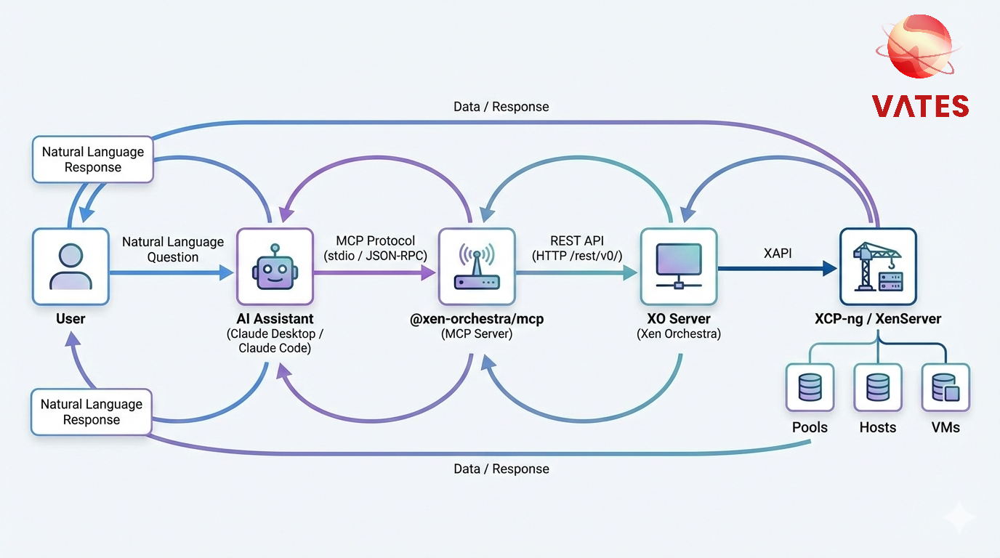
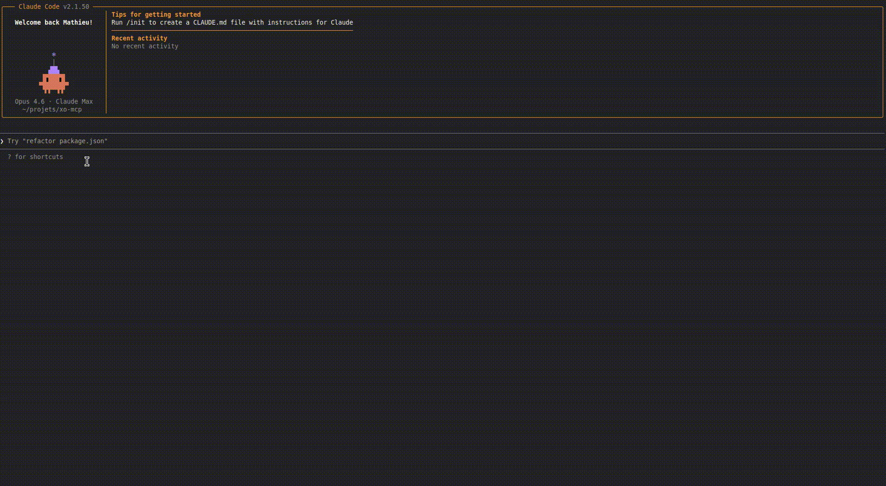
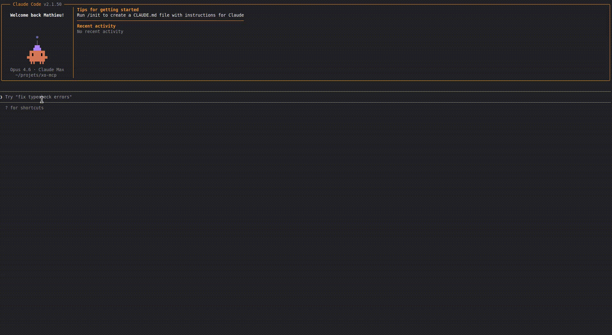

# Model Context Protocol (MCP)

## What is MCP?

[MCP](https://modelcontextprotocol.io/) (Model Context Protocol) is an open standard that allows AI assistants to interact with external tools and data sources. Think of it as a universal adapter between AI assistants (like Claude) and your infrastructure.

With the `@xen-orchestra/mcp` package, your AI assistant can directly query your Xen Orchestra instance to answer questions about your virtualization infrastructure in natural language.

## Why MCP with Xen Orchestra?

MCP enables new ways to interact with your infrastructure:

- **Natural language queries** — Ask "How many VMs are running?" instead of navigating dashboards
- **AI-assisted monitoring** — Get instant summaries of your infrastructure state
- **Quick diagnostics** — Ask about specific VMs, hosts, or pools without leaving your conversation
- **Documentation at your fingertips** — Search XO documentation directly from the assistant

All operations are **read-only by design**, ensuring safe interaction with your production environment.

## Installation

### Prerequisites

- **Node.js** 20 or later
- A **Xen Orchestra** instance with [REST API](restapi.md) enabled
- An **AI assistant** that supports MCP (Claude Desktop, Claude Code, etc.)

### Install the MCP server

```bash
npm install -g @xen-orchestra/mcp
```

Or run directly without installing:

```bash
npx @xen-orchestra/mcp
```

### Configure authentication

The MCP server connects to Xen Orchestra via the REST API using three environment variables:

| Variable      | Required | Description                                               |
| ------------- | -------- | --------------------------------------------------------- |
| `XO_URL`      | Yes      | Xen Orchestra server URL (e.g., `https://xo.example.com`) |
| `XO_USERNAME` | Yes      | XO user with admin privileges                             |
| `XO_PASSWORD` | Yes      | XO password                                               |

:::tip
Only admin users can currently use the REST API. See [REST API authentication](restapi.md#authentication) for details.
:::

### Configure your AI assistant

#### Claude Desktop

Add the following to your Claude Desktop configuration file (`~/.config/claude-desktop/config.json` on Linux, `~/Library/Application Support/Claude/claude_desktop_config.json` on macOS):

```json
{
  "mcpServers": {
    "xo": {
      "command": "npx",
      "args": ["@xen-orchestra/mcp"],
      "env": {
        "XO_URL": "https://your-xo-server",
        "XO_USERNAME": "admin@example.com",
        "XO_PASSWORD": "your-password"
      }
    }
  }
}
```

#### Claude Code

```bash
claude mcp add xo \
  -e XO_URL=https://your-xo-server \
  -e XO_USERNAME=admin@example.com \
  -e XO_PASSWORD=your-password \
  -- npx @xen-orchestra/mcp
```

#### Other MCP-compatible clients

Run the MCP server with environment variables set:

```bash
XO_URL=https://your-xo-server \
XO_USERNAME=admin@example.com \
XO_PASSWORD=your-password \
npx @xen-orchestra/mcp
```

The server communicates via stdio using the MCP protocol (JSON-RPC), compatible with any MCP client.

## How it works



1. You ask a question in natural language to your AI assistant.
2. The assistant determines which MCP tool to call.
3. The MCP server queries the XO REST API (`/rest/v0/...`).
4. Results are returned to the assistant, which formats a natural language answer.

## Available Tools

### `check_connection`

Test the connection to the Xen Orchestra server. Use this to validate your setup before querying infrastructure.

**Parameters:** None

**Example question:** "Can you connect to my XO server?"

---

### `list_pools`

List all pools in Xen Orchestra with their basic information.

| Parameter | Type   | Required | Description                                                                                          |
| --------- | ------ | -------- | ---------------------------------------------------------------------------------------------------- |
| `fields`  | string | No       | Comma-separated fields to return (default: `id,name_label,name_description,auto_poweron,HA_enabled`) |

**Example question:** "List all my pools"

---

### `get_pool_dashboard`

Get an aggregated dashboard for a specific pool, including host status, top resource consumers, and active alarms.

| Parameter | Type   | Required | Description |
| --------- | ------ | -------- | ----------- |
| `pool_id` | string | Yes      | The pool ID |

**Example question:** "Show me the dashboard for pool X"

---

### `list_hosts`

List all hosts (hypervisors) in Xen Orchestra with optional filtering.

| Parameter | Type   | Required | Description                                                                        |
| --------- | ------ | -------- | ---------------------------------------------------------------------------------- |
| `filter`  | string | No       | Filter expression (e.g., `productBrand:XCP-ng`)                                    |
| `fields`  | string | No       | Comma-separated fields (default: `id,name_label,productBrand,version,power_state`) |

**Example question:** "Show me all XCP-ng hosts"

---

### `list_vms`

List virtual machines in Xen Orchestra with optional filtering.

| Parameter | Type   | Required | Description                                                               |
| --------- | ------ | -------- | ------------------------------------------------------------------------- |
| `filter`  | string | No       | Filter expression (e.g., `power_state:Running`, `name_label:web*`)        |
| `fields`  | string | No       | Comma-separated fields (default: `id,name_label,power_state,CPUs,memory`) |
| `limit`   | number | No       | Maximum number of results                                                 |

**Example question:** "How many VMs are currently running?"

---

### `get_vm_details`

Get detailed information about a specific virtual machine.

| Parameter | Type   | Required | Description       |
| --------- | ------ | -------- | ----------------- |
| `vm_id`   | string | Yes      | The VM ID or UUID |

**Example question:** "Give me the details of VM abc123"

---

### `get_infrastructure_summary`

Get a high-level summary of the entire XO infrastructure, including pool count, host count, and VM counts by power state (running, halted, other).

**Parameters:** None

**Example question:** "Give me an overview of my infrastructure"

---

### `search_documentation`

Search and retrieve Xen Orchestra documentation. Useful for learning about XO features, configuration, and best practices.

| Parameter | Type | Required | Description                                                                                                                     |
| --------- | ---- | -------- | ------------------------------------------------------------------------------------------------------------------------------- |
| `topic`   | enum | Yes      | One of: `installation`, `configuration`, `backups`, `restapi`, `manage`, `users`, `architecture`, `troubleshooting`, `releases` |

**Example question:** "How do I configure backups in XO?"

## Prompts

The MCP server also provides a built-in prompt:

### `infrastructure-overview`

Generates a natural language overview of the XO infrastructure. When invoked, the assistant calls `get_infrastructure_summary` and formats the results as a readable summary with pool names, host counts, and VM statistics.

## Example Conversations

**Infrastructure overview:**



**Searching documentation:**



## Troubleshooting

:::note Connection refused
Verify that `XO_URL` is correct and includes the protocol (`https://` or `http://`). Make sure the XO server is reachable from the machine running the MCP server.
:::

:::note Authentication failed (401)
Check `XO_USERNAME` and `XO_PASSWORD`. Only admin users can currently access the REST API. Verify your credentials work by logging into the XO web interface.
:::

:::note Timeout errors
The MCP server has a 30-second timeout for API requests. If you experience timeouts, check network connectivity between the MCP server and your XO instance.
:::

:::note Missing required environment variables
All three environment variables (`XO_URL`, `XO_USERNAME`, `XO_PASSWORD`) must be set. When using Claude Desktop, make sure they are in the `env` section of the MCP server configuration.
:::
