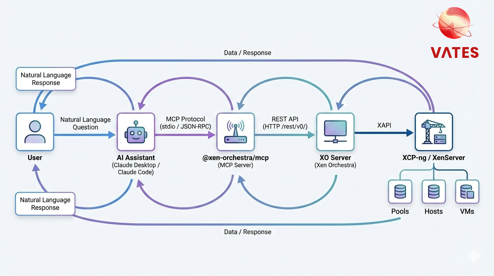
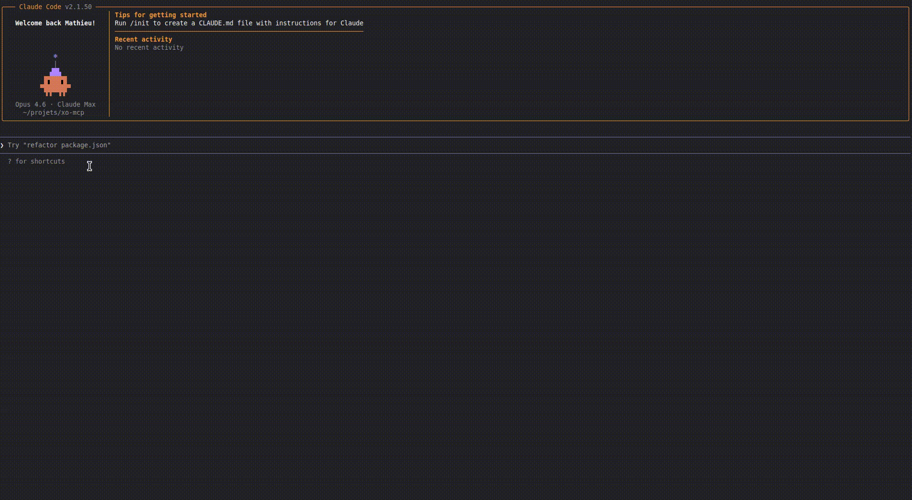
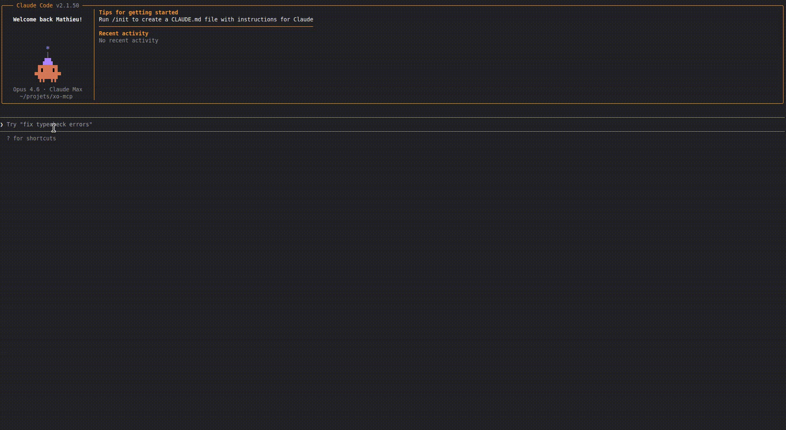

# Model Context Protocol (MCP)

## What is MCP?

[MCP](https://modelcontextprotocol.io/) (Model Context Protocol) is an open standard that allows AI assistants to interact with external tools and data sources. Think of it as a universal adapter between AI assistants (like Claude) and your infrastructure.

With the `@xen-orchestra/mcp` package, your AI assistant can directly query your Xen Orchestra instance to answer questions about your virtualization infrastructure in natural language.

## Why MCP with Xen Orchestra?

MCP enables new ways to interact with your infrastructure:

- **Natural language queries** — Ask "How many VMs are running?" instead of navigating dashboards
- **AI-assisted monitoring** — Get instant summaries of your infrastructure state
- **Quick diagnostics** — Ask about specific VMs, hosts, or pools without leaving your conversation
- **Documentation at your fingertips** — Search XO documentation directly from the assistant

All operations are **read-only by default**, ensuring safe interaction with your production environment. Write operations can be enabled explicitly — see [Write operations](#write-operations).

## Installation

### Prerequisites

- **Node.js** 20 or later
- A **Xen Orchestra** instance with [REST API](restapi.md) enabled
- An **AI assistant** that supports MCP (Claude Desktop, Claude Code, etc.)

### Install the MCP server

```bash
npm install -g @xen-orchestra/mcp
```

Or run directly without installing:

```bash
npx @xen-orchestra/mcp
```

### Configure authentication

The MCP server connects to Xen Orchestra via the REST API. Two authentication modes are supported: **token** (recommended) or **username/password**.

| Variable                | Required                | Description                                                                                   |
| ----------------------- | ----------------------- | --------------------------------------------------------------------------------------------- |
| `XO_URL`                | Yes                     | Xen Orchestra server URL (e.g., `https://xo.example.com`)                                     |
| `XO_TOKEN`              | If no username/password | Authentication token                                                                          |
| `XO_USERNAME`           | If no token             | XO user with admin privileges                                                                 |
| `XO_PASSWORD`           | If no token             | XO password                                                                                   |
| `XO_MCP_ENABLE_ACTIONS` | No                      | Set to `1` to expose write/destructive operations (see [Write operations](#write-operations)) |

To generate a token, go to the XO user page (`/user`) or run `xo-cli create-token`. If both `XO_TOKEN` and `XO_USERNAME`/`XO_PASSWORD` are set, token authentication takes priority.

:::tip
Only admin users can currently use the REST API. See [REST API authentication](restapi.md#authentication) for details.
:::

### Configure your AI assistant

#### Claude Desktop

Add the following to your Claude Desktop configuration file (`~/.config/claude-desktop/config.json` on Linux, `~/Library/Application Support/Claude/claude_desktop_config.json` on macOS):

Using a token (recommended):

```json
{
  "mcpServers": {
    "xo": {
      "command": "npx",
      "args": ["@xen-orchestra/mcp"],
      "env": {
        "XO_URL": "https://your-xo-server",
        "XO_TOKEN": "your-token"
      }
    }
  }
}
```

Using username/password:

```json
{
  "mcpServers": {
    "xo": {
      "command": "npx",
      "args": ["@xen-orchestra/mcp"],
      "env": {
        "XO_URL": "https://your-xo-server",
        "XO_USERNAME": "admin@example.com",
        "XO_PASSWORD": "your-password"
      }
    }
  }
}
```

#### Claude Code

```bash
# Using a token (recommended)
claude mcp add xo \
  -e XO_URL=https://your-xo-server \
  -e XO_TOKEN=your-token \
  -- npx @xen-orchestra/mcp

# Using username/password
claude mcp add xo \
  -e XO_URL=https://your-xo-server \
  -e XO_USERNAME=admin@example.com \
  -e XO_PASSWORD=your-password \
  -- npx @xen-orchestra/mcp
```

#### Other MCP-compatible clients

Run the MCP server with environment variables set:

```bash
# Using a token (recommended)
XO_URL=https://your-xo-server \
XO_TOKEN=your-token \
npx @xen-orchestra/mcp

# Using username/password
XO_URL=https://your-xo-server \
XO_USERNAME=admin@example.com \
XO_PASSWORD=your-password \
npx @xen-orchestra/mcp
```

The server communicates via stdio using the MCP protocol (JSON-RPC), compatible with any MCP client.

#### Multiple XO instances

To manage several XO servers from the same assistant, add one entry per instance with a different name:

```json
{
  "mcpServers": {
    "xo-production": {
      "command": "npx",
      "args": ["@xen-orchestra/mcp"],
      "env": {
        "XO_URL": "https://xo-production.example.com",
        "XO_TOKEN": "prod-token"
      }
    },
    "xo-staging": {
      "command": "npx",
      "args": ["@xen-orchestra/mcp"],
      "env": {
        "XO_URL": "https://xo-staging.example.com",
        "XO_TOKEN": "staging-token"
      }
    }
  }
}
```

With Claude Code:

```bash
claude mcp add xo-production \
  -e XO_URL=https://xo-production.example.com \
  -e XO_TOKEN=prod-token \
  -- npx @xen-orchestra/mcp

claude mcp add xo-staging \
  -e XO_URL=https://xo-staging.example.com \
  -e XO_TOKEN=staging-token \
  -- npx @xen-orchestra/mcp
```

Each entry starts its own process with its own credentials. The assistant gets a separate set of tools per instance, so you can ask about a specific environment by name ("list running VMs on xo-production").

:::tip
Pick descriptive names (`xo-production`, `xo-dr-site`, ...) so the assistant knows which instance you're referring to.
:::

## How it works



1. On startup, the MCP server fetches the OpenAPI spec from your XO instance (`/rest/v0/docs/swagger.json`) and generates one tool per resource domain.
2. You ask a question in natural language to your AI assistant.
3. The assistant picks a tool (e.g. `pools_query`) and chooses an `operation` (e.g. `list`, `dashboard`).
4. The MCP server calls the corresponding XO REST endpoint and returns a markdown-formatted response.

Because the tool surface is generated from the live OpenAPI spec, it always reflects the XO version you're connecting to — new endpoints become available automatically as XO evolves.

## Available Tools

### Utility tools

These three tools are always present regardless of the XO spec.

#### `check_connection`

Test the connection to the Xen Orchestra server. Use this to validate your setup before querying infrastructure.

**Parameters:** None

**Example question:** "Can you connect to my XO server?"

---

#### `get_infrastructure_summary`

Aggregate pools, hosts, and VMs across the entire infrastructure into a single markdown summary.

**Parameters:** None

**Example question:** "Give me an overview of my infrastructure"

---

#### `search_documentation`

Search and retrieve Xen Orchestra documentation. Useful for learning about XO features, configuration, and best practices.

| Parameter | Type | Required | Description                                                                                                                     |
| --------- | ---- | -------- | ------------------------------------------------------------------------------------------------------------------------------- |
| `topic`   | enum | Yes      | One of: `installation`, `configuration`, `backups`, `restapi`, `manage`, `users`, `architecture`, `troubleshooting`, `releases` |

**Example question:** "How do I configure backups in XO?"

### Domain query tools

Each domain exposes a single `{domain}_query` tool. The assistant picks an `operation` from the tool's enum and supplies the relevant arguments. All query tools share the same argument shape:

| Parameter   | Type   | Required    | Description                                                                                                                                     |
| ----------- | ------ | ----------- | ----------------------------------------------------------------------------------------------------------------------------------------------- |
| `operation` | enum   | Yes         | The operation to perform (e.g. `list`, `get`, `dashboard`). The list of valid operations is domain-specific and listed in the tool description. |
| `id`        | string | If required | Resource ID (required for `get`, sub-resource operations, etc.)                                                                                 |
| `filter`    | string | No          | [Filter expression](https://docs.xen-orchestra.com/manage_infrastructure#live-filter-search) for list operations                                |
| `fields`    | string | No          | Comma-separated fields to return. Leave empty to use optimized defaults.                                                                        |
| `limit`     | number | No          | Maximum number of results for list operations                                                                                                   |

Generated domain tools (operation list is indicative — the exact enum depends on your XO version):

| Tool                | Covers                                 | Common operations                                                      |
| ------------------- | -------------------------------------- | ---------------------------------------------------------------------- |
| `pools_query`       | pools                                  | `list`, `get`, `dashboard`, `alarms`, `missing_patches`, `messages`, … |
| `hosts_query`       | hosts                                  | `list`, `get`, `alarms`, `smt`, `missing_patches`, `messages`, …       |
| `vms_query`         | VMs, templates, snapshots, controllers | `list`, `get`, `alarms`, `vdis`, `dashboard`, `list_vm-templates`, …   |
| `storage_query`     | VDIs, SRs, VBDs, PBDs                  | `list_vdis`, `get_vdi`, `list_srs`, `get_sr`, `list_vbds`, …           |
| `networks_query`    | networks, VIFs, PIFs                   | `list`, `get`, `list_vifs`, `get_vif`, `list_pifs`, `get_pif`, …       |
| `backup_query`      | schedules, logs, repositories          | `list_schedules`, `list_backup-logs`, `list_backup-repositories`, …    |
| `backup-jobs_query` | backup jobs                            | `list`, `get`, `jobs_vm_backup`, `jobs_metadata_backup`, …             |
| `admin_query`       | users, groups, servers                 | `list_users`, `get_user`, `list_groups`, `list_servers`, …             |
| `infra_query`       | tasks, messages, alarms, events        | `list_tasks`, `list_messages`, `list_alarms`, `list_events`, …         |
| `system_query`      | PCIs, PGPUs, proxies, SMs              | `list_pcis`, `list_pgpus`, `list_proxies`, `list_sms`, …               |
| `docs_query`        | OpenAPI spec                           | `swagger.json`                                                         |
| `xoa_query`         | XO appliance                           | `list_dashboard`, `list_ping`, `list_gui-routes`                       |

**Example questions:**

- "List all my pools" → `pools_query` with `operation: list`
- "Show the dashboard for pool X" → `pools_query` with `operation: dashboard, id: X`
- "How many VMs are currently running?" → `vms_query` with `operation: list, filter: power_state:Running`
- "List user VDIs larger than 100GB" → `storage_query` with `operation: list_vdis, filter: VDI_type:User`
- "Show all XCP-ng hosts" → `hosts_query` with `operation: list, filter: productBrand:XCP-ng`

:::note Excluded endpoints
Stats endpoints (`/…/stats`) are deliberately not exposed as MCP tools: a single response can contain hundreds of time-series points across dozens of metrics, blowing past the LLM context window without a meaningful way to narrow the payload via query parameters. Hit the REST API directly (`GET /rest/v0/{resource}/{id}/stats`) when you need raw metric series.
:::

### Write operations

By default, the MCP server only exposes read-only tools. Set `XO_MCP_ENABLE_ACTIONS=1` in the server environment to also expose `{domain}_action` tools covering POST/PUT/PATCH/DELETE operations.

Action tools share this argument shape:

| Parameter       | Type   | Required         | Description                                                                                |
| --------------- | ------ | ---------------- | ------------------------------------------------------------------------------------------ |
| `operation`     | enum   | Yes              | The action to perform (e.g. `start`, `delete`, `emergency_shutdown`).                      |
| `id`            | string | For most actions | Target resource ID                                                                         |
| `body`          | object | No               | Request body for create/update operations                                                  |
| `confirm_token` | string | For risky ops    | One-shot token returned by a prior preview call — required to execute dangerous operations |

**Confirmation flow for dangerous operations.** All `DELETE`s and a hand-picked set of destructive operations (`pools/emergency_shutdown`, `pools/rolling_reboot`, `pools/rolling_update`, `vms/hard_shutdown`, `vms/hard_reboot`) require explicit confirmation. The first call returns a preview and a `confirm_token`; the assistant must call back within 5 minutes with that token to execute. This turns "Yes, delete all my snapshots" into a two-step handshake and neutralises accidental destructive calls.

:::warning Only enable actions if you trust the caller
Enabling `XO_MCP_ENABLE_ACTIONS` lets the assistant mutate your infrastructure. Confirmations reduce the blast radius for destructive operations, but non-destructive writes (create, update) proceed without a second round-trip. Keep read-only mode unless you have a specific need.
:::

## Prompts

The MCP server also provides a built-in prompt:

### `infrastructure-overview`

Generates a natural language overview of the XO infrastructure. When invoked, the assistant calls `get_infrastructure_summary` and formats the results as a readable summary.

## Example Conversations

**Infrastructure overview:**



**Searching documentation:**



## Troubleshooting

:::note Connection refused
Verify that `XO_URL` is correct and includes the protocol (`https://` or `http://`). Make sure the XO server is reachable from the machine running the MCP server.
:::

:::note Authentication failed (401)
If using token authentication, check that `XO_TOKEN` is valid — the token may have expired or been revoked. If using username/password, check `XO_USERNAME` and `XO_PASSWORD`. Only admin users can currently access the REST API.
:::

:::note Timeout errors
The MCP server has a 30-second timeout for API requests. If you experience timeouts, check network connectivity between the MCP server and your XO instance.
:::

:::note Missing required environment variables
`XO_URL` is always required. You must also set either `XO_TOKEN` or both `XO_USERNAME` and `XO_PASSWORD`. When using Claude Desktop, make sure they are in the `env` section of the MCP server configuration.
:::
