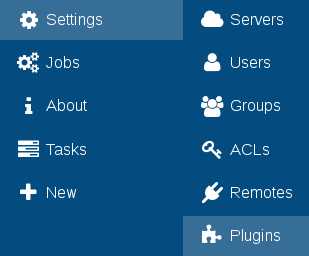
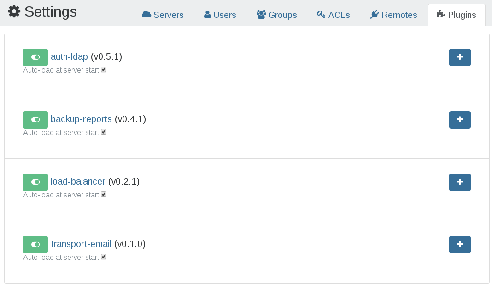

# Plugins

Xen Orchestra plugins allow you to extend features without rewriting the core of the application.

You can see your installed plugins in "Settings" then the "Plugins" page:

All plugin configuration should be done in the web interface:

A plugin can be:

- activated/deactivated
- loaded on start of the application
- configured (extend the plugin settings by clicking on the "+" icon
