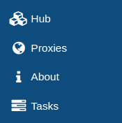

# Backup Proxy

A Xen Orchestra proxy is an architecture component you can deploy in your infrastructure in order to locally handle the data streams of your backup jobs.
The most current situation in which you might wish to use a XO proxy are:

- To handle backup data streams in large infrastructure to avoid saturation of the main appliance and split the workload
- To handle backup data streams in remote infrastructure to avoid useless back and forth from the main XOA to the remote location

## Architecture


## Deployment

### Prerequisites

To deploy a Xen Orchestra proxy, you need to have an available proxy license. To purchase a license, you simply need to visit [our store](https://xen-orchestra.com/#!/member/purchaser) and follow the purchasing process.

### Minimum Requirements

XO proxies require the following resources:

- 2 vCPUs
- 2GiB RAM
- 20GiB disk (2GiB on thin pro SR)

### Installation

1. Go to the proxies section of your appliance



2. Deploy a proxy in your infrastructure


3. Perform all the required configuration for your proxy (SR, network...)


4. If you have an available license, it will be automatically bound to your newly deployed proxy.

## Proxy Remote creation

Once a proxy is deployed in your infrastructure, you can create a proxy remote using the remote form.


## Backup job with Proxies

While creating a standard backup job from your main Xen Orchestra appliance, you will have the ability to select a proxy on which you want to execute the job.


## Enabling login to a proxy appliance

Login is disabled by default on proxy appliances.
If you need to login for some reason, you need to set a password for the xoa user via the XenStore of the VM. The following is to be ran on your XCP-ng host:

```sh
xe vm-param-set uuid=<UUID> xenstore-data:vm-data/system-account-xoa-password=<password>
```

Where UUID is the uuid of your proxy VM.

Then you need to restart the proxy VM.
You can now login through SSH with the `xoa` username and password you defined in the previous command.

## Adding a network card to a Proxy

First you will need to add a second VIF to your Proxy VM. This can be done in the Network tab of the VM in XOA.

After adding the VIF you will need to set an IP for the new NIC, for that you will first need to SSH to the VM [as describe before](#enabling-login-to-a-proxy-appliance).

Then set the new IP:

```console
$ xoa network static eth1
? Static IP for this machine 192.168.100.120
? Network mask (eg 255.255.255.0) 255.255.255.0
```

If you want to set a static address.

```sh
xoa network dhcp eth1
```

If you prefer using DHCP.
:::tip
As XOA uses the first IP address reported by XAPI to contact the proxy appliance, you may have to switch the network card order if you want your proxy to be connected through a specific IP address.
:::
