# Purchase

With a subscription, you'll have both Pro Support and XOA Appliance with various features (depending on XOA Edition).

:::tip
To find which XOA Edition fits your needs, please read the [feature matrix page](https://xen-orchestra.com/#!/featuresmatrix) on Xen Orchestra website.
:::

You can buy XOA in multiple ways, depending on your needs. Click on the following links for more documentation:

- [for your company (direct purchase)](purchase.md#direct-purchase)
- [through your purchase department (purchaser)](purchase.md#via-your-purchase-departement)
- [for your own client (reseller)](purchase.md#as-a-reseller)

## Direct purchase

This is the easiest purchase option: you can buy XOA with your registered email account on [https://xen-orchestra.com](https://xen-orchestra.com).

### Choose your edition

You can choose the edition you want in two places:

- [the pricing page](https://xen-orchestra.com/#!/pricing)
- [your account/purchases page](https://xen-orchestra.com/#!/purchases)

:::tip
You need to be logged in to make a purchase. If you don't have an account, please [register here](https://xen-orchestra.com/#!/signup).
:::

From your account page, click on the purchase menu, then select the edition you need:

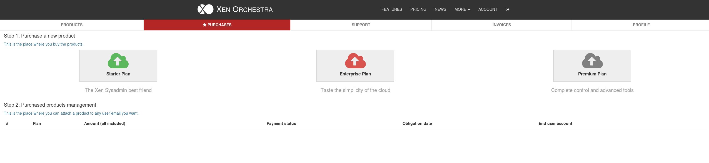

### Purchase options

The second step is to select your purchase option:

- Subscription: only available with a credit card payment. Choose this option for a monthly payment or a yearly payment **renewed automatically** each year.

- Paid period: **check or wire transfer only**. This purchase allows you to subscribe for a one, two or three year period

:::tip

- A 2 year subscription period grants you 1 month discounted
- A 3 year subscription period grants you 2 months discounted
  :::

Then you need to fill in your information and select **"Buy for my own use"** (direct purchase)

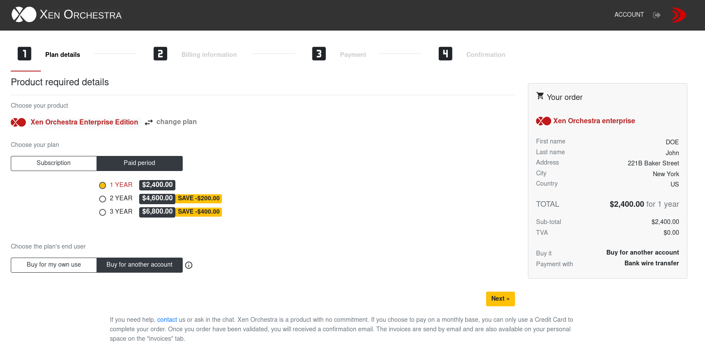

### Billing information

You need to complete all the required information on this page in order to move forward.

:::tip
If you are part of the Eurozone, you will need to provide a valid EU VAT number in order to proceed to payment. Transactions between companies inside the Eurozone are VAT free.
Transactions outside the Eurozone are VAT free.
:::

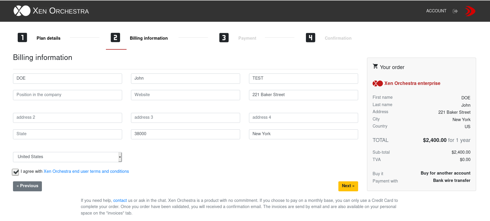

### Select your payment mode

Credit Card, Wire transfer or Bank check are the three payment methods available on our store. Some methods can be unavailable regarding the purchase option you have selected during step one.

:::tip
Wire transfer is not available for monthly and yearly subscription - Credit Card is not available for paid period.
:::

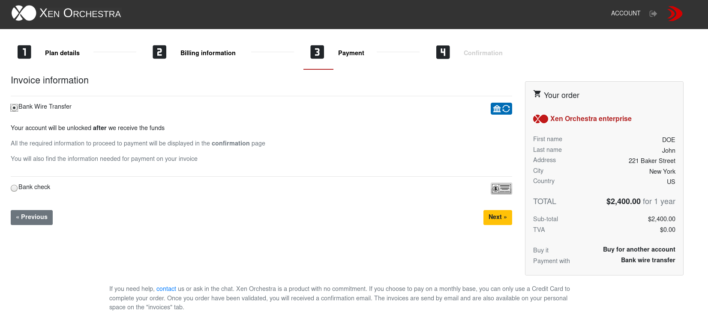

:::tip
All required information for wire transfer and Check payment will be available in the last step of the payment AND on your proforma invoice.
:warning: Please, use an explicit reference for your wire transfer in order for us to easily identify your payment.
:::

## Via your purchase departement

If you can't purchase using your own account, usually because you need to go through a dedicated purchase department in your company, this is the process you need to follow.

Typically, you will provide two contacts:

- The "billing contact" (in general, the purchaser email). This account will have access to invoices. This is the account doing the purchase. Once purchased, the license needs to be bound to the second contact account, the technical contact.
- The "technical contact", the email of the system administrator using the solution and making support requests.

### As "billing contact"

1. First of all, you need to create an account as a purchaser (eg: "purchase.dept@example.com"). Once it's done, you need to go inside the member page, in the **purchases** menu.

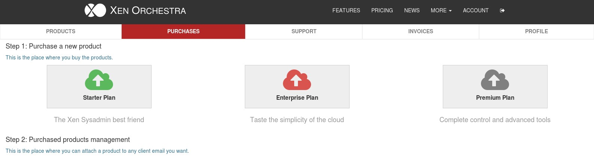

Now, you just have to pick the edition of Xen Orchestra you want to purchase for your IT team.

2. On the first payment screen, after you choose the plan and the subscription method. You can select the option "Buy for another account"

3. Once the payment is completed, you will have to bind the plan with the end-user account (technical contact). If the end-user doesn't have an account yet, the system will create one and send an e-mail to your end user.

That's it, you have now completed the purchase.

:::warning
Once you have bound the plan to your end user account, you cannot change it. Double check the spelling of the e-mail before binding the account.
:::

## Invoices

Invoices are available in PDF format. You can find them [in your account](https://xen-orchestra.com/#!/member).

Get in the "Invoices" tab:

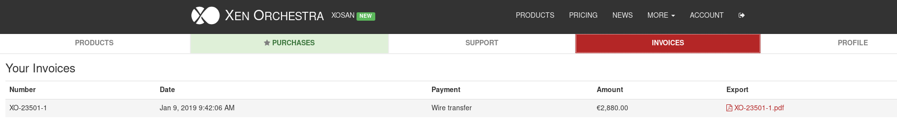

:::tip
You can download your invoice in PDF format, by clicking in the "Export" row, on the invoice name with the PDF extension.
:::

## Ask for a quote

You can ask for an automatic quote on our website via the pricing page or directly from you personal account page.

Choose the plan you want, the years of commitment that suits you, then fill out the information required (it should be prefilled with your account information).

If you want to purchase XO using the quote you receive, you just have to enter the quote number into the purchase menu, on your personal account page.

## Edit your card information

If you choose a Stripe payment, you can always edit the credit card information in case it changes. To do so, you only have to login to your personal account page and access the _profile_ menu.

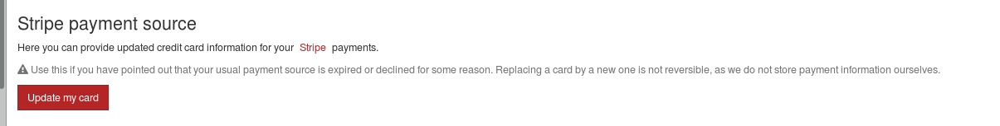

## Upgrade your plan

If you want to upgrade your active plan to a higher version of Xen Orchestra, you can do it from your **personal space**.

### Step by step:

1. Connect on your personal account on the [website](https://xen-orchestra.com/#!/login?source=member.index).

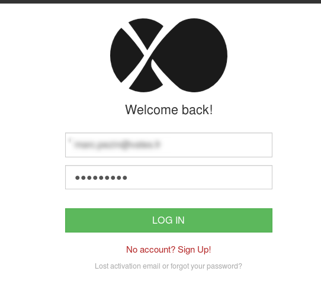

2. Go on the purchase menu

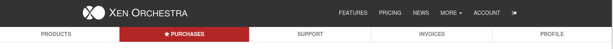

3. Pick the line corresponding to the account you want to upgrade. Click on the "upgrade" button on the right.

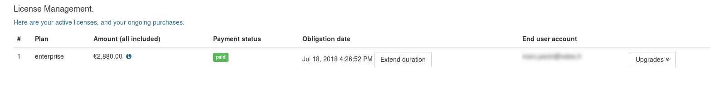

4. At this point, you will see a standard subscription page. **Choose the same payment method you used to purchase the initial plan** and confirm the purchase.

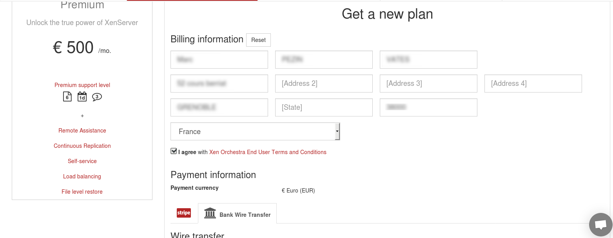

5. If you chosse wire transfer, you have now the possibility to download a quote. As you can see, the remaining period of your previous plan is now a credit note applied on this upgrade.

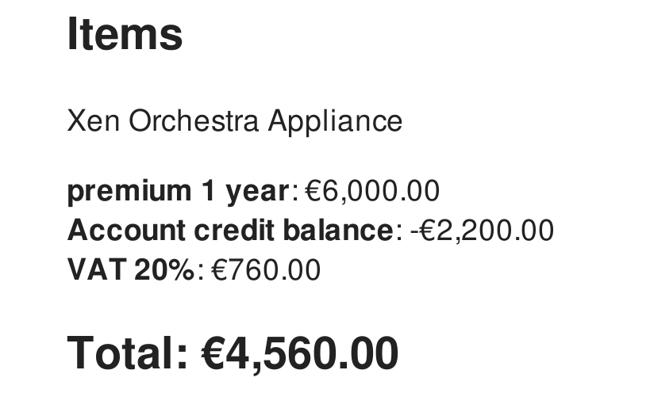

6. As for a regular purchase, upload a proof of payment in order for us to activate your new plan as soon as possible.

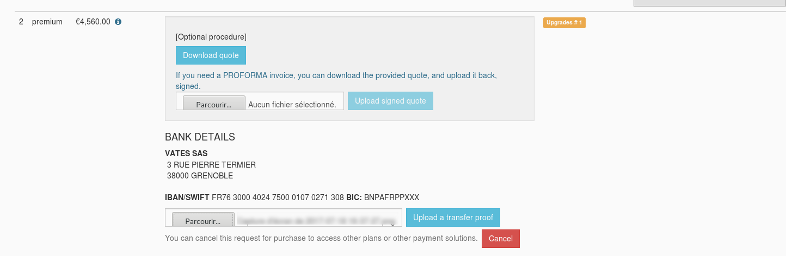

7. **Enjoy your new plan!**

:::tip
As a reseller, the process is quite the same. The only difference is that you have to pick your customer line into you reseller space an not your personal space.
:::
