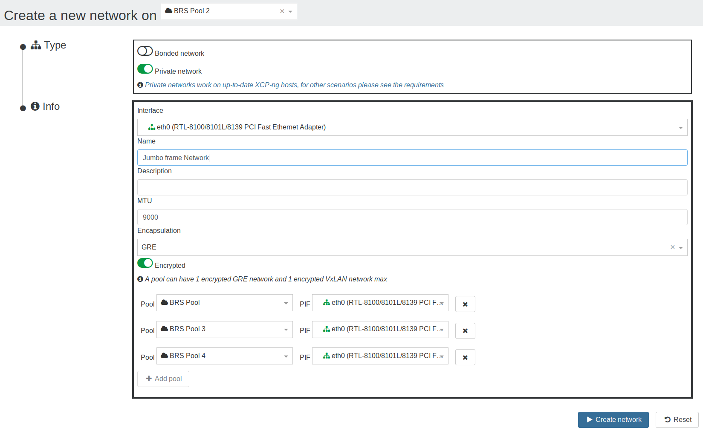
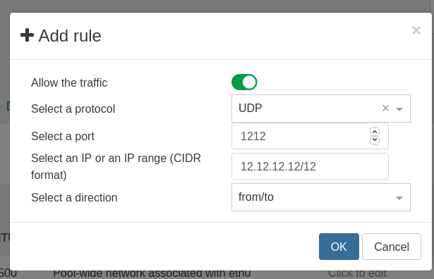
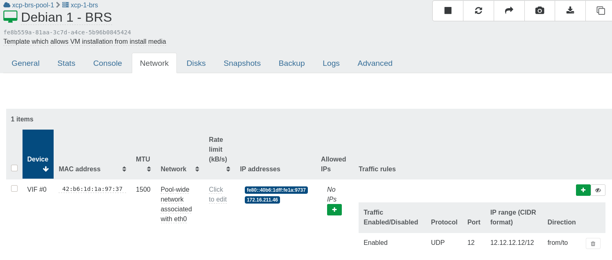

# SDN Controller

:::tip
Be sure to enable the plugin on only one XOA instance.
:::

The SDN Controller enables a user to **create pool-wide and cross-pool private networks** and more. It's available as a Xen Orchestra plugin (included in XOA Premium).

## Global Private Networks

Interconnect your VMs and hosts within a dedicated and secured private network, even across different pools all around the world. This is a great way to protect "private links" (eg between applications and databases, management networks etc.) without any complicated deployment.


### How does it work?

Please read the [dedicated devblog on the SDN Controller](https://xen-orchestra.com/blog/xo-sdn-controller/) and its [extension for cross-pool private networks](https://xen-orchestra.com/blog/devblog-3-extending-the-sdn-controller/).

:::warning
As VxLAN and GRE are protocols using extra encapsulation, they require extra bits on a network packet. If you create a Global Private Network with a default MTU at `1500`, you won't be able to use it "as is" in your VMs, unless you configure a smaller MTU for each virtual interface, in your VM operating system (eg: `1400`).

If you want something entirely transparent for your VMs, then you'll need to create a network with a MTU of `1546` for GRE or `1550` for VxLAN. However, larger MTU will require capable network equipments.
:::

### Network creation

In the network creation view:

- Select a `pool`
- Select `Private network`
- Select an interface on which to create the network's tunnels
- Select the encapsulation: a choice is offered between `GRE` and `VxLAN`, if `VxLAN` is chosen, then port 4789 must be open for UDP traffic on all the network's hosts (see [the requirements](#vxlan))
- Choose if the network should be encrypted or not (see [the requirements](#encryption) to use encryption)
- Select other `pool`s to add them to the network if desired
  - For each added `pool`: select an interface on which to create the tunnels
- Create the network
- Have fun! ☺



:::tip

- All hosts in a private network must be able to reach the other hosts' management interface and all hosts must be able to reach one another on the interface selected for private networks creation.
  > The term ‘management interface’ is used to indicate the IP-enabled NIC that carries the management traffic.
- Only 1 encrypted GRE network and 1 encrypted VxLAN network per pool can exist at a time due to Open vSwitch limitation.
  :::

### Configuration

Like all other xo-server plugins, it can be configured directly via the web interface, see [the plugin documentation](architecture#plugins).

The plugin's configuration contains:

- `cert-dir`: The path where the plugin will look for the certificates to create SSL connections with the hosts.
  If none is provided, the plugin will create its own self-signed certificates.
- `override-certs`: Enable to uninstall the existing SDN controller CA certificate in order to replace it with the plugin's one.

### Requirements

### VxLAN

### Encryption

- To be able to encrypt the networks, `openvswitch-ipsec` package must be installed on all the hosts:
  - `yum install openvswitch-ipsec --enablerepo=xcp-ng-testing`
  - `systemctl enable ipsec`
  - `systemctl enable openvswitch-ipsec`
  - `systemctl start ipsec`
  - `systemctl start openvswitch-ipsec`

## OpenFlow rules

There are currently two implementations:

- One where the SDN Controller plugin talks directly to Open vSwitch through the OpenFlow protocol
- A newer one using a XAPI plugin on XCP-ng side that directly configures Open vSwitch

At this time, the two options are covered until we can fully deprecate the older, direct OpenFlow implementation.

### OpenFlow Protocol

:::warning
This feature requires opening the OpenFlow port (TCP 6653). This is done automatically by XAPI.
:::

Limitations:

- Only on the physical host's management network (neither bond nor VLAN)
- Only supports per-VIF rules

For now, this is the default mode in Xen Orchestra.

Please see the [devblog about OpenFlow rules](https://xen-orchestra.com/blog/vms-vif-network-traffic-control/).

In the VM network tab a new column has been added: _Network rules_.

- The _Add rule_ button display a form to add a new rule choosing to:
  - enable/disable the matching traffic
  - for a specific protocol (optional)
  - on a specific port (optional)
  - matching a specific IP or IP range (optional)
  - coming from the VIF / going to the VIF / both
- The _Show rules_ button allow to display all rules for a VIF.
- When the rules are display a button to delete a rule is available.




### XAPI Plugin

:::warning
Two caveats:

- At this time, there is no UI in Xen Orchestra for network-wide rules. The rules can be created through `xo-cli`.
- This is not enabled by default, and requires a configuration change for `xo-server`. See [the configuration page](configuration#sdn-controller-mode) to know more.
  :::

- Works on any network:
  - Networks bound to physical interface as well as bonds
  - VLAN on top of any network
  - Private networks and cross-pool private networks
- Per VIF rules
- Network-wide rules

To setup a per-VIF rule using the UI, follow the [openflow instructions](#openflow-protocol) above, as the UI is the same and only the backend changes.

Here, we describe how to use `xo-cli` to configure rules. First, make sure to register xo-cli to your XOA instance as documented in [it's documentation](architecture#register-your-xo-instance).

- Add per-VIF rules: `xo-cli sdnController.addRule vifId=<VIF_UUID> <parameters>`
- Delete per-VIF rules: `xo-cli sdnController.deleteRule vifId=<VIF_UUID> <parameters`
- Add new network-wide rules: `xo-cli sdnController.addNetworkRule networkId=<NETWORK_UUID> <parameters`
- Delete network-wide rules: `xo-cli sdnController.deleteNetworkRule networkId=<NETWORK_UUID> <parameters`

Parameters:

- _ipRange_: An IP or range of IPs in CIDR notation (for example `192.168.1.0/24`). An IP does not need `/32`.
- _direction_:
  - _to_: means the parameters for **port** and **ipRange** are to be used as destination.
  - _from_: means they will be used as source.
  - _from/to_ or _to/from_: 2 rules will be created (one per direction).
- _protocol_: IP, TCP, UDP, ICMP or ARP (case-insensitive).
- _port_: required for TCP/UDP protocol. Use `json:22` so the number is passed as an integer.
- _allow_: true or false. If set to false the packets are dropped.

Some examples:

```
# Per-VIF rules:
xo-cli sdnController.addRule vifId=15f1a9ec-4348-0cca-d2b8-e536db043298 direction=from ipRange=1.1.1.3 protocol=tcp port=json:4242 allow=false
xo-cli sdnController.deleteRule vifId=15f1a9ec-4348-0cca-d2b8-e536db043298 direction=from ipRange=1.1.1.3 protocol=tcp port=json:4242
xo-cli sdnController.addRule vifId=e9a7914a-9518-82e2-7052-42cb16cc9724 direction=to ipRange=1.1.1.2 protocol=icmp allow=false
xo-cli sdnController.deleteRule vifId=e9a7914a-9518-82e2-7052-42cb16cc9724 direction=to ipRange=1.1.1.2 protocol=icmp
# Network-wide rules:
xo-cli sdnController.addNetworkRule networkId=9334aa83-6960-62e5-a463-5acc05295af4 direction=to ipRange=1.1.1.2 protocol=icmp allow=false
xo-cli sdnController.deleteNetworkRule networkId=9334aa83-6960-62e5-a463-5acc05295af4 direction=to ipRange=1.1.1.2 protocol=icmp
xo-cli sdnController.addNetworkRule networkId=9334aa83-6960-62e5-a463-5acc05295af4 direction=from ipRange=1.1.1.2 protocol=tcp allow=false port=json:4242
xo-cli sdnController.deleteNetworkRule networkId=9334aa83-6960-62e5-a463-5acc05295af4 direction=from ipRange=1.1.1.2 protocol=tcp port=json:4242
```

## OpenSSL 3 + SDN upgrade path

With OpenSSL 3 arriving in XCP-ng 8.3, the certificates previously generated by the Xen Orchestra SDN Controller plugin will no longer work. They will need to be regenerated. We recommend you take the time to handle this as soon as possible, so you’re ready for the XCP-ng’s March 2026 update.

:::warning
We remind you that the self-signed certificates generated by Xen Orchestra’s SDN Controller plugin are a workaround. **They are neither safe nor recommended**. You should provide your own certificates.
:::

### Are you impacted?

This is only of interest to you if you meet the following requirements:

- One of your pools is using our **Global Private Network** (VxLAN or GRE tunnels) or the **VIF Traffic Rules**.
- The SDN Controller plugin is enabled in **Xen Orchestra → Settings → Plugins**.
- You’re not providing your own certificates. 
- You’re using the `override-cert` option (shown when clicking the `+` button of the SDN Controller plugin).

:::info
Standard networks and VLAN are not related to the SDN Controller and are **not impacted**.
:::

#### How to check if your pools use these features?

To check if you’re using **Global Private Networks**, you can use one of the methods below. 

##### Method 1: Use a script
We provide a script to run from a host that has access to your pool. To run the script, you will need the following:

- A machine to run it that has access to your pools. Your XOA may be a good place.
- The list of the addresses of your pool masters.
- (optional) If your infrastructure is on the bigger side, it may be better to have ssh agents configured with keys to avoid the need to pass all the passwords.

[check-sdn-features.sh (download script)](../static/sh/check-sdn-features.sh)

Copy the file to where you want to run the script, then run this:

```
$ bash -xe check-sdn-features.sh <pool-master-ip1> [pool-master-ip2] [pool-master-ip3] ...
```

The script will connect to those masters and check:
- if an SDN Controller is connected
- if there are tunnels
- if there are traffic rules configured 

It will then print a summary letting you know if there are using features that require a manual intervention.

##### Method 2: Check manually

Alternatively, you can check manually in Xen Orchestra’s interface:

- For **Global Private Networks**: Go to the **Pool → Network** tab, and check for tunnelX PIFs, note that the search field is looking at the name of the network (not the PIF) so you can’t filter with that.
- For **VIF Traffic Rules**: Go to the **VM → Network** tab and look for the “eye” icon under the traffic rule column.

### Manual Regeneration Procedure

If you did the previous check and confirm you’re using the SDN Controller features, you will unfortunately need a manual intervention before the March XCP-ng 8.3 update.

There are 3 cases here:

- You’re using the `latest` channel of Xen Orchestra Appliance.
- You’re using the `stable` channel of Xen Orchestra Appliance.
- You run Xen Orchestra from sources.

:::warning
We recommend doing this right before updating Xen Orchestra Appliance, or you’ll need to restart the `xo-server` again manually.
:::

#### Latest Channel

This is the simplest case. We have updated the self-signed certificates to work with the incoming OpenSSL 3. All you need is to remove the current certificates, start the update, and you’re good to go. The certificates will be regenerated and copied over to your hosts.

:::tip
We suggest doing a backup of the certificates in case anything goes wrong:

```
xoa@xoa:~$ today=$(date +%Y%m%d)
xoa@xoa:~$ sudo mkdir /var/lib/xo-server/data/sdn-controller/$today-backup
xoa@xoa:~$ sudo mv /var/lib/xo-server/data/sdn-controller/*.pem /var/lib/xo-server/data/sdn-controller/$today-backup
```
:::

Finally, update your XOA, and things will take care of themselves.

#### Stable Channel

The update present in the `latest` channel will probably be available later than the XCP-ng 8.3 update (March 2026) that will include OpenSSL 3. In that case, you need to actually generate certificates yourself, then restart `xo-server`.

We provide a helper script to run on your XOA VM:

[regenerate-certs.sh (download script)](../static/sh/regenerate-certs.sh)

```
xoa@xoa:~$ sudo bash -e ./regenerate-certs.sh
# if you have available updates, just update XOA, otherwise:
xoa@xoa:~$ sudo systemctl restart xo-server
```

#### Running from sources

If you have auto-updates from master, you likely already are in a case similar to people using the `latest` channel and already have the updated certificate generation. 

1. You need to find where your xo-server's data folder lives.
2. Move or remove your certificates 
3. Restart xo-server. 

If for any reason you’re pinning xen-orchestra to a specific release, you can use the `regenerate-certs.sh` as an insipration, but be sure to adjust it to your installation (xo-server’s data folder, permission…). Then, you can restart `xo-server` with your distribution service manager.