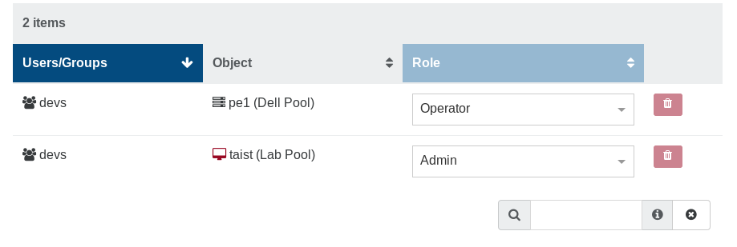

# Users

:::tip
For system users (in XOA), please refer to [XOA section](xoa.md). Here, we are only talking about users in Xen Orchestra application
:::

There are 2 types of XO users:

- **admins**, with all rights on all connected resources
- **users**, with no rights by default

## Authentication

Xen Orchestra supports various types of user authentication, internal or even external thanks to the usage of the [Passport library](http://passportjs.org/).

:::tip
Any account created by an external authentication process (LDAP, SSO...) will be a **user** without any permission.
Also, you don't have to create an external user by yourself: it will be created automatically in Xen Orchestra after its first connection.
:::

### Built-in

This is the default method. Creating a user is very simple:

1. Go into the Settings view, select "Users"
2. You can create a _user_ or an _admin_, with their password (or generate one)


By default, a _user_ won't have any permissions. At the opposite, an _admin_ will have all rights.

### LDAP

XO currently supports connections to LDAP directories, like _Open LDAP_ or _Active Directory_.

1. **Access the Plugin**:
   1. Navigate to the **Settings → Plugins** screen.
   2. Locate the **auth-ldap plugin** by scrolling or using the search bar.

2. **Configure LDAP Settings**:
   1. Click **+** button for the LDAP plugin.\
   A list of settings appears: 
   2. Fill in the required fields based on your LDAP server details.

3. **Save and Activate**:
    1. Click **Save configuration**. 
    2. To check if the plugin is activated, activate the toggle switch next to the **auth-ldap** plugin name.\
    The switch should now appear green.

#### Common LDAP Filters

LDAP Filters allow you to properly match your user. Finding the right filter is no easy task, and it entirely depends on your LDAP configuration.

Still, here is a list of common filters:

- `'(uid={{name}})'` is usually the default filter for _Open LDAP_.
- `'(cn={{name}})'`, `'(sAMAccountName={{name}})'`, `'(sAMAccountName={{name}}@<domain>)'` or even `'(userPrincipalName={{name}})'` are widely used for _Active Directory_.\
 Please check with your AD Admin to find the right one.

Once configured, users can authenticate using their LDAP credentials. Upon a successful initial login, the user's account will appear in the XO user list.

#### Group Synchronization

The LDAP plugin allows for the synchronization of user groups. 

1. **Access group synchronization settings**

    To configure the synchronization:
    1. Go to the  **Synchronize groups** section.
    2. Check the box called **Fill information (optional)**.\
    A list of text fields appear.
    3. Fill out the fields according to the picture below:


2. **Basic group settings**:
   - **Base** and **Filter**: Similar to the user configuration. The plugin needs an entry point in the directory and a filter to find the groups.
   - **ID attribute**: The attribute used by the plugin to uniquely identify each group. The ID attribute must be unique across groups and not change over time.\
   On each synchronization, the plugin will compare LDAP groups with XO groups, then try to match them based on this attribute and create or update XO groups if necessary.
   - **Display name attribute**: Set the attribute used as the group's name in Xen Orchestra.

3. **Members mapping**: 

This part of the configuration is used to determine which LDAP users belong to which LDAP groups. 

For example, here's an LDAP directory:

**User:**

```
objectClass: Person
cn: Bruce Wayne
uid: 347
...
```

**Group:**

```
objectClass: Group
cn: heroes
displayName: Heroes
gid: 456
member: 347
member: 348
...
```

The plugin needs to know that Bruce Wayne is part of the **heroes** group. To do so, you need to set 2 entries in the configuration:

- **Group attribute**: the name of the _group_ attribute that is used to list users within a group. In this example, it would be `member`.
- **User attribute**: the name of the _user_ attribute that is used to reference users in groups. In this example, it would be `uid` since `347`, `348`, etc. are user `uid`s.

Save the configuration and you're good to go. From now on, every time an LDAP user logs into XO, the plugin will automatically create or update that user's groups and add them to those groups. 

**Importing all groups manually**

If you need to import all the groups at once, you can do so from **Settings → Groups → Synchronize LDAP Groups**.\
This can be useful if you want to assign ACLs on groups without having to wait for a member of the group to log in.

:::tip
Importing the groups won't import their members. Users will still be imported one by one when they log in for the first time.
:::

:::tip
To find the LDAP users, enter this filter in the users table: `authProviders:ldap?`.
:::

#### Troubleshooting

If users can authenticate but group memberships are not reflected:

1. Verify Your **Group Filter**

Check if your LDAP group filter is too restrictive. By default, the filter should match all relevant groups.

Example of a broad filter:
```text
(objectclass=posixGroup)
```
If you are using a more specific filter, ensure that it correctly matches your intended groups. For instance, if you only sync a specific group, it may look like this:
```text
(&(objectclass=posixGroup)(cn=group1))
```
This filter will **only** synchronize `group1`. To sync all groups, remove the `(cn=group1)` condition.

2. Verify that the **Group Attribute** and **User Attribute** in the plugin configuration match the corresponding attributes in your LDAP directory.
3. Ensure that the **ID Attribute** for both users and groups is unique and correctly specified.
4. Check XO logs for any synchronization errors and adjust configurations accordingly.

### OpenID Connect

#### Overview

The OpenID Connect (OIDC) plugin (`auth-oidc`) allows Xen Orchestra to integrate with identity providers that support the OIDC protocol.

In this section, you'll learn:

- how users can log in with OpenID Connect
- how administrators can configure the plugin to suit their needs

#### Prerequisites

- Make sure your identity provider supports OpenID Connect.

#### User Workflow

##### Log In with OpenID Connect

On the Xen Orchestra login page, click **Sign in with OpenID Connect**


You’ll be redirected to the login page of your internal portal. Once authentificated on it, you will be redirected to the Xen Orchestra home page.

#### Administrator Guide

##### Set Up the OpenID Connect Plugin

You can set up the `auth-oidc` plugin directly in Xen Orchestra:

1. Go to **Settings** → **Plugins**.
2. Find the `auth-oidc` plugin in the list.
3. Click **+** next to the plugin name to expand the configuration options.


##### Required Configuration

Fill in the mandatory fields. You can also specify the auto-discovery URL, if needed.

##### Advanced Configuration (Optional)

To access advanced options:

1. Check **Fill information (optional)** to reveal additional fields.
2. Complete the fields as needed.

##### Save and Activate the Plugin

1. Once everything is configured, click **Save configuration**.
2. Toggle the switch next to the `auth-oidc` plugin name to enable it. This will:
   - Activate the plugin immediately.
   - Ensure it loads automatically when the Xen Orchestra server restarts.

### SAML

This plugin allows SAML users to authenticate to Xen-Orchestra.

The first time a user signs in, XO will create a new XO user with the same identifier.

#### Configuration

In the "Settings" then "Plugins" view, expand the SAML plugin configuration. Then provide the needed fields:


Save the configuration and then activate the plugin (button on top).

#### Vendor specific

##### Google Workspace - SAML [support.google.com](https://support.google.com/a/answer/6087519?hl=en#zippy=)

Use the screenshots below as a reference as how to setup SAML with Google Workspace.

1. Sign in to your [Google Workspace Admin Dashboard](https://admin.google.com).
2. Go to **Apps/Web and mobile apps**
3. Click **Add app** and select **Add custom SAML app**.
4. Give your app a name and optionally a description.
5. To see how the fields should be filled out, refer to the screenshots below.

> Note: Right now even when the authorization is successfull, you will be redirected to the `https://xo.company.net/signin` page. However, just browse directly into the bare URL `https://xo.company.net`, and you'll now be logged in and can use the XO-dashboard.

> If you get a certificate error. Try to add a newline at the bottom of the Certificate field in Xen Orchestra.

The first login will create the user inside XO, as a non-privileged user. An administrator then has to promote the user to the apropriate group. (XO: Settings/Users).


Also make sure to adjust the SAML attribute mapping in the Google Workspace configuration. (Primary email -> email)


### GitHub

This plugin allows any GitHub user to authenticate to Xen Orchestra.

The first time a user signs in, XO will create a new XO user with the same identifier (i.e. GitHub name), with _user_ permissions. An existing admin will need to apply the appropriate permissions for your environment.

First you need to configure a new app in your GitHub account. Go to your Github settings > "Developer Settings" > "OAuth Apps" > "New OAuth App".

1. Name your GitHub application under "Application Name".
2. Enter your Xen Orchestra URL (or IP) under "Homepage URL"
3. Add your "Authorization callback URL" (for example, https://homepageUrl/signin/github/callback)


When you get your Client ID and your Client secret, you can configure them in the GitHub Plugin inside the "Settings/Plugins" view of Xen Orchestra.


Be sure to activate the plugin after you save the configuration (button on top). When it's done, you'll see a link in the login view, this is where you'll go to authenticate:


### Google

This plugin allows Google users to authenticate to Xen-Orchestra.

The first time a user signs in, XO will create a new XO user with the same identifier, without any permissions.

#### Creating the Google project

Go to Google's [Credentials page](https://console.developers.google.com/apis/credentials) and create a new project:


Configure an OAuth consent screen if requested then create OAuth 2.0 credentials:


Get your client ID and client secret:


#### Configure the XO plugin

In Settings, then Plugins, expand the Google plugin details and configure it with the information from the Google Console:


Be sure to activate the plugin after you save the configuration (button on top).

You can now connect with your Google account in the login page.

## ACLs

:::tip
ACLs are permissions that apply to pre-existing objects. Only a super admin (XO administrator) can create objects.
:::

ACLs are the permissions for your users or groups. The ACLs view can be accessed in the "Settings" panel.

1. Select the user or group you want to apply permissions on
2. Select the object on which the permission will apply
3. Choose the role for this ACL
4. Click on "Create"


:::tip
You can click to add multiple objects at the same time!
:::

Your ACL is now available in the right list:



You can edit/remove existing ACLs here.

### Roles

There are 3 different roles for your users:

- Admin
- Operator
- Viewer

#### Admin

An object admin can do everything on it, even destroy it. E.g with its admin VM:

- remove it
- migrate it (to a host with admin permission on it)
- modify the VM resources, name and description
- clone it
- copy it
- convert it into a template
- snapshot it (even revert from a snapshot)
- export it
- attach/add visible disks
- same for network cards

#### Operator

An operator can make everyday operations on assigned objects. E.g on a VM:

- eject a CD
- insert a CD (if he can view the ISO storage repository)
- start, restart, shutdown, suspend/resume it

All other operations are forbidden.

#### Viewer

A viewer can only see the VM state and its metrics. That's all!

### Inheritance

Objects have a hierarchy: a Pool contains all its hosts, containing itself all its VMs.

If you give a _view_ permission to a user (or a group) on a pool, he will automatically see all the objects inside this pool (SRs, hosts, VMs).

### Examples

#### Allow a user to install an OS

If the OS install needs an ISO, you need to give this user 2 permissions:

- _Operate_ on the VM (e.g to start it)
- _View_ on the ISO Storage containing the needed ISO.

## Self-service portal

The self-service feature allows users to create new VMs. This is different from delegating existing resources (VM's) to them, and it leads to a lot of possibilities.

### Set of resources

To create a new set of resources to delegate, go to the "Self Service" section in the main menu:


#### Create a set

:::tip
Only an admin can create a set of resources
:::

To allow people to create VMs as they want, we need to give them a _part_ of your XCP-ng/XenServer resources (disk space, CPUs, RAM). You can call this "general quotas" if you like. But you first need to decide which resources will be used.

In this example below, we'll create a set called **"sandbox"** with:

- "devs" is the group that can use this set (all users in the group)
- "Lab Pool" is the pool where they can play
- "Debian 8 Cloud Ready" is the only template they can use
- "SSD NFS" is the only SR where they can create VMs
- "Pool-wide network with eth0" is the only available network for them


As you can see, only compatible hosts are shown and can be used for this resource set (hosts in another pool aren't shown). This way, you can be sure to have resources free for tasks other than self-service.

:::tip
Don't forget to add an ISO SR to allow your users to install VMs with CD if necessary
:::

##### Quotas

Then, you can define quotas on this set:

- max vCPUs
- max RAM
- max disk usage

:::tip
Replicated VMs and snapshots created by a backup job don't use quotas.
:::

:::tip
A snapshot of a Self Service VM will use as much resources as a VM would. You can disable this by setting `ignoreVmSnapshotResources` to `true` in the `selfService` section of `xo-server`'s config.
:::

When you click on create, you can see the resource set and remove or edit it:


### Usage (user side)

As soon as a user is granted a resource set, it displays a new button in their main view: "new".


Now, the user can create a VM with only the resources granted in the set:


And the recap before creation:


If the "Create" button is disabled, it means the user requested more resources than available.

Finally, if a user has been granted access to multiple resource sets, they can be switched in the top right of the screen.

### Toward the Cloud

Self-service is a major step in the Cloud. Combine it with our [Cloudinit compatible VM creation](advanced.md#cloud-init) for a full experience:

- create a Cloud ready template
- create a set and put Cloud templates inside
- delegate this set to a group of users

Now, your authorized users can create VMs with their SSH keys, grow template disks if needed, etc. Everything is inside a "sandbox" (the resource set) you defined earlier!


## Audit log

XO Audit Log is a plugin that records all important actions performed by users and provides the administrators an overview of each action. This gives them an idea of the users behavior regarding their infrastructure in order to track suspicious activities.

### How does it work?

XO Audit Log listens to important actions performed by users and stores them in the XOA database using the [hash chain structure](https://en.wikipedia.org/wiki/Hash_chain).

### Trustability of the records

Stored records are secured by:

- structure: records are chained using the hash chain structure which means that each record is linked to its parent in a cryptographically secure way. This structure prevents the alteration of old records.

- hash upload: the hash chain structure has limits, it does not protect from the rewrite of recent/all records. To reduce this risk, the Audit log plugin regularly uploads the last record hash to our database after checking the integrity of the whole record chain. This functionality keeps the records safe by notifying users in case of alteration of the records.

### Configuration

The recording of the users' actions is disabled by default. To enable it:

1. go into `settings/plugins`
2. expand the `audit` configuration
3. toggle active and save the configuration


Now, the audit plugin will record users' actions and upload the last record in the chain every day at **06:00 AM (UTC)**.

## Debugging

If you can't log in, please [check the logs of `xo-server`](https://xen-orchestra.com/docs/troubleshooting.html#logs).
