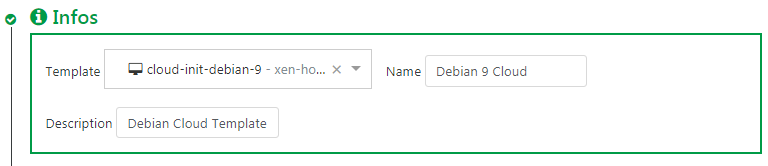
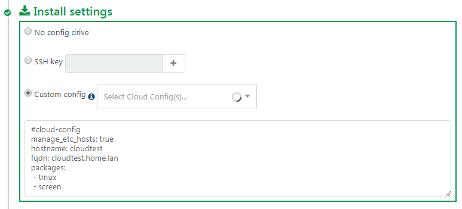
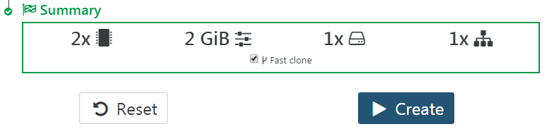

# VM Templates

Virtual machine templates in Xen Orchestra make it easy to deploy new VMs by providing a ready-to-use configuration with predefined hardware specs and settings. Instead of manually setting up each VM from scratch, you can use templates to speed up deployment and keep things consistent.


## Creating Templates

There are a few ways to create a VM template in Xen Orchestra:

### From an Existing VM

Set up a VM with your preferred OS and settings, then convert it into a template.

:::warning
Once you convert a VM into a template, it won’t show up in the VM list anymore—this change is permanent.
:::

1. Select your VM and go to the **Advanced** tab.
2. Click **Convert to template**, then confirm.


### Clone an Existing Template

Duplicate one of the built-in templates and customize it to match your needs.

1. Go to **Home → Templates**.
2. Check the box next to the template(s) you want to copy.
3. Click the **Copy button** in the header.
4. Fill out the details in the dialog box.


### Create a VM and Convert It

Set up a new VM (without installing an OS), adjust its hardware settings, and turn it into a template. This is useful if you just want a predefined hardware setup without an OS baked in.

To know more on VM creation, read the [Infrastructure Management → VM Creation](./manage_infrastructure#vm-creation) section.

## Viewing Template Properties

### From Xen Orchestra

To check a template’s settings in Xen Orchestra:

1. Head to the **Home → Templates** section.
2. Check the box next to the template(s) you want to inspect.
3. Click the hamburger button at the corresponding line to see details like CPU, RAM, and template tags.


### From the REST API

If you need more technical details that aren’t shown in the UI, you can use the Xen Orchestra API to dig deeper.

To know more on the REST API, read [its documentation](https://github.com/vatesfr/xen-orchestra/blob/master/packages/xo-server/docs/rest-api.md).

All collections are listed when you run `GET /rest/v0`, including the `vm-templates` collection:


### From the CLI

You can also use the CLI tools to dig deeper.

For example, if your template is named `My Debian Template`, you can get its details in the CLI like this:

```sh
xe template-list name-label="My Debian Template"
uuid=$(xe template-list name-label="My Debian Template" --minimal)
xe template-param-list uuid=$uuid | less
```

## Deleting a Template

Need to delete a template? Here’s how:

:::warning
Before deleting a template, make sure to find and remove any attached disks. Otherwise, you'll end up with orphaned VDIs.
:::

1. In Xen Orchestra, open the template, go to **Home → Templates** section.
2. Check the box next to the template(s) you want to copy.
3. Click the trash can icon in the header and confirm the deletion.

## Viridian extensions

VMs include a parameter to enable Viridian extensions.

### What is Viridian?

Viridian is a codename for [Hyper-V](https://learn.microsoft.com/en-us/windows-server/virtualization/hyper-v/hyper-v-overview), a native hypervisor developed by Microsoft that allows the creation of virtual machines on x86-64 systems running Windows.

Viridian extensions —referred to as "Viridian enlightenments" by Microsoft— are used by any "recent" Windows OS to work properly. Consequently, the Viridian setting in Xen Orchestra is typically enabled by default for all Windows templates from Windows 2012 onwards.

### Step-by-step guide

:::warning
We strongly advise to create Windows templates by starting from a built-in Windows template, as the Viridian setting in Xen Orchestra is only relevant for those.
:::

#### Templates based on built-in Windows templates

To find and enable the Viridian setting for your template:

1. Navigate to the **Home → VMs** menu.\
A list of VMs appears.
2. Choose your VM from the list and click its name.\
The VM details screen appears.
3. Click the **Advanced** tab to show more settings for your VM.
4. In the **Xen settings** section, scroll to the end and activate the **Viridian** toggle switch:
   
   Viridian extensions are now enabled for your VM. You can now safely use this VM to create your Windows template.

#### Enabling Viridian for other non-Windows VM templates

To enable Viridian enlightenments for other non-Windows VM templates, follow the instructions detailed in the **Virtual Machines (VMs)** section of the [XCP-ng technical documentation](https://docs.xcp-ng.org/vms/).

## Cloud-init and Cloudbase-init

If you want VMs to set themselves up automatically after deployment, **Cloud-Init** (for Linux) and **Cloudbase-Init** (for Windows) can help.

### Cloud-init

Cloud-init is a program that handles the early initialization of a cloud instance of Linux.
In other words, on a "Cloud-init-ready" VM template, you can pass a lot of data at first boot, such as:

- Set the host name
- Add SSH keys
- Automatically grow the file system
- Create users
- And a lot more!

This tool is pretty standard and used everywhere. A lot of existing cloud templates use it.

This means that you can easily customize your VM when you create it from a compatible template. It brings you closer to the "instance" principle like in Amazon Cloud or OpenStack.

### Cloudbase-init (Windows)

As of release 5.101, Xen Orchestra also supports Cloudbase-init. This tool provides equivalent functionality to Cloud-init but is specifically designed for Windows virtual machines.

### Requirements

You only need to use a template of a VM with Cloud-init (for Linux VMs) or Cloudbase-init (for Windows VMs) installed inside it.
[Check this blog post to learn how to install CloudInit](https://xen-orchestra.com/blog/centos-cloud-template-for-xenserver/).

:::tip
In XOA 5.31, we changed the Cloud-init config drive type from [OpenStack](https://cloudinit.readthedocs.io/en/latest/topics/datasources/configdrive.html) to the [NoCloud](https://cloudinit.readthedocs.io/en/latest/topics/datasources/nocloud.html) type. This will allow us to pass network configuration to VMs in the future. For 99% of users, including default cloud-init installs, this change will have no effect. However if you have previously modified your cloud-init installation in a VM template to only look for `openstack` drive types (for instance with the `datasource_list` setting in `/etc/cloud/cloud.cfg`) you need to modify it to also look for `nocloud`.
:::

### Example: How to create a Cloudbase-init template with Windows Server?

Refer to the [Windows Templates with Cloudbase-init: Step-by-step Guide & Best Practices](./windows-templates) document for complete instructions.

### Example: How to create a Cloud-init template with Ubuntu 22.04 LTS?

1. Create a VM with e.g. 2 CPU, 8 GiB of RAM, 10 GiB of disk space, and install Ubuntu 22.04 LTS on it.
2. Upon reboot, `apt update` and `apt upgrade` the machine.
3. Install the [Guest Tools](https://docs.xcp-ng.org/vms/#%EF%B8%8F-guest-tools).
4. Install the "cloud-initramfs-growroot" so that the VM can apply a Cloud Config:
   ```sh
   sudo apt install cloud-initramfs-growroot
   ```
5. Run the command `sudo cloud-init clean`.
6. Clear out the machine-id so it can be regenerated when the template is used:
   ```sh
   sudo truncate -s 0 /etc/machine-id /var/lib/dbus/machine-id
   ```
7. Shutdown the VM and create a template from that image.

### Usage

First, select your compatible template (CloudInit ready) and name it:



Then, activate the config drive and insert your SSH key. Or you can also use a custom CloudInit configuration:



> CloudInit configuration examples are [available here](http://cloudinit.readthedocs.org/en/latest/topics/examples.html).

You can extend the disk size (**in this case, the template disk was 8 GiB originally**). We'll extend it to 20GiB:


Finally, create the VM:



Now start the VM and SSH to its IP:

- **the system has the right VM hostname** (from VM name)
- you don't need to use a password to access it (thanks to your SSH key):

```console
$ ssh centos@192.168.100.226
[centos@tmp-app1 ~]$
```

The default `cloud-init` configuration can allow you to be to be a sudoer directly:

```console
[centos@tmp-app1 ~]$ sudo -s
[root@tmp-app1 centos]#
```

Check the root file system size: indeed, **it was automatically increased** to what you need:

```console
[centos@tmp-app1 ~]$ df -h
/dev/xvda1          20G    1,2G   18G   6% /
```
