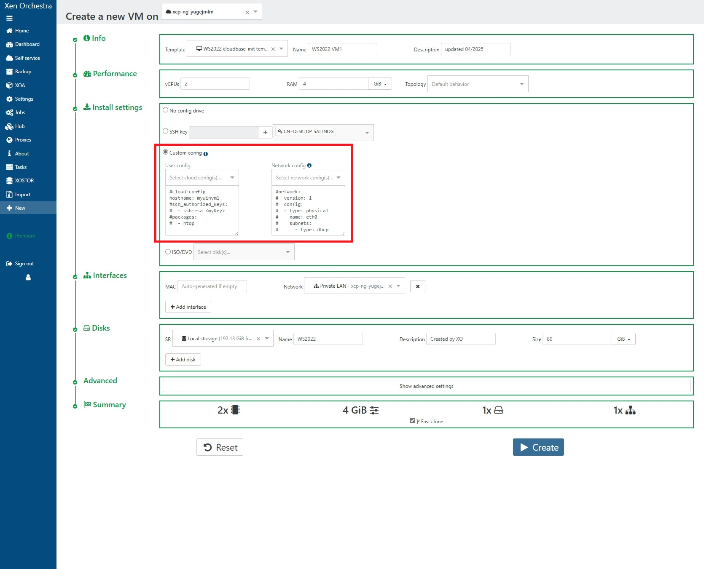

# Windows Templates with Cloudbase-init: Step-by-step Guide & Best Practices

In this guide, we provide a basic step-by-step guide for creating Windows templates with cloud-init support using [Cloudbase-init](https://cloudbase.it/cloudbase-init/).
With these templates, you can specify numerous system settings (hostname, users, password, etc.) without having to configure each VM manually.
Read the [online documentation](https://cloudbase-init.readthedocs.io/en/latest/index.html) for more details on how to use Cloudbase-init.

In short, you will maintain a *master VM* containing a fresh, up-to-date copy of Windows.
From this master VM, you can branch out *template VMs* and customize them with drivers, tooling and settings as desired.
Finally, these template VMs will be generalized with Sysprep and converted into templates that can be used for VM creation.
You will find an overview diagram below:


Following is a list of steps for preparing a Windows template:

1. Create and install master VM (for Windows Update)
2. Branch out master VM to template VM
3. Install software in template VM
4. Sysprep and reseal; template creation
5. Instantiate new VM

:::tip
**Why use a master VM?**

- Windows installed from older media may take a very long time to catch up with updates (especially in the case of Server 2016).
- Creating VMs from a recently-updated template also reduces the time and resources needed to bring each new VM up to date.
- Many different kinds of template VMs can be branched from the same master, saving time and effort.
- Note that you don't need to produce a new template every time you update Windows.
  Instead, consider your VM update policy and refresh your templates as necessary.
- If you don't expect to have multiple different kinds of templates, feel free to install software directly onto your master VM.
  Every time you want to refresh your template, simply clone your master then run Sysprep.
:::

## Installing master VM

Create a Windows VM using the included default templates for Windows, then install Windows as usual.
However, at the initial Welcome screen after Windows starts up, we will enter Audit mode by pressing **Ctrl+Shift+F3**.

:::tip
Our guide uses Windows Server 2022, however any supported version of Windows would also work.
:::

:::tip
We highly recommend starting from the default Windows templates, as they contain optimal settings for Windows guests.
Use at least 4 vCPUs and 4 GB of RAM to ensure that the update process goes smoothly.
:::

:::tip
Audit mode is a special Windows boot mode that skips customizations normally applied after Setup
Using Audit mode helps avoid certain Sysprep issues, especially with Store apps.
:::


*Master VM: Press Ctrl+Shift+F3 here to enter Audit mode.*

Windows will automatically restart, and you will be presented with the Sysprep GUI as follows.


*Master VM: Windows in Audit mode*

:::warning
Keep this Sysprep window open throughout the entire Audit mode up until you manually invoke Sysprep.exe.
If you close the Sysprep window by accident, you may get locked out and be forced to reboot.
:::

Now, you can keep your master VM up-to-date using Windows Updates in preparation for future templates.

## Branching out template VM

Every time you want to refresh your templates, copy your master VM into a new *template VM*.
As its name indicated, this VM will become your new Windows template for future production VMs.

:::tip
Use a full VM copy (*Copy* button) to avoid having too many VM disk layers, which may degrade performance.
:::


## Installing software in template

You can install any software you need in this template.
In this example, we install the XenServer VM Tools:


You can freely restart the VM when prompted.
Once restarted, the VM will go back to Audit mode until you run Sysprep again.

## Configure Cloudbase-init

Grab the latest installer from [cloudbase.it](https://cloudbase.it/cloudbase-init/) and start the installation process.


Don't run Sysprep at this step yet; you still need to configure Cloudbase-init.


Enter the directory `C:\Program Files\Cloudbase Solutions\Cloudbase-Init\conf`.
You will find the following two files: `cloudbase-init.conf` and `cloudbase-init-unattend.conf`.
For each file, replace any `metadata_services` lines with the following:

```
metadata_services=cloudbaseinit.metadata.services.nocloudservice.NoCloudConfigDriveService
```

This line makes sure Cloudbase-init uses the NoCloud configuration drive (as generated by XO) as its data source.


Your VM is now ready for conversion to template.

## Sysprep and reseal

Close the running Sysprep window, then run the following command in a PowerShell window running as Administrator:

```
C:\Windows\System32\Sysprep\sysprep.exe /generalize /oobe /shutdown "/unattend:C:\Program Files\Cloudbase Solutions\Cloudbase-Init\conf\Unattend.xml"
```

:::warning
- You must specify Cloudbase-init's Unattend.xml since this file is what starts the cloud-init configuration process.
- The Unattend parameter should be fully quoted because the Unattend.xml path contains spaces.
:::

Once the Sysprep process is complete, your template VM will shut itself down.


Finally, immediately convert your VM to a template; do not start it again or the cloud-init configuration process will begin.

## Instantiating new VMs

Create VMs from your prepared template and enter your cloud-init configs as necessary.



:::tip
Refer to the [Cloudbase-init plugins documentation](https://cloudbase-init.readthedocs.io/en/latest/plugins.html) for information on how to configure cloud-init for Windows guests.
:::

Your VMs will reboot several times during the unseal process.


Enjoy your finished product.


## Tips and tricks

- If you are Sysprepping an installation containing the XenServer/XCP-ng PV drivers, you may need to set the PersistAllDeviceInstalls option in your Unattend.xml. (Cloudbase-init's Unattend.xml already includes this option)
- Windows Server in Audit mode is not activated, and will automatically shut down after 1 hour. Be sure to either finish your work in 1 hour, or simply reboot before the timeout expires.
