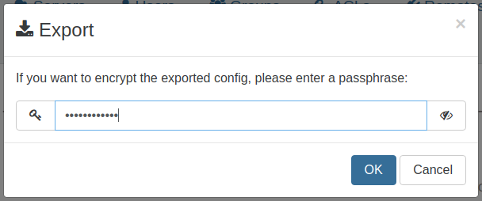
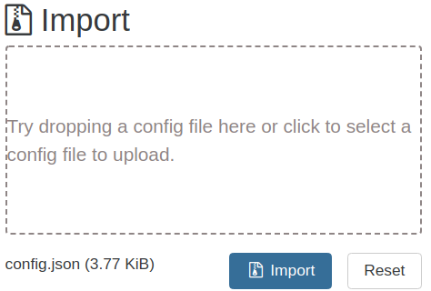

# Migrate to new XOA

### Deploy new appliance

First step, you have to deploy a new appliance. All needed information is [here](installation.md)

### Export configuration

To export your current configuration, navigate to **Settings** -> **Config**.
Here you will see a button labeled **_Download current config_**. Click on it, then an export modal will appear.

You can set a passphrase to encrypt the exported configuration.

### Import configuration

Now it's time to import your configuration to the new appliance.
Go to the **Settings** -> **Config** page of your new appliance. Here you have an **_import_** section where you can drag and drop your exported configuration file.

When your configuration is loaded, click to import. A new modal will appear to ask you the passphrase to decrypt your configuration. If you didn't set a passphrase when you exported your configuration, leave it empty.

### Advanced users

If you made custom adjustments to the `/etc/xo-server` config file on your previous appliance, unfortunately you will have to recreate these modifications on the new appliance.
