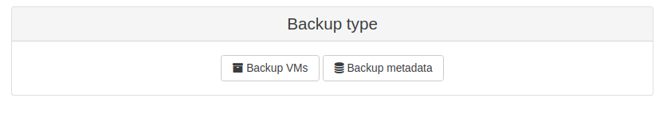
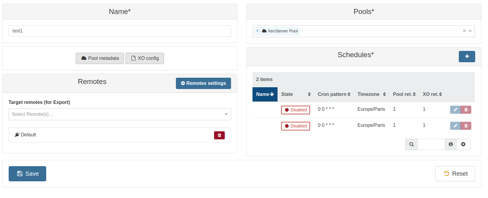
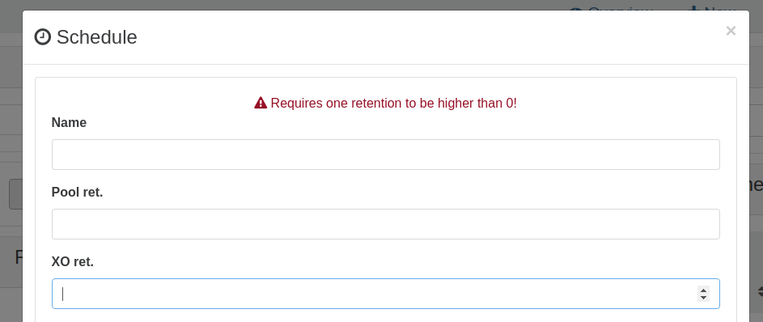
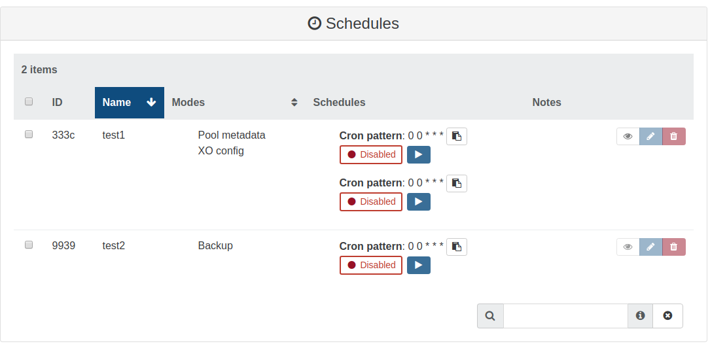
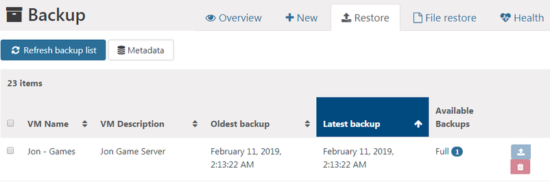
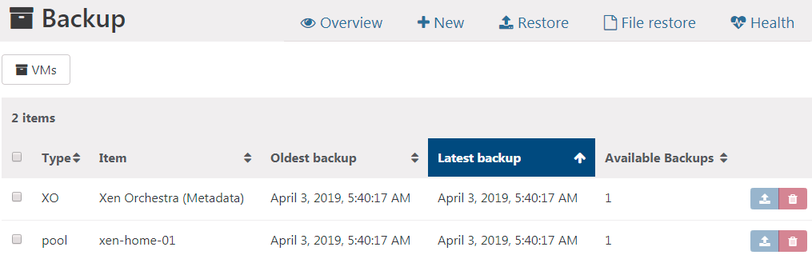
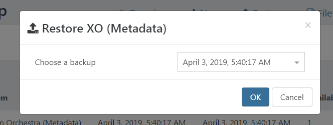

# Metadata backup

XCP-ng and Citrix Hypervisor (Xenserver) hosts use a database to store metadata about VMs and their associated resources such as storage and networking. Metadata forms this complete view of all VMs available on your pool. Backing up the metadata of your pool allows you to recover from a physical hardware failure scenario in which you lose your hosts without losing your storage (SAN, NAS...).

In Xen Orchestra, Metadata backup is divided into two different options:

- **Pool metadata backup** - Backup metadata of your physical XCP-ng host: VMs, storage repositories, networks, etc.
- **XO configuration backup:** - Backup metadata of your Xen Orchestra instance: Users, authorizations and ressource sets, backup job settings, hosts and plugin settings, etc.

## Performing a backup

In the backup job section, when creating a new backup job, you will now have a choice between backing up VMs and backing up Metadata:

When you select Metadata backup, you will have a new backup job screen, letting you choose between a pool metadata backup and an XO configuration backup (or both at the same time):

Define the name and retention for the job.

Once created, the job is displayed with the other classic jobs.

## Performing a restore

:::warning
Restoring pool metadata completely overwrites the XAPI database of a host. Only perform a metadata restore if it is a new server with nothing running on it (eg replacing a host with new hardware).
:::

:::warning
**The XAPI version of the target host must match the one the backup was taken from.** If it
does not, the restore is refused with `RESTORE_INCOMPATIBLE_VERSION` and no data is written.
This matters most in the situation the feature exists for: rebuilding a host after a failure,
where a fresh install from the current ISO is usually several XAPI releases ahead of the
backup.

The backup itself records the version it was taken from, in its `XAPI_Build` field.

To restore onto a rebuilt host:

1. Reinstall XCP-ng.
2. Bring the host to the XAPI level the backup was taken at. If the backup is at the XAPI
   version shipped with the original release of your XCP-ng version, the freshly installed
   host is already at that level and no extra step is needed. Otherwise, install the specific
   updates for that level.
3. Restore the pool metadata.
4. Patch the host to apply the remaining updates.
:::

If you browse to the Backup NG Restore panel, you will now notice a Metadata filter button:

If you click this button, it will show you Metadata backups available for restore:

You can see both our Xen Orchestra config backup, and our pool metadata backup. To restore one, simply click the blue restore arrow, choose a backup date to restore, and click OK:

That's it!
