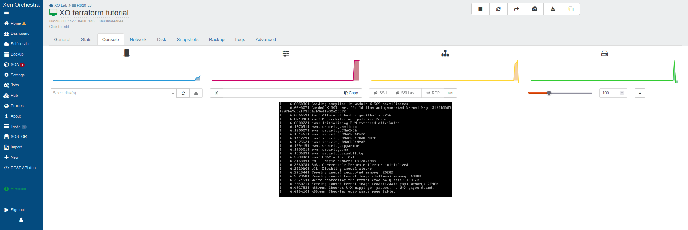
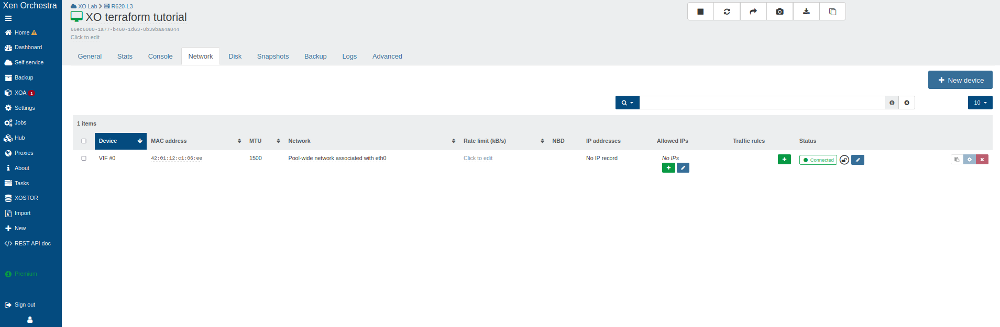

# Terraform provider

## Introduction

Managing infrastructure manually often leads to errors and complexity. With Infrastructure as Code (IaC), we describe our infrastructure in configuration files to make it **predictable**, **reproducible**, and **version-controlled**. 
This tutorial will guide you through using **Terraform** or **OpenTofu**, the leading IaC tools, to automate the deployment and updating of your **VMs** on **Xen Orchestra**.

:::note
This guide works with both **Terraform** and **OpenTofu**. OpenTofu is a community-driven fork of Terraform that maintains compatibility.
:::

:::tip
Terraform’s two-step workflow (`plan` then `apply`) gives you full control. You can preview all changes before applying them, ensuring safe and predictable deployments while saving time and effort.
:::

## Launching Virtual Machines in XO with Terraform

In this guide, we’ll walk you step-by-step through using `Terraform` to launch a virtual machine (VM) on your Xen Orchestra (XO) instance, and then show you how to modify it easily.

:::note 
*Before starting, make sure you have a running **Xen Orchestra** instance connected to an **XCP-ng** pool.*
:::

**Here are the 4 main steps we’ll follow:**

1. Install Terraform
2. Create a VM template
3. Provision the VM with Terraform
4. Add an additional network interface to the VM

:::tip
The code used in this tutorial can be found on [GitHub](https://github.com/vatesfr/terraform-provider-xenorchestra), but we’ll write it from scratch step by step.
:::

### Installing Terraform

If you haven’t installed Terraform yet, start by following the [official Hashicorp tutorial](https://developer.hashicorp.com/terraform/install) to install it on your system.

:::info
**Required Version**: This tutorial requires Terraform `1.13.1` or newer, or OpenTofu `1.10.0` or newer.
:::

### Using VM Templates in Xen Orchestra

Terraform needs a starting point to create a VM: a `template` that already contains an installed operating system with **cloud-init** capabilities (or **Cloudbase-init** for Windows), as well as **Xen/Guest Tools** for better integration with Xen Orchestra. This setup enables automatic customization during deployment and simplifies VM management, including IP assignment and hostname configuration.

:::info
We recommend using pre-built templates from the **XOA Hub** for optimal results:
- **Debian 13** (with cloud-init)
- **Ubuntu 22.04/24.04** (with cloud-init)
- **etc.**

For more information about templates:
- [Creating VM Templates](https://docs.xen-orchestra.com/vm-templates#creating-templates)
- [Cloud-init and Cloudbase-init](https://docs.xen-orchestra.com/vm-templates#cloud-init-and-cloudbase-init)
- [Windows Templates with Cloudbase-init](https://xen-orchestra.com/blog/windows-templates-with-cloudbase-init-step-by-step-guide-best-practices/)
:::

### Provisioning Your VM with Terraform

Now that Terraform is installed and your environment has a VM template ready, let’s start writing the configuration files that describe our infrastructure.

We will now create the configuration files that describe our infrastructure.

1. **Configure the Provider**

    The first step is to tell Terraform to communicate with Xen Orchestra by declaring the **official provider**. Create a file named `provider.tf` and add the following code.

    :::info
    **Provider Version**: This tutorial uses version `~> 0.35` of the Xen Orchestra provider. Check the [official provider documentation](https://registry.terraform.io/providers/vatesfr/xenorchestra/latest) for the latest version and release notes.
    :::

    ```tf
    # provider.tf
    terraform {
        required_providers {
            xenorchestra = {
                source  = "vatesfr/xenorchestra"
                version = "~> 0.35"
            }
        }
    }
    ```

    This code tells Terraform to download [Xen Orchestra Terraform provider](https://github.com/vatesfr/terraform-provider-xenorchestra) from the [official Terraform registry](https://registry.terraform.io/providers/vatesfr/xenorchestra/latest).

    Next, open your terminal in this folder and run `terraform init`. This command reads your configuration, downloads the Xen Orchestra provider, and sets up your working environment. 

    You should see output confirming successful initialization.

    ```bash
    william@william:~$ terraform init 
    Initializing the backend...
    Initializing provider plugins...
    - Finding vatesfr/xenorchestra versions matching "~> 0.35"...
    - Installing vatesfr/xenorchestra v0.35.1...
    - Installed vatesfr/xenorchestra v0.35.1 (self-signed, key ID 3084D82948625D89)
    Partner and community providers are signed by their developers.
    If you'd like to know more about provider signing, you can read about it here:
    https://developer.hashicorp.com/terraform/cli/plugins/signing
    Terraform has created a lock file .terraform.lock.hcl to record the provider
    selections it made above. Include this file in your version control repository
    so that Terraform can guarantee to make the same selections by default when
    you run "terraform init" in the future.

    Terraform has been successfully initialized!

    You may now begin working with Terraform. Try running "terraform plan" to see
    any changes that are required for your infrastructure. All Terraform commands
    should now work.

    If you ever set or change modules or backend configuration for Terraform,
    rerun this command to reinitialize your working directory. If you forget, other
    commands will detect it and remind you to do so if necessary.
    ```

2. **Handle Credentials Securely**

    To authenticate Terraform with your **Xen Orchestra API**, it needs credentials. 

    :::warning
    Never store passwords directly in your code. The recommended method is to use environment variables.
    :::

    - Create a file `~/.xoa` in your home directory with the following content.

        ```bash
        export XOA_URL=ws://hostname-of-your-deployment
        export XOA_USER=YOUR_USERNAME
        export XOA_PASSWORD=YOUR_PASSWORD
        ```
        Or using a token:

        ```bash
        export XOA_URL=ws://hostname-of-your-deployment
        export XOA_TOKEN=YOUR_TOKEN
        ```

    - Then, before running Terraform, load these variables into your terminal session.

        ```bash
        eval $(cat ~/.xoa)
        ```

    :::tip
    It’s also possible to use variables to configure authentication details.
    This can be useful in some cases, especially to avoid storing credentials in plain text.

    ```bash
    provider "xenorchestra" {
    # Must be ws or wss
    token = local.xoa_token         # or set the XOA_TOKEN environment variable
    url   = "ws://${local.xoa_url}" # or set the XOA_URL environment variable
    }
    ```
    :::

3. **Define Existing Resources (Data Sources)**

    Terraform needs to know about existing resources in XO (your pool, network, storage, etc.). For that, we use `data` blocks and read-only queries that fetch existing information. This avoids hardcoding technical identifiers (UUIDs, etc.) and makes your configuration more readable and portable.

    Create a file named `vm.tf` (or `data-source.tf`, as most people do) and add the following code, making sure to replace the `name_label` values with the exact names of your resources in Xen Orchestra (the names of your pool, network, storage repository, and VM template, respectively). 

    ```tf
    # vm.tf

    data "xenorchestra_pool" "pool" {
    name_label = "Main pool"
    }

    data "xenorchestra_template" "vm_template" {
    name_label = "Ubuntu 24.04 Cloud-Init"
    }

    data "xenorchestra_sr" "sr" {
    name_label = "ZFS"
    pool_id = data.xenorchestra_pool.pool.id
    }

    data "xenorchestra_network" "network" {
    name_label = "Pool-wide network"
    pool_id = data.xenorchestra_pool.pool.id
    }
    ```

    :::tip
    Using explicit `name_label` values is fine for this tutorial.  
    However, in real environments, it’s recommended to use **unique names** to prevent conflicts or misconfigurations when multiple resources share similar labels.  
    :::

4. **Verify Data Sources**

    At this stage, even before defining our VM, we can run `terraform plan` for the first time. This is an excellent practice to ensure that Terraform can successfully connect to Xen Orchestra and locate all the resources we have declared.

    ```bash
    william@william:~$ terraform plan
    data.xenorchestra_pool.pool: Reading...
    data.xenorchestra_template.vm_template: Reading...
    data.xenorchestra_pool.pool: Read complete after 0s [id=355ee47d-ff4c-4924-3db2-fd86ae629676]
    data.xenorchestra_network.network: Reading...
    data.xenorchestra_sr.sr: Reading...
    data.xenorchestra_network.network: Read complete after 0s [id=a12df741-f34f-7d05-f120-462f0ab39a48]
    data.xenorchestra_template.vm_template: Read complete after 0s [id=d0b0869b-2503-0c17-1e5e-3725f6eba342]
    data.xenorchestra_sr.sr: Read complete after 0s [id=86a9757d-9c05-9fe0-e79a-8243cb1f37f3]

    No changes. Your infrastructure matches the configuration.

    Terraform has compared your real infrastructure against your configuration and found no differences, so no changes are needed.
    ```

    The message `No changes. Infrastructure is up-to-date.` or `No changes. Your infrastructure matches the configuration.` is exactly what we’re expecting. It confirms that our data sources are correctly configured and that Terraform has successfully found the corresponding `pool`, `template`, `SR`, and `network`.

5. **Define the VM Resource**

    Now that Terraform knows where to find the template, storage, and network, we can finally define the VM we want to create.

    Add the following code block at the end of your `vm.tf` file, or create a new file named `resources.tf`.

    :::tip
    If your template uses multiple disks, be careful to declare the same number of disks in your VM resource, paying attention to the order. The disks must be at least the same size as those in the template.
    :::

    ```tf
    resource "xenorchestra_vm" "vm" {
    memory_max = 2147467264
    cpus = 1
    name_label = "XO terraform tutorial"
    template = data.xenorchestra_template.vm_template.id

    network {
        network_id = data.xenorchestra_network.network.id
    }

    disk {
        sr_id = data.xenorchestra_sr.sr.id
        name_label = "VM root volume"
        size = 50214207488
    }
    }
    ```

    This `resource` block describes the characteristics of the VM to be created : its `name`, `memory`, and `CPU`. It uses the information retrieved from the data sources to connect to the correct template, network, and storage.

    :::note 
    The code above uses the `.vm_template.id` and `.sr.id` references to match the data sources we defined, ensuring that the configuration works properly.
    :::

6. **Plan and Deploy the VM**

    It’s time to bring our VM to life !

    * Run `terraform plan`

        This command will analyze your code and show you what it’s about to do. The output will indicate that a new resource is going to be created.

        ```bash
        william@william:~$ terraform plan
        data.xenorchestra_pool.pool: Reading...
        data.xenorchestra_template.vm_template: Reading...
        data.xenorchestra_pool.pool: Read complete after 1s [id=355ee47d-ff4c-4924-3db2-fd86ae629676]
        data.xenorchestra_network.network: Reading...
        data.xenorchestra_sr.sr: Reading...
        data.xenorchestra_template.vm_template: Read complete after 1s [id=d0b0869b-2503-0c17-1e5e-3725f6eba342]
        data.xenorchestra_network.network: Read complete after 0s [id=a12df741-f34f-7d05-f120-462f0ab39a48]
        data.xenorchestra_sr.sr: Read complete after 0s [id=86a9757d-9c05-9fe0-e79a-8243cb1f37f3]

        Terraform used the selected providers to generate the following execution plan. Resource actions are indicated with the following
        symbols:
        + create

        Terraform will perform the following actions:

        # xenorchestra_vm.vm will be created
        + resource "xenorchestra_vm" "vm" {
            + auto_poweron                        = false
            + clone_type                          = "fast"
            + core_os                             = false
            + cpu_cap                             = 0
            + cpu_weight                          = 0
            + cpus                                = 1
            + destroy_cloud_config_vdi_after_boot = false
            + exp_nested_hvm                      = false
            + hvm_boot_firmware                   = "bios"
            + id                                  = (known after apply)
            + ipv4_addresses                      = (known after apply)
            + ipv6_addresses                      = (known after apply)
            + memory_max                          = 2147467264
            + memory_min                          = (known after apply)
            + name_label                          = "XO terraform tutorial"
            + power_state                         = "Running"
            + start_delay                         = 0
            + template                            = "d0b0869b-2503-0c17-1e5e-3725f6eba342"
            + vga                                 = "std"
            + videoram                            = 8

            + disk {
                + name_label = "VM root volume"
                + position   = (known after apply)
                + size       = 50214207488
                + sr_id      = "86a9757d-9c05-9fe0-e79a-8243cb1f37f3"
                + vbd_id     = (known after apply)
                + vdi_id     = (known after apply)
                }

            + network {
                + device         = (known after apply)
                + ipv4_addresses = (known after apply)
                + ipv6_addresses = (known after apply)
                + mac_address    = (known after apply)
                + network_id     = "a12df741-f34f-7d05-f120-462f0ab39a48"
                }
            }

        Plan: 1 to add, 0 to change, 0 to destroy.
        ```

    * Run `terraform apply`

        If the plan looks good to you, run this command to apply the changes. Terraform will ask for final confirmation, type `yes` and press `Enter`.

        ```bash
        william@william:~$ terraform apply 
        data.xenorchestra_template.vm_template: Reading...
        data.xenorchestra_pool.pool: Reading...
        data.xenorchestra_pool.pool: Read complete after 1s [id=355ee47d-ff4c-4924-3db2-fd86ae629676]
        data.xenorchestra_network.network: Reading...
        data.xenorchestra_sr.sr: Reading...
        data.xenorchestra_template.vm_template: Read complete after 1s [id=d0b0869b-2503-0c17-1e5e-3725f6eba342]
        data.xenorchestra_network.network: Read complete after 0s [id=a12df741-f34f-7d05-f120-462f0ab39a48]
        data.xenorchestra_sr.sr: Read complete after 0s [id=86a9757d-9c05-9fe0-e79a-8243cb1f37f3]

        Terraform used the selected providers to generate the following execution plan. Resource actions are indicated with the following
        symbols:
        + create

        Terraform will perform the following actions:

        # xenorchestra_vm.vm will be created
        + resource "xenorchestra_vm" "vm" {
            + auto_poweron                        = false
            + clone_type                          = "fast"
            + core_os                             = false
            + cpu_cap                             = 0
            + cpu_weight                          = 0
            + cpus                                = 1
            + destroy_cloud_config_vdi_after_boot = false
            + exp_nested_hvm                      = false
            + hvm_boot_firmware                   = "bios"
            + id                                  = (known after apply)
            + ipv4_addresses                      = (known after apply)
            + ipv6_addresses                      = (known after apply)
            + memory_max                          = 2147467264
            + memory_min                          = (known after apply)
            + name_label                          = "XO terraform tutorial"
            + power_state                         = "Running"
            + start_delay                         = 0
            + template                            = "d0b0869b-2503-0c17-1e5e-3725f6eba342"
            + vga                                 = "std"
            + videoram                            = 8

            + disk {
                + name_label = "VM root volume"
                + position   = (known after apply)
                + size       = 50214207488
                + sr_id      = "86a9757d-9c05-9fe0-e79a-8243cb1f37f3"
                + vbd_id     = (known after apply)
                + vdi_id     = (known after apply)
                }

            + network {
                + device         = (known after apply)
                + ipv4_addresses = (known after apply)
                + ipv6_addresses = (known after apply)
                + mac_address    = (known after apply)
                + network_id     = "a12df741-f34f-7d05-f120-462f0ab39a48"
                }
            }

        Plan: 1 to add, 0 to change, 0 to destroy.

        Do you want to perform these actions?
        Terraform will perform the actions described above.
        Only 'yes' will be accepted to approve.

        Enter a value: yes

        xenorchestra_vm.vm: Creating...
        xenorchestra_vm.vm: Still creating... [00m10s elapsed]
        xenorchestra_vm.vm: Creation complete after 17s [id=66ec6080-1a77-b460-1d63-8b39baa4a844]

        Apply complete! Resources: 1 added, 0 changed, 0 destroyed.
        ```

🚀🎉 Congratulations! Your VM is now deployed via Terraform on XO. 




Any future modifications to this VM can now be easily **reviewed** and **version-controlled**.

To demonstrate this, let’s imagine that this VM needs a second network interface. Let’s see how easily we can make that change.

### Updating an Existing Infrastructure

One of Terraform’s greatest advantages is its ability to manage changes throughout the entire lifecycle of your infrastructure.

Our goal is simple: to add a second network interface to the VM we just created.

To do this, simply modify the `resources.tf` file (or `vm.tf` if you combined everything) and add a second `network` block to your VM definition.

```tf
resource "xenorchestra_vm" "vm" {
  memory_max = 2147467264
  cpus = 1
  name_label = "XO terraform tutorial"
  template = data.xenorchestra_template.vm_template.id

  # First network interface
  network {
    network_id = data.xenorchestra_network.network.id
  }
  
  # Second network interface
  network {
    network_id = data.xenorchestra_network.network.id
  }

  disk {
    sr_id = data.xenorchestra_sr.sr.id
    name_label = "VM root volume"
    size = 50214207488
  }
}
```

Once the file is modified, the process of applying the change is exactly the same as for creation.

* Run `terraform plan`

    This time, the output will be different. Terraform has detected that the resource already exists and needs to be **modified**, not created. You’ll be able to see exactly which `network` block is going to be added.

    ```bash
    william@william:~$ terraform plan
    data.xenorchestra_pool.pool: Reading...
    data.xenorchestra_template.vm_template: Reading...
    data.xenorchestra_pool.pool: Read complete after 0s [id=355ee47d-ff4c-4924-3db2-fd86ae629676]
    data.xenorchestra_network.network: Reading...
    data.xenorchestra_sr.sr: Reading...
    data.xenorchestra_template.vm_template: Read complete after 0s [id=d0b0869b-2503-0c17-1e5e-3725f6eba342]
    data.xenorchestra_network.network: Read complete after 0s [id=a12df741-f34f-7d05-f120-462f0ab39a48]
    data.xenorchestra_sr.sr: Read complete after 0s [id=86a9757d-9c05-9fe0-e79a-8243cb1f37f3]
    xenorchestra_vm.vm: Refreshing state... [id=66ec6080-1a77-b460-1d63-8b39baa4a844]

    Terraform used the selected providers to generate the following execution plan. Resource actions are indicated with the following
    symbols:
    ~ update in-place

    Terraform will perform the following actions:

    # xenorchestra_vm.vm will be updated in-place
    ~ resource "xenorchestra_vm" "vm" {
            id                                  = "66ec6080-1a77-b460-1d63-8b39baa4a844"
            tags                                = []
            # (24 unchanged attributes hidden)

          disk {
                # (8 unchanged attributes hidden)
            }

        + network {
            + attached       = true
            + ipv4_addresses = (known after apply)
            + ipv6_addresses = (known after apply)
            + network_id     = "a12df741-f34f-7d05-f120-462f0ab39a48"
            }

            # (1 unchanged block hidden)
        }

    Plan: 0 to add, 1 to change, 0 to destroy.
    ```

* Run `terraform apply`

    Run the command to apply the change. After confirming with `yes`, Terraform will add the new network interface to your existing VM.
    
    ```bash
    william@william:~$ terraform apply 
    data.xenorchestra_pool.pool: Reading...
    data.xenorchestra_template.vm_template: Reading...
    data.xenorchestra_pool.pool: Read complete after 0s [id=355ee47d-ff4c-4924-3db2-fd86ae629676]
    data.xenorchestra_network.network: Reading...
    data.xenorchestra_sr.sr: Reading...
    data.xenorchestra_template.vm_template: Read complete after 0s [id=d0b0869b-2503-0c17-1e5e-3725f6eba342]
    data.xenorchestra_network.network: Read complete after 0s [id=a12df741-f34f-7d05-f120-462f0ab39a48]
    data.xenorchestra_sr.sr: Read complete after 0s [id=86a9757d-9c05-9fe0-e79a-8243cb1f37f3]
    xenorchestra_vm.vm: Refreshing state... [id=66ec6080-1a77-b460-1d63-8b39baa4a844]

    Terraform used the selected providers to generate the following execution plan. Resource actions are indicated with the following
    symbols:
    ~ update in-place

    Terraform will perform the following actions:

    # xenorchestra_vm.vm will be updated in-place
    ~ resource "xenorchestra_vm" "vm" {
            id                                  = "66ec6080-1a77-b460-1d63-8b39baa4a844"
            tags                                = []
            # (24 unchanged attributes hidden)

            # (3 unchanged blocks hidden)
        }

    Plan: 0 to add, 1 to change, 0 to destroy.

    Do you want to perform these actions?
    Terraform will perform the actions described above.
    Only 'yes' will be accepted to approve.

    Enter a value: yes

    xenorchestra_vm.vm: Modifying... [id=66ec6080-1a77-b460-1d63-8b39baa4a844]
    xenorchestra_vm.vm: Still modifying... [id=66ec6080-1a77-b460-1d63-8b39baa4a844, 00m10s elapsed]
    xenorchestra_vm.vm: Still modifying... [id=66ec6080-1a77-b460-1d63-8b39baa4a844, 00m20s elapsed]
    xenorchestra_vm.vm: Still modifying... [id=66ec6080-1a77-b460-1d63-8b39baa4a844, 00m30s elapsed]
    xenorchestra_vm.vm: Modifications complete after 36s [id=66ec6080-1a77-b460-1d63-8b39baa4a844]

    Apply complete! Resources: 0 added, 1 changed, 0 destroyed.
    ```

In just a few lines of code, you’ve modified your infrastructure in a controlled and reproducible way.

- ***Before the modification - Single network interface***


- ***After adding the second network interface***  


## Debugging and Logs

The provider supports detailed logging for troubleshooting and debugging purposes.

- **Enable Provider Logs**

    To enable debug logging, set the `TF_LOG_PROVIDER` environment variable:

    ```bash
    export TF_LOG_PROVIDER=DEBUG
    terraform plan
    ```

- **Terraform Log Levels**

    You can control the level of provider logging with the `TF_LOG_PROVIDER`environment variable:

    ```bash
    export TF_LOG_PROVIDER=DEBUG
    terraform apply
    ```

    Valid `TF_LOG_PROVIDER` levels are: `TRACE`, `DEBUG`, `INFO`, `WARN`, `ERROR`.

- **Log to File**

    To save logs to a file for analysis:

    ```bash
    export TF_LOG_PROVIDER=DEBUG
    export TF_LOG_PATH=./terraform.log
    terraform apply
    ```

:::note 
Only enable debug logging when troubleshooting, as it can significantly increase log verbosity and may impact performance.
:::

## Conclusion

The Terraform provider for Xen Orchestra represents an important step toward **VirtOps** (the application of DevOps practices to virtualization). By adopting **Infrastructure as Code**, you gain reliability, reproducibility, and efficiency, as it transforms infrastructure management into a collaborative and auditable process.

:::note
**Commercial Support**: For technical support, contact our support team through your customer portal.

**Community Support**: 
- [XCP-ng Forum](https://xcp-ng.org/forum/)
- [Discord Community](https://discord.com/invite/ZpNq8ez)
- [GitHub Issues](https://github.com/vatesfr/terraform-provider-xenorchestra/issues)

For detailed provider documentation, check the [official Terraform registry](https://registry.terraform.io/providers/vatesfr/xenorchestra/latest) which contains up-to-date information on all resources, data sources, and releases.
:::

## Related links 

* [Official Terraform Provider Documentation](https://docs.vates.tech/devops-tools/terraform-provider/)
* [Official Terraform Documentation](https://developer.hashicorp.com/terraform/docs)
* [Official Xen Orchestra Documentation](https://docs.xen-orchestra.com/)
* [Official XCP-ng Documentation](https://docs.xcp-ng.org/)
* [OpenTofu Documentation](https://opentofu.org/docs/)
