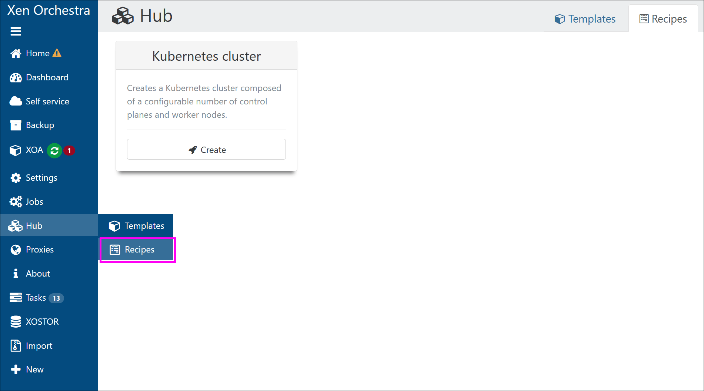
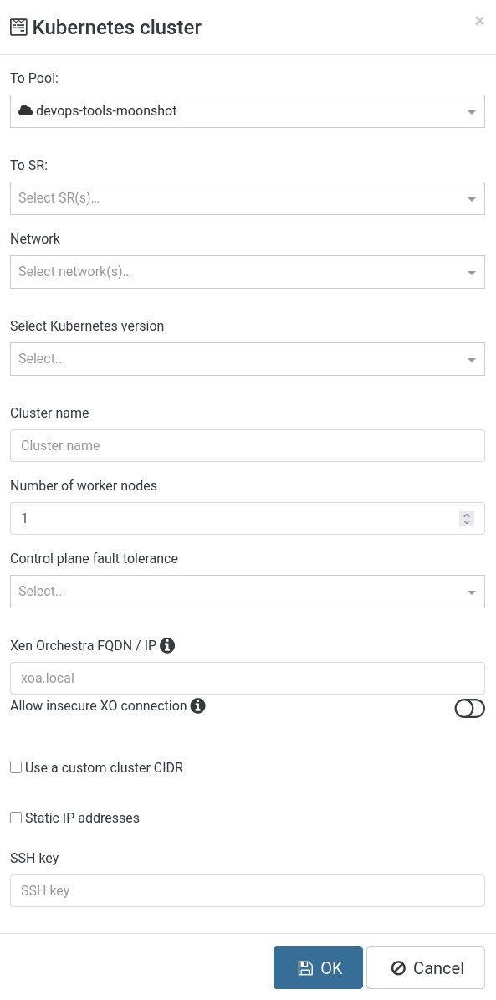
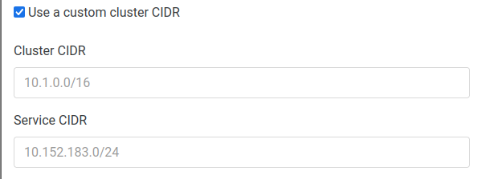
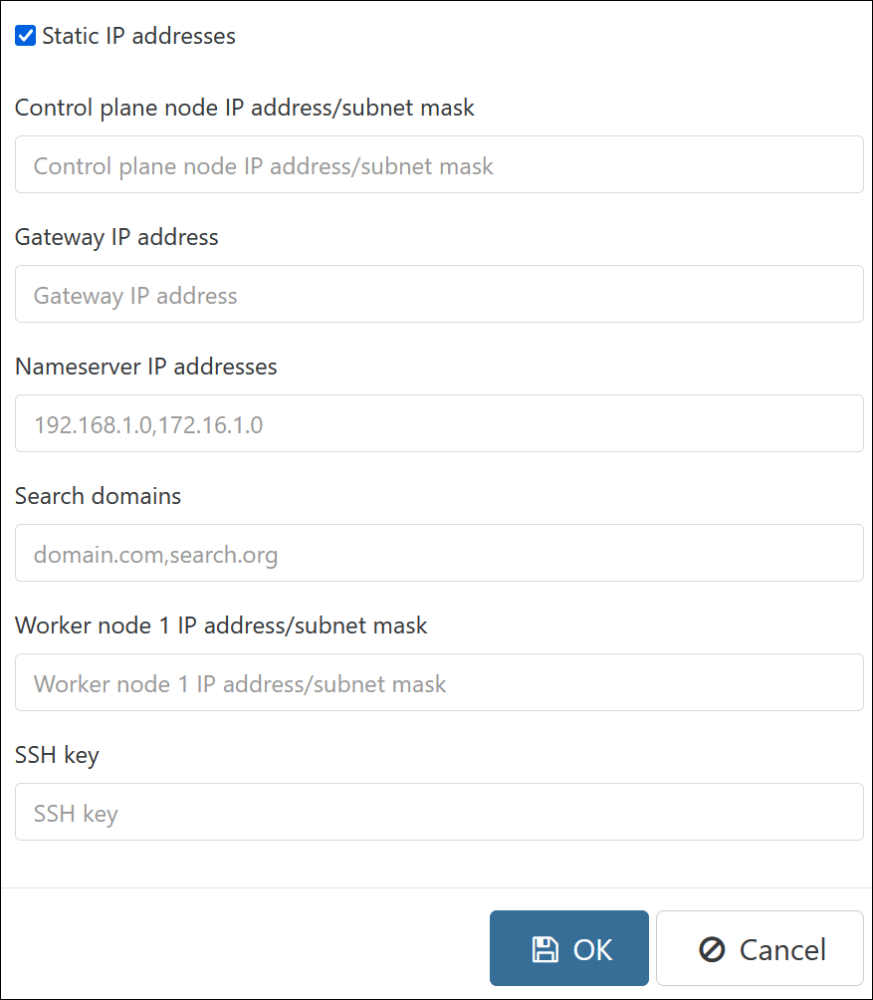
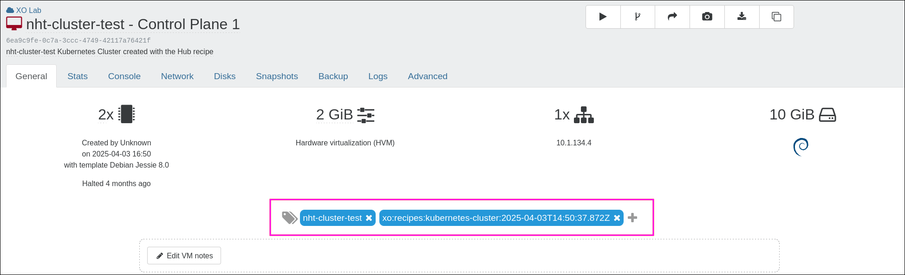
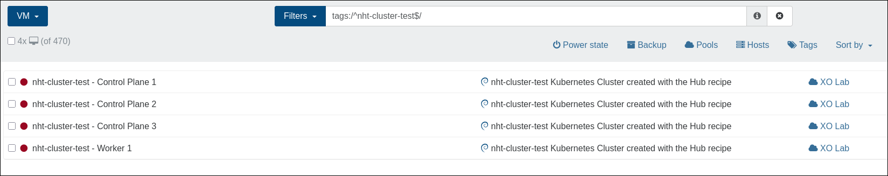
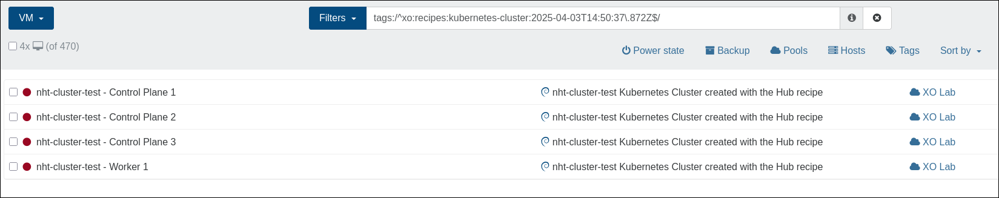
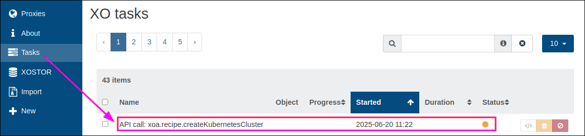

# Deploy Kubernetes with recipes

## Introduction

Xen Orchestra includes a Kubernetes cluster [recipe](../xo5/advanced#recipes) that provides a simple way to deploy an official Kubernetes distribution called **MicroK8s** (maintained by Canonical).

:::tip
One of the key benefits of MicroK8s is its automatic security updates. For example, patch releases (like 1.30.x to 1.30.x+1) are applied automatically. This saves Kubernetes admins a lot of time and effort.
:::

### Networking and CNI

This recipe uses **Calico**, the default Container Network Interface (CNI) plugin included with MicroK8s, to handle container networking. Calico provides secure networking and network policies for Kubernetes, and its default configuration is ready for production—no additional setup required.

If you need to adjust the Calico setup (for example, to modify the CIDR range), check the [MicroK8s documentation](https://microk8s.io/docs/change-cidr) for step-by-step instructions.

#### Configure the pod CIDR

Since version 5.113 of Xen Orchestra, the pod and service CIDR can be customized via the recipe form. There is no need to perform manual configuration to change them. See [Deployment steps - 3.vii](./kubernetes.md#deployment-steps).

:::note
The default CIDR for pods is `10.1.0.0/16`. All pods are assigned an IP address in that range.

The default service CIDR is `10.152.183.0/24`. `10.152.183.1` will typically be reserved for the Kubernetes API, and `10.152.183.10` will be used by CoreDNS.
:::

### Cloud Controller Manager

This recipe automatically deploys the [Xen Orchestra Cloud Controller Manager](https://github.com/vatesfr/xenorchestra-cloud-controller-manager/tree/main). The Cloud Controller Manager (CCM) acts as a bridge between your Kubernetes cluster and the underlying Xen Orchestra instance.

It takes care of node initialization and sets the correct labels and taints for effective cluster management. When it notices that a VM has been deleted from Xen Orchestra, it automatically cleans up the associated node and removes it from the cluster.

For the CCM to function properly, the Xen Orchestra instance must be reachable by the cluster nodes (VMs) via either an FQDN or IP address. (See [Deployment steps - 3.vi](./kubernetes.md#deployment-steps).)

The recipe automatically generates an API token for the current user with a validity of 6 months. 

:::warning
You will need to renew this token and update the `xenorchestra-cloud-controller-manager` secret in the Kubernetes cluster before it expires to maintain CCM functionality.
:::

#### Viewing the Current Token

To view the current token configuration in the secret:

```bash
kubectl get secret xenorchestra-cloud-controller-manager \
  --namespace=kube-system \
  -o json | jq -r '.data["config.yaml"]' | base64 -d
```

#### Refreshing the API Token

To refresh the token, generate a new one using the Xen Orchestra API and update the Kubernetes secret:

```bash
# 1. Generate a new token (replace with your XO URL)
# `-k` is needed if the cert is invalid
NEW_TOKEN=$(curl -X 'POST' \
  --header 'Cookie: authenticationToken=<current-token>' \
  'https://your-xo-instance.example.com/rest/v0/users/me/authentication_tokens' \
  -H 'accept: application/json' \
  -H 'Content-Type: application/json' \
  -d '{
  "description": "token for CCM",
  "expiresIn": "6 months"
}' | jq -r '.token.id')

# 2. Update the secret with the new token
kubectl get secret xenorchestra-cloud-controller-manager \
  --namespace=kube-system \
  -o json | \
  jq --arg token "$NEW_TOKEN" '.data["config.yaml"] |= (@base64d | sub("token: .+"; "token: " + $token) | @base64)' | \
  kubectl apply -f -
```

## Before you start

Make sure your infrastructure meets these requirements:

- A running Xen Orchestra instance connected to an XCP-ng pool
- A **VM template** for the base OS (e.g. an Ubuntu image)
- Enough resources to host the **control plane** and **worker nodes**
-	The Xen Orchestra instance must be reachable by the cluster nodes/VMs -	It can be reached via an FQDN or an IP address - This is for the XO CCM (Cloud Controller Manager).

## Deployment steps

1. In Xen Orchestra 5, go to **Hub → Recipes**.\
    A list of recipes will appear:
    
2. Go to the **Kubernetes cluster** recipe and click **Create**.\
    A cluster creation form appears:
    
3. Configure your cluster:
    1. Select a pool where you want to deploy your cluster.
    2. Select a storage repository, a network and a Kubernetes version.
    3. Enter a name for your cluster.\
    The name will be used to tag VMs (see [VM tagging](./kubernetes.md#vm-tagging)).
    4. Define the number of worker nodes.
    5. Define the number of nodes used for the control plane.
    6. Define the FQDN or IP address that will be used by the Cloud Controller Manager (CCM) to reach this Xen Orchestra instance.\
    *If the instance use a self signed HTTPS certificate, toggle "Allow insecure XO connection"*.
    7. (Optional). If you want to change the default CIDR for your cluster pods and services, check the **Use a custom cluster CIDR** box and specify the new IP ranges to use.
    
    9. (Optional). If you want your cluster to use static IP addresses, check the **Static IP addresses** box and specify the IP address parameters:
    
4. Click **OK** to start deploying the cluster.

Xen Orchestra handles the rest: cloning VMs, assigning IPs, bootstrapping Kubernetes and configuring internal networking.

### VM tagging

:::tip
The name provided to the cluster is also used to tag VMs, so that you can easily find them all:
:::





## During deployment

Follow the progress on the **Task** screen while the cluster is being created:


## Using your cluster

### Connecting to your cluster

Once the cluster and its VMs are ready, SSH into the first control plane node. From there, you can manage your Kubernetes cluster. 

For example:

```
$ ssh debian@<replace-by-vm-ip>

$ debian@cp-1:~$ microk8s kubectl get nodes
NAME       STATUS   ROLES    AGE   VERSION
cp-1       Ready    <none>   40m   v1.33.0
cp-2       Ready    <none>   30m   v1.33.0
cp-3       Ready    <none>   31m   v1.33.0
worker-1   Ready    <none>   31m   v1.33.0
worker-2   Ready    <none>   31m   v1.33.0
worker-3   Ready    <none>   31m   v1.33.0
```

### Adjusting VM Resources

The VMs in your Kubernetes cluster are created with default CPU and RAM settings, but you can easily adjust these to match your workload needs.

This gives you the flexibility to fine-tune performance or cut costs, depending on what your use case demands.

### Keeping your cluster updated

:::tip
MicroK8s handles **patch releases** automatically by design, so you always benefit from the latest security fixes and improvements without manual intervention. We think this is a great feature as it helps keep your cluster secure and up to date effortlessly.
:::

For **minor version upgrades** (for example, from `1.30.x` to `1.31.x`), you will need to follow the official [MicroK8s upgrade guide](https://microk8s.io/docs/upgrading?ref=xen-orchestra.com). These upgrades typically involve:

- Checking the current version with `microk8s version`
- Refreshing the MicroK8s snap to the desired channel
- Restarting the nodes if necessary

Example:

```bash
# Check current version
microk8s version

# Upgrade to a new minor release
sudo snap refresh microk8s --channel=1.31/stable
```
:::warning
Always review the MicroK8s documentation for the most up-to-date instructions before performing a minor upgrade.
:::

### Managing your cluster with external tools

Once the deployment finishes, Xen Orchestra provides a `kubeconfig` file. You can use it to manage your cluster with external tools:

For example:

```
$ microk8s config
apiVersion: v1
clusters:
- cluster:
    certificate-authority-data: [...]
    server: https://10.1.134.51:16443
  name: microk8s-cluster
contexts:
- context:
    cluster: microk8s-cluster
    user: admin
  name: microk8s
current-context: microk8s
kind: Config
preferences: {}
users:
- name: admin
  user:
    client-certificate-data: LS0tLS1CRU[...]
    client-key-data: LS0tLS1CRUdJ[...]
```

### Add-ons

In addition to the core components of the Kubernetes control plane, this recipe automatically installs the following add-ons:

- **DNS:** Deploys CoreDNS for internal address resolution.
- **Helm:** Installs [Helm 3](https://helm.sh/), the Kubernetes package manager.
- **RBAC:** Enable [Role-based access control (RBAC)](https://kubernetes.io/docs/reference/access-authn-authz/rbac/) for authorization. 

When **high availability (HA)** is enabled, the recipe also includes:

- **HA-cluster:** Ensures high availability for clusters with three or more nodes.
- **[Kube-VIP](https://kube-vip.io/):** Provides a virtual IP and load balancer for the control plane, deployed via the official Helm chart.

## Best Practices

When deploying Kubernetes clusters with recipes, it’s important to plan for performance and reliability. 

- Always allocate enough CPU and memory resources for both control plane and worker nodes. Using three control plane nodes ensures high availability in production environments. 
- Place the VMs on shared storage to allow live migration if needed. 
- For security, restrict SSH and api-server accesses and consider enabling RBAC and network policies once the cluster is running. 

Finally, keep your base template up to date with the latest OS patches and Kubernetes tools to avoid compatibility issues.

## Related links

- [Kubernetes official documentation](https://kubernetes.io/docs/home/)
- [MicroK8s official documentation](https://microk8s.io/docs)
- [CoreDNS official documentation](https://coredns.io/manual/toc/)