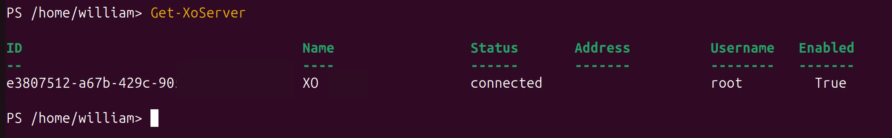
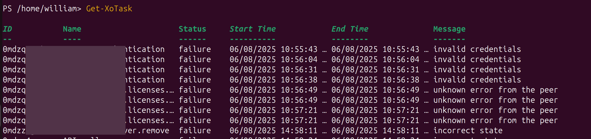
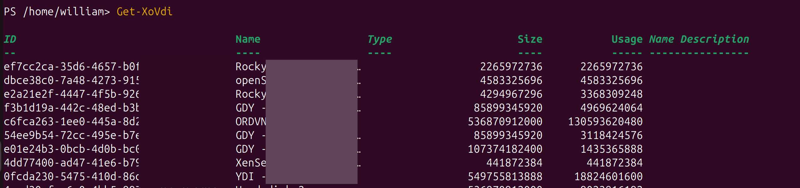
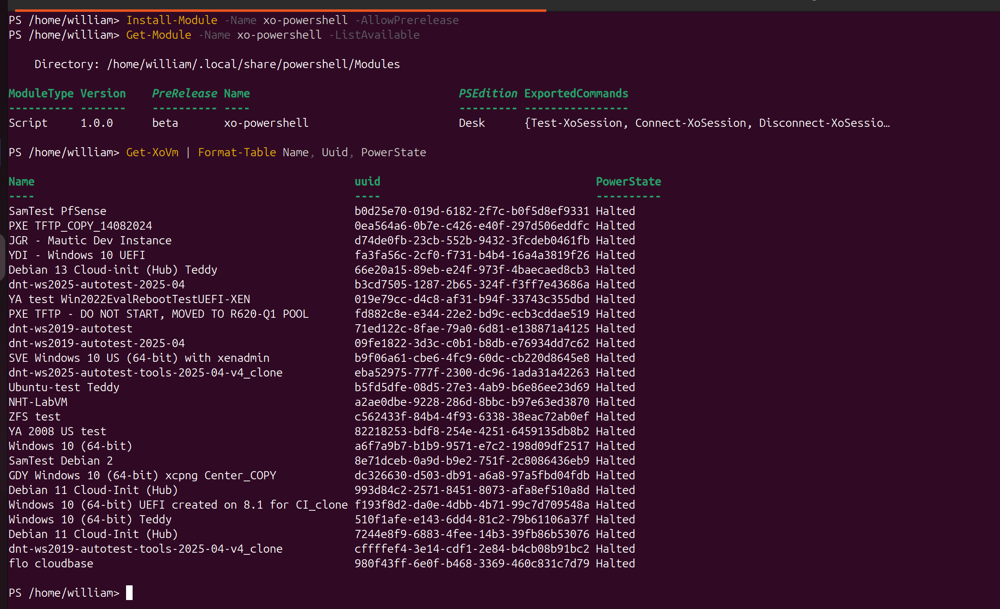
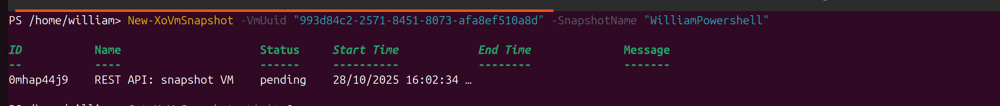
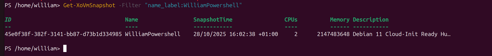
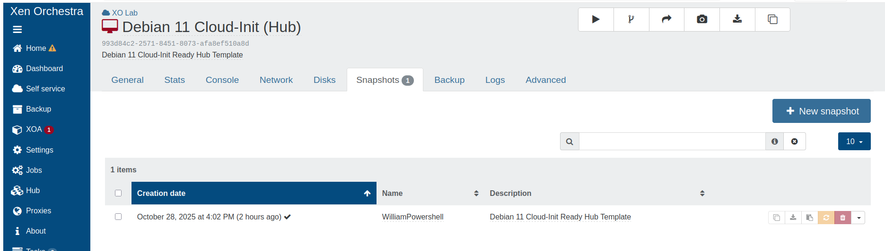

# Powershell module

## Introduction

Xen Orchestra (XO) is a powerful tool for managing XCP-ng and XenServer virtualisation environments. However, relying solely on the web interface can result in repetitive manual tasks. For system administrators, particularly those working in Windows-centric environments, **PowerShell** is the go-to automation tool. The `xo-powershell` module combines the strengths of these two tools by offering PowerShell's scripting capabilities to interact directly with the Xen Orchestra API. This article presents the most impactful features of the module, which can significantly simplify and accelerate the management of your virtualisation infrastructure. 

## Single-Line Installation and Connection

The `xo-powershell` module stands out for its ease of adoption, with simple installation from the [PowerShell Gallery](https://www.powershellgallery.com/packages/xo-powershell/) in a single command. 

:::info 
**Prerequisites**: PowerShell 7.0 or higher. The module is compatible with Windows PowerShell and PowerShell Core. 
::: 

```bash
Install-Module -Name xo-powershell -AllowPrerelease
```

Likewise, connecting to your Xen Orchestra instance is just as straightforward, requiring only the host address and an API token.

:::info 
**Obtaining the API token**: In Xen Orchestra, go to User Space → Edit my settings → Authentication tokens to generate an API token. [Learn more about authentication](https://docs.xcp-ng.org/management/manage-at-scale/xo-api/#authentification).
::: 

```bash
Connect-XoSession -HostName "https://your-xo-server" -Token "your-api-token"
```

## The Power of the Pipeline for Advanced Automation

What distinguishes this module from a simple API wrapper is its deep integration with the PowerShell pipeline. Most commands are designed to pass objects to one another, allowing the creation of single-line commands that are both powerful and expressive.

### Example (Simple Usage Examples)

* **List XCP-ng servers:**
    ```bash
    Get-XoServer
    ```
    

* **Monitor ongoing tasks:**
    ```bash
    Get-XoTask
    ```
    

* **Get information about virtual disks:**
    ```bash
    Get-XoVdi
    ```
    

* **To stop all virtual machines whose name contains "`Test`," the following command suffices:**

    ```bash
    Get-XoVm | Where-Object { $_.Name -like "*Test*" } | Stop-XoVm
    ```

    - This command first retrieves the list of all VMs, filters it to keep only those whose name matches the criteria, and then passes only these VMs to the `Stop-XoVm` command.

    - This is possible because `Get-XoVm` does not simply return text but a collection of PowerShell objects. Each VM object has properties (`.Name`, `.Memory`, etc.) that can be inspected by `Where-Object` before the complete object is passed to the next command. 
    

* **This principle also applies to more complex filtering, such as suspending running VMs with more than 4 GB of memory.**

    ```bash
    Get-XoVm -PowerState Running | Where-Object { $_.Memory.size -gt 4294967296 }  | Suspend-XoVm
    ```

:::info 
This capability transforms script writing, moving from a series of disconnected commands to a fluid flow of data and actions. 
:::

## Extended Environment Control (VM Management)

Although virtual machine management is an essential function, the scope of the module is much broader, offering complete control over the entire virtualisation environment. It provides in-depth coverage of all facets of the infrastructure.

- **Practical Use Cases**

    | Scenario | Command Sequence | Benefit |
    | :--- | :--- | :--- |
    | **Storage Audit** | `Get-XoSr` → `Get-XoVdi` → `Get-XoVmVdi` | Comprehensive storage utilization view |
    | **Maintenance Planning** | `Get-XoHost` → `Get-XoVm` → `Stop-XoVm` → `Wait-XoTask` | Planned maintenance without data loss |
    | **Session Verification** | `Test-XoSession` | Verify automation readiness |

This extended control is particularly useful. The 'Wait-XoTask' command enables the creation of robust scripts that wait for lengthy operations (such as creating a **snapshot**) to complete before continuing execution. This functionality makes the module a true command-line interface for Xen Orchestra and not just a tool for a few common tasks.

### Example: Creating virtual machine snapshots

This demonstration shows how to create and verify a virtual machine snapshot.

- **Step 1: Identify a Base VM**

    ```bash
    Get-XoVm | Format-Table Name, Uuid, PowerState
    ```
    

- **Step 2: Create a Snapshot**

    ```bash
    New-XoVmSnapshot -VmUuid "993d84c2-2571-8451-8073-afa8ef510a8d" -SnapshotName "your-snapshot-name"
    ```
    

- **Step 3: Verify Snapshot Creation**

    ```bash
    Get-XoVmSnapshot -Filter "name_label:your-snapshot-name" 
    ```
    



<!--
## Export Your Disks and Snapshots Directly to VHD or RAW

The module simplifies complex tasks such as exporting virtual disks (VDI) and their snapshots. The ideal way to back up the current state of a virtual disk is to use the `Export-XoVdi` command.

```bash
Export-XoVdi -VdiId "a1b2c3d4" -Format vhd -OutFile "C:\exports\disk_backup.vhd"
```

Furthermore, to create an archive of a *point-in-time* version of a disk, you can export one of its snapshots directly. This is ideal for backup or migration workflows based on specific restoration points, as it does not affect the active VM.

```bash
Export-XoVdiSnapshot -VdiSnapshotId "e5f6g7h8" -Format vhd -OutFile "C:\archives\disk_snapshot_archive.vhd"
```

This distinction enables granular backup and migration strategies that are fully script-managed.
-->

## Conclusion: Rethink Your XCP-ng Management

The `Xo-powershell` module is much more than just a collection of commands: it is a gateway to powerful, scalable and efficient automation within the XCP-ng/Xen Orchestra ecosystem. Leveraging the PowerShell pipeline and a comprehensive set of commands aligns it with the DevOps philosophy, bringing automation practices closer to Windows administrators and helping them save valuable time while reducing the risk of human error.

## Related links

- [PowerShell Gallery](https://www.powershellgallery.com/packages/xo-powershell/)
- [PowerShell module GitHub](https://xcp-ng.org/forum/category/29/infrastructure-as-code)
- [Learn more about authentication](https://docs.xcp-ng.org/management/manage-at-scale/xo-api/#authentification)
