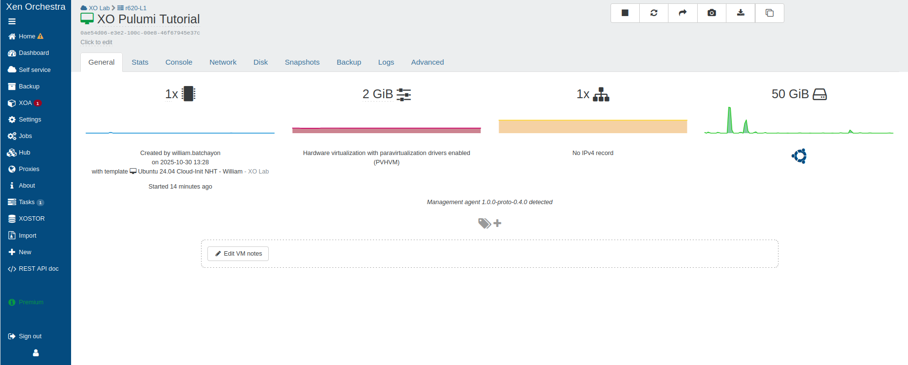
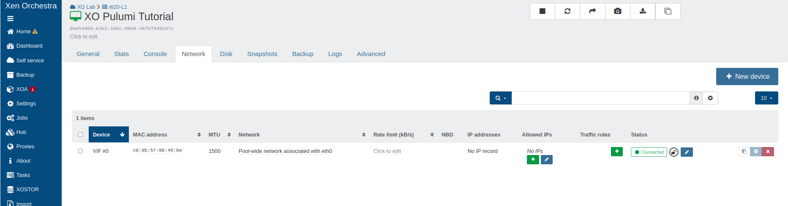
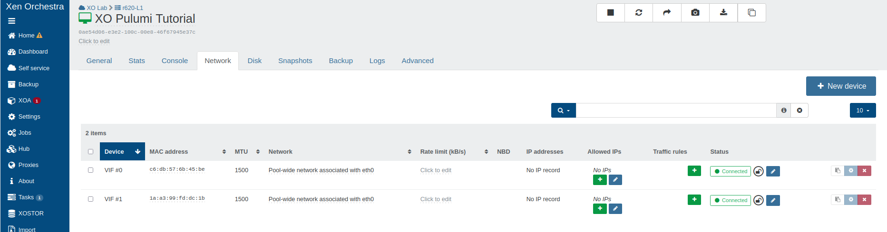

# Pulumi provider

## Introduction

Manually managing infrastructure can lead to errors and increased complexity. With Infrastructure as Code (IaC), however, we can describe our infrastructure in configuration files, making it **predictable**, **reproducible** and **versioned**. 

This tutorial will guide you through using **Pulumi**, a modern IaC tool, to automate the deployment and updating of your **virtual machines (VMs)** on **Xen Orchestra (XO)**.

:::note
Pulumi supports several programming languages (TypeScript, Python, Go, .NET, etc.), but we will use TypeScript for this example. To do this, you need to install Node/NPM version 20 or higher.
:::

:::tip
Pulumi's approach allows you to use real programming languages to define your infrastructure, offering more flexibility and power than traditional configuration languages.
:::

## Launching virtual machines in XO with Pulumi

In this tutorial, we will guide you through the process of using `Pulumi` to launch a virtual machine (VM) on your Xen Orchestra (XO) instance and demonstrate how to easily modify it.

:::note 
Since Pulumi relies on the Xen Orchestra API to abstract hosts, pools, networks, disks and virtual machines (VMs), as well as to manipulate them declaratively, ensure you have a functioning Xen Orchestra instance connected to XCP-ng before you begin. 
:::

**Here are the four main steps we will follow:**

1. Install Pulumi
2. Create a Pulumi project
3. Use Pulumi to provision the VM
4. Add an additional network interface to the VM

:::tip
The code used in this tutorial can be found on [GitHub](https://github.com/vatesfr/pulumi-xenorchestra), but we will write it from scratch step by step.
:::

### Installing Pulumi

If you haven't installed Pulumi yet, follow the [official Pulumi tutorial](https://www.pulumi.com/docs/install/) to install it on your system.

:::info
**Required version**: This tutorial requires Pulumi version v3.0+ or newer, as well as the Xen Orchestra provider version v2.0+.
:::

### Using VM Templates in Xen Orchestra

Pulumi needs a starting point to create a VM. This can be a `template` that already contains an operating system installed with **cloud-init** capabilities (or **Cloudbase-init** for Windows), as well as **Xen/Guest Tools** for better integration with Xen Orchestra.

:::info
We recommend using the pre-built templates from the **XOA Hub** for optimal results.
- **Debian 13** (with cloud-init)
- **Ubuntu 22.04/24.04** (with cloud-init)
- **etc.**

For more information on templates:
- [Creating VM templates](https://docs.xen-orchestra.com/vm-templates#creating-templates)
- [Cloud-init and Cloudbase-init](https://docs.xen-orchestra.com/vm-templates#cloud-init-and-cloudbase-init)
:::

### Provisioning your VM with Pulumi

Now that Pulumi is installed and you have a VM template ready in your environment, you can start writing the configuration files that describe your infrastructure.

1. **Creating the Pulumi project**

    Create a new directory for your project and initialise the project:

    ```bash
    mkdir xo-pulumi-project
    cd xo-pulumi-project
    pulumi new typescript
    ```

2. **Installing the Xen Orchestra provider**

    Install the Pulumi Xen Orchestra package:

    ```bash
    npm install @vates/pulumi-xenorchestra
    ```

3. **Securely configuring credentials**

    In order to authenticate Pulumi with your **Xen Orchestra API**, credentials are required.

    :::warning
    Never store passwords directly in your code. The recommended method is to use environment variables.
    :::

    - Create a `~/.xoa` file in your home directory containing the following content:

        ```bash
        export XOA_URL=ws://hostname-of-your-deployment
        export XOA_USER=YOUR_USERNAME
        export XOA_PASSWORD=YOUR_PASSWORD
        ```
        Or, if you are using a token:
        ```bash
        export XOA_URL=ws://hostname-of-your-deployment
        export XOA_TOKEN=YOUR_TOKEN
        ```

    - Then, before running Pulumi, load these variables into your terminal session:

        ```bash
        eval $(cat ~/.xoa)
        ```

    :::tip
    It is also possible to use the Pulumi configuration to store the credentials.

    ```bash
    pulumi config set xenorchestra:url ws://your-xo-hostname
    pulumi config set xenorchestra:token YOUR_TOKEN --secret
    ```
    :::

4. **Defining existing resources (data sources)**

    Pulumi needs to be aware of the resources already in place in XO (e.g. your pool, network and storage). To achieve this, we use data calls to retrieve existing information.

    Edit the `index.ts` file and replace its contents with:

    ```typescript
    import * as pulumi from "@pulumi/pulumi";
    import * as xenorchestra from "@vates/pulumi-xenorchestra";

    // Retrieving the pool
    const pool = xenorchestra.getXoaPool({
        nameLabel: "Main pool",
    });

    // Retrieve the template
    const template = xenorchestra.getXoaTemplate({
        nameLabel: "Ubuntu 24.04 Cloud-Init",
    });

    // Retrieve the storage repository
    const storageRepository = pool.then(p =>
        xenorchestra.getXoaStorageRepository({
            nameLabel: "ZFS",
            poolId: p.id,
        })
    );

    // Retrieve the network
    const network = pool.then(p =>
        xenorchestra.getXoaNetwork({
            nameLabel: "Pool-wide network",
            poolId: p.id,
        })
    );
    ```

    :::tip
    Using explicit `nameLabel` values is appropriate for this tutorial.  
    However, in real-world environments, it is recommended to use **unique names** to avoid conflicts or misconfigurations when multiple resources share similar labels.  
    :::

5. **Defining the VM resource**

    Now that Pulumi knows where to find the template, storage and network, we can define the VM that we want to create.

    Add the following code to the end of your `index.ts` file:

    :::tip
    If your template uses multiple disks, make sure you declare the same number of disks in your VM resource and pay attention to the order. The disks must be at least the same size as those in the template.
    :::

    ```typescript
    // Creating the VM
    const vm = new xenorchestra.Vm("xo-pulumi-tutorial", {
        memoryMax: 2 * 1024 * 1024 * 1024, // 2GB
        cpus: 1,
        nameLabel: "XO Pulumi Tutorial",
        template: template.then(t => t.id),
        networks: [
            {
                networkId: network.then(n => n.id),
            },
        ],
        disks: [
            {
                srId: storageRepository.then(sr => sr.id),
                nameLabel: "VM root volume",
                size: 50 * 1024 * 1024 * 1024, // 50GB
            },
        ],
    });

    // Export
    export const vmId = vm.id;
    export const vmName = vm.nameLabel;
    export const ipv4 = vm.ipv4Addresses;
    ```

    This code describes the characteristics of the VM to be created, including its `name`, `memory` and `CPU`. It uses the retrieved data to connect to the correct model, network and storage.

6. **Deploying the VM**

    It's time to bring our VM to life!

    * Run `pulumi up`

        This command will analyse your code and show you what it is about to do. The output will indicate that a new resource is going to be created.

        ```bash
        pulumi up
        ```

        Pulumi will then show you a preview of the changes and ask for confirmation before proceeding.

        ```bash
        Previewing update (dev)

        View in Browser (Ctrl+O): https://app.pulumi.com/batchayw-org/xo-pulumi-project/dev/previews/13fa0ed6-67f7-463d-8e18-83a1fa9571e2

            Type                      Name                   Plan       
        +   pulumi:pulumi:Stack       xo-pulumi-project-dev  create     
        +   └─ xenorchestra:index:Vm  xo-pulumi-tutorial     create     

        Outputs:
            ipv4  : [unknown]
            vmId  : [unknown]
            vmName: "XO Pulumi Tutorial"

        Resources:
            + 2 to create

        Do you want to perform this update?
        ```

    * Confirm with `yes`

        Pulumi will then deploy the VM on Xen Orchestra.

        ```bash
        Updating (dev)

        View in Browser (Ctrl+O): https://app.pulumi.com/batchayw-org/xo-pulumi-project/dev/updates/1

            Type                      Name                   Status            
        +   pulumi:pulumi:Stack       xo-pulumi-project-dev  created (19s)     
        +   └─ xenorchestra:index:Vm  xo-pulumi-tutorial     created (17s)     

        Outputs:
            vmId  : "0ae54d06-e3e2-100c-00e8-46f67945e37c"
            vmName: "XO Pulumi Tutorial"

        Resources:
            + 2 created

        Duration: 21s
        ```
🚀🎉 Congratulations! Your VM has now been deployed via Pulumi on XO.



Any future changes to this VM can now be easily **revised** and **versioned**.

To demonstrate this, let's imagine that this VM needs a second network interface. Let's see how we can easily implement this change.

### Updating existing infrastructure

One of Pulumi's greatest strengths lies in its ability to manage changes throughout your infrastructure's lifecycle.

Our goal is straightforward: to add a second network interface to the VM we just created.

To achieve this, simply edit the `index.ts` file and add a second network block to your VM definition.

```typescript
// Create the virtual machine with two network interfaces
const vm = new xenorchestra.Vm("xo-pulumi-tutorial", {
    memoryMax: 2 * 1024 * 1024 * 1024, // 2GB
    cpus: 1,
    nameLabel: "XO Pulumi Tutorial",
    template: template.then(t => t.id),
    networks: [
        {
            networkId: network.then(n => n.id),
        },
        // Second network interface
        {
            networkId: network.then(n => n.id),
        },
    ],
    disks: [
        {
            srId: storageRepository.then(sr => sr.id),
            nameLabel: "VM root volume",
            size: 50 * 1024 * 1024 * 1024, // 50GB
        },
    ],
});
```

The process for applying changes is exactly the same as for creating them.

* Run `pulumi up`

    This time, the output will be different. Pulumi has detected that the resource already exists and needs to be modified, not created. You will be able to see exactly which network block is going to be added.

    ```bash
    Previewing update (dev)

    View in Browser (Ctrl+O): https://app.pulumi.com/batchayw-org/xo-pulumi-project/dev/previews/9c687495-ba9d-4a8a-8446-f9bb8c2f1826

        Type                      Name                   Plan       Info
        pulumi:pulumi:Stack       xo-pulumi-project-dev             
    ~   └─ xenorchestra:index:Vm  xo-pulumi-tutorial     update     [diff: ~networks]

    Resources:
        ~ 1 to update
        1 unchanged

    Do you want to perform this update?
    ```

* Confirm with `yes`

    After confirmation, Pulumi will add the new network interface to your existing VM.

    ```bash
    Updating (dev)

    View in Browser (Ctrl+O): https://app.pulumi.com/batchayw-org/xo-pulumi-project/dev/updates/2

        Type                      Name                   Status            Info
        pulumi:pulumi:Stack       xo-pulumi-project-dev                    
    ~   └─ xenorchestra:index:Vm  xo-pulumi-tutorial     updated (29s)     [diff: ~networks]

    Outputs:
        vmId  : "0ae54d06-e3e2-100c-00e8-46f67945e37c"
        vmName: "XO Pulumi Tutorial"

    Resources:
        ~ 1 updated
        1 unchanged

    Duration: 32s
    ```

With just a few lines of code, you can modify your infrastructure in a controlled and reproducible manner.

* ***Before modification: single network interface***
    

* ***After adding the second network interface***
    


## Advanced Features

### Using Cloud-Init

Pulumi supports `cloud-init` configuration to customize your VMs during deployment.

```typescript
const vmWithCloudInit = new xenorchestra.Vm("vm-with-cloudinit", {
    // ... other parameters
    cloudConfig: `#cloud-config
users:
  - name: demo
    sudo: ALL=(ALL) NOPASSWD:ALL
    ssh-authorized-keys:
      - ssh-rsa <YOUR_PUBLIC_KEY_HERE>
packages:
  - nginx
  - git
runcmd:
  - systemctl enable nginx
  - systemctl start nginx
`,
});
```

### Managing multiple disks

You can easily add multiple disks to a VM.

```typescript
const vmWithMultipleDisks = new xenorchestra.Vm(“vm-multi-disk”, {
    // ... other parameters
    disks: [
        {
            srId: storageRepository.then(sr => sr.id),
            nameLabel: “System disk”,
            size: 30 * 1024 * 1024 * 1024, // 30 GB
        },
        {
            srId: storageRepository.then(sr => sr.id),
            nameLabel: “Data disk”,
            size: 100 * 1024 * 1024 * 1024, // 100 GB
        },
    ],
});
```

### Tag configuration

Add tags to organize and manage your resources.

```typescript
const taggedVm = new xenorchestra.Vm(“tagged-vm”, {
    // ... other parameters
    tags: [“production”, “web-server”, “pulumi-managed”],
});
```

## Debugging and logs

The provider supports detailed logging to facilitate troubleshooting and debugging.

* **Enabling Pulumi logs**

To enable debug logging, use the verbosity flags.

```bash
pulumi up --debug
```
Or for more details
```bash
pulumi up --logtostderr -v=9
```

* **Xen Orchestra provider logs**

The Xen Orchestra provider also logs its activities. These logs can be viewed in the Pulumi output when debug mode is enabled.

:::note
Only enable debug logging when troubleshooting, as it can significantly increase log verbosity and impact performance.
:::

## Best practices

### State Management

:::warning
Pulumi state contains sensitive information about your infrastructure. Always use a secure backend such as a self-hosted solution or local encrypted storage.
:::

```bash
# Configuration with local encrypted backend (recommended for full control)
pulumi login file://~          # Encrypted local storage in home directory
pulumi login --local           # Default location

# Or configuration with a self-hosted backend
pulumi login s3://my-pulumi-state-bucket
pulumi login gs://my-pulumi-state-bucket
pulumi login azblob://my-pulumi-state-bucket
```

## Conclusion

The Pulumi provider for Xen Orchestra is an important step towards VirtOps, which involves applying DevOps practices to virtualisation. By adopting Infrastructure as Code with Pulumi, you can achieve greater reliability, reproducibility and efficiency while transforming infrastructure management into a more collaborative and auditable process.

:::note
For detailed documentation on the provider, see the [official NPM package](https://github.com/vatesfr/pulumi-xenorchestra), which contains up-to-date information on all resources, data sources, and versions.
:::

## Related links

- [Pulumi documentation](https://www.pulumi.com/docs)
- [Pulumi code examples](https://github.com/vatesfr/pulumi-xenorchestra/tree/v2.3.0/examples)
- [Pulumi GitHub](https://github.com/vatesfr/pulumi-xenorchestra/issues)
- [Xen Orchestra docs](https://docs.xen-orchestra.com)
- [XCP-ng forum](https://xcp-ng.org/forum/)