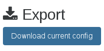
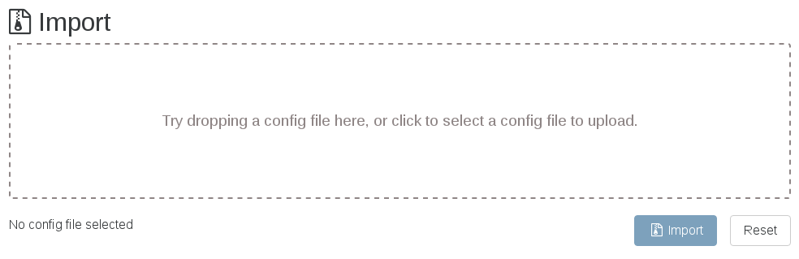

# XOA Support

This is the section dedicated to all XOA details and how to get support on it.

:::tip
As a XOA user, you can open tickets in your support panel: [https://support.vates.fr/](https://support.vates.fr/).
:::

## Technical Support

XOA is the only way to get our pro support, which is available remotely via SSH and a special tunnel.

### XOA Check

XOA check is a way to test if you XOA is correctly configured. It should be the first thing to do if you have any problem!

To run this check, in the web UI, you can access the support section in the XOA menu. In this section you can launch an `xoa check` command:


### Support tunnel

Open a secure support tunnel so our team can remotely investigate on your XOA. For that, we need to get the "support ID". See below:


<a id="ssh-pro-support"></a>

If your web UI is not working, you can also open the secure support tunnel from the CLI. To open a private tunnel (we are the only one with the private key), you can use the command `xoa support tunnel` like below:

```console
$ xoa support tunnel
The support tunnel has been created.

Do not stop this command before the intervention is over!
Give this id to the support: 40713
```

Give us this number, and we'll be able to access your XOA in a secure manner. Then, close the tunnel with `Ctrl+C` after your issue has been solved by support.

:::tip
The user `xoa-support` is used by the tunnel. If you want to deactivate this bundled user, you can run `chage -E 0 xoa-support`. To re-activate this account, you must run `chage -E 1 xoa-support`.
:::

## XOA VM Specifications

By default, the VM is configured with:

- 2 vCPUs
- 2GiB of RAM
- 20GiB of free SR space (2GiB on thin pro SR)

For use on huge infrastructure (more than 500+ VMs), feel free to increase the RAM.

## Alternative install

Please only use this if you have issues with [the default way to deploy XOA](installation#xoa).

### Via a bash script

Alternatively, you can deploy it by connecting to your XCP-ng/XenServer host and executing the following:

```sh
bash -c "$(wget --no-verbose -O- https://xoa.io/deploy)"
```

:::tip
This won't write or modify anything on your XCP-ng/XenServer host: it will just import the XOA VM into your default storage repository.
:::

Follow the instructions:

- Your IP configuration will be requested: it's set to **DHCP by default**, otherwise you can enter a fixed IP address (eg `192.168.0.10`)
- If DHCP is selected, the script will continue automatically. Otherwise a netmask, gateway, and DNS server should be provided.
- XOA will be deployed on your default storage repository. You can move it elsewhere anytime after.

### Via a manual XVA download

You can also download XOA from xen-orchestra.com in an XVA file. Once you've got the XVA file, you can import it with `xe vm-import filename=xoa_unified.xva` or via XenCenter.

If you want to use static IP address for your appliance:

```sh
xe vm-param-set uuid="$uuid" \
  xenstore-data:vm-data/ip="$ip" \
  xenstore-data:vm-data/netmask="$netmask" \
  xenstore-data:vm-data/gateway="$gateway"
```

If you want to replace the default DNS server:

```sh
xe vm-param-set uuid="$uuid" xenstore-data:vm-data/dns="$dns"
```

After the VM is imported, you just need to start it with `xe vm-start vm="XOA"` or with XenCenter.

## First console connection

### Deployed with the [web deploy form](https://vates.tech/deploy/)

In that case, you already set the password for `xoa` user. If you forgot it, see below.

### Manually deployed

If you connect via SSH or console for the first time without using our [web deploy form](https://vates.tech/deploy/), be aware **there is NO default password set for security reasons**. To set it, you need to connect to your host to find the XOA VM UUID (eg via `xe vm-list`).

Next, you can replace `<UUID>` with the UUID you found previously, and `<password>` with your password:

```sh
xe vm-param-set uuid=<UUID> xenstore-data:vm-data/system-account-xoa-password=<password>
```

:::tip
Don't forget to use quotes for your password, eg: `xenstore-data:vm-data/system-account-xoa-password='MyPassW0rd!'`
:::

Finally, you must reboot the VM to implement the changes.

You can now connect with the `xoa` username and password you defined in the previous command, eg with `ssh xoa@<XOA IP ADDRESS>`.

### Using sudo

To avoid typing `sudo` for any admin command, you can have a root shell with `sudo -s`:

```console
$ sudo -s

We trust you have received the usual lecture from the local System
Administrator. It usually boils down to these three things:

    #1) Respect the privacy of others.
    #2) Think before you type.
    #3) With great power comes great responsibility.

[sudo] password for xoa:
$
```

## Network configuration

XOA uses **DHCP** by default, so if you need to configure the IP address, please run the command `xoa network static`. It will ask you network details:

```console
$ xoa network static
? Static IP for this machine 192.168.100.120/24
? Gateway 192.168.100.254
? IP of the DNS server 192.168.100.254
```

Xen Orchestra is now accessible in your browser at `https://your-vm-ip`.

You can access the VM console through XenCenter or using VNC through a SSH tunnel.

If you want to go back in DHCP, just run `xoa network dhcp`

### Other interfaces

If you need to configure other interfaces than the default one, you can use the same commands with the name of the interface to configure as supplementary argument:

```console
$ xoa network static enX1
? Static IP for this machine 192.168.100.120
? Network mask (eg 255.255.255.0) 255.255.255.0

$ xoa network dhcp enX1
```

## Secondary IP addresses

To add more IP addresses on an already configured interface, you can use the `--add` flag:

```
$ xoa network static --add
? Static IP for this machine 192.168.200.120/24
```

## Firewall

By default XOA is firewalled, with only ports 22, 80 and 443 opened. You can see the current status of the firewall using the `sudo ufw status verbose` command:

```
Status: active
Logging: on (low)
Default: deny (incoming), allow (outgoing)
New profiles: skip

To                         Action      From
--                         ------      ----
22                         ALLOW IN    Anywhere
80                         ALLOW IN    Anywhere
443                        ALLOW IN    Anywhere
22/tcp                     LIMIT IN    Anywhere
22                         ALLOW IN    Anywhere (v6)
80                         ALLOW IN    Anywhere (v6)
443                        ALLOW IN    Anywhere (v6)
22/tcp                     LIMIT IN    Anywhere (v6)
```

If you want to open or close ports, please check the [documentation of UFW](https://help.ubuntu.com/community/UFW).

## Default XO account

Default user is **admin@admin.net** with **admin** as a password.

:::warning
If you are using the default credentials, **please** create a new admin account and remove this one.
:::

In any case, if you lose your password, you can reset the database and get the default credentials back.

## Timezone

You can verify that your time is correctly set with the `date` command. To set XOA to your current timezone, use `sudo dpkg-reconfigure tzdata`.

## Setting a custom NTP server

By default, XOA is configured to use the `systemd-timesyncd` daemon, along with the standard Debian NTP servers:

```
pool 0.debian.pool.ntp.org iburst
pool 1.debian.pool.ntp.org iburst
pool 2.debian.pool.ntp.org iburst
pool 3.debian.pool.ntp.org iburst
```

If you'd like to use another pool, you can make the changes directly in `/etc/systemd/timesyncd.conf`.

You will need to be root to edit this file (or use `sudo`). We recommend adding your custom server to the top of the list, leaving the Debian server entries if possible.

If you'd like to simply change NTP servers, use the `xoa network ntp` command:

```console
$ xoa network ntp
? NTP servers (space separated)
```

For changes to take effect, you will need to restart NTP: `systemctl restart systemd-timesyncd.service`.

## Restart the service

You can restart Xen Orchestra by accessing XOA via SSH (or console) and running `systemctl restart xo-server.service`.

To check the status of `xo-server`, use `systemctl status xo-server.service`, it should display something like this:

```
xo-server.service - XO Server
   Loaded: loaded (/etc/systemd/system/xo-server.service; enabled)
   Active: active (running) since Thu 2014-08-14 10:59:46 BST; 21min ago
 Main PID: 394 (node)
   CGroup: /system.slice/xo-server.service
           └─394 node /usr/local/bin/xo-server

Aug 14 10:59:46 xoa systemd[1]: Starting XO Server...
Aug 14 10:59:46 xoa systemd[1]: Started XO Server.
Aug 14 10:59:48 xoa xo-server[394]: WebServer listening on http://0.0.0.0:80
```

## Migrate from an older XOA

If you still use the first XOA (which was not the "unified" version), you can easily migrate all your settings (ACLs, users, servers, etc) to the new version painlessly.

To do so, go into "Settings/Config" of your old XOA. Export the configuration: you'll download a `config.json` file.



Now go to your new unified XOA, "Settings/Config" and import the `config.json` file you downloaded previously, by doing a drag and drop:



That's it!
