# XOSANv1

XOSAN is a virtual SAN that allows you to create a shared SR (Storage Repository) by combining your existing local SRs. It's a software defined and hyperconverged solution for Citrix Hypervisor.

:::warning
Due to their difference, XOSANv1 (the initial implementation) is incompatible with XCP-ng. For XCP-ng, see the [XOSANv2 dedicated documentation](xosanv2.md).
:::

## Introduction

This documentation will give you some advice and assistance in order to create an XOSAN storage on your XenServer or XCP-ng infrastructure.

## Objectives

XOSAN will "gather" all your local disks (across multiple hosts) into a shared SR, that XenServer/XCP-ng will just see as any other shared SR, without limitations (you can live migrate, snapshot, backup, whatever you need). **It's a fully software defined solution** that doesn't require you to buy extra hardware. It can even run on the disk where your Citrix Hypervisor (Xenserver) or XCP-ng is already installed!

The objectives are to:

- protect your data thanks to replication of data across multiple hosts
- Unlock High Availability without buying a NAS nor a SAN
- give you flexibility to grow your storage by adding new nodes
- work on all kinds of hardware, HDDs or SSDs, with hardware RAID or not

To deploy XOSAN, please follow the rest of the documentation:

- [XOSAN Requirements](xosan.md#requirements))
- [Types of XOSAN](xosan.md#xosan-types)
- [How to create a new XOSAN Storage](xosan.md#creation))
- [XOSAN management](xosan.md#advanced-options)
- [Get a free XOSAN trial](xosan.md#try-it)

## Requirements

In order to work, XOSAN need a minimal set of requirements.

### Storage

XOSAN can be deployed on an existing **Local LVM storage**, that XCP-ng/XenServer configure by default during its installation. You need 10GiB for XOSAN VM (one on each host) and the rest for XOSAN data, eg all the space left.

However, if you have unused disks on your host, you can also create yourself a local LVM storage while using Xen Orchestra:

- Go on the "New" menu entry, then select "Storage"
- Select the host having the disk you want to use for XOSAN
- Select "Local LVM" and enter the path of this disk (e.g: `/dev/sdf`)

> You can discover disks names by issuing `fdisk -l` command on your XCP-ng/XenServer host.

> **Recommended hardware:** we don't have specific hardware recommendation regarding hard disks. It could be directly a disk or even a disk exposed via a hardware RAID. Note that RAID mode will influence global speed of XOSAN.

### Network

XOSAN will use the network card you choose at creation. For better performances, a dedicated storage network should be used.

> **Recommended hardware:** 1 Gbit/s network card is the minmum to have decent performances. However, a **10 Gbits/s** network is preferable, especially for a setup using SSDs or more than 2 nodes.

### RAM

Each XOSAN VM will use 2GiB of RAM. It could be increased (sweet spot seems to be around 4GiB), but it's also workload and infrastructure related. If you don't have a lot of RAM, keep it to 2GiB. If RAM is not an issue, 4GiB is better.

### CPU

Each XOSAN VM deployed will use 2x vCPUs. This setting should be enough for all cases.

### Examples

For a 6 nodes setup, XOSAN will use in total:

- 12 vCPUs (usage is in general pretty low)
- 12 GiB RAM
- All Local LVM disk space

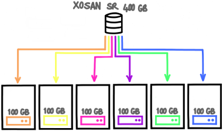

## XOSAN types

There is 2 modes for creating an XOSAN storage. They are different and the choice is done forever. You can't **switch from a mode to another** when XOSAN is created, except by removing and re-creating it.

That's why it's **very important to understand pros and cons** of each type.

:::tip
On "top" of there 2 types, you can also decide to spread all operations to multiple number of volumes. This is called **distributed** mode. It's very similar to _RAID 0_, which can be placed on top of a _RAID 1_ for example. We'll talk about it in the end of this guide.
:::

Here is those 2 types:

- Replicated
- Disperse

### Disperse type

Data are **chunked and dispersed** on multiple nodes. There is a kind of "parity" data allowing to lost one or mode nodes ("like" RAID5 or RAID6).

Pros:

- good capacity (perfect for **HDD storage**)
- simple to setup
- simple to maintain
- various level of protection

Cons:

- not all configrations possible (3, 5, 6 nodes and more)
- limited performances on SSDs (replication is better in this case)

<!-- 
FIXME: this missing img link broke the markdown parser
 
-->

#### Disperse 3

This is similar to **RAID5**: there is an [algorithm](https://en.wikipedia.org/wiki/Reed%E2%80%93Solomon_error_correction) that will generate a kind of parity, being able to continue to work even if 1 node is down. If you reintroduce the node, it will be "healed" automatically.

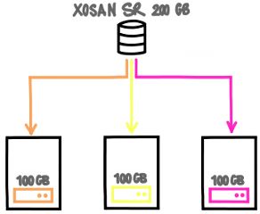

If you lose one node, your data are still here. This mode will give you **66% of your total disk space**.

#### Disperse 5

Same than 3, like **RAID5**, you can lose 1 node without service interruption.

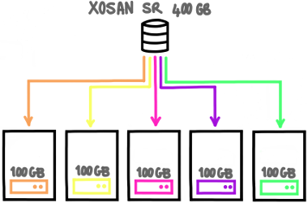

In this case, you'll be able to use up to **80%** of your total storage capacity!

#### Disperse 6

It's very similar to **RAID6**. You can lose up to 2 nodes, it will continue to work in read and write.

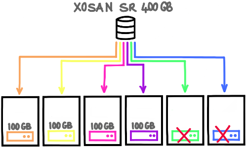

#### Growing a disperse XOSAN

You can grow a replicated XOSAN by adding extra disperse volumes, in other words a new disperse will be like in RAID 0 with the old one. It's a **distributed-disperse** type. Some examples:

- To grow a disperse 3, you need 3 new nodes. You'll add the total capacity of each disperse to make a distributed-disperse on 2x3 dispersed nodes.
- To grow a disperse 6, you need 6 new nodes.

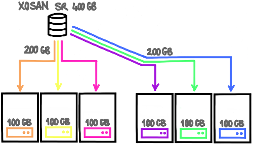

### Replicated type

Data are replicated from a node to another.

Pros:

- fast (**must be used for SSDs**)
- relatively flexible

Cons:

- lower capacity (so higher cost, better for SSDs)
- a bit more complex to maintain in distributed-replicated (see "RAID 10 like")

#### 2-way replication

This type is pretty simple to understand: everything written on one node is mirrored to another one. It's very similar to **RAID 1**.

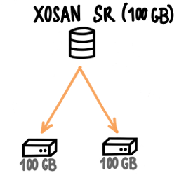

If you lose one node, your data are still here. This mode will give you **50% of your total disk space** (e.g with 2x nodes of 100GiB, you'll have only 100GiB of space).

#### 3-way replication

Same than 2-way, but data is replicated on 3 nodes in total.

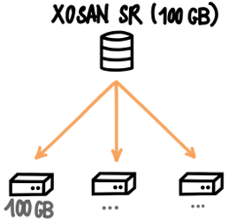

2 nodes can be destroyed without losing your data. This mode will give you **33% of your total disk space** (e.g with 3x nodes of 100GiB, you'll have only 100GiB of space).

#### Building a "RAID 10" like

If you have more than 2 or 3 nodes, it could be interesting to **distribute** data on multiple replicated nodes. This is called "**distributed-replicated**" type. Here is an example with 6 nodes:

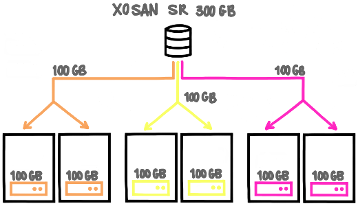

It's very similar to **RAID 10**. In this example, you'll have 300GiB of data usable.

> This is the mode you'll use in a more than 3 nodes setup.

#### Examples

Here is some examples depending of the number of XCP-ng/XenServer hosts.

##### 2 hosts

This is a kind of special mode. On a 2 nodes setup, one node must know what's happening if it can't contact the other node. This is called a **split brain** scenario. To avoid data loss, it goes on read only. But there is a way to overcome this, with a special node, called **the arbiter**. It will only require an extra VM using only few disk space.

Thanks to this arbiter, you'll have 3 nodes running on 2 XCP-ng/XenServer hosts:

- if the host with 1 node is down, the other host will continue to provide a working XOSAN
- if the host with 2 nodes (1 normal and 1 arbiter) id down, the other node will go into read only mode, to avoid split brain scenario.

This way, in all cases, you are protected.

##### 3 hosts

The easiest way is to use 3-way replication. You can lose completely 2 hosts, it will continue to work on the survivor!

##### 4 hosts

The usual deal is to create a "group" of 2 replicated nodes (2x2). In a picture:

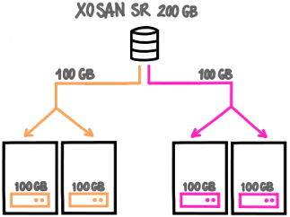

##### 5 hosts

There is no way to use the local disks of 5 nodes in a replicated type. So you'll use 4 hosts in XOSAN, and the 5th would be also able to use the shared XOSAN SR, without participating directly to it.

##### 6 hosts

You have 2 choices:

1. 2-way replication on 3 replicated nodes (2x3)
2. 3-way replication on 2 triplicated nodes (3x2)

There is more fault tolerance on mode 2, but less space usable. It's up to you!

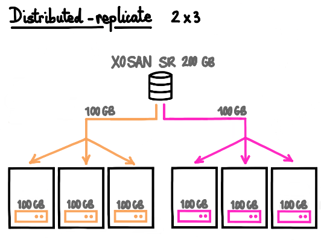

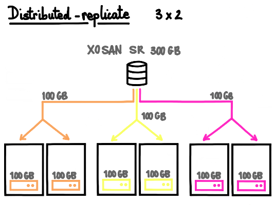

#### Growing a replicated XOSAN

You can grow a replicated XOSAN by adding pairs, in other words "RAID 1"-like mirrors to the existing setup, like you would adds mirrored disks in "RAID 10" setup. Examples:

- on a 2 hosts setup, going for 4 hosts by adding 2 mirrored nodes
- on a 3 hosts setup using 3-way replication, by adding 3 mirrored nodes

### Which mode to choose

In the vast majority of cases, **replicated is better**, because:

- it's almost ALWAYS faster
- it's easier to manage
- it's easier to grow

The only downside is that replicated will "waste" more space.

Using disperse makes sense only if:

- you have big HDDs and you want use the space at most
- you don't use database (or don't care about performances)
- you store big files and you don't need ultra fast data access

XOSAN will need a pool with:

- XenServer 7 or higher
- Local LVM SR with at lease 15GiB of free space on **each** host
- 2 GiB of free RAM on each host for the XOSAN VM
- A working connection with the updater (same way as the XO trial)
- Our XOSAN pack installed on each hosts (it's automatically deployed during the first XOSAN install)

> The pack will install user-space packages and add a new SR type: "xosan". Their will be no other modification. The tool stack has to be restarted to be able to deal with XOSAN (no VM or service interruption). It's also fully automated in the XOSAN install process.

### Optional

- An extra/dedicated physical network for storage to deliver high performances
- 10G networks will deliver higher throughput

## Creation

After the completion of all the requirements, you can install XOSAN itself.

1. Go in your XOSAN panel in Xen Orchestra.

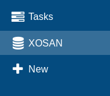

2. Click on `new` and select the pool on which you want to create a shared cluster. Click on `install it now` to install the XOSAN package on every hosts in the pool.

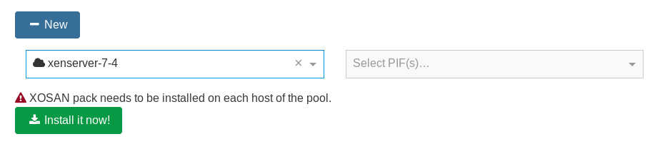

3. Select the PIF on which you want to create the XOSAN network.

4. Select all the SR you want to use in your shared cluster.

> Note: you can only select on SR on each host. If you select SR with different size, the size of the cluster will be limited by the size of the smallest SR selected. We recommend you to use the same type of SR (SSD/HDD) and with the same size to avoid space loss

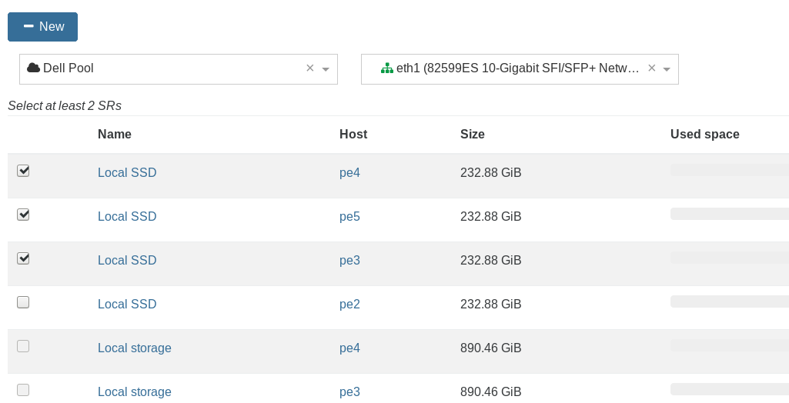

5. Select the mode you want to use for your cluster: disperse or replicate.

> We do not recommend the disperse mode for now. See [XOSAN types](https://xen-orchestra.com/docs/xosan_types.html) for additional information about modes.

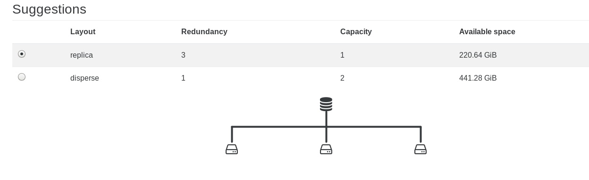

### Advanced options

With the advanced option, you can:

- use a VLAN

  > If you want to use a VLAN, don't forget to configure your switch as well!

- use a custom IP network

- change the total size you want for your shared storage

- increase the memory allocated to XOSAN
  > 2GiB is the minimum to allocate to XOSAN. You will get better result with 4GiB and if you have a lot of memory available, 8GiB is the best.

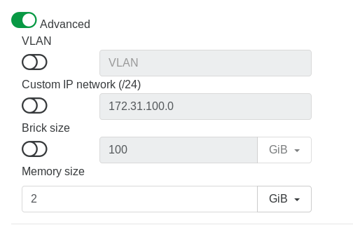

Once you are ready, you can click on `Create`. XOSAN will automatically deploy itself and create the virtual shared storage you have selected.

> The process can take a few minutes to complete.

## Try it

XOSAN is a 100% software defined solution for XCP-ng/XenServer hyperconvergence. You can unlock a free 50GiB cluster to test the solution in your infrastructure and discover all the benefits you can get by using XOSAN.

### Step 1

You will need to be registered on our website in order to use Xen Orchestra. If you are not yet registered, [here is the way](https://xen-orchestra.com/#!/signup)

SSH in your XCP-ng/XenServer and use the command line `bash -c "$(wget -qO- https://xoa.io/deploy)"` - it will deploy Xen Orchestra Appliance on your XCP-ng/XenServer infrastructure which is required to use XOSAN.

> Note: You can also download the XVA file and follow [these instructions](https://xen-orchestra.com/docs/xoa.html#the-alternative).

### Step 2

Register your XOA appliance

> _If you are not familiar with Xen Orchestra, note that you can also activate a 30 day Premium trial for XOA. More informations [here](https://xen-orchestra.com/#!/trial)_

### Step 3

Access the XOSAN menu and click on the "new" button. By default, your XOSAN will be a trial license, limited to 50GiB of space.

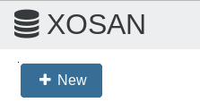

:::tip
You will always have the opportunity to upgrade an existing XOSAN cluster which is in trial version to a standard XOSAN license.
:::
