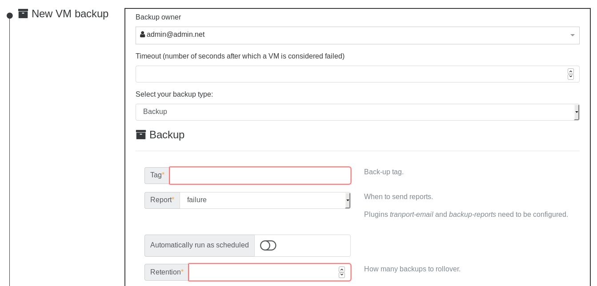

# Full backups

You can schedule full backups of your VMs, by exporting them to the local XOA file-system, or directly to an NFS or SMB share. The "rentention" parameter allows you to modify how many backups are retained (by removing the oldest one).

Full backups are space consuming! But they allow a very simple restoration without anything to think of (the file will contain all the VM disks and information).

## How it works

Full backups use XenServer's VM export capabilities. We store and rotate XVA files. It works very well. If you want to use less disk space, take a look at the [delta backups](delta_backups.md) feature.
