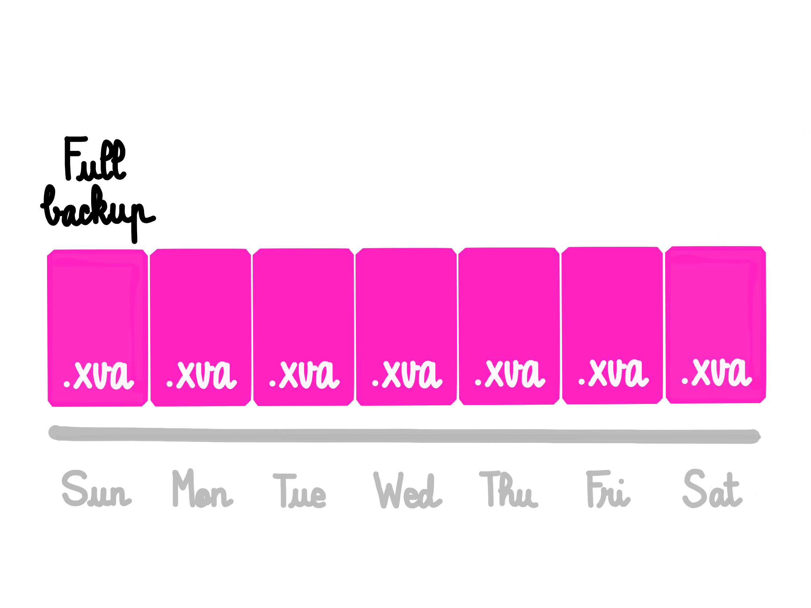
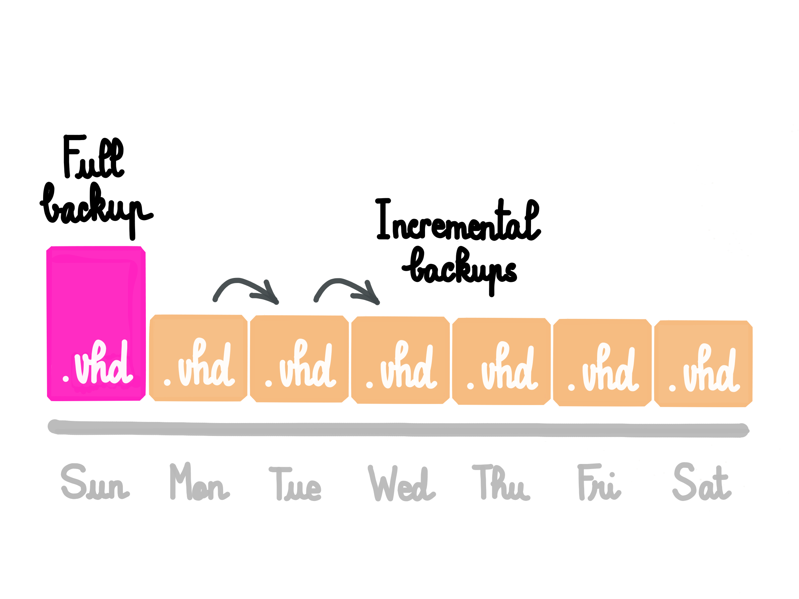
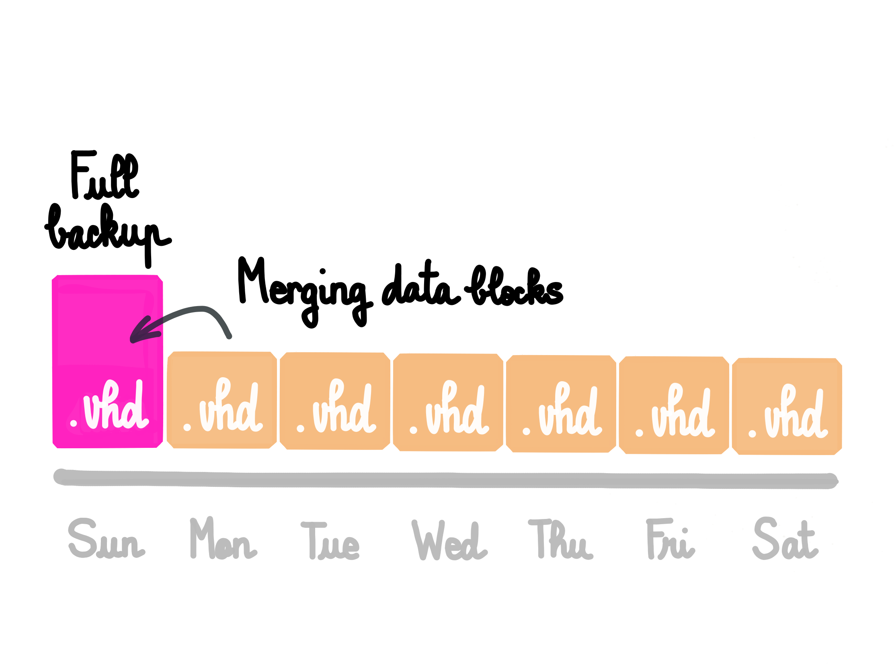
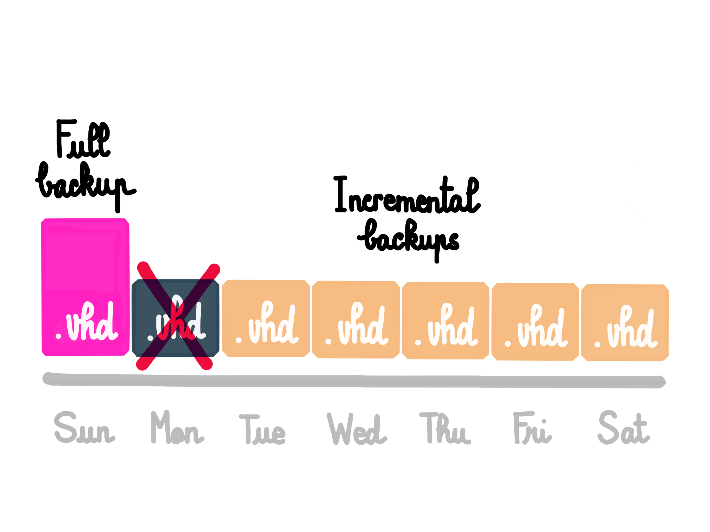
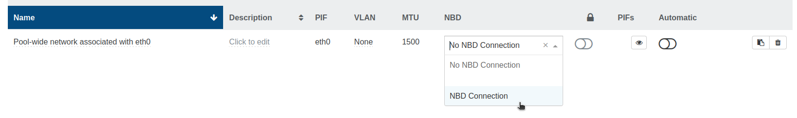
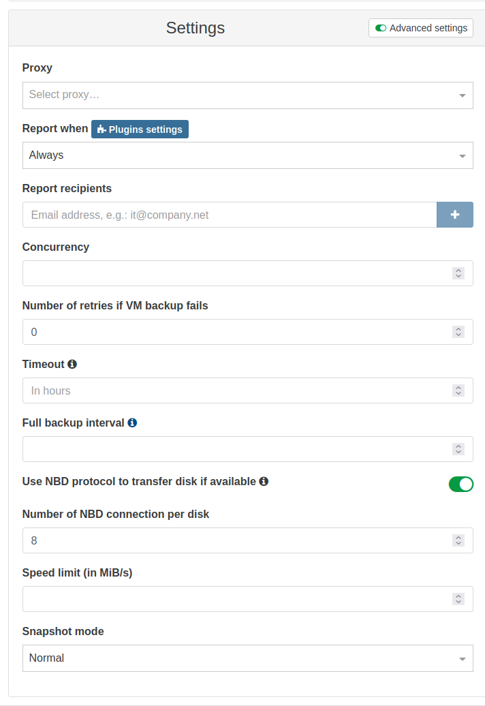

# Incremental Backups (formerly: Continuous Delta backups)

You can export only the delta (difference) between your current VM disks and a previous snapshot (called here the _reference_). They are called _continuous_ because you'll **never export a full backup** after the first one.

## Introduction

Full backups can be represented like this:

It means huge files for each backup. Incremental backups will only export the difference between the previous backup:

You can imagine making your first initial key(complete) backup during a weekend, and then only delta backups every night. It combines the flexibility of snapshots and the power of full backups, because:

- delta are stored somewhere else than the current VM storage
- they are small
- quick to create
- easy to restore

So, if you want to rollback your VM to a previous state, the cost is only one snapshot on your SR (far less than the [rolling snapshot](rolling_snapshot.md) mechanism).

Even if you lost your whole SR or VM, XOA will restore your VM entirely and automatically, at any date of backup.

You can even imagine using this to backup more often! Because deltas will be smaller, and will **always be deltas**.

### Continuous

They are called continuous because you'll **never export a full backup** after the first one. We'll merge the oldest delta into the full:

This way we can go "forward" and remove this oldest VHD after the merge:

## Create Delta backup

Just go into your "Backup" view, and select Delta Backup. Then, it's the same as a normal backup.

## Snapshots

Unlike other types of backup jobs which delete the associated snapshot when the job is done and it has been exported, delta backups always keep a snapshot of every VM in the backup job, and uses it for the delta. Do not delete these snapshots!

## Incremental backup initial seed

If you don't want to do an initial full directly toward the destination, you can create a local delta backup first, then transfer the files to your destination.

Then, only the diff will be sent.

1. create a incremental backup job to the first remote
1. run the backup (full)
1. edit the job to target the other remote
1. copy files from the first remote to the other one
1. run the backup (incremental)

## Key backup interval

This advanced setting defines the number of backups after which a key backup is triggered, ie the maximum length of a delta chain.

For example, with a value of 2, the first two backups will be a key and a delta, and the third will start a new chain with a full backup.

This is important because on rare occasions a backup can be corrupted, and in the case of incremetnal backups, this corruption might impact all the following backups in the chain. Occasionally performing a full backup limits how far a corrupted delta backup can propagate.

The value to use depends on your storage constraints and the frequency of your backups, but a value of 20 is a good start.

:::tip
Migrating the VDIs of a VM to another SR will trigger a full export at the next backup run.
:::

## NBD-enabled Backups

You have the option to utilize the NBD network protocol for data transfer instead of the VHD handler generated by the XAPI. NBD-enabled backups generally show improved speed as the load on the Dom0 is reduced.

NBD must also be enabled on the network used to transfer the backups: select the relevant pool, and navigate to the Network tab to modify the parameter:

This will securely transfer encrypted data from the host to the XOA.
When creating or editing an incremental (previously known as delta) backup and replication for this pool in the future, you have the option to enable NBD in the Advanced settings, and use multiple connections per VDI.

After the job is completed, you can verify whether NBD was used for the transfer in the backup log:

To learn more about the evolution of this feature across various XO releases, check out our blog posts for versions [5.76](https://xen-orchestra.com/blog/xen-orchestra-5-76/), [5.81](https://xen-orchestra.com/blog/xen-orchestra-5-81/), [5.82](https://xen-orchestra.com/blog/xen-orchestra-5-82/), and [5.86](https://xen-orchestra.com/blog/xen-orchestra-5-86/).
