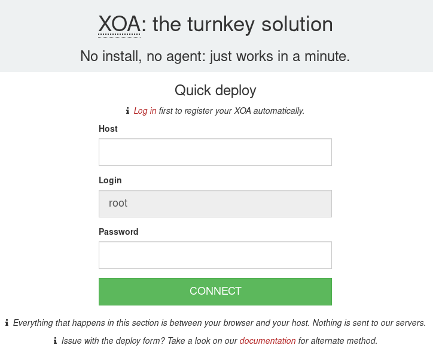
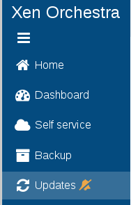
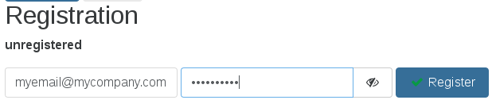
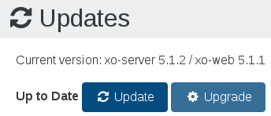

# Installation

:::tip
If you want to deploy an XOA in an airgapped infrastructure, refer to the [dedicated documentation](airgap.md).
:::

## XOA

Log in to your account and use the deploy form [available on this page](https://vates.tech/deploy/).

:::tip
All the deploy code is within your browser, nothing is sent to our server!
:::



### First Login

Once you have started the VM, you can access the web UI by putting the IP you configured during deployment into your web browser. If you did not configure an IP or are unsure, try one of the following methods to find it:

- Run `xe vm-list params=name-label,networks | grep -A 1 XOA` on your host
- Check your router's DHCP leases for an `xoa` lease

:::tip

- Default Web UI credentials are `admin@admin.net` / `admin`
- Default console/SSH credentials are not set, you need to set them [as described here](troubleshooting.md#set-or-recover-xoa-vm-password).
  :::

### Registration

**The first thing** you need to do with your XOA is register. [Read the documentation on the page dedicated to the updater/register inferface](updater.md#register).

:::tip
We don't generate virtual appliances every month (unlike XO code itself). It's very likely you'll need to update Xen Orchestra after the initial deploy. You need to register to do so!
:::

### Trial

In your current Free XOA, register it in the "Updates" view in the main menu:



**To register your appliance, please use your email/password from your previous registration on xen-orchestra.com**:



Then you can click on "Start Trial", the green button:


Remember to click on the Upgrade button after requesting a trial - this will download the **Premium Edition** for 15 days!



### Trial availability

In this update view, you can see when your trial will end:


:::tip
Don't worry! XOA will still work after the trial: you'll be forced to downgrade to Free version, but you won't lose any configuration data.
:::

### More on XOA

You can get all the info you want on XOA in its [dedicated section](xoa.md).


## From the sources

:::warning
We don't provide pro support for this installation method. We cannot guarantee anything if it's used in production. Use it at your own risk!
:::

:::tip
Please consider using XOA before trying to play with the manual build, which can be difficult if you are not used to NodeJS and NPM.
:::

This installation has been validated against a fresh Debian 11 (Bullseye) x64 install. It should be nearly the same on other dpkg systems. For RPM based OS's, it should be close, as most of our dependencies come from NPM and not the OS itself.

As you may have seen in other parts of the documentation, XO is composed of two parts: [xo-server](https://github.com/vatesfr/xen-orchestra/tree/master/packages/xo-server/) and [xo-web](https://github.com/vatesfr/xen-orchestra/tree/master/packages/xo-web/). They can be installed separately, even on different machines, but for the sake of simplicity we will set them up together.

### Packages and Pre-requisites

#### NodeJS

XO requires [Node.js](https://en.wikipedia.org/wiki/Node.js), **please always use [latest LTS](https://github.com/nodejs/release?tab=readme-ov-file#release-schedule)**.

We'll consider at this point that you've got a working node on your box. E.g:

```console
$ node -v
v20.14.0
```

If not, see [this page](https://nodejs.org/en/download/package-manager/) for instructions on how to install Node.

#### Yarn

Yarn is a package manager that offers more guarantees than npm.

See [this page](https://yarnpkg.com/en/docs/install#debian-stable) for instructions on how to install Yarn.

#### Packages

XO needs the following packages to be installed. Redis is used as a database by XO.

For example, on Debian/Ubuntu:

```sh
apt-get install build-essential redis-server libpng-dev git python3-minimal libvhdi-utils lvm2 cifs-utils nfs-common ntfs-3g
```

On Fedora/CentOS like:

```sh
dnf install redis libpng-devel git lvm2 cifs-utils make automake gcc gcc-c++ nfs-utils ntfs-3g
```

### Make sure Redis is running

Start the service:

```sh
systemctl restart redis.service
```

Ensure it's working:

```console
$ redis-cli ping
PONG
```

### Fetching the Code

You need to use the `git` source code manager to fetch the code. Ideally, you should run XO as a non-root user, and if you choose to, you need to set up `sudo` to be able to mount NFS remotes. As your chosen non-root (or root) user, run the following:

```sh
git clone -b master https://github.com/vatesfr/xen-orchestra
```

:::tip
`xo-server` and `xo-web` have been migrated to the [xen-orchestra](https://github.com/vatesfr/xen-orchestra) mono-repository - so you only need the single clone command above
:::

### Installing dependencies

Now that you have the code, you can enter the `xen-orchestra` directory and use `yarn` to install other dependencies. Then finally build it using `yarn build`. Be sure to run `yarn` commands as the same user you will be using to run Xen Orchestra:

```sh
cd xen-orchestra
yarn
yarn build
```

Now you have to create a config file for `xo-server`:

```sh
cd packages/xo-server
mkdir -p ~/.config/xo-server
cp sample.config.toml ~/.config/xo-server/config.toml
```

> Note: If you're installing `xo-server` as a global service, you may want to copy the file to `/etc/xo-server/config.toml` instead.

In this config file, you can change default ports (80 and 443) for xo-server. If you are running the server as a non-root user, you will need to set the port to 1024 or higher.

You can try to start xo-server to see if it works. You should have something like this:

```console
$ yarn start
WebServer listening on localhost:80
[INFO] Default user: "admin@admin.net" with password "admin"
```

### Running XO

The only part you need to launch is xo-server, which is quite easy to do. From the `xen-orchestra/packages/xo-server` directory, run the following:

```sh
yarn start
```

That's it! Use your browser to visit the xo-server IP address, and it works! :)

### Updating

If you would like to update your current version, enter your `xen-orchestra` directory and run the following:

```sh
# This will clear any changes you made in the repository!!
git checkout .

git pull --ff-only
yarn
yarn build
```

Then restart Xen Orchestra if it was running.

### Always Running

#### Using forever

- You can use [forever](https://github.com/nodejitsu/forever) to have the process always running:

```sh
yarn global add forever

# Run the below as the user owning XO
forever start dist/cli.mjs
```

- Or you can use [forever-service](https://github.com/zapty/forever-service) to install XO as a system service, so it starts automatically at boot. Run the following as root:

```sh
yarn global add forever
yarn global add forever-service

# Be sure to edit the path below to where your install is located!
cd /home/username/xen-orchestra/packages/xo-server/

# Change the username below to the user owning XO
forever-service install orchestra -r username -s dist/cli.mjs
```

The forever-service command above must be run in the xo-server bin directory. Now you can manage the service, and it will start on boot with the machine:

```sh
service orchestra start
service orchestra status
```

If you need to delete the service:

```sh
forever-service delete orchestra
```

#### Systemd service

You can also use systemd to enable the service instead.

_The following example is based on a Ubuntu 24.04 installation_

Create the following file `/etc/systemd/system/xo-server.service` containing the following inside:

```ini
[Unit]
Description=XO Server
After=network-online.target

[Service]
Environment="DEBUG=xo:main"
Restart=always
SyslogIdentifier=xo-server

# Be sure to edit the path below to where your Node and your xo-server install is located!
ExecStart=/usr/bin/node /home/username/xen-orchestra/packages/xo-server/dist/cli.mjs

[Install]
WantedBy=multi-user.target
```

Reload the daemon and enable the service:

```sh
systemctl daemon-reload
systemctl enable --now xo-server
```

You can then use standard systemd commands to start/stop/check status e.g.

```sh
systemctl status xo-server
```

> **Security:** `xo-server` will be run as `root`, make sure your files are not editable by other users or it may be used as an attack vector.

### Banner and warnings

You probably noticed a banner and some warnings when using XO "from the sources": no pro support, no QA performed, etc. But why? We don't sell any licenses, just the turnkey appliance with QA/support and extra services. And we don't sell that to individuals, only companies.

However, there's no way to discriminate if this "from the sources" version is used by a company or an individual. Remember that we have no control where or when XO from the sources is running on premise, nor how many people use it.

That's why we have to notify these companies about XOA: it's better to run XO with XOA in production. So as a home user, just ignore it. Also, removing this with your own scripts that you distribute might hurt XO and the [XCP-ng project](https://xcp-ng.org). Indeed, since XOA is our main revenue stream for both projects, this banner is important to get the attention of companies potentially interested by that, driving revenue helping us to develop our fully Open Source products further/faster. We are not Facebook or Google with their giant ad revenue, and each dollar/euro earned by selling support is **directly and 100% invested into XO or XCP-ng**.

As a home user, you can support the XO project in a lot of ways: spreading the word, giving your feedback, finding bugs and ultimately contribute to the code. Keeping this banner is also a way to support us!

:::tip
Exceptional individual contributers are awarded with a free XOA Premium subscription. If you think you deserve it, feel free to contact us!
:::

### Troubleshooting

If you have problems during the building phase, follow these steps in your `xen-orchestra` directory:

1. `rm -rf node_modules`
1. `yarn`
1. `yarn build`

### FreeBSD

> This process has been contributed by the community, it is **not officially supported**.

If you are using FreeBSD, you need to install these packages:

```sh
pkg install gmake redis python git npm node autoconf
```

You can update `npm` itself right now with a `npm update -g`

A few of the npm packages look for system binaries as part of their installation, and if missing will try to build it themselves. Installing these will save some time and allow for easier upgrades later:

```sh
pkg install jpeg-turbo optipng gifsicle
```

Because FreeBSD is shipped with CLANG and not GCC, you need to do this:

```sh
ln -s /usr/bin/clang++ /usr/local/bin/g++
```

To enable redis on boot, add this in your `/etc/rc.conf`:

```sh
redis_enable="YES"
```

Don't forget to start redis if you don't reboot now:

```sh
service redis start
```

### OpenBSD

> This process has been contributed by the community, it is **not officially supported**.

If you are using OpenBSD, you need to install these packages:

```sh
pkg_add gmake redis python--%2.7 git node autoconf yarn
```

A few of the npm packages look for system binaries as part of their installation, and if missing will try to build it themselves. Installing these will save some time and allow for easier upgrades later:

```sh
pkg_add jpeg optipng gifsicle
```

Because OpenBSD is shipped with CLANG and not GCC, you need to do this:

```sh
export CC=/usr/bin/clang
export CXX=/usr/bin/clang++
```

You will need to update the number of allowed open files and make `node` available to `npm` :

```sh
ulimit -n 10240
ln -s /usr/local/bin/node /tmp/node
```

If `yarn` cannot find Python, give it an hand :

```sh
PYTHON=/usr/local/bin/python2 yarn
```

Enable redis on boot with:

```sh
rcctl enable redis
```

Don't forget to start redis if you don't reboot now:

```sh
rcctl start redis
```

### sudo

If you are running `xo-server` as a non-root user, you need to use `sudo` to be able to mount NFS remotes. You can do this by editing `xo-server` configuration file and setting `useSudo = true`. It's near the end of the file:

```toml
useSudo = true
```

You need to configure `sudo` to allow the user of your choice to run mount/umount commands without asking for a password. Depending on your operating system / sudo version, the location of this configuration may change. Regardless, you can use:

```
username ALL=(root)NOPASSWD: /bin/mount, /bin/umount, /bin/findmnt
```
