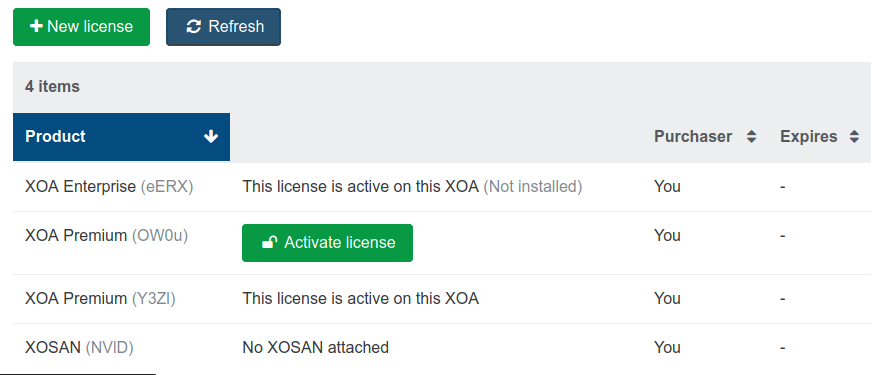
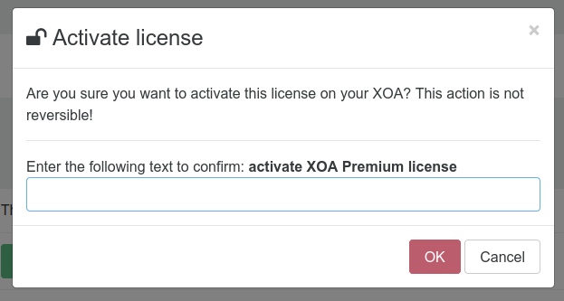

## Activate a Xen Orchestra license

1. After the [purchase](https://xen-orchestra.com/docs/purchase.html), all your available licenses will be visible in the license section of your appliance.

2. All the licenses available and not bind already will be displayed here with a green `activate license` button

3. By clicking on the activate license option, you will be required to confirm your choice. 

> ⚠ Once a license is bind, the only way to unbind it is to contact us with a [support ticket](https://xen-orchestra.com/#!/member/support)!
