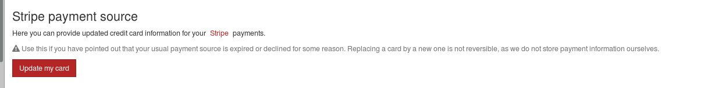

# Purchase

You can buy XOA in multiple ways, depending on your needs. Click on the following links for more documentation:

* [for your company (direct purchase)](directpurchase.md)
* [through your purchase department (purchaser)](through_purchase_department.md)
* [for your own client (reseller)](reseller.md)

## XOA Editions

To find which XOA Edition fits your needs, please read the [dedicated editions page](editions.md).

## Invoices

Invoices are available in PDF format. [Details here](invoices.md).

## Receiving a quote

You can ask for an automatic quote on our website via the pricing page or directly from you personal account page. 

Choose the plan you want, the years of commitment that suits you, then fill out the information required (it should be prefilled with your account information). 

If you want to purchase XO using the quote you receive, you just have to enter the quote number into the purchase menu, on your personal account page. 

## Edit your card information

If you choose a Stripe payment, you can always edit the credit card information in case it changes. To do so, you only have to login to your personal account page and access the *profile* menu. 

