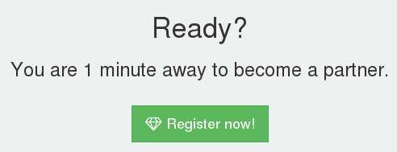
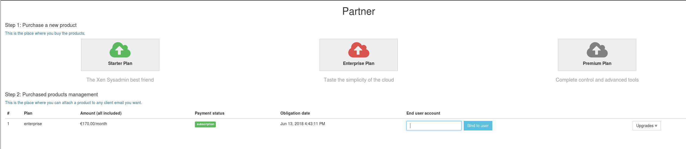

# Partner Program

The Xen Orchestra partner program is designed to offer you the opportunity to become a reseller of Xen Orchestra and deliver a full stack solution to your customers.

:::tip
Becoming a reseller will grant you a standard discount. However, **the reseller status is designed for companies that want to actively prospect for new Xen Orchestra users**. That's why we are asking our partners to **resell Xen Orchestra at least two times a year**. If you are acting as a third party purchaser answering to a specific request from one of your customers, you don't need to apply to the reseller program - you can follow [this process](./purchase.md#via-your-purchase-departement) instead.
:::

## Apply to the program

To apply to our partner program, you can access the [partner page](https://xen-orchestra.com/#!/partner) and click on the "Register to become a partner" button:

You will have to complete a form in order to provide information regarding your expectations and location. Once you've finished, you should receive an email in order to **start the discussion with someone from our team**.

:::tip
It's important to answer the email - this will start the discussion with someone from our team in order to determine together if the partner status is what you really need.
:::

Once we have activated your partner space, you will have the ability to access the purchasing page [at the same place](https://xen-orchestra.com/#!/partner).

## Purchase XOAs

Now that you can see the reseller interface:

You can follow these steps to purchase an XOA edition for your customer.

1. choose the edition you want to purchase for your customer
2. Buy it on your reseller page (the discount is automatically applied - once it's done, a new line appears on your reseller page)
3. assign/bind the plan to your final client email

You'll have all the invoices in your account.

## From your client's perspective

Your client can use the email assigned to register their appliance, and unlock the Edition you purchased. They will not get any invoices from us but can still access our support system.
